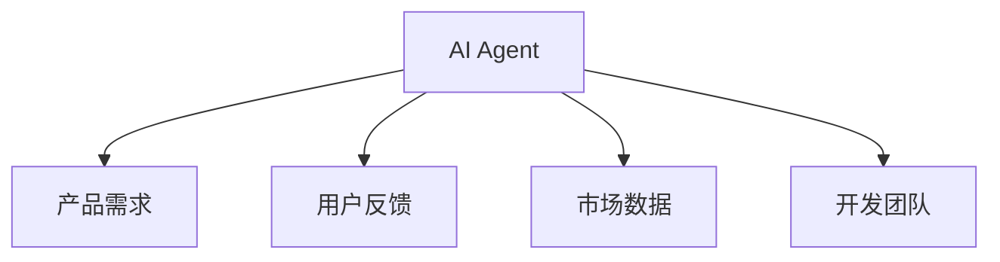
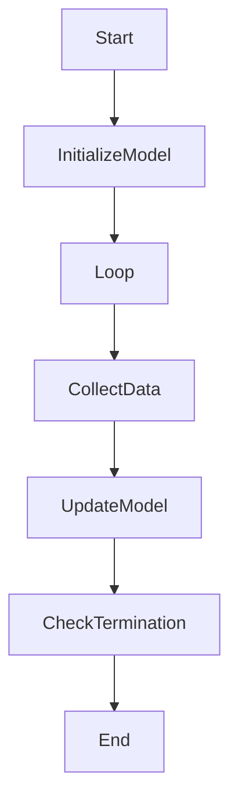
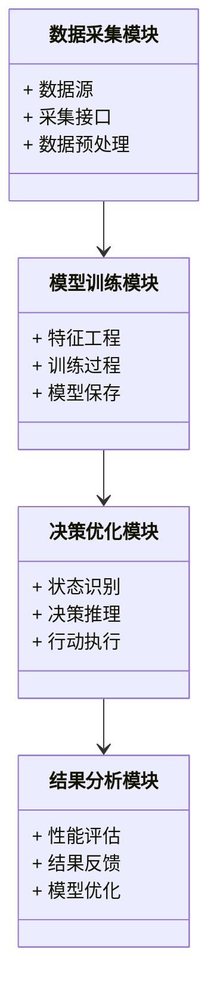
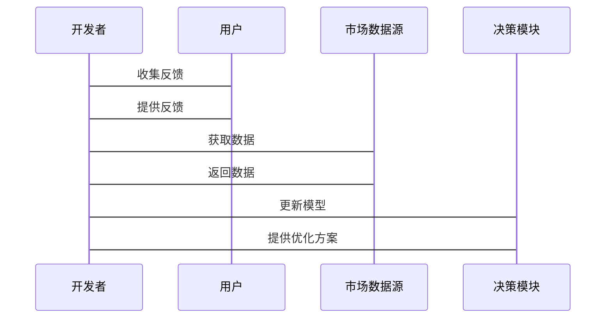

                 


# AI Agent辅助企业新产品开发与市场测试

**关键词**：AI Agent, 企业应用, 新产品研发, 市场测试, 算法模型, 系统架构, 项目实战

**摘要**：本文系统探讨AI Agent在企业新产品开发与市场测试中的应用，分析其优势与挑战，详细讲解算法原理和系统架构设计，并通过实际案例展示其应用过程，最后总结经验并展望未来。

---

## 第1章 AI Agent的基本概念与背景介绍

### 1.1 AI Agent的定义与核心概念

#### 1.1.1 问题背景：企业新产品开发与市场测试的挑战
企业新产品开发和市场测试通常涉及复杂的过程，需要整合多方数据和实时反馈。传统方法依赖人工判断，效率低且难以覆盖所有变量。

#### 1.1.2 问题描述：传统开发与测试模式的局限性
传统模式依赖经验，难以快速响应变化，且容易遗漏市场趋势和用户反馈。

#### 1.1.3 问题解决：AI Agent的引入与应用
AI Agent能够实时分析数据，优化决策，提高开发和测试效率。

#### 1.1.4 AI Agent的核心要素与概念结构
AI Agent由理性、知识、感知和行动四个核心要素组成，构成一个动态反馈系统。

#### 1.1.5 AI Agent的边界与外延
AI Agent专注于辅助决策，不完全替代人类判断，其应用范围需明确界定。

### 1.2 AI Agent在企业中的应用前景

#### 1.2.1 AI Agent的潜在应用领域
涵盖产品设计、测试优化、市场预测和用户体验提升等多个方面。

#### 1.2.2 企业采用AI Agent的优势
提升效率、精准度和竞争力，优化资源分配。

#### 1.2.3 AI Agent应用的挑战与机遇
技术复杂性和数据隐私是挑战，而技术创新和市场扩展是机遇。

---

## 第2章 AI Agent的核心概念与联系

### 2.1 AI Agent的核心原理

#### 2.1.1 理性与知识表示
AI Agent通过知识表示处理信息，基于理性进行决策。

#### 2.1.2 感知与状态识别
利用传感器和数据分析，AI Agent实时感知环境变化。

#### 2.1.3 行动与决策优化
通过算法优化决策，执行行动并调整策略。

### 2.2 核心概念对比分析

| 概念对比 | AI Agent | 传统软件代理 | 规则引擎 | 机器学习模型 |
|----------|-----------|--------------|----------|--------------|
| 数据依赖 | 高         | 低           | 中        | 高           |
| 学习能力 | 高         | 无           | 无        | 高           |
| 决策复杂度 | 高         | 低           | 低        | 中            |

### 2.3 AI Agent的实体关系图



---

## 第3章 AI Agent的算法原理

### 3.1 基于模型的AI Agent算法

#### 3.1.1 算法原理



#### 3.1.2 Python代码示例

```python
class AIModel:
    def __init__(self):
        self.model = self.build_model()
    
    def build_model(self):
        # 构建模型
        pass
    
    def update_model(self, data):
        # 更新模型
        pass
```

### 3.2 基于经验的强化学习算法

#### 3.2.1 算法原理

$$ Q-learning算法：Q(s,a) = Q(s,a) + \alpha (r + \gamma \max Q(s',a') - Q(s,a)) $$

#### 3.2.2 Python代码示例

```python
import numpy as np

class QLearning:
    def __init__(self, state_space, action_space):
        self.q_table = np.zeros((state_space, action_space))
    
    def choose_action(self, state, epsilon=0.1):
        if np.random.random() < epsilon:
            return np.random.randint(action_space)
        return np.argmax(self.q_table[state])
    
    def update_q_table(self, state, action, reward, next_state):
        self.q_table[state, action] += 0.1 * (reward + 0.99 * np.max(self.q_table[next_state]) - self.q_table[state, action])
```

---

## 第4章 系统架构设计

### 4.1 问题场景介绍
企业新产品开发与市场测试需要整合用户反馈和市场数据，实时优化策略。

### 4.2 系统功能设计



### 4.3 系统交互设计



---

## 第5章 项目实战

### 5.1 环境安装

```bash
pip install numpy matplotlib scikit-learn
```

### 5.2 核心代码实现

```python
import numpy as np
from sklearn import svm

class AIAssistant:
    def __init__(self, data):
        self.data = data
        self.model = svm.SVC()
    
    def train(self):
        self.model.fit(self.data.features, self.data.labels)
    
    def predict(self, input):
        return self.model.predict(input)
```

### 5.3 案例分析
通过智能音箱产品的开发案例，展示AI Agent在需求分析、测试优化和市场预测中的应用，优化产品功能和市场策略。

### 5.4 项目总结
AI Agent显著提升了开发效率和测试精准度，但仍需注意数据质量和模型可解释性。

---

## 第6章 总结与展望

### 6.1 全文总结
AI Agent在企业应用中展现了巨大潜力，但仍需解决技术难题和优化用户体验。

### 6.2 未来展望
AI Agent将与边缘计算和区块链结合，推动智能化决策。

### 6.3 最佳实践 tips
建议企业从小规模项目开始，确保数据质量和算法透明性。

---

通过以上章节的详细讲解，读者能够全面了解AI Agent在企业新产品开发与市场测试中的应用，从理论到实践，掌握其实现方法和未来发展方向。

