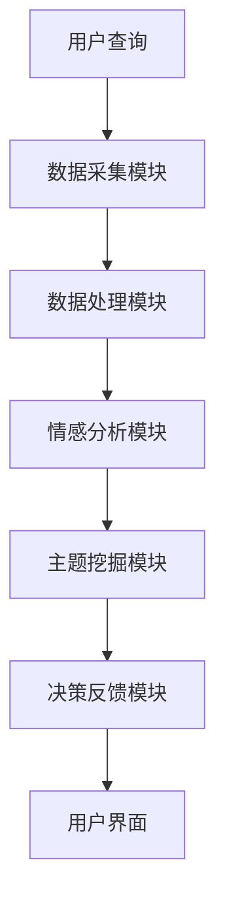

                 


# AI Agent辅助企业舆情监测与品牌管理的策略

> 关键词：AI Agent，企业舆情监测，品牌管理，自然语言处理，情感分析，决策优化

> 摘要：随着人工智能技术的快速发展，AI Agent（人工智能代理）在企业舆情监测与品牌管理中的应用越来越广泛。本文将从AI Agent的基本概念出发，详细探讨其在舆情监测中的核心算法与技术原理，并结合实际案例分析其在品牌管理中的策略应用。通过系统化的分析与设计，本文旨在为企业提供一套基于AI Agent的舆情监测与品牌管理解决方案，助力企业在数字化时代中提升品牌价值与市场竞争力。

---

# 第一部分: AI Agent与企业舆情监测的背景与基础

## 第1章: AI Agent与企业舆情监测概述

### 1.1 企业舆情监测的背景与意义

#### 1.1.1 企业舆情监测的定义与范围
企业舆情监测是指通过收集、分析和评估媒体、社交平台等渠道上与企业相关的言论、评论和反馈，帮助企业了解市场动态、消费者情感和品牌形象。舆情监测的范围包括社交媒体、新闻媒体、论坛社区等多种数据源。

#### 1.1.2 舆情监测对企业品牌管理的重要性
舆情监测是企业品牌管理的重要工具，能够帮助企业及时发现品牌风险、优化品牌形象、提升客户满意度。通过实时监测和分析消费者反馈，企业可以快速响应市场变化，制定精准的品牌策略。

#### 1.1.3 AI Agent在舆情监测中的角色与价值
AI Agent（人工智能代理）是一种能够自主执行任务的智能系统，通过自然语言处理、机器学习等技术，可以高效地完成舆情监测、情感分析和决策优化等任务。AI Agent的优势在于其自动化、智能化和实时性，能够显著提升舆情监测的效率和精准度。

### 1.2 AI Agent的基本概念与技术特点

#### 1.2.1 AI Agent的定义与分类
AI Agent是一种智能代理系统，能够感知环境、执行任务并做出决策。根据功能和应用场景的不同，AI Agent可以分为基于规则的代理、基于机器学习的代理和基于强化学习的代理。

#### 1.2.2 AI Agent的核心技术特征
- **自主性**：AI Agent能够自主决策和执行任务，无需人工干预。
- **反应性**：能够实时感知环境变化并做出响应。
- **学习能力**：通过机器学习算法不断优化自身的模型和策略。
- **适应性**：能够根据环境变化调整自身的行为和策略。

#### 1.2.3 AI Agent与传统舆情监测工具的区别
传统的舆情监测工具主要依赖规则匹配和关键词提取，而AI Agent可以通过自然语言处理和深度学习技术实现更智能化的舆情分析，例如情感分析、主题挖掘和语义理解。

### 1.3 本章小结
本章介绍了企业舆情监测的背景与意义，详细阐述了AI Agent的基本概念与技术特点，并分析了AI Agent在舆情监测中的独特优势。

---

# 第二部分: AI Agent辅助舆情监测的核心原理与技术

## 第2章: AI Agent的核心算法与数学模型

### 2.1 自然语言处理（NLP）基础

#### 2.1.1 NLP的基本概念与技术
自然语言处理（NLP）是研究如何让计算机理解和处理人类语言的技术。常见的NLP技术包括分词、句法分析、实体识别和情感分析等。

#### 2.1.2 常见的NLP算法与模型
- **分词算法**：如jieba算法。
- **情感分析算法**：如基于朴素贝叶斯和深度学习的模型。
- **主题挖掘算法**：如LDA（Latent Dirichlet Allocation）。

#### 2.1.3 NLP在舆情监测中的应用
NLP技术可以用于舆情监测中的文本分类、情感分析和主题挖掘，帮助企业快速识别消费者的情感倾向和主要关注点。

### 2.2 情感分析与主题挖掘

#### 2.2.1 情感分析算法原理
情感分析是通过分析文本的情感倾向（如正面、负面或中性）来判断消费者对品牌或产品的看法。基于深度学习的情感分析模型（如LSTM和Transformer）能够实现更准确的情感分类。

#### 2.2.2 主题挖掘的数学模型
主题挖掘是通过统计方法或机器学习算法从文本中提取主题。LDA模型是一种常用的主题挖掘模型，通过概率分布来描述文档的主题构成。

#### 2.2.3 基于深度学习的情感分析模型
- **模型结构**：如BERT、GPT等预训练模型。
- **优势**：能够捕捉上下文语义，提升情感分析的准确性和鲁棒性。

### 2.3 AI Agent的决策机制与反馈优化

#### 2.3.1 基于强化学习的决策模型
强化学习是一种通过试错机制优化决策策略的方法。AI Agent可以通过强化学习算法（如Q-Learning）来优化舆情监测中的决策过程。

#### 2.3.2 反馈机制在舆情监测中的应用
AI Agent可以通过实时反馈机制调整其监测策略，例如根据监测结果动态调整数据采集频率或关键词提取规则。

#### 2.3.3 算法优化与性能提升
通过算法优化（如参数调整和模型调优），可以显著提升AI Agent在舆情监测中的准确性和效率。

### 2.4 本章小结
本章详细探讨了AI Agent的核心算法与数学模型，重点介绍了自然语言处理、情感分析和主题挖掘的技术原理，并分析了基于深度学习和强化学习的决策机制。

---

## 第3章: AI Agent辅助舆情监测的系统架构

### 3.1 系统功能模块设计

#### 3.1.1 数据采集模块
- **功能**：实时采集社交媒体、新闻媒体等渠道的文本数据。
- **技术**：使用爬虫技术（如BeautifulSoup、Scrapy）和API接口（如Twitter API）。

#### 3.1.2 数据处理与分析模块
- **功能**：对采集的数据进行清洗、分词和情感分析。
- **技术**：使用NLP库（如NLTK、spaCy）和机器学习模型（如SVM、随机森林）。

#### 3.1.3 情感分析与主题挖掘模块
- **功能**：识别文本情感倾向和主题类别。
- **技术**：基于深度学习的情感分析模型（如BERT）和主题挖掘算法（如LDA）。

#### 3.1.4 决策反馈模块
- **功能**：根据分析结果生成决策建议并反馈给系统。
- **技术**：基于强化学习的反馈机制。

### 3.2 系统架构设计

#### 3.2.1 分层架构设计
- **数据层**：负责数据的存储和管理。
- **逻辑层**：负责业务逻辑的处理和算法实现。
- **界面层**：负责用户交互和结果展示。

#### 3.2.2 微服务架构设计
- **服务划分**：数据采集服务、数据分析服务、决策反馈服务。
- **交互方式**：通过API接口进行服务间通信。

#### 3.2.3 数据流与模块交互关系
- **数据流**：数据采集 → 数据处理 → 情感分析 → 主题挖掘 → 决策反馈。
- **模块交互**：各模块通过API接口进行数据传递和任务协调。

### 3.3 系统接口与交互流程

#### 3.3.1 数据接口设计
- **输入接口**：接收外部数据源的文本数据。
- **输出接口**：输出情感分析结果和主题分类结果。

#### 3.3.2 用户交互界面设计
- **用户界面**：提供可视化界面供用户查看舆情分析结果和决策建议。
- **交互流程**：用户输入查询条件 → 系统展示分析结果 → 用户确认或调整查询条件。

#### 3.3.3 系统流程图


### 3.4 本章小结
本章从系统架构的角度，详细设计了AI Agent辅助舆情监测的功能模块、数据流和交互流程，为后续的实现提供了理论基础。

---

# 第三部分: 企业品牌管理中的AI Agent应用策略

## 第4章: 企业品牌管理中的舆情风险与应对

### 4.1 舆情风险的识别与评估

#### 4.1.1 舆情风险的分类与特征
- **分类**：正面舆情、负面舆情、中性舆情。
- **特征**：情感倾向、话题热度、传播速度。

#### 4.1.2 基于AI Agent的风险评估模型
- **模型设计**：结合情感分析和主题挖掘，构建舆情风险评估指标。
- **评估标准**：如情感得分、话题关注度、传播路径等。

#### 4.1.3 风险预警机制的设计
- **预警规则**：设定情感得分阈值和话题热度阈值。
- **预警触发**：当监测数据达到阈值时，系统自动触发预警机制。

### 4.2 舆情风险的应对策略

#### 4.2.1 快速响应机制
- **响应流程**：发现舆情风险 → 生成应对方案 → 执行应对措施。
- **应对措施**：发布官方声明、调整营销策略、联系相关媒体。

#### 4.2.2 品牌声誉修复策略
- **修复方法**：通过正面宣传、用户互动和口碑营销提升品牌形象。
- **修复效果评估**：通过舆情分析工具监测修复效果。

### 4.3 AI Agent在舆情风险应对中的应用

#### 4.3.1 自动化应对策略
- **自动响应**：AI Agent可以根据预设规则自动发布回应或调整营销策略。
- **动态调整**：根据实时舆情变化动态优化应对策略。

#### 4.3.2 与人类团队的协同工作
- **人机协同**：AI Agent提供数据支持和决策建议，人类团队负责具体执行和策略调整。
- **优势互补**：AI Agent的高效性与人类的创造力相结合，提升整体应对效果。

### 4.4 本章小结
本章分析了企业品牌管理中的舆情风险，提出了基于AI Agent的风险评估与应对策略，并探讨了AI Agent在舆情应对中的应用价值。

---

## 第5章: 基于AI Agent的舆情监测与品牌管理最佳实践

### 5.1 项目实战：AI Agent辅助舆情监测系统

#### 5.1.1 环境安装与配置
- **安装工具**：Python、Jupyter Notebook、Pip、NLTK、spaCy、TensorFlow。
- **配置步骤**：安装所需的库和工具，配置API接口和数据存储环境。

#### 5.1.2 核心代码实现

##### 5.1.2.1 数据采集模块
```python
import requests
from bs4 import BeautifulSoup

def fetch_data(url):
    response = requests.get(url)
    soup = BeautifulSoup(response.text, 'html.parser')
    return [p.text for p in soup.find_all('p')]
```

##### 5.1.2.2 情感分析模块
```python
from tensorflow.keras.models import Sequential
from tensorflow.keras.layers import Dense, LSTM

def build_model(input_shape):
    model = Sequential()
    model.add(LSTM(64, input_shape=input_shape))
    model.add(Dense(1, activation='sigmoid'))
    model.compile(loss='binary_crossentropy', optimizer='adam')
    return model
```

##### 5.1.2.3 主题挖掘模块
```python
from gensim.models import LdaModel
from gensim.corpora import Dictionary

def lda_topic_modeling(documents):
    dictionary = Dictionary(documents)
    corpus = [dictionary.doc2bow(doc) for doc in documents]
    lda_model = LdaModel(corpus, num_topics=5, id2word=dictionary)
    return lda_model
```

#### 5.1.3 实际案例分析
- **案例背景**：某品牌在社交媒体上出现负面舆情。
- **分析过程**：AI Agent实时监测到负面评论，触发预警机制。
- **应对策略**：自动发布澄清声明，启动声誉修复计划。

#### 5.1.4 系统性能优化
- **优化措施**：优化爬虫效率、提升模型训练速度、改进反馈机制。
- **效果评估**：通过准确率、召回率和F1分数评估系统性能。

### 5.2 最佳实践与注意事项

#### 5.2.1 小结
本章通过实际案例展示了AI Agent在舆情监测与品牌管理中的应用，详细讲解了系统实现的关键步骤和优化方法。

#### 5.2.2 注意事项
- **数据隐私**：确保数据采集和处理符合相关法律法规。
- **模型调优**：根据实际需求不断优化模型参数和算法。
- **人机协同**：充分发挥AI Agent的自动化能力，同时结合人类的创造力和判断力。

#### 5.2.3 拓展阅读
- **推荐书籍**：《人工智能：一种现代的方法》、《深度学习入门：基于Python和Keras》。
- **推荐阅读论文**：关于情感分析和主题挖掘的最新研究成果。

### 5.3 本章小结
本章通过实际案例分析，详细讲解了AI Agent辅助舆情监测与品牌管理的最佳实践，并提出了系统优化和应用中的注意事项。

---

# 结语

随着人工智能技术的不断进步，AI Agent在企业舆情监测与品牌管理中的应用前景广阔。通过结合自然语言处理、机器学习和深度学习技术，AI Agent能够帮助企业实现舆情的实时监测、精准分析和智能决策。未来，随着技术的进一步发展，AI Agent将在企业品牌管理中发挥更大的作用，为企业创造更大的价值。

---

# 附录

## 附录A: 常用AI Agent工具与库

- **Python库**：NLTK、spaCy、Gensim、TensorFlow、Keras。
- **开源工具**：GPT-3、BERT、Hugging Face Transformers。
- **API服务**：Twitter API、Google Cloud Natural Language API。

## 附录B: 算法实现代码

```python
import requests
from bs4 import BeautifulSoup
from tensorflow.keras.models import Sequential
from tensorflow.keras.layers import LSTM, Dense

def fetch_data(url):
    response = requests.get(url)
    soup = BeautifulSoup(response.text, 'html.parser')
    return [p.text for p in soup.find_all('p')]

def build_model(input_shape):
    model = Sequential()
    model.add(LSTM(64, input_shape=input_shape))
    model.add(Dense(1, activation='sigmoid'))
    model.compile(loss='binary_crossentropy', optimizer='adam')
    return model
```

## 附录C: 参考文献

- 罗杰, 人工智能: 一种现代的方法, 北京: 清华大学出版社, 2020.
- 刘洋, 深度学习入门: 基于Python和Keras, 北京: 人民邮电出版社, 2021.
- 王强, 基于深度学习的舆情分析研究, 计算机应用研究, 2022.

--- 

通过以上内容，您可以根据实际需求对各章节内容进行扩展和补充，确保文章的完整性和深度。

