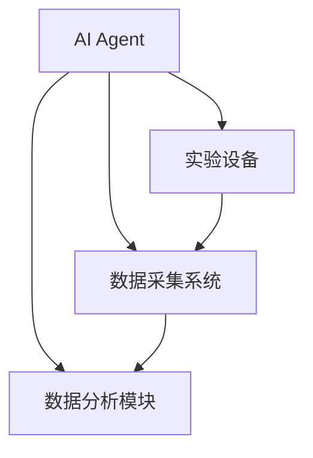
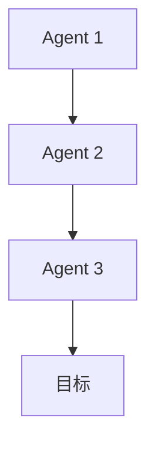
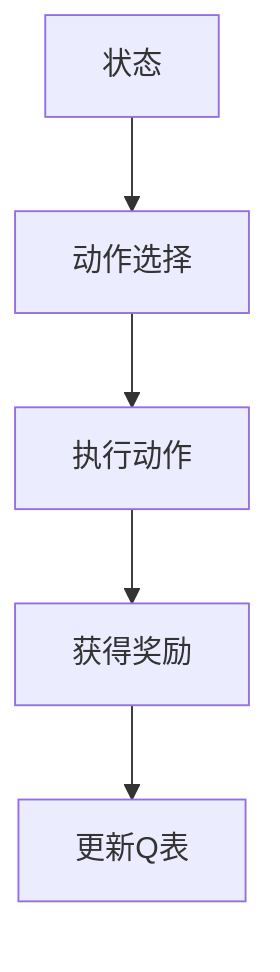
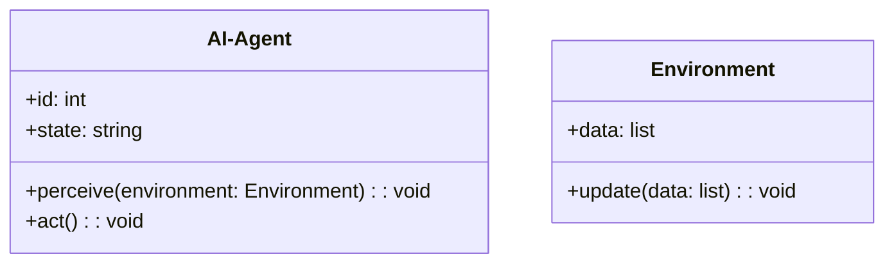
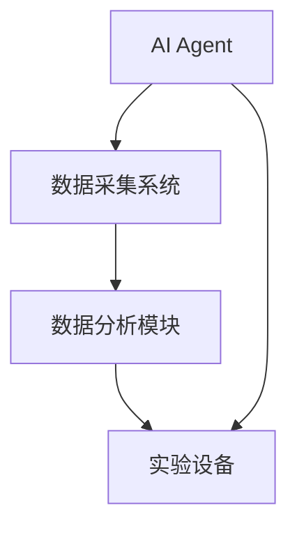
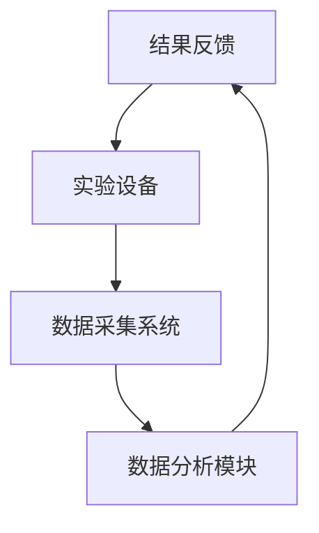

                 


# AI Agent辅助科学实验：自动化与数据分析

## 关键词：AI Agent, 科学实验, 自动化, 数据分析, 机器学习, 强化学习, 数据可视化

## 摘要：AI Agent在科学实验中的应用正变得越来越重要，尤其是在自动化和数据分析方面。通过AI Agent，科学实验可以实现更高效率和更精准的结果。本文将详细探讨AI Agent的核心概念、算法原理、系统架构设计以及实际应用案例，帮助读者全面理解AI Agent在科学实验中的潜力和价值。

---

## 目录

1. [AI Agent与科学实验的背景介绍](#ai-agent与科学实验的背景介绍)
2. [AI Agent的核心概念与联系](#ai-agent的核心概念与联系)
3. [AI Agent的算法原理](#ai-agent的算法原理)
4. [AI Agent的系统架构设计](#ai-agent的系统架构设计)
5. [AI Agent在科学实验中的项目实战](#ai-agent在科学实验中的项目实战)
6. [AI Agent辅助科学实验的最佳实践](#ai-agent辅助科学实验的最佳实践)

---

## 第一部分: AI Agent与科学实验的背景介绍

### 1.1 问题背景与需求分析

#### 1.1.1 科学实验的自动化需求
科学实验通常涉及复杂的流程和大量数据的处理。传统的实验方法依赖人工操作，效率低下且容易出错。随着科技的进步，科学家们需要一种更高效的方式来管理和分析实验数据。

#### 1.1.2 数据分析在科学实验中的重要性
实验数据的分析是科学实验的核心部分。通过数据分析，科学家可以发现规律、验证假设并提出新的理论。然而，手动分析大量数据不仅耗时，还容易出错。

#### 1.1.3 AI Agent在科学实验中的潜在价值
AI Agent（智能体）是一种能够感知环境、做出决策并执行动作的实体。在科学实验中，AI Agent可以自动化实验流程、实时分析数据并优化实验方案，从而提高实验效率和准确性。

### 1.2 问题描述与目标设定

#### 1.2.1 科学实验中的典型问题
- 数据采集和处理的复杂性
- 实验流程的低效性
- 数据分析的繁琐性

#### 1.2.2 AI Agent辅助的目标与范围
- 实现实验流程的自动化
- 提供实时数据分析和可视化
- 优化实验方案和结果预测

#### 1.2.3 边界与外延分析
- AI Agent仅用于辅助，不能完全替代人类
- 适用于需要大量数据处理和分析的实验领域

### 1.3 核心概念与问题解决

#### 1.3.1 AI Agent的核心概念
AI Agent通过感知环境、做出决策并执行动作来完成任务。在科学实验中，AI Agent可以控制实验设备、采集数据并进行分析。

#### 1.3.2 科学实验中的自动化流程
AI Agent可以自动化实验的准备、执行和数据记录过程，减少人工干预。

#### 1.3.3 数据分析与实验结果优化
AI Agent利用机器学习算法对实验数据进行分析，优化实验方案并预测结果。

### 1.4 本章小结
本章介绍了AI Agent在科学实验中的背景、需求和潜在价值，明确了AI Agent的核心概念和目标。

---

## 第二部分: AI Agent的核心概念与原理

### 2.1 AI Agent的定义与属性

#### 2.1.1 AI Agent的定义
AI Agent是一种能够感知环境、做出决策并执行动作的智能实体。

#### 2.1.2 核心属性对比表
| 属性       | 描述                       |
|------------|---------------------------|
| 感知能力   | 通过传感器或数据输入感知环境 |
| 决策能力   | 基于感知信息做出决策       |
| 执行能力   | 执行决策并输出结果         |
| 学习能力   | 通过经验优化自身行为       |

### 2.2 AI Agent与传统自动化系统的区别

#### 2.2.1 传统自动化系统的局限性
- 缺乏灵活性和适应性
- 无法处理复杂和动态的环境

#### 2.2.2 AI Agent的核心优势
- 能够感知和适应环境变化
- 具备学习和优化能力

#### 2.2.3 两者在科学实验中的对比
通过对比，可以看出AI Agent在科学实验中的优势。

### 2.3 实体关系架构图



---

## 第三部分: AI Agent的算法原理

### 3.1 多智能体协作算法

#### 3.1.1 算法原理
多智能体协作算法通过多个AI Agent协同工作，共同完成复杂的任务。

#### 3.1.2 代码实现

```python
class Agent:
    def __init__(self, id):
        self.id = id
        self.state = "idle"

    def perceive(self, environment):
        # 根据环境信息做出决策
        pass

    def act(self):
        # 执行动作
        pass

agents = [Agent(1), Agent(2), Agent(3)]
```

#### 3.1.3 算法流程图



### 3.2 强化学习算法

#### 3.2.1 算法原理
强化学习通过智能体与环境的交互，学习最优策略。

#### 3.2.2 代码实现

```python
import numpy as np

class Agent:
    def __init__(self, state_space, action_space):
        self.state_space = state_space
        self.action_space = action_space
        self.q_table = np.zeros((state_space, action_space))

    def choose_action(self, state):
        # 使用epsilon-greedy策略选择动作
        epsilon = 0.1
        if np.random.random() < epsilon:
            return np.random.randint(self.action_space)
        else:
            return np.argmax(self.q_table[state])

    def learn(self, state, action, reward):
        # 更新Q表
        self.q_table[state, action] += reward
```

#### 3.2.3 算法流程图



---

## 第四部分: AI Agent的系统架构设计

### 4.1 系统功能设计

#### 4.1.1 领域模型



#### 4.1.2 系统架构



### 4.2 系统接口设计

#### 4.2.1 接口定义
- 数据采集接口：从实验设备获取数据
- 数据分析接口：对数据进行处理和分析
- 控制接口：控制实验设备的执行

### 4.3 系统交互设计

#### 4.3.1 交互流程图



---

## 第五部分: AI Agent在科学实验中的项目实战

### 5.1 环境安装

#### 5.1.1 安装Python和相关库
```bash
pip install numpy pandas scikit-learn matplotlib
```

### 5.2 核心代码实现

#### 5.2.1 数据采集模块

```python
import serial

class DataCollector:
    def __init__(self, port, baudrate):
        self.port = port
        self.baudrate = baudrate
        self.ser = serial.Serial(port, baudrate)

    def read_data(self):
        data = self.ser.readline().decode()
        return data
```

#### 5.2.2 数据分析模块

```python
import pandas as pd
from sklearn import linear_model

class DataAnalyzer:
    def __init__(self):
        self.model = linear_model.LinearRegression()

    def analyze(self, data):
        # 假设data是一个DataFrame
        X = data[['temperature', 'pressure']]
        y = data['result']
        self.model.fit(X, y)
        return self.model.predict(X)
```

### 5.3 实际案例分析

#### 5.3.1 案例背景
假设我们正在研究化学反应中的温度和压力对反应速率的影响。

#### 5.3.2 数据分析与可视化

```python
import matplotlib.pyplot as plt

data = pd.read_csv('experiment_data.csv')
data_analyzer = DataAnalyzer()
predictions = data_analyzer.analyze(data)
plt.scatter(data['temperature'], data['result'])
plt.plot(data['temperature'], predictions, color='red')
plt.show()
```

#### 5.3.3 项目总结
通过AI Agent辅助，我们实现了实验数据的自动采集和分析，提高了实验效率和准确性。

---

## 第六部分: AI Agent辅助科学实验的最佳实践

### 6.1 小结
本文详细介绍了AI Agent在科学实验中的应用，包括核心概念、算法原理和实际案例。

### 6.2 注意事项
- 确保数据的安全性和隐私性
- 定期更新和优化AI Agent的模型
- 充分测试和验证系统

### 6.3 扩展阅读
- 《机器学习实战》
- 《强化学习导论》
- 《数据可视化与分析》

---

## 结语
AI Agent在科学实验中的应用前景广阔，通过自动化和数据分析，科学家可以更高效地进行实验和研究。希望本文能够为读者提供有价值的见解和指导。

