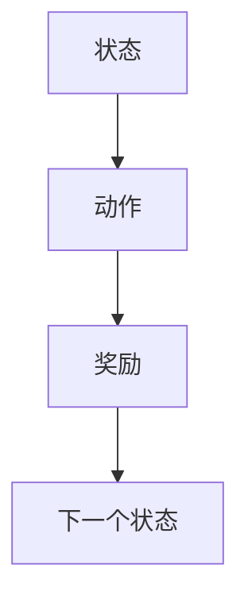
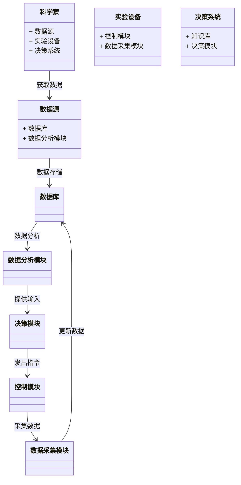
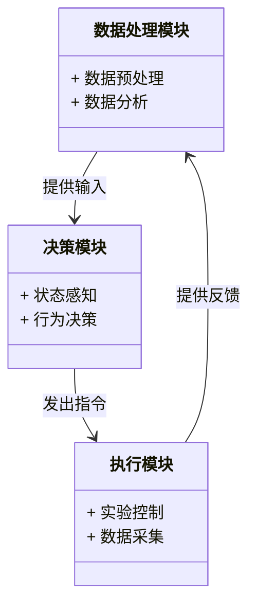
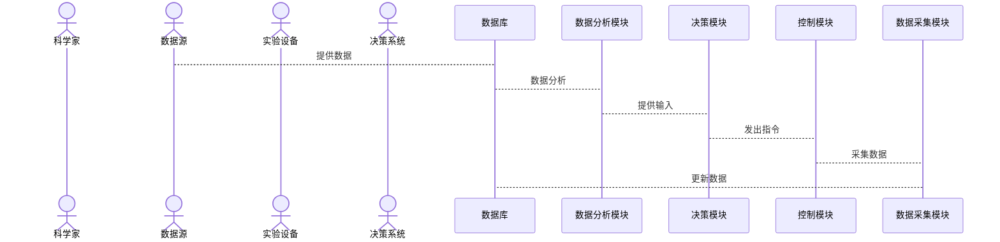

                 


# AI Agent辅助科学研究的方法

## 关键词：AI Agent、科学研究、机器学习、数据处理、算法原理

## 摘要：本文将详细探讨AI Agent在科学研究中的应用方法，从基本概念到算法原理，再到系统架构设计，最后通过实际案例展示AI Agent如何辅助科学研究。文章旨在帮助读者理解AI Agent的核心原理及其在科学研究中的具体应用，为科研人员和技术爱好者提供有价值的指导。

---

# 第一部分: AI Agent辅助科学研究的背景与概念

## 第1章: AI Agent的基本概念与背景

### 1.1 AI Agent的定义与特点
AI Agent（人工智能代理）是指能够感知环境、自主决策并采取行动的智能实体。与传统程序不同，AI Agent具备以下特点：
- **自主性**：能够在没有外部干预的情况下运行。
- **反应性**：能够根据环境反馈调整行为。
- **目标导向性**：通过设定目标来优化决策过程。
- **学习能力**：能够通过经验改进性能。

### 1.2 AI Agent在科学研究中的应用背景
随着科学研究的复杂性和数据量的急剧增加，传统的研究方法逐渐暴露出效率低下、数据处理能力有限等问题。AI Agent凭借其强大的数据处理能力和自主决策能力，为科学研究提供了新的解决方案。

#### 1.2.1 传统科学研究方法的局限性
- 数据处理效率低：科学实验产生的数据量庞大，人工分析耗时耗力。
- 知识更新滞后：科学研究需要快速响应最新数据和技术进展。
- 决策过程依赖人工经验：缺乏系统性和客观性。

#### 1.2.2 AI Agent在科学研究中的潜在价值
- 提高数据处理效率：AI Agent能够快速分析和处理大量数据，帮助科学家发现潜在规律。
- 实现实验自动化：AI Agent可以辅助设计实验方案并自动执行实验。
- 优化决策过程：通过数据驱动的决策，减少人为经验的依赖。

### 1.3 AI Agent辅助科学研究的核心问题
AI Agent在科学研究中的应用涉及多个方面，以下是核心问题：
- **问题背景**：科学研究中的数据复杂性和不确定性。
- **问题描述**：如何利用AI Agent提高科学研究的效率和准确性。
- **问题解决**：通过AI Agent实现数据处理、实验设计和结果分析的自动化。
- **边界与外延**：AI Agent的应用范围和局限性。
- **核心要素**：数据源、算法模型、决策逻辑。

---

## 第2章: AI Agent的核心概念与联系

### 2.1 AI Agent的核心概念原理
AI Agent的核心原理是通过感知环境、学习知识和优化决策来实现科学研究的目标。以下是几种典型的AI Agent类型及其特点：

| 类型       | 描述                                   | 优缺点分析                       |
|------------|----------------------------------------|----------------------------------|
| 基于规则的 | 通过预定义的规则进行决策               | 易实现，但灵活性差                |
| 基于模型的 | 基于数学模型进行推理和决策             | 精度高，但需要高质量的模型        |
| 基于学习的 | 通过机器学习算法从数据中学习           | 灵活性高，但需要大量数据          |

### 2.2 AI Agent的实体关系图
以下是AI Agent在科学研究中的实体关系图：

```mermaid
er
    %% AI Agent实体关系图
    actor 科学家
    actor 数据源
    actor 实验设备
    actor 决策系统
    database 数据库
    class 数据
    class 知识库
    class 决策结果
    科学家 --> 数据源: 获取数据
    数据源 --> 数据库: 数据存储
    数据库 --> 决策系统: 数据分析
    决策系统 --> 实验设备: 控制实验
    决策系统 --> 知识库: 更新知识
    知识库 --> 数据: 知识推理
```

---

## 第3章: AI Agent的算法原理

### 3.1 AI Agent的核心算法
AI Agent的核心算法包括强化学习（Reinforcement Learning）和监督学习（Supervised Learning）。以下是强化学习的流程图：



#### 3.1.1 强化学习算法
强化学习是一种通过试错机制来优化决策的算法。以下是Q-learning算法的数学模型：

$$ Q(s, a) = r + \gamma \max Q(s', a') $$

其中：
- $Q(s, a)$ 表示状态 $s$ 下采取动作 $a$ 的价值。
- $r$ 表示立即奖励。
- $\gamma$ 表示折扣因子。
- $Q(s', a')$ 表示下一个状态 $s'$ 下动作 $a'$ 的价值。

#### 3.1.2 监督学习算法
监督学习是一种通过标记数据训练模型的算法。以下是线性回归的公式：

$$ y = \theta_0 + \theta_1 x $$

---

## 第4章: AI Agent的系统分析与架构设计

### 4.1 问题场景介绍
AI Agent在科学研究中的应用场景包括数据处理、实验设计和结果分析。以下是典型场景：



### 4.2 系统功能设计
以下是系统功能设计的类图：



---

## 第5章: AI Agent的项目实战

### 5.1 环境安装与配置
以下是Python环境的安装和配置步骤：

```bash
# 安装Python
# 安装必要的库
pip install numpy pandas scikit-learn
```

### 5.2 核心代码实现
以下是AI Agent的核心代码实现：

```python
import numpy as np
from sklearn.linear_model import LinearRegression

# 数据预处理
data = np.array([[1, 2], [2, 3], [3, 4], [4, 5]])
X = data[:, 0].reshape(-1, 1)
y = data[:, 1].reshape(-1, 1)

# 训练模型
model = LinearRegression()
model.fit(X, y)

# 预测结果
print(model.predict(np.array([[5]])))
```

### 5.3 实际案例分析
以下是AI Agent在蛋白质结构预测中的应用案例：



---

## 第6章: AI Agent的最佳实践与注意事项

### 6.1 最佳实践Tips
- 数据隐私和安全：在使用AI Agent时，需要注意数据的隐私和安全问题。
- 算法的可解释性：在科学研究中，算法的可解释性非常重要。
- 持续优化：定期更新模型和算法，以适应新的数据和需求。

### 6.2 小结
AI Agent作为一种强大的工具，正在逐渐改变科学研究的方式。通过本文的介绍，读者可以了解到AI Agent的核心概念、算法原理和实际应用。未来，随着技术的不断发展，AI Agent在科学研究中的作用将更加重要。

### 6.3 注意事项
- 确保数据的高质量：AI Agent的性能依赖于数据的质量。
- 合理选择算法：根据具体问题选择合适的算法。
- 定期维护和更新：确保系统的稳定性和先进性。

### 6.4 拓展阅读
- 《机器学习实战》
- 《深度学习》
- 《人工智能：一种现代的方法》

---

通过以上内容，我们可以看到AI Agent在科学研究中的巨大潜力。希望本文能为读者提供有价值的指导和启发。

