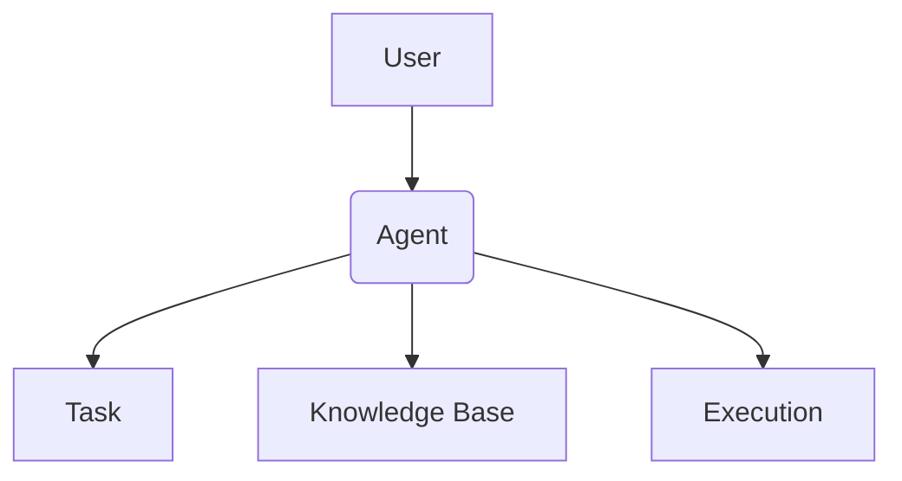

                 

# AI Agent辅助软件开发的方法

> 关键词：AI Agent, 软件开发, 自然语言处理, 机器学习, 知识图谱

> 摘要：本文详细探讨了AI Agent在软件开发中的应用方法，从概念、技术原理到实际项目应用，系统性地分析了AI Agent如何提升开发效率和代码质量。通过结合实际案例，本文展示了AI Agent在需求分析、代码生成、测试优化等环节中的具体作用，并总结了最佳实践和未来发展方向。

---

## 第一部分: AI Agent辅助软件开发的背景与概念

### 第1章: AI Agent的定义与背景

#### 1.1 AI Agent的基本概念

##### 1.1.1 什么是AI Agent
AI Agent（人工智能代理）是一种能够感知环境、自主决策并执行任务的智能实体。它能够通过与用户或系统的交互，理解需求并提供相应的解决方案。AI Agent的核心目标是通过自动化和智能化的方式，提升软件开发的效率和质量。

##### 1.1.2 AI Agent的历史演变
AI Agent的概念起源于人工智能领域，经历了从简单规则驱动到复杂学习驱动的演变。早期的AI Agent主要基于预定义规则进行决策，而现代AI Agent则结合了机器学习、自然语言处理等技术，具备更强的适应性和学习能力。

##### 1.1.3 AI Agent与传统软件开发工具的区别
与传统软件开发工具相比，AI Agent具有以下显著区别：
- **智能化**：AI Agent能够理解上下文并做出决策，而传统工具仅执行预定义指令。
- **自主性**：AI Agent能够自主选择最优解决方案，而传统工具需要人工干预。
- **学习能力**：AI Agent能够通过数据不断优化性能，而传统工具无法改进。

#### 1.2 AI Agent在软件开发中的作用

##### 1.2.1 提高开发效率
AI Agent可以通过自动化代码生成、需求分析和测试优化，显著缩短开发周期。

##### 1.2.2 优化代码质量
AI Agent能够识别潜在的代码问题，并提出改进建议，从而提升代码的可读性和可维护性。

##### 1.2.3 助力复杂系统的设计与实现
在处理复杂系统时，AI Agent能够协助开发者进行架构设计和模块划分，降低开发难度。

#### 1.3 本章小结
本章介绍了AI Agent的基本概念及其在软件开发中的重要性。通过对比传统工具，明确了AI Agent的核心优势和应用场景。

---

## 第二部分: AI Agent的核心概念与技术原理

### 第2章: AI Agent的核心概念与原理

#### 2.1 AI Agent的核心概念

##### 2.1.1 感知层
感知层负责接收输入信息并理解其含义。AI Agent通过自然语言处理技术，能够解析用户的意图和需求。

##### 2.1.2 决策层
决策层基于感知层获取的信息，结合知识图谱和机器学习模型，生成最优解决方案。

##### 2.1.3 执行层
执行层负责将决策层生成的方案转化为具体操作，如生成代码或调用API。

#### 2.2 AI Agent的关键技术

##### 2.2.1 自然语言处理
自然语言处理技术使AI Agent能够理解用户的输入，包括文本解析和意图识别。

##### 2.2.2 机器学习算法
机器学习算法用于训练AI Agent的决策模型，使其能够不断优化性能。

##### 2.2.3 知识图谱构建
知识图谱构建技术帮助AI Agent建立领域知识库，从而更好地理解上下文。

#### 2.3 AI Agent的核心属性对比

| 属性         | 描述                                                                 |
|--------------|----------------------------------------------------------------------|
| 感知能力     | 理解用户需求和上下文                                                 |
| 决策能力     | 基于数据做出最优选择                                               |
| 执行能力     | 自动化执行任务                                                     |

#### 2.4 AI Agent的实体关系图

#### 2.5 本章小结
本章详细讲解了AI Agent的核心概念和关键技

