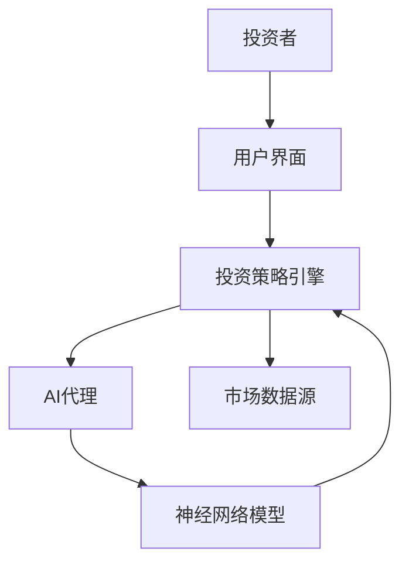

                 


# AI agents优化价值投资策略的动态调整

## 关键词：AI代理，价值投资策略，动态调整，强化学习，金融投资，动态规划

## 摘要：  
本文探讨AI代理在优化价值投资策略中的应用，重点分析动态调整的实现及其对投资决策的影响。通过强化学习和动态规划算法，AI代理能够实时调整投资策略，提升收益并降低风险。

---

## 第一部分：背景介绍

### 第1章：AI代理与价值投资策略概述

#### 1.1 AI代理的基本概念
- **1.1.1 AI代理的定义与特点**
  AI代理是能够感知环境并采取行动以实现目标的智能体。其特点包括自主性、反应性、目标导向和社交能力。
- **1.1.2 价值投资策略的背景与意义**
  价值投资策略强调长期投资优质资产，AI代理通过分析市场数据优化策略。
- **1.1.3 动态调整在投资中的重要性**
  动态调整使投资策略适应市场变化，AI代理通过实时分析优化决策。

#### 1.2 AI代理在金融领域的应用
- **1.2.1 AI代理在金融分析中的作用**
  AI代理用于市场预测、风险评估和投资组合优化。
- **1.2.2 价值投资策略的动态调整需求**
  传统策略静态，AI代理使其动态化，适应市场变化。
- **1.2.3 AI代理如何优化投资决策**
  通过实时数据分析和强化学习，AI代理优化投资组合，降低风险。

---

## 第二部分：核心概念与联系

### 第2章：AI代理与价值投资策略的核心原理

#### 2.1 AI代理的核心原理
- **2.1.1 强化学习与动态规划**
  强化学习通过奖励机制优化决策，动态规划用于分解复杂问题。
- **2.1.2 状态、动作与奖励机制**
  状态表示当前市场情况，动作是投资行为，奖励机制评估决策效果。
- **2.1.3 智能体的决策过程**
  AI代理根据市场状态采取最优行动，实现投资目标。

#### 2.2 价值投资策略的动态调整
- **2.2.1 价值投资的基本原理**
  投资者购买低于内在价值的资产，长期收益。
- **2.2.2 动态调整的必要性**
  市场变化要求策略灵活调整，避免固定模式。
- **2.2.3 AI代理在动态调整中的作用**
  AI代理实时分析数据，优化投资组合，动态调整策略。

#### 2.3 AI代理与价值投资策略的对比分析
| **属性**       | **AI代理**             | **传统方法**           |
|-----------------|-----------------------|-----------------------|
| 决策速度         | 实时                   | 定期                   |
| 数据处理能力     | 大规模                 | 有限                   |
| 精准度           | 高                     | 中等                   |
| 可适应性         | 强                     | 弱                     |

---

## 第三部分：算法原理讲解

### 第3章：基于强化学习的动态调整算法

#### 3.1 强化学习算法概述
- **3.1.1 Q-learning算法**
  通过状态-动作-奖励机制更新Q值，选择最优动作。
- **3.1.2 Deep Q-Networks（DQN）算法**
  使用深度神经网络近似Q值函数，处理高维状态空间。
- **3.1.3 算法的数学模型与公式**
  - Q-learning公式：
  $$ Q(s, a) \leftarrow Q(s, a) + \alpha \left[r + \gamma \max Q(s', a') - Q(s, a)\right] $$
  - DQN网络结构：输入层、隐藏层、输出层，使用经验回放和目标网络。

#### 3.2 动态调整的数学模型
- **3.2.1 状态空间与动作空间**
  状态空间：市场指标、资产价格。
  动作空间：买入、卖出、持有。
- **3.2.2 奖励函数的设计**
  基于投资收益、风险、交易成本。
  $$ R = \text{收益} - \text{风险} - \text{成本} $$
- **3.2.3 动态规划的数学表达**
  状态转移方程：
  $$ P(s' | s, a) $$
  投资组合优化问题：
  $$ \max_{w} \left( \mu^T w - \lambda \sigma^T w \right) $$

#### 3.3 算法实现步骤
1. **初始化**：设置初始参数和网络权重。
2. **环境交互**：根据当前状态选择动作，执行并获得奖励。
3. **经验回放**：存储经验，随机抽取小批量训练。
4. **网络更新**：优化器更新参数，减小当前网络与目标网络差距。
5. **策略调整**：根据奖励调整投资组合。

---

## 第四部分：系统分析与架构设计

### 第4章：系统架构设计

#### 4.1 系统应用场景
- **4.1.1 金融市场的动态变化**
  AI代理实时处理市场波动，优化投资决策。
- **4.1.2 投资者的多样化需求**
  提供个性化投资建议，满足不同风险偏好。

#### 4.2 系统功能设计
- **4.2.1 用户需求分析**
  投资者输入资金、风险偏好，系统提供策略建议。
- **4.2.2 功能模块设计**
  数据采集、策略优化、投资执行、风险监控。

#### 4.3 系统架构图


#### 4.4 系统接口设计
- **API接口**
  - 输入：市场数据、用户参数。
  - 输出：优化策略、投资组合。
- **交互流程**
  - 用户输入请求，系统分析数据，返回结果。

---

## 第五部分：项目实战

### 第5章：AI代理优化价值投资策略的实现

#### 5.1 环境安装与配置
- **Python环境**
  安装Python 3.8及以上版本，配置虚拟环境。
- **依赖库安装**
  使用pip安装TensorFlow、Keras、numpy、pandas、scikit-learn。

#### 5.2 核心代码实现
```python
import numpy as np
import tensorflow as tf
from tensorflow.keras import layers

# 定义DQN网络
class DQN:
    def __init__(self, state_space, action_space):
        self.state_space = state_space
        self.action_space = action_space
        self.model = self.build_model()
        self.target_model = self.build_model()
        self.target_update()

    def build_model(self):
        model = tf.keras.Sequential()
        model.add(layers.Dense(64, input_dim=self.state_space, activation='relu'))
        model.add(layers.Dense(64, activation='relu'))
        model.add(layers.Dense(self.action_space, activation='linear'))
        return model

    def target_update(self):
        self.target_model.set_weights(self.model.get_weights())

    def act(self, state):
        state = np.array([state])
        prediction = self.model.predict(state)[0]
        return np.argmax(prediction)

    def remember(self, state, action, reward, next_state):
        # 实际实现中需要存储经验回放
        pass

    def replay(self, batch_size):
        # 实际实现中需要从经验池中抽取样本训练
        pass
```

#### 5.3 代码解读与分析
- **DQN类**：实现深度Q网络，包含模型构建、目标网络更新和动作选择。
- **act方法**：根据当前状态选择最优动作。
- **target_update方法**：更新目标网络参数，确保稳定训练。

#### 5.4 实际案例分析
假设市场数据为股票价格，AI代理动态调整投资组合，优化收益。通过训练，模型能有效预测市场变化，执行最优交易策略。

---

## 第六部分：最佳实践

### 第6章：总结与展望

#### 6.1 小结
- AI代理通过强化学习优化价值投资策略，动态调整投资组合，提升收益。
- 技术实现涉及复杂算法和系统架构设计，需深入理解并正确实施。

#### 6.2 注意事项
- 数据质量：确保数据准确，避免偏差。
- 模型选择：根据具体情况选择合适算法，避免过度拟合。
- 风险控制：设置止损点，防止重大损失。

#### 6.3 拓展阅读
推荐学习强化学习、动态规划和金融数学相关知识，深入理解投资策略优化。

---

通过以上步骤，我们可以看到，AI代理在优化价值投资策略中的动态调整不仅技术复杂，而且效果显著。未来随着技术进步，AI代理在金融投资中的应用将更加广泛和深入。

