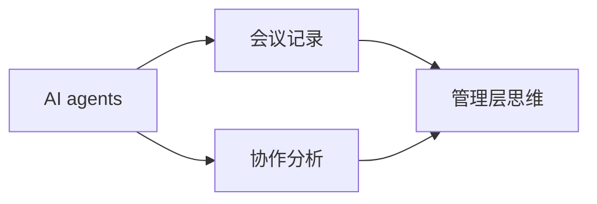
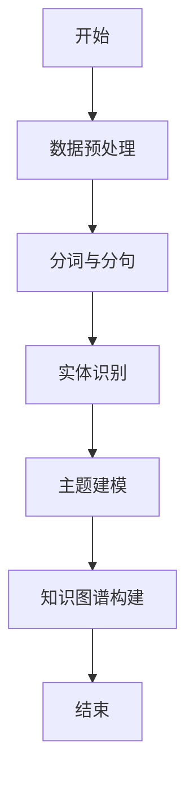
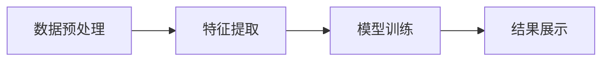
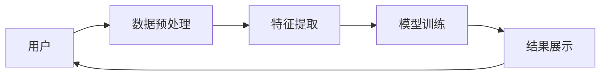
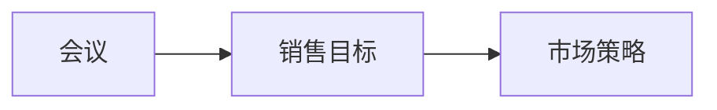

                 


# AI agents协作分析公司会议记录：洞察管理层思维

## 关键词
AI agents, 会议记录分析, 管理层思维, 自然语言处理, 机器学习, 知识图谱

## 摘要
本文探讨AI agents在协作分析公司会议记录中的应用，通过自然语言处理和机器学习技术，从会议记录中提取关键信息，构建知识图谱，进而洞察管理层的思维模式和决策逻辑。文章详细介绍了AI agents的核心概念、算法原理、系统架构，并通过实战案例展示其在企业中的实际应用价值。

---

# 第1章: AI agents协作分析公司会议记录的背景与核心概念

## 1.1 问题背景
### 1.1.1 传统会议记录分析的局限性
传统的会议记录分析依赖人工阅读和总结，存在以下问题：
- **效率低下**：人工分析耗时长，难以应对大量会议记录。
- **主观性**：不同分析师可能得出不同的结论，影响结果的准确性。
- **深度不足**：难以发现隐含的模式和趋势。

### 1.1.2 AI技术在企业分析中的应用趋势
随着AI技术的发展，企业开始利用AI工具进行数据分析，尤其是在以下方面：
- **自动化处理**：AI能够快速处理大量数据，提高效率。
- **深度洞察**：通过机器学习，AI能够发现数据中的隐藏模式。

### 1.1.3 管理层思维洞察的重要性
管理层的决策和思维模式直接影响企业的发展方向。通过分析会议记录，可以洞察管理层的决策逻辑、优先级和潜在风险。

## 1.2 问题描述
### 1.2.1 会议记录分析的主要挑战
- **数据多样性**：会议记录内容复杂，包括文本、语音等多种形式。
- **语义理解**：需要准确理解上下文和隐含含义。
- **实时性要求**：管理层可能需要快速分析结果以做出决策。

### 1.2.2 管理层思维的隐含模式
- **决策偏好**：管理层在会议中反复提到的关键词可能反映其决策倾向。
- **问题识别**：通过分析会议记录，可以识别管理层关注的主要问题。

### 1.2.3 AI agents在协作分析中的角色
AI agents可以通过协作的方式，分工处理会议记录的各个部分，如分词、实体识别、主题建模等，最终生成结构化的分析结果。

## 1.3 问题解决与边界
### 1.3.1 AI agents协作分析的解决方案
- **模块化设计**：将会议记录分析分解为多个模块，如数据预处理、特征提取、模型训练等。
- **协同工作**：AI agents协作处理各模块，提高效率和准确性。

### 1.3.2 解决方案的边界与适用场景
- **边界**：主要解决会议记录的结构化分析问题，不涉及企业内部其他系统的集成。
- **适用场景**：适用于需要快速分析会议记录的企业，尤其是管理层决策分析。

### 1.3.3 解决方案的外延与限制
- **外延**：未来可以扩展到其他类型的企业文档分析。
- **限制**：需要高质量的会议记录数据，且对AI模型的训练数据要求较高。

## 1.4 核心概念与概念结构
### 1.4.1 核心概念
- **AI agents**：具备自主决策和协作能力的智能体。
- **会议记录**：企业会议的文本或语音记录。
- **管理层思维**：管理层在会议中的决策逻辑和关注点。

### 1.4.2 概念结构图


---

# 第2章: AI agents协作分析的算法原理

## 2.1 自然语言处理在会议记录分析中的应用
### 2.1.1 分词与分句
- **分词**：将会议记录分割为词语或短语。
- **分句**：将会议记录分割为句子。

### 2.1.2 实体识别
- **命名实体识别（NER）**：识别会议记录中的关键实体，如人名、机构名等。
- **实体关系识别**：识别实体之间的关系。

### 2.1.3 情感分析
- **情感分析**：分析会议记录中参与者的情感倾向。

## 2.2 机器学习在会议记录分析中的应用
### 2.2.1 主题建模
- **LDA主题模型**：用于发现会议记录中的主题分布。

### 2.2.2 文本分类
- **分类任务**：将会议记录分类为不同主题或类别。

## 2.3 知识图谱构建
### 2.3.1 知识图谱构建流程
1. 数据预处理：清洗和标准化会议记录。
2. 实体识别与链接：识别实体并建立关联。
3. 关系抽取：提取实体之间的关系。
4. 知识图谱存储：存储构建的知识图谱。

### 2.3.2 知识图谱应用
- **语义搜索**：基于知识图谱进行语义搜索。
- **决策支持**：基于知识图谱提供决策支持。

## 2.4 算法流程图


---

# 第3章: AI agents协作分析的系统架构

## 3.1 系统功能设计
### 3.1.1 功能模块划分
- **数据预处理模块**：负责清洗和标准化会议记录。
- **特征提取模块**：提取会议记录中的关键特征。
- **模型训练模块**：训练机器学习模型。
- **结果展示模块**：展示分析结果。

### 3.1.2 功能模块的交互流程
1. 数据预处理模块接收原始会议记录。
2. 特征提取模块提取关键特征并传递给模型训练模块。
3. 模型训练模块生成分析结果并传递给结果展示模块。
4. 结果展示模块将结果呈现给用户。

## 3.2 系统架构设计
### 3.2.1 系统架构图


### 3.2.2 系统接口设计
- **输入接口**：接收会议记录数据。
- **输出接口**：输出分析结果。

## 3.3 系统交互流程图


---

# 第4章: AI agents协作分析的项目实战

## 4.1 项目背景
### 4.1.1 项目目标
通过AI agents协作分析会议记录，提取关键信息，构建知识图谱，洞察管理层思维。

## 4.2 项目环境安装
### 4.2.1 环境要求
- Python 3.8及以上版本
- 安装必要的库，如 `jieba`、`spacy`、`networkx`

## 4.3 核心代码实现
### 4.3.1 数据预处理
```python
import jieba
from spacy.lang.zh import Chinese

def preprocess(text):
    # 分词
    words = jieba.lcut(text)
    # 去除停用词
    stopwords = set(["的", "了", "是", "在", "和", "且", "或", "但"])
    filtered_words = [word for word in words if word not in stopwords]
    return filtered_words
```

### 4.3.2 实体识别
```python
import spacy

nlp = spacy.load("zh_core_web_sm")
def entity_recognition(text):
    doc = nlp(text)
    entities = []
    for ent in doc.ents:
        entities.append((ent.text, ent.label_))
    return entities
```

### 4.3.3 知识图谱构建
```python
from networkx import *
import matplotlib.pyplot as plt

def build_kg(entities):
    G = Graph()
    nodes = set()
    edges = []
    for entity in entities:
        node1 = entity[0]
        node2 = entity[1]
        nodes.add(node1)
        nodes.add(node2)
        edges.append((node1, node2))
    G.add_nodes_from(nodes)
    G.add_edges_from(edges)
    return G

def visualize_kg(G):
    plt.figure(figsize=(10,10))
    nx.draw(G, with_labels=True, node_color='red', edge_color='blue')
    plt.show()
```

## 4.4 项目结果展示
### 4.4.1 数据预处理结果
```plaintext
原始文本：今天会议讨论了下一季度的销售目标和市场策略。
预处理后：今天 会议 讨论 下一季 度 销售 目标 市场 策略
```

### 4.4.2 实体识别结果
```plaintext
('会议', 'ORG'), ('销售目标', 'EVENT'), ('市场策略', 'EVENT')
```

### 4.4.3 知识图谱展示


---

# 第5章: AI agents协作分析的最佳实践与小结

## 5.1 项目小结
通过AI agents协作分析会议记录，可以高效地提取关键信息，构建知识图谱，洞察管理层思维。AI agents的协作能力显著提高了分析效率和准确性。

## 5.2 注意事项
- **数据质量**：确保会议记录数据的完整性和准确性。
- **模型调优**：根据实际需求调整模型参数。
- **隐私保护**：注意会议记录中的敏感信息保护。

## 5.3 拓展阅读
- 推荐阅读《自然语言处理入门》和《机器学习实战》。

---

# 结语
AI agents协作分析公司会议记录是一种高效的企业数据分析方式，通过自然语言处理和机器学习技术，可以帮助企业更好地洞察管理层思维，优化决策过程。随着技术的不断进步，AI agents将在企业分析中发挥越来越重要的作用。

