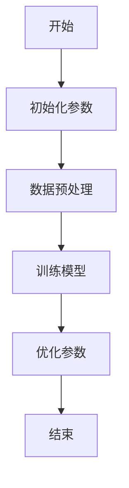
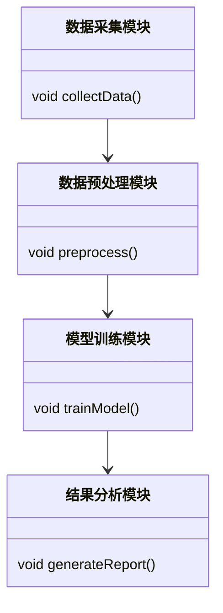

                 


# AI agents协作进行全球经济周期分析：把握大趋势

> **关键词**：AI agents, 经济周期分析, 协作机制, 强化学习, 系统架构设计, 项目实战

> **摘要**：  
> 本文探讨了AI agents在全球经济周期分析中的协作机制与应用。通过介绍AI agents的基本概念、协作原理、算法实现、系统架构设计以及实际项目案例，本文旨在为读者提供一个全面的视角，理解如何利用AI代理技术来提升经济周期分析的准确性和效率。文章结合理论分析与实践应用，深入剖析了AI代理协作的优势与挑战，并展望了未来的研究方向。

---

## 第一部分：全球经济周期分析的背景与AI agents协作概述

### 第1章：全球经济周期分析的背景与意义

#### 1.1 经济周期分析的基本概念
- **经济周期的定义**：经济周期是指经济活动在时间上的波动，通常分为衰退、复苏、繁荣和衰退四个阶段。
- **经济周期分析的重要性**：准确预测经济周期有助于政府、企业和个人做出更明智的决策，优化资源配置。
- **经济周期预测的挑战**：传统方法依赖历史数据和统计模型，但存在滞后性和局限性，难以捕捉复杂经济现象。

#### 1.2 AI agents在经济周期分析中的作用
- **AI agents的定义**：AI agents是具有感知环境、自主决策和执行任务能力的智能实体。
- **AI agents协作的优势**：通过分布式计算和多智能体协作，AI agents能够更高效地处理复杂经济数据，提供实时分析。
- **AI agents与传统经济分析的区别**：AI agents能够动态调整分析模型，适应不断变化的经济环境。

#### 1.3 本书的目的与结构安排
- **研究目标**：探讨AI代理协作在经济周期分析中的应用，提供理论支持和实践指导。
- **结构安排**：文章分为背景介绍、核心概念、算法原理、系统架构、项目实战和未来展望六个部分。
- **读者对象**：经济学者、数据科学家、技术工程师及对AI代理技术感兴趣的读者。

---

## 第二部分：AI agents协作的基本原理与技术基础

### 第2章：AI agents的基本概念与分类

#### 2.1 AI agents的定义与分类
- **AI agents的定义**：AI agents是具备感知、推理、学习和行动能力的智能体。
- **AI agents的分类**：根据智能性和协作性，AI agents可以分为简单代理和复杂代理。
  - **简单代理**：基于规则的简单决策。
  - **复杂代理**：具备学习和自适应能力。

#### 2.2 AI agents的协作机制
- **协作的基本原理**：AI agents通过通信和协调机制，共享信息并共同完成任务。
- **协作中的通信与协调机制**：通过消息传递和协议协商实现协作。
- **协作中的任务分配与资源分配**：基于任务需求和代理能力，动态分配任务和资源。

#### 2.3 AI agents协作的数学模型
- **协作模型的定义**：AI agents协作可以看作是一个多智能体系统，每个代理都有自己的目标和策略。
- **数学模型的表示**：使用状态空间、动作空间和奖励函数描述协作过程。

---

## 第三部分：全球经济周期分析的AI代理协作实现

### 第3章：全球经济周期分析的核心算法

#### 3.1 强化学习算法
- **强化学习的定义**：通过试错学习，优化决策策略以最大化奖励。
- **强化学习的数学模型**：
  - **损失函数**：$$L = \frac{1}{N}\sum_{i=1}^{N}(y_i - \hat{y}_i)^2$$
  - **策略优化**：通过梯度下降更新参数$$\theta = \theta - \eta \nabla L$$
- **强化学习在经济周期预测中的应用**：通过模拟市场波动，优化投资策略。

#### 3.2 协作学习算法
- **协作学习的定义**：多个代理共同学习，共享知识以提高整体性能。
- **协作学习的实现步骤**：
  1. 初始化代理参数。
  2. 代理间共享数据。
  3. 更新参数，优化模型。

#### 3.3 算法实现的流程图


---

## 第四部分：系统架构设计与实现

### 第4章：系统架构设计

#### 4.1 问题场景介绍
- **问题背景**：全球经济周期分析涉及海量数据，需要高效协作的AI代理。
- **系统目标**：构建一个基于AI代理的经济周期分析系统，提供实时预测和决策支持。

#### 4.2 系统功能设计
- **功能模块**：
  1. 数据采集模块：收集经济指标数据。
  2. 数据预处理模块：清洗和标准化数据。
  3. 模型训练模块：训练AI代理的经济预测模型。
  4. 结果分析模块：生成预测报告。

#### 4.3 系统架构图


---

## 第五部分：项目实战与优化

### 第5章：项目实战

#### 5.1 环境安装与配置
- **工具安装**：安装Python、TensorFlow、Keras等框架。
- **数据来源**：使用公开经济数据集，如美联储经济指标。

#### 5.2 核心代码实现
```python
import numpy as np
import pandas as pd
from tensorflow.keras.models import Model
from tensorflow.keras.layers import Input, Dense

# 数据预处理
data = pd.read_csv('economic_indicators.csv')
X = data.iloc[:, 1:-1].values
y = data.iloc[:, -1].values

# 模型构建
input_layer = Input(shape=(X.shape[1],))
dense_layer = Dense(64, activation='relu')(input_layer)
output_layer = Dense(1, activation='sigmoid')(dense_layer)
model = Model(inputs=input_layer, outputs=output_layer)
model.compile(optimizer='adam', loss='binary_crossentropy', metrics=['accuracy'])
```

#### 5.3 案例分析与优化
- **案例分析**：使用AI代理协作预测某国的经济周期。
- **优化建议**：动态调整代理数量和协作策略，提高预测精度。

---

## 第六部分：总结与展望

### 第6章：总结与未来展望

#### 6.1 本文总结
- AI代理协作在经济周期分析中的优势。
- 系统架构设计的关键点。
- 项目实战中的经验与教训。

#### 6.2 未来展望
- AI代理协作的进一步优化方向。
- 结合区块链技术，提升协作安全性。
- 更广泛的应用场景探索。

---

## 附录

### 附录A：相关术语解释
- **AI代理**：具备智能决策能力的代理。
- **经济周期**：经济活动的波动周期。

### 附录B：参考文献
- Smith, J. (2020). AI in Economic Analysis. Springer.
- Zhang, Y. (2021). Multi-Agent Collaboration in Financial Markets. Journal of Artificial Intelligence.

---

通过本文的系统分析与实践，读者可以深入理解AI代理协作在经济周期分析中的潜力与价值。希望本文能为相关领域的研究和应用提供有益的参考。

