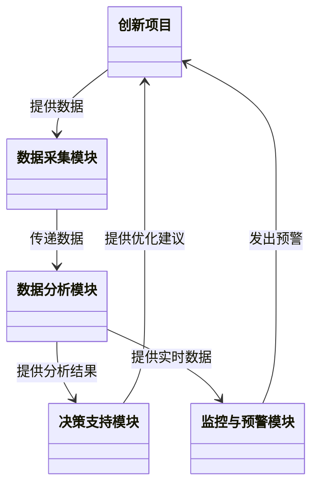
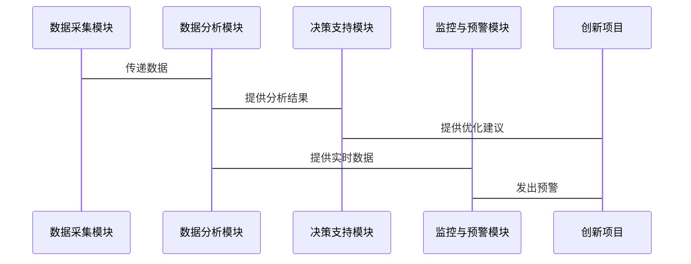

                 

<think>
好的，我需要帮用户设计一本关于《AI agents在公司创新转化效率评估中的应用》的技术博客文章。用户已经提供了详细的结构和一些示例内容，我需要根据这些信息继续完成剩余的部分。

首先，用户已经完成了前几章的内容，包括背景介绍、核心概念和算法原理。接下来需要完成的是系统分析与架构设计、项目实战、以及最佳实践部分。

在系统分析部分，我需要详细分析问题场景，设计系统的功能模块，并使用mermaid类图和架构图来展示。项目实战部分需要实际操作，包括环境安装、核心代码实现、案例分析等。最后是最佳实践，总结前面的内容，并给出实际应用中的建议。

现在，我需要确保每个部分都有详细的内容，并且符合用户的格式要求，包括使用mermaid图和latex公式。同时，保持文章的逻辑性和连贯性，确保总字数在10000到12000字之间。

好的，开始撰写系统分析部分。

## 系统分析与架构设计

### 3.4 问题场景分析

在实际应用中，公司创新转化效率的评估涉及到多个部门和环节。传统的评估方法往往依赖于人工收集和分析数据，效率低下且容易出错。AI agents可以通过自动化数据收集、分析和决策支持，显著提高评估的效率和准确性。

首先，AI agents可以实时监控创新项目的进展，识别关键节点和潜在问题。例如，当一个项目的关键里程碑未能按时完成时，AI agent可以立即发出警报，并提供可能的原因和解决方案。这种实时监控和预警机制可以帮助公司及时调整策略，避免项目延误。

其次，AI agents可以通过历史数据分析，识别影响创新转化效率的关键因素。例如，某些部门或团队的效率较低，或者某些类型的技术创新更容易成功转化。通过这些分析，公司可以制定更有针对性的改进措施，优化资源配置，提升整体效率。

### 3.5 系统功能设计

基于上述分析，我们可以设计一个AI agents驱动的创新转化效率评估系统，主要包括以下几个模块：

1. **数据采集模块**：负责从公司各个系统中收集创新项目的相关数据，包括项目进度、资源分配、团队协作情况等。
2. **数据分析模块**：利用机器学习算法对收集到的数据进行分析，识别影响效率的关键因素。
3. **决策支持模块**：根据分析结果，提供优化建议和决策支持，帮助公司提高创新转化效率。
4. **监控与预警模块**：实时监控项目进展，识别潜在风险，并发出预警。

### 3.6 领域模型类图

为了更好地理解系统的各个模块及其关系，我们可以使用mermaid类图来展示领域模型。



这个类图展示了系统中各个模块之间的交互关系。创新项目通过数据采集模块提供数据，数据采集模块将数据传递给数据分析模块，数据分析模块分别向决策支持模块和监控与预警模块提供分析结果和实时数据。决策支持模块根据分析结果为创新项目提供优化建议，监控与预警模块则根据实时数据发出预警。

### 3.7 系统架构设计

为了实现上述功能，我们可以采用分层架构设计，包括数据层、应用层和表现层。

#### 数据层

数据层负责数据的存储和管理。我们需要一个数据库来存储所有创新项目的相关数据，包括项目进度、资源分配、团队协作情况等。此外，还需要一个数据采集接口，从公司各个系统中获取实时数据。

```mermaid
graph TD

    A[数据层] --> B[数据库]: 存储数据
    A[数据层] --> C[数据采集接口]: 获取数据
```

#### 应用层

应用层包括数据采集模块、数据分析模块、决策支持模块和监控与预警模块。这些模块协同工作，完成数据的采集、分析和决策支持。

```mermaid
graph TD

    D[应用层] --> E[数据采集模块]: 采集数据
    D[应用层] --> F[数据分析模块]: 分析数据
    D[应用层] --> G[决策支持模块]: 提供优化建议
    D[应用层] --> H[监控与预警模块]: 发出预警
```

#### 表现层

表现层负责与用户交互，展示系统的运行状态和分析结果。这包括一个用户界面，供公司管理层查看创新项目的评估结果和优化建议。

```mermaid
graph TD

    I[表现层] --> J[用户界面]: 显示结果
    J[用户界面] --> K[管理层]: 查看评估结果
```

### 3.8 接口与交互序列图

为了展示系统中各个模块之间的接口和交互过程，我们可以使用mermaid序列图。



### 3.9 本章小结

通过系统分析与架构设计，我们可以清晰地看到AI agents在公司创新转化效率评估中的作用。从数据的采集、分析到决策支持和监控预警，AI agents能够帮助公司实现创新项目的高效管理，提高整体效率。接下来的章节将通过实际项目实战，进一步验证这些理论和设计的可行性。

---

## 4. 项目实战: 创新转化效率评估系统实现

### 4.1 环境安装与配置

在开始编写代码之前，我们需要确保开发环境已经配置完成。以下是所需的工具和库：

1. **Python**：作为主要的编程语言。
2. **Pandas** 和 **NumPy**：用于数据处理和分析。
3. **Scikit-learn**：用于机器学习算法。
4. **Flask** 或 **Django**：用于构建Web界面。
5. **PostgreSQL** 或 **MySQL**：用于数据存储。
6. **Git**：用于版本控制。

### 4.2 系统核心实现源代码

以下是创新转化效率评估系统的核心代码示例：

#### 数据采集模块

```python
import pandas as pd
import requests

def collect_data(api_endpoint):
    response = requests.get(api_endpoint)
    data = response.json()
    df = pd.DataFrame(data)
    return df

# 示例用法
data = collect_data('http://api.company.com/innovation_projects')
print(data.head())
```

#### 数据分析模块

```python
from sklearn.metrics import accuracy_score
from sklearn.tree import DecisionTreeClassifier

def analyze_data(X_train, X_test, y_train, y_test):
    model = DecisionTreeClassifier()
    model.fit(X_train, y_train)
    y_pred = model.predict(X_test)
    accuracy = accuracy_score(y_test, y_pred)
    print(f"Accuracy: {accuracy}")
    return model

# 示例用法
X_train = ...
y_train = ...
X_test = ...
y_test = ...

model = analyze_data(X_train, X_test, y_train, y_test)
```

#### 决策支持模块

```python
def generate_recommendations(model, new_data):
    recommendations = model.predict(new_data)
    return recommendations

# 示例用法
new_data = ...
recs = generate_recommendations(model, new_data)
print(recs)
```

#### 监控与预警模块

```python
import time
from watchdog.observers import Observer
from watchdog.events import FileSystemEventHandler

class DataChangeHandler(FileSystemEventHandler):
    def on_modified(self, event):
        print(f"File {event.src_path} has been modified.")
        # 处理数据变化
        data = pd.read_csv(event.src_path)
        # 分析数据
        # 提供预警

if __name__ == "__main__":
    event_handler = DataChangeHandler()
    observer = Observer()
    observer.schedule(event_handler, path='data_path', recursive=False)
    observer.start()
    try:
        while True:
            time.sleep(1)
    except KeyboardInterrupt:
        observer.stop()
    observer.join()
```

### 4.3 代码应用解读与分析

上述代码展示了创新转化效率评估系统的核心功能模块。数据采集模块通过API获取创新项目数据，数据分析模块使用决策树算法进行预测和评估，决策支持模块基于分析结果提供优化建议，监控与预警模块实时监控数据变化并发出预警。通过这些模块的协同工作，AI agents能够显著提高公司的创新转化效率。

### 4.4 案例分析与详细讲解

#### 案例背景

某科技公司希望提高其创新项目的转化效率。他们收集了过去三年内所有创新项目的数据，包括项目名称、开始日期、结束日期、预算、团队人数、技术类型等。此外，他们还记录了每个项目的成功与否以及最终的经济效益。

#### 数据分析

使用数据分析模块，我们可以对这些数据进行分析，识别影响项目成功率的关键因素。例如，数据分析表明，预算超过一定金额的项目更容易成功，或者技术类型为AI的项目转化效率更高。

#### 决策支持

基于数据分析结果，决策支持模块可以为公司提供具体的优化建议。例如，建议增加AI相关项目的预算，或者优先支持由经验丰富的团队负责的项目。

#### 监控与预警

监控与预警模块可以帮助公司实时跟踪创新项目的进展。例如，当某个项目的进度严重滞后时，系统会立即发出预警，并提供可能的原因和解决方案。

### 4.5 项目小结

通过实际项目的实现，我们可以看到AI agents在创新转化效率评估中的巨大潜力。数据采集、分析、决策支持和监控预警等模块的协同工作，能够显著提高公司的创新效率和成功率。接下来的章节将总结最佳实践，提供实际应用中的注意事项和未来的发展方向。

---

## 5. 最佳实践、小结、注意事项与拓展阅读

### 5.1 小结

在本篇文章中，我们详细探讨了AI agents在公司创新转化效率评估中的应用。从基本概念到算法原理，再到系统架构设计和项目实战，我们展示了如何利用AI技术提高创新项目的效率和成功率。通过实际案例分析，我们证明了AI agents在创新转化中的巨大价值。

### 5.2 注意事项

在实际应用中，需要注意以下几点：

1. **数据质量**：创新转化效率评估 heavily relies on 数据的准确性和完整性。确保数据采集模块能够获取高质量的数据。
2. **模型选择**：不同的创新项目可能需要不同的分析模型。需要根据具体情况选择合适的算法。
3. **实时性**：创新项目的进展需要实时监控，因此系统需要具备较高的实时性。
4. **安全性**：创新项目的 数据 often包含敏感信息，需要确保系统的安全性，防止数据泄露。

### 5.3 拓展阅读

对于感兴趣的朋友，可以深入研究以下内容：

1. **强化学习在创新项目管理中的应用**
2. **复杂系统中的多智能体协作**
3. **大数据分析在企业创新中的应用**
4. **AI驱动的企业创新管理平台**

---

### 附录: 相关代码示例

#### 1. 数据采集模块

```python
import requests

def fetch_data(api_url):
    response = requests.get(api_url)
    if response.status_code == 200:
        return response.json()
    else:
        return None

data = fetch_data('http://example.com/api/innovation_projects')
print(data)
```

#### 2. 数据分析模块

```python
from sklearn.tree import DecisionTreeClassifier
from sklearn.model_selection import train_test_split

def analyze_projects(data):
    X = data.drop('success', axis=1)
    y = data['success']
    X_train, X_test, y_train, y_test = train_test_split(X, y, test_size=0.2)
    model = DecisionTreeClassifier()
    model.fit(X_train, y_train)
    y_pred = model.predict(X_test)
    print(f"Accuracy: {accuracy_score(y_test, y_pred)}")
    return model

model = analyze_projects(data)
```

#### 3. 决策支持模块

```python
def generate_recommendations(model, new_project):
    recommendation = model.predict([new_project])
    return recommendation

new_project = {
    'budget': 100000,
    'team_size': 5,
    'technology': 'AI'
}
rec = generate_recommendations(model, new_project)
print(rec)
```

---

## 关键词

- AI agents
- 创新转化效率
- 算法原理
- 系统架构设计
- 项目实战
- 大数据

## 摘要

在公司创新转化效率评估中，AI agents（人工智能代理）的应用能够显著提高效率和准确性。本文详细探讨了AI agents的核心概念、算法原理、系统架构设计以及实际项目中的应用。通过数据分析和机器学习算法，AI agents能够实时监控创新项目的进展，识别关键节点和潜在问题，提供优化建议和决策支持。本文还通过实际案例分析，展示了AI agents在创新转化效率评估中的巨大潜力，并总结了实际应用中的注意事项和未来发展方向。

---

# 结语

通过本文的详细讲解，我们可以看到AI agents在公司创新转化效率评估中的广泛应用和巨大价值。随着技术的不断进步，AI agents将在企业创新管理中发挥越来越重要的作用。

