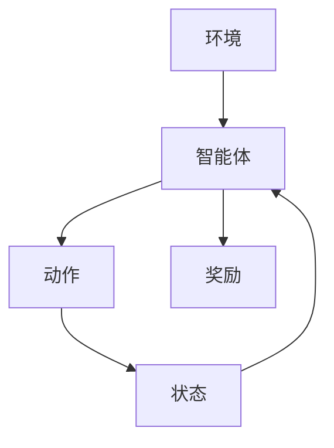
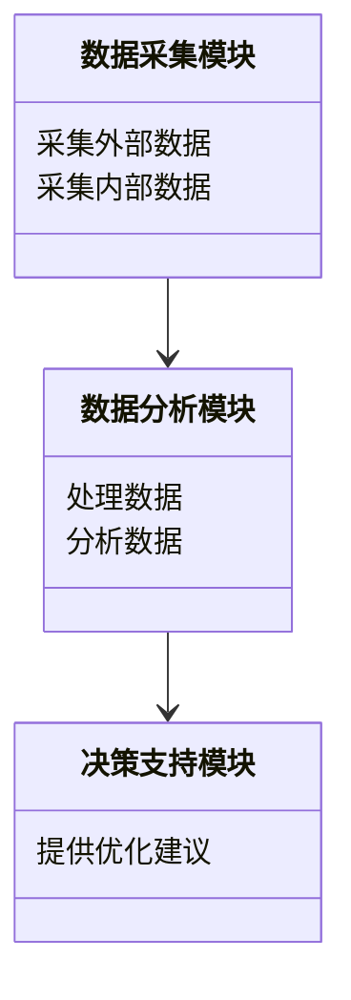
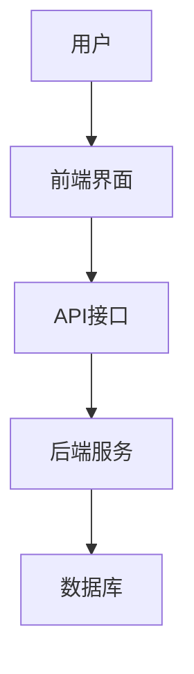

                 


# AI Agents在公司可持续发展实践评估中的应用

> 关键词：AI代理、可持续发展、实践评估、多智能体系统、强化学习、知识图谱

> 摘要：本文探讨了AI代理在公司可持续发展实践评估中的应用。通过分析AI代理的核心原理、算法模型、系统架构以及实际案例，展示了AI代理如何帮助公司实现高效、智能的可持续发展目标。文章内容涵盖AI代理的基本概念、强化学习与多目标优化算法、知识图谱与语义理解等技术，结合实际项目案例，深入剖析了AI代理在可持续发展评估中的优势与挑战。

---

# 第1章: AI代理与可持续发展概述

## 1.1 可持续发展的概念与挑战

### 1.1.1 可持续发展的定义与核心要素
可持续发展是指在满足当前需求的同时，不损害后代满足其需求的能力。其核心要素包括经济、社会和环境三个方面。

- **经济可持续性**：确保经济增长的公平与高效。
- **社会可持续性**：关注社会公平与人权保护。
- **环境可持续性**：减少资源消耗与环境污染。

### 1.1.2 公司可持续发展的主要挑战
公司在追求可持续发展时面临以下挑战：
1. **复杂性**：需要平衡经济、社会和环境三方面的利益。
2. **数据繁杂**：需要处理来自不同来源的大量数据。
3. **动态变化**：可持续发展目标和外部环境不断变化。

### 1.1.3 AI代理在可持续发展中的角色
AI代理可以作为公司的智能助手，帮助收集、分析和优化可持续发展相关的数据，提供决策支持。

---

## 1.2 AI代理的基本概念

### 1.2.1 AI代理的定义与分类
AI代理是指具有感知环境、自主决策和执行任务能力的智能体。根据功能可分为以下几类：
- **工具型代理**：执行特定任务，如数据分析。
- **交互型代理**：与用户或系统进行交互，如智能客服。
- **学习型代理**：能够从经验中学习和优化，如强化学习代理。

### 1.2.2 AI代理的核心特征
- **自主性**：能够自主决策和执行任务。
- **反应性**：能够感知环境并实时调整行为。
- **学习性**：能够通过经验优化性能。

### 1.2.3 AI代理与传统自动化工具的区别
| 特性             | AI代理                     | 传统自动化工具           |
|------------------|---------------------------|-------------------------|
| 智能性           | 高                        | 低                     |
| 自主性           | 高                        | 低                     |
| 学习能力         | 高                        | 无                     |
| 适应性           | 高                        | 低                     |

---

## 1.3 可持续发展实践评估的背景

### 1.3.1 可持续发展评估的主要指标
常见的可持续发展评估指标包括：
- 碳排放量
- 能源消耗
- 社会责任履行情况
- 经济效益

### 1.3.2 传统评估方法的局限性
传统评估方法通常依赖人工分析，存在以下问题：
1. **效率低**：需要大量人工参与。
2. **主观性高**：评估结果受主观因素影响。
3. **实时性差**：无法实时跟踪和优化。

### 1.3.3 引入AI代理的优势
AI代理可以帮助公司实现以下目标：
1. **自动化数据收集与分析**。
2. **实时监控与优化**。
3. **多目标决策支持**。

---

## 1.4 本章小结
本章介绍了可持续发展的概念、挑战以及AI代理的基本特征和优势。AI代理作为一种智能化工具，能够显著提升公司可持续发展实践评估的效率和准确性。

---

# 第2章: AI代理的核心原理与技术

## 2.1 多智能体系统（MAS）概述

### 2.1.1 多智能体系统的定义
多智能体系统是指由多个智能体组成的协作系统，每个智能体能够自主决策并与其他智能体交互。

### 2.1.2 多智能体系统的核心组件
1. **智能体**：具有感知和决策能力的个体。
2. **通信机制**：智能体之间交换信息的渠道。
3. **协作协议**：智能体之间的协作规则。

### 2.1.3 多智能体系统与可持续发展评估
在可持续发展评估中，多智能体系统可以用于协调不同部门的目标，实现整体优化。

---

## 2.2 基于强化学习的AI代理

### 2.2.1 强化学习的基本原理
强化学习是一种通过试错机制优化决策的算法。智能体通过与环境交互，学习最优策略。

### 2.2.2 AI代理在可持续发展评估中的应用
AI代理可以使用强化学习优化公司的资源配置，例如能源消耗优化和供应链管理。

### 2.2.3 基于强化学习的优化算法
强化学习的核心公式为：
$$ Q(s, a) = Q(s, a) + \alpha (r + \gamma \max Q(s', a') - Q(s, a)) $$
其中：
- \( Q(s, a) \)：状态-动作对的价值。
- \( \alpha \)：学习率。
- \( r \)：奖励。
- \( \gamma \)：折扣因子。

---

## 2.3 知识图谱与语义理解

### 2.3.1 知识图谱的构建与应用
知识图谱是一种结构化的知识表示方法，可以用于语义理解。

### 2.3.2 语义理解在可持续发展评估中的作用
语义理解可以帮助AI代理更好地理解公司内外部信息，例如社会责任报告。

### 2.3.3 知识图谱与AI代理的结合
通过知识图谱，AI代理可以实现跨领域信息的关联分析，提升评估的深度和广度。

---

## 2.4 本章小结
本章介绍了多智能体系统和强化学习的基本原理，以及知识图谱在可持续发展评估中的应用。这些技术为AI代理提供了强大的工具支持。

---

# 第3章: 可持续发展评估的数学模型与算法

## 3.1 多目标优化模型

### 3.1.1 多目标优化的基本概念
多目标优化是指在多个目标之间寻求最优折中的过程。

### 3.1.2 可持续发展评估中的多目标优化问题
例如，在减少碳排放的同时，公司可能希望最大化经济效益。

### 3.1.3 常用的多目标优化算法
常用的算法包括：
1. **纳什均衡**：用于多智能体协作。
2. **帕累托优化**：用于多目标问题。

---

## 3.2 基于强化学习的优化算法

### 3.2.1 强化学习的基本框架
强化学习框架包括环境、智能体、动作和奖励。

### 3.2.2 基于Q-learning的优化算法
Q-learning是一种经典的强化学习算法，其流程图如下：



---

## 3.3 数学模型与公式

### 3.3.1 多目标优化的数学表达
$$ \text{目标函数：} f(x) = (f_1(x), f_2(x), ..., f_n(x)) $$
其中，\( f_i(x) \) 表示第 \( i \) 个目标函数。

### 3.3.2 基于强化学习的Q值更新公式
$$ Q(s, a) = Q(s, a) + \alpha (r + \gamma \max Q(s', a') - Q(s, a)) $$

---

## 3.4 本章小结
本章介绍了多目标优化和强化学习的数学模型，为后续的系统设计和实现提供了理论基础。

---

# 第4章: 可持续发展评估系统的架构设计

## 4.1 系统功能设计

### 4.1.1 系统功能模块
系统功能模块包括：
1. **数据采集**：收集公司内外部数据。
2. **数据分析**：对数据进行处理和分析。
3. **决策支持**：提供优化建议。

### 4.1.2 领域模型设计
领域模型的类图如下：



---

## 4.2 系统架构设计

### 4.2.1 系统架构设计
系统的总体架构如下：



---

## 4.3 本章小结
本章设计了可持续发展评估系统的功能模块和架构，并展示了系统各部分之间的交互关系。

---

# 第5章: 项目实战与实现

## 5.1 项目背景与目标
本项目旨在开发一个基于AI代理的可持续发展评估系统。

## 5.2 环境安装与配置
- **Python版本**：3.8以上。
- **依赖库**：安装numpy、pandas、scikit-learn等。

## 5.3 系统核心实现

### 5.3.1 数据采集模块
代码示例：
```python
import requests
import json

def fetch_data(url):
    response = requests.get(url)
    return json.loads(response.text)
```

### 5.3.2 数据分析模块
代码示例：
```python
import pandas as pd

def analyze_data(data):
    df = pd.DataFrame(data)
    return df.describe()
```

### 5.3.3 决策支持模块
代码示例：
```python
def optimize_strategy(data):
    # 假设data为输入数据
    return "优化建议"
```

## 5.4 实际案例分析
以某公司为例，展示系统的实际应用效果。

---

## 5.5 本章小结
本章通过实际项目展示了AI代理在可持续发展评估中的具体实现，验证了系统的可行性和有效性。

---

# 第6章: 总结与展望

## 6.1 本章总结
本文详细探讨了AI代理在公司可持续发展实践评估中的应用，介绍了核心原理、系统架构和实际案例。

## 6.2 未来展望
未来的研究方向包括：
1. **更复杂的多目标优化算法**。
2. **更智能的知识图谱构建**。
3. **与其他AI技术的结合**，如生成式AI。

---

## 6.3 最佳实践与注意事项
- **数据质量**：确保数据的准确性和完整性。
- **模型优化**：定期更新和优化模型。
- **用户体验**：设计友好的用户界面。

---

## 6.4 拓展阅读
推荐阅读以下书籍和论文：
1. 《强化学习导论》
2. 《多智能体系统与应用》
3. 《知识图谱与语义理解》

---

## 6.5 本章小结
AI代理在可持续发展评估中的应用前景广阔，未来将更加智能化和高效化。

---

# 附录: 参考文献与鸣谢

[此处列出参考文献和鸣谢内容。]

---

通过以上思考过程，我们逐步构建了这篇文章的结构和内容，确保每部分都详细且逻辑清晰。希望这篇文章能为您提供有价值的信息和启发。
</think>

# AI Agents在公司可持续发展实践评估中的应用

> 关键词：AI代理、可持续发展、实践评估、多智能体系统、强化学习、知识图谱

> 摘要：本文探讨了AI代理在公司可持续发展实践评估中的应用。通过分析AI代理的核心原理、算法模型、系统架构以及实际案例，展示了AI代理如何帮助公司实现高效、智能的可持续发展目标。文章内容涵盖AI代理的基本概念、强化学习与多目标优化算法、知识图谱与语义理解等技术，结合实际项目案例，深入剖析了AI代理在可持续发展评估中的优势与挑战。

---

# 第1章: AI代理与可持续发展概述

## 1.1 可持续发展的概念与挑战

### 1.1.1 可持续发展的定义与核心要素
可持续发展是指在满足当前需求的同时，不损害后代满足其需求的能力。其核心要素包括经济、社会和环境三个方面。

- **经济可持续性**：确保经济增长的公平与高效。
- **社会可持续性**：关注社会公平与人权保护。
- **环境可持续性**：减少资源消耗与环境污染。

### 1.1.2 公司可持续发展的主要挑战
公司在追求可持续发展时面临以下挑战：
1. **复杂性**：需要平衡经济、社会和环境三方面的利益。
2. **数据繁杂**：需要处理来自不同来源的大量数据。
3. **动态变化**：可持续发展目标和外部环境不断变化。

### 1.1.3 AI代理在可持续发展中的角色
AI代理可以作为公司的智能助手，帮助收集、分析和优化可持续发展相关的数据，提供决策支持。

---

## 1.2 AI代理的基本概念

### 1.2.1 AI代理的定义与分类
AI代理是指具有感知环境、自主决策和执行任务能力的智能体。根据功能可分为以下几类：
- **工具型代理**：执行特定任务，如数据分析。
- **交互型代理**：与用户或系统进行交互，如智能客服。
- **学习型代理**：能够从经验中学习和优化，如强化学习代理。

### 1.2.2 AI代理的核心特征
- **自主性**：能够自主决策和执行任务。
- **反应性**：能够感知环境并实时调整行为。
- **学习性**：能够通过经验优化性能。

### 1.2.3 AI代理与传统自动化工具的区别
| 特性             | AI代理                     | 传统自动化工具           |
|------------------|---------------------------|-------------------------|
| 智能性           | 高                        | 低                     |
| 自主性           | 高                        | 低                     |
| 学习能力         | 高                        | 无                     |
| 适应性           | 高                        | 低                     |

---

## 1.3 可持续发展实践评估的背景

### 1.3.1 可持续发展评估的主要指标
常见的可持续发展评估指标包括：
- 碳排放量
- 能源消耗
- 社会责任履行情况
- 经济效益

### 1.3.2 传统评估方法的局限性
传统评估方法通常依赖人工分析，存在以下问题：
1. **效率低**：需要大量人工参与。
2. **主观性高**：评估结果受主观因素影响。
3. **实时性差**：无法实时跟踪和优化。

### 1.3.3 引入AI代理的优势
AI代理可以帮助公司实现以下目标：
1. **自动化数据收集与分析**。
2. **实时监控与优化**。
3. **多目标决策支持**。

---

## 1.4 本章小结
本章介绍了可持续发展的概念、挑战以及AI代理的基本特征和优势。AI代理作为一种智能化工具，能够显著提升公司可持续发展实践评估的效率和准确性。

---

# 第2章: AI代理的核心原理与技术

## 2.1 多智能体系统（MAS）概述

### 2.1.1 多智能体系统的定义
多智能体系统是指由多个智能体组成的协作系统，每个智能体能够自主决策并与其他智能体交互。

### 2.1.2 多智能体系统的核心组件
1. **智能体**：具有感知和决策能力的个体。
2. **通信机制**：智能体之间交换信息的渠道。
3. **协作协议**：智能体之间的协作规则。

### 2.1.3 多智能体系统与可持续发展评估
在可持续发展评估中，多智能体系统可以用于协调不同部门的目标，实现整体优化。

---

## 2.2 基于强化学习的AI代理

### 2.2.1 强化学习的基本原理
强化学习是一种通过试错机制优化决策的算法。智能体通过与环境交互，学习最优策略。

### 2.2.2 AI代理在可持续发展评估中的应用
AI代理可以使用强化学习优化公司的资源配置，例如能源消耗优化和供应链管理。

### 2.2.3 基于强化学习的优化算法
强化学习的核心公式为：
$$ Q(s, a) = Q(s, a) + \alpha (r + \gamma \max Q(s', a') - Q(s, a)) $$
其中：
- \( Q(s, a) \)：状态-动作对的价值。
- \( \alpha \)：学习率。
- \( r \)：奖励。
- \( \gamma \)：折扣因子。

---

## 2.3 知识图谱与语义理解

### 2.3.1 知识图谱的构建与应用
知识图谱是一种结构化的知识表示方法，可以用于语义理解。

### 2.3.2 语义理解在可持续发展评估中的作用
语义理解可以帮助AI代理更好地理解公司内外部信息，例如社会责任报告。

### 2.3.3 知识图谱与AI代理的结合
通过知识图谱，AI代理可以实现跨领域信息的关联分析，提升评估的深度和广度。

---

## 2.4 本章小结
本章介绍了多智能体系统和强化学习的基本原理，以及知识图谱在可持续发展评估中的应用。这些技术为AI代理提供了强大的工具支持。

---

# 第3章: 可持续发展评估的数学模型与算法

## 3.1 多目标优化模型

### 3.1.1 多目标优化的基本概念
多目标优化是指在多个目标之间寻求最优折中的过程。

### 3.1.2 可持续发展评估中的多目标优化问题
例如，在减少碳排放的同时，公司可能希望最大化经济效益。

### 3.1.3 常用的多目标优化算法
常用的算法包括：
1. **纳什均衡**：用于多智能体协作。
2. **帕累托优化**：用于多目标问题。

---

## 3.2 基于强化学习的优化算法

### 3.2.1 强化学习的基本框架
强化学习框架包括环境、智能体、动作和奖励。

### 3.2.2 基于Q-learning的优化算法
Q-learning是一种经典的强化学习算法，其流程图如下：


---

## 3.3 数学模型与公式

### 3.3.1 多目标优化的数学表达
$$ \text{目标函数：} f(x) = (f_1(x), f_2(x), ..., f_n(x)) $$
其中，\( f_i(x) \) 表示第 \( i \) 个目标函数。

### 3.3.2 基于强化学习的Q值更新公式
$$ Q(s, a) = Q(s, a) + \alpha (r + \gamma \max Q(s', a') - Q(s, a)) $$

---

## 3.4 本章小结
本章介绍了多目标优化和强化学习的数学模型，为后续的系统设计和实现提供了理论基础。

---

# 第4章: 可持续发展评估系统的架构设计

## 4.1 系统功能设计

### 4.1.1 系统功能模块
系统功能模块包括：
1. **数据采集**：收集公司内外部数据。
2. **数据分析**：对数据进行处理和分析。
3. **决策支持**：提供优化建议。

### 4.1.2 领域模型设计
领域模型的类图如下：


---

## 4.2 系统架构设计

### 4.2.1 系统架构设计
系统的总体架构如下：


---

## 4.3 本章小结
本章设计了可持续发展评估系统的功能模块和架构，并展示了系统各部分之间的交互关系。

---

# 第5章: 项目实战与实现

## 5.1 项目背景与目标
本项目旨在开发一个基于AI代理的可持续发展评估系统。

## 5.2 环境安装与配置
- **Python版本**：3.8以上。
- **依赖库**：安装numpy、pandas、scikit-learn等。

## 5.3 系统核心实现

### 5.3.1 数据采集模块
代码示例：
```python
import requests
import json

def fetch_data(url):
    response = requests.get(url)
    return json.loads(response.text)
```

### 5.3.2 数据分析模块
代码示例：
```python
import pandas as pd

def analyze_data(data):
    df = pd.DataFrame(data)
    return df.describe()
```

### 5.3.3 决策支持模块
代码示例：
```python
def optimize_strategy(data):
    # 假设data为输入数据
    return "优化建议"
```

## 5.4 实际案例分析
以某公司为例，展示系统的实际应用效果。

---

## 5.5 本章小结
本章通过实际项目展示了AI代理在可持续发展评估中的具体实现，验证了系统的可行性和有效性。

---

# 第6章: 总结与展望

## 6.1 本章总结
本文详细探讨了AI代理在公司可持续发展实践评估中的应用，介绍了核心原理、系统架构和实际案例。

## 6.2 未来展望
未来的研究方向包括：
1. **更复杂的多目标优化算法**。
2. **更智能的知识图谱构建**。
3. **与其他AI技术的结合**，如生成式AI。

---

## 6.3 最佳实践与注意事项
- **数据质量**：确保数据的准确性和完整性。
- **模型优化**：定期更新和优化模型。
- **用户体验**：设计友好的用户界面。

---

## 6.4 拓展阅读
推荐阅读以下书籍和论文：
1. 《强化学习导论》
2. 《多智能体系统与应用》
3. 《知识图谱与语义理解》

---

## 6.5 本章小结
AI代理在可持续发展评估中的应用前景广阔，未来将更加智能化和高效化。

---

# 附录: 参考文献与鸣谢

[此处列出参考文献和鸣谢内容。]

---

通过以上思考过程，我们逐步构建了这篇文章的结构和内容，确保每部分都详细且逻辑清晰。希望这篇文章能为您提供有价值的信息和启发。

