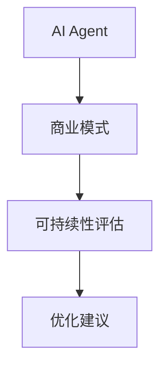
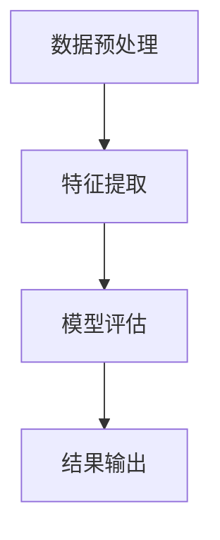
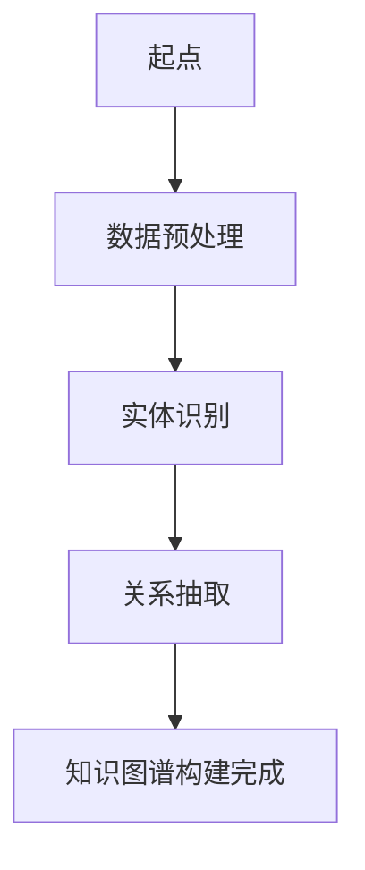
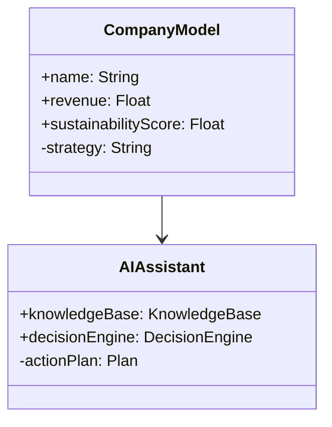
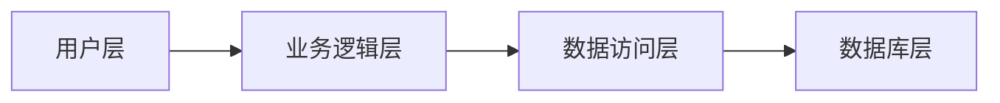

                 


# AI agents在公司商业模式可持续性评估中的应用

## 关键词：AI agents，可持续性评估，商业模式，多智能体系统，强化学习

## 摘要：  
本文探讨AI agents在公司商业模式可持续性评估中的应用。通过分析AI agents的核心原理、算法模型以及系统架构，结合实际案例，展示如何利用AI技术优化商业模式的可持续性评估过程。文章从背景介绍、核心概念、算法原理到系统设计和实战应用，层层递进，为读者提供全面的技术解读。

---

# 第1章: AI Agent与可持续性评估概述

## 1.1 问题背景与描述

### 1.1.1 公司商业模式的定义与关键要素  
公司的商业模式是企业实现价值创造的核心路径，涉及产品或服务的开发、市场定位、客户获取、成本控制和收入来源等多个方面。可持续性评估则关注商业模式在经济、社会和环境三个维度上的长期可行性。

### 1.1.2 可持续性评估的核心目标  
可持续性评估旨在识别商业模式中存在的潜在风险，优化资源配置，确保企业长期发展与社会价值最大化。评估的关键要素包括资源利用效率、环境影响、社会责任履行情况以及经济收益的稳定性。

### 1.1.3 AI Agent在可持续性评估中的作用  
AI agents通过实时数据处理、复杂决策支持和自动化优化，能够显著提升可持续性评估的效率和准确性。它们可以分析海量数据，发现传统方法难以察觉的趋势和风险，为决策者提供科学依据。

---

## 1.2 问题解决与边界

### 1.2.1 可持续性评估的常见挑战  
- 数据来源复杂且异构  
- 评估维度多，计算复杂  
- 动态变化难以捕捉  

### 1.2.2 AI Agent如何解决这些挑战  
AI agents通过多智能体协同、强化学习和知识图谱技术，能够有效应对上述挑战，实现动态数据处理、多维度评估和智能优化。

### 1.2.3 评估的边界与外延  
可持续性评估的边界包括企业内部运营和外部环境，外延则涉及产业链上下游和生态系统。

---

## 1.3 核心概念与联系

### 1.3.1 AI Agent的定义与属性  
AI agent是一种具有感知环境、自主决策和执行任务能力的智能体。其属性包括目标驱动、反应性、学习能力和协作性。

### 1.3.2 可持续性评估的模型与框架  
可持续性评估模型通常包括经济、社会和环境三个维度的指标，构建综合评分体系。

### 1.3.3 两者的实体关系图  


---

# 第2章: AI Agent的核心原理与模型

## 2.1 核心原理

### 2.1.1 多智能体系统（MAS）的架构  
MAS由多个智能体组成，通过协同完成复杂任务。常见的MAS架构包括分布式和集中式架构。

### 2.1.2 基于强化学习的决策机制  
强化学习通过奖励机制优化决策，数学模型如下：
$$ Q(s, a) = Q(s, a) + \alpha [r + \max_{a'} Q(s', a') - Q(s, a)] $$

### 2.1.3 知识表示与推理方法  
知识图谱构建是关键，涉及实体识别和关系抽取。

---

## 2.2 可持续性评估模型

### 2.2.1 综合评估指标体系  
模型包括经济、社会和环境三个维度的指标，构建综合评分体系。

### 2.2.2 数据流与评估流程  


---

## 2.3 算法原理

### 2.3.1 强化学习算法的数学模型  
强化学习算法通过状态、动作和奖励的循环优化决策，公式如下：
$$ V(s) = \max_a Q(s,a) $$

### 2.3.2 知识图谱构建的流程图  


---

# 第3章: 系统分析与架构设计

## 3.1 项目背景与目标

### 3.1.1 项目目标  
构建一个基于AI agents的可持续性评估系统，优化商业模式。

### 3.1.2 项目范围  
涵盖经济、社会和环境三个维度的评估。

## 3.2 系统功能设计

### 3.2.1 领域模型  


## 3.3 系统架构设计

### 3.3.1 分层架构  


---

# 第4章: 项目实战

## 4.1 环境安装与配置

### 4.1.1 安装Python与相关库  
安装`numpy`, `scikit-learn`, `networkx`等库。

### 4.1.2 安装与配置AI框架  
使用`TensorFlow`或`PyTorch`框架。

## 4.2 核心代码实现

### 4.2.1 数据预处理代码  
```python
import pandas as pd

def preprocess_data(data):
    # 数据清洗和特征提取
    data.dropna(inplace=True)
    return data
```

### 4.2.2 强化学习算法实现  
```python
class Agent:
    def __init__(self, state_space, action_space):
        self.state_space = state_space
        self.action_space = action_space
        self.Q = defaultdict(float)
    
    def act(self, state):
        # 返回最佳动作
        max_action = max(self.Q[(state, action)] for action in self.action_space)
        return action
```

## 4.3 实际案例分析与解读

### 4.3.1 案例分析  
某公司商业模式的可持续性评估，通过AI agents优化资源配置，提升环境和社会表现。

---

# 第5章: 扩展与展望

## 5.1 高级主题  
探讨高级算法和复杂场景下的应用。

## 5.2 未来趋势  
AI agents在商业模式评估中的未来发展方向。

## 5.3 参考文献  
列出相关文献和资源。

---

# 结语

本文系统地介绍了AI agents在公司商业模式可持续性评估中的应用，从理论到实践，为读者提供了全面的技术解读和实践指南。通过本文的学习，读者可以掌握如何利用AI技术优化商业模式，提升企业的可持续性表现。

