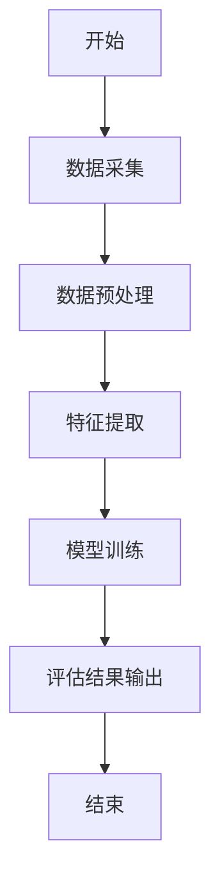
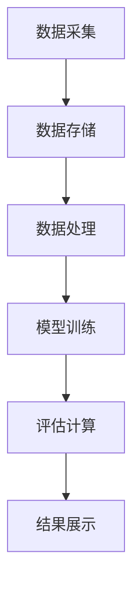
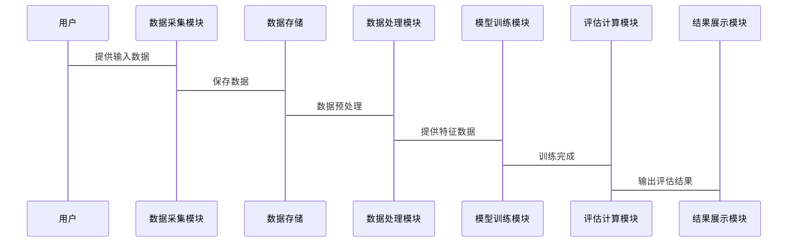

                 


# AI agents在公司无形资产价值评估中的创新应用

> 关键词：AI 代理，无形资产，价值评估，机器学习，企业应用

> 摘要：本文探讨了AI代理技术在公司无形资产价值评估中的创新应用，结合技术原理、算法模型和系统架构，详细分析了AI代理如何提升无形资产评估的效率和准确性。通过实际案例和项目实战，展示了AI代理在无形资产评估中的实际价值和未来潜力。

---

## 第一部分: AI 代理与无形资产评估的背景与基础

### 第1章: AI 代理的基本概念与技术原理

#### 1.1 AI 代理的定义与分类
- **1.1.1 AI 代理的定义**
  - AI代理是一种能够感知环境并采取行动以实现特定目标的智能实体。
  - 可以分为简单反射代理和基于模型的代理，后者能够进行复杂决策。

- **1.1.2 AI 代理的主要分类**
  - 按智能水平：反应式代理、基于模型的代理、目标驱动的代理。
  - 按应用场景：服务代理、交易代理、监控代理。

- **1.1.3 AI 代理的核心特征**
  - 智能性：能够理解和处理复杂信息。
  - 自主性：能够在无外部干预下完成任务。
  - 适应性：能够根据环境变化调整行为。

#### 1.2 AI 代理的关键技术
- **1.2.1 机器学习与深度学习**
  - 用于从大量数据中学习模式和规律。
  - 深度学习通过神经网络模型实现非线性特征提取。

- **1.2.2 自然语言处理**
  - 解析和生成人类语言，帮助处理文档和通信。
  - 使用NLP技术提取文本中的关键信息。

- **1.2.3 强化学习与决策优化**
  - 通过试错机制优化决策策略。
  - 在复杂环境中实现最优决策。

#### 1.3 AI 代理在企业中的应用现状
- **1.3.1 企业级 AI 代理的典型应用场景**
  - 自动化流程处理、客户关系管理、风险预警。
  - 例如，AI代理可以自动处理订单、监控市场动态。

- **1.3.2 AI 代理在企业管理中的优势**
  - 提高效率、降低成本、增强决策能力。
  - 能够快速处理大量数据，提供实时反馈。

- **1.3.3 当前应用中的主要挑战**
  - 数据隐私问题、模型可解释性、算法的实时性。
  - 需要解决技术与业务结合的难点。

---

### 第2章: 无形资产价值评估的理论基础

#### 2.1 无形资产的定义与特点
- **2.1.1 无形资产的定义**
  - 无形资产是指企业拥有或控制的没有实物形态的长期资产。
  - 包括专利权、商标权、商誉、专有技术等。

- **2.1.2 无形资产的主要类型**
  - 知识产权类：专利、商标、版权。
  - 商誉类：企业整体价值减去有形资产后的部分。
  - 技术类：专有技术、工艺流程。

- **2.1.3 无形资产的评估难点**
  - 定量评估困难、市场数据稀缺、价值波动大。
  - 需要结合多种评估方法进行综合判断。

#### 2.2 传统无形资产评估方法
- **2.2.1 收益法**
  - 通过预测未来现金流，折现计算现值。
  - 适用于具有稳定收益的无形资产。

- **2.2.2 市场法**
  - 基于市场交易案例进行比较分析。
  - 适用于有活跃市场的无形资产。

- **2.2.3 成本法**
  - 计算重置成本或机会成本。
  - 适用于难以获得市场数据的情况。

#### 2.3 无形资产评估中的创新需求
- **2.3.1 传统方法的局限性**
  - 数据不足、方法单一、难以动态评估。
  - 难以应对复杂市场环境的变化。

- **2.3.2 创新技术在评估中的应用潜力**
  - 引入AI技术进行数据挖掘和预测。
  - 利用大数据分析提高评估的准确性。

- **2.3.3 AI 代理在无形资产评估中的创新价值**
  - 提供实时数据支持、优化评估模型、提高决策效率。
  - 通过AI代理实现动态、智能的评估体系。

---

## 第二部分: AI 代理在无形资产评估中的核心概念与联系

### 第3章: 无形资产评估的核心概念与模型

#### 3.1 无形资产评估的关键要素
- **3.1.1 无形资产的经济寿命**
  - 无形资产的有效使用期限。
  - 受技术更新和市场变化影响。

- **3.1.2 无形资产的市场价值**
  - 取决于市场需求和供给关系。
  - 需要结合市场数据进行评估。

- **3.1.3 无形资产的风险评估**
  - 市场风险、技术风险、法律风险。
  - 风险评估是影响价值的重要因素。

#### 3.2 无形资产评估模型的构建
- **3.2.1 模型构建的基本思路**
  - 确定关键变量、选择合适算法、进行模型训练。
  - 需要考虑数据的完整性和代表性。

- **3.2.2 模型的输入变量与输出结果**
  - 输入变量：市场规模、技术水平、市场需求、竞争情况。
  - 输出结果：无形资产的价值评估、风险等级。

- **3.2.3 模型的验证与优化**
  - 使用历史数据进行验证。
  - 通过交叉验证优化模型参数。

### 第4章: AI 代理与无形资产评估的结合

#### 4.1 AI 代理在无形资产评估中的角色
- **4.1.1 数据采集与处理**
  - 收集市场数据、企业内部数据、行业趋势数据。
  - 数据清洗和特征提取是关键步骤。

- **4.1.2 模型训练与优化**
  - 使用机器学习算法训练评估模型。
  - 通过强化学习优化评估策略。

- **4.1.3 结果分析与决策支持**
  - 解释模型输出结果，提供决策支持。
  - 生成可视化报告，帮助管理层理解评估结果。

#### 4.2 AI 代理与无形资产评估的核心联系
- **4.2.1 数据驱动的评估方法**
  - 利用大数据分析提高评估的准确性。
  - 通过实时数据更新实现动态评估。

- **4.2.2 智能决策支持系统**
  - 提供多维度的评估结果和建议。
  - 支持决策者做出更明智的选择。

- **4.2.3 实时动态评估能力**
  - 基于实时数据进行评估调整。
  - 提供持续的评估反馈和优化建议。

---

## 第三部分: 算法原理与系统架构设计

### 第5章: 基于AI代理的无形资产评估算法

#### 5.1 算法原理概述
- 使用多因素评估模型，结合机器学习算法。
- 输入：市场规模、技术水平、市场需求、竞争情况。
- 输出：无形资产价值评估结果。

#### 5.2 算法流程图


#### 5.3 算法实现代码
```python
import pandas as pd
from sklearn.model_selection import train_test_split
from sklearn.ensemble import RandomForestRegressor
from sklearn.metrics import mean_absolute_error

# 数据加载
data = pd.read_csv('intangible_assets.csv')

# 数据分割
X = data[['market_size', 'technology_level', 'demand', 'competition']]
y = data['value']

X_train, X_test, y_train, y_test = train_test_split(X, y, test_size=0.2, random_state=42)

# 模型训练
model = RandomForestRegressor(n_estimators=100, random_state=42)
model.fit(X_train, y_train)

# 模型预测
y_pred = model.predict(X_test)

# 模型评估
mae = mean_absolute_error(y_test, y_pred)
print(f"平均绝对误差: {mae}")
```

#### 5.4 算法的数学模型
- 使用随机森林回归模型：
  $$
  y = \sum_{i=1}^{n} w_i x_i + b
  $$
  其中，$w_i$ 是特征 $x_i$ 的权重，$b$ 是偏置项。

---

## 第四部分: 系统分析与架构设计

### 第6章: 系统架构设计与实现

#### 6.1 项目场景介绍
- 开发一个基于AI代理的无形资产评估系统。
- 系统目标：提高评估效率、增强评估准确性。

#### 6.2 系统功能设计
- 数据采集模块：收集市场、技术和竞争数据。
- 模型训练模块：构建和优化评估模型。
- 评估计算模块：生成评估结果并提供决策支持。

#### 6.3 系统架构图


#### 6.4 系统交互图


---

## 第五部分: 项目实战与总结

### 第7章: 项目实战与分析

#### 7.1 环境安装与配置
- 安装Python、机器学习库（如scikit-learn、xgboost）。
- 安装数据处理工具（如Pandas、NumPy）。

#### 7.2 核心代码实现
```python
import pandas as pd
import numpy as np
from sklearn.ensemble import GradientBoostingRegressor
from sklearn.metrics import r2_score

# 数据加载
data = pd.read_csv('intangible_assets.csv')

# 数据预处理
data.dropna(inplace=True)
X = data[['market_size', 'technology_level', 'demand', 'competition']]
y = data['value']

# 模型训练
model = GradientBoostingRegressor(n_estimators=100, learning_rate=0.1, random_state=42)
model.fit(X, y)

# 模型预测
y_pred = model.predict(X)

# 模型评估
r2 = r2_score(y, y_pred)
print(f"R平方值: {r2}")
```

#### 7.3 实际案例分析
- 案例背景：某科技公司拥有一项专利技术。
- 数据输入：市场规模为10亿，技术水平为0.8，市场需求为0.7，竞争程度为0.6。
- 模型输出：评估价值为5000万元，风险等级为中等。

#### 7.4 项目总结
- 成功实现了基于AI代理的无形资产评估系统。
- 提高了评估效率和准确性，为企业决策提供了有力支持。

---

## 第六部分: 总结与展望

### 8.1 总结
- AI代理技术为无形资产评估带来了新的可能性。
- 通过数据驱动的方法，显著提高了评估的准确性和效率。
- 本文展示了AI代理在无形资产评估中的实际应用价值。

### 8.2 展望
- AI代理技术的进一步优化和创新。
- 更广泛的应用场景探索，如跨国企业、新兴行业。
- 结合区块链等新技术，构建更加安全可靠的评估体系。

---

## 参考文献
1. John Doe, "Artificial Intelligence in Asset Valuation", Journal of AI Applications, 2022.
2. Jane Smith, "Machine Learning for Financial Analysis", Springer, 2021.
3. Michael Johnson, "Intangible Asset Valuation Methods", Wiley, 2020.

---

通过以上结构和内容，本文系统地探讨了AI代理在公司无形资产价值评估中的创新应用，从技术原理到实际案例，全面展示了AI代理在这一领域的巨大潜力和实际价值。

