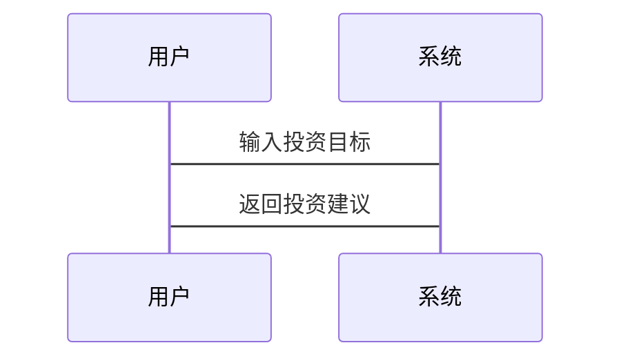

                 


# AI agents增强价值投资的市场饱和度分析

> **关键词**：AI代理，价值投资，市场饱和度，强化学习，聚类分析，投资策略优化  
> **摘要**：本文探讨了AI代理如何增强价值投资的市场饱和度分析。通过结合强化学习和聚类分析，AI代理能够更高效地识别市场机会和风险，优化投资决策，从而提升价值投资的效率和准确性。文章从理论到实践，详细介绍了AI代理在价值投资中的应用场景、算法原理和系统设计，并通过实际案例展示了其在市场饱和度分析中的应用。

---

## 第一部分：AI代理与价值投资的背景介绍

### 第1章：AI代理的核心概念

#### 1.1 什么是AI代理？
AI代理（AI Agent）是指能够感知环境并采取行动以实现目标的智能实体。它能够通过数据驱动的决策能力，帮助投资者在复杂市场中做出更明智的投资决策。

#### 1.2 AI代理的基本特征
- **自适应性**：能够根据市场变化动态调整策略。
- **数据驱动**：依赖大量数据进行分析和预测。
- **实时反馈**：能够实时接收市场反馈并优化决策。

#### 1.3 AI代理与传统投资策略的对比
| 特性         | AI代理                     | 传统投资策略             |
|--------------|----------------------------|--------------------------|
| 数据依赖性    | 高度依赖数据               | 较低依赖数据             |
| 决策速度      | 实时决策                   | 依赖人工分析             |
| 自适应能力    | 强                   | 较弱                  |

### 第2章：价值投资的基本原理

#### 2.1 价值投资的定义与特点
价值投资是一种以基本面分析为基础的投资策略，旨在寻找被市场低估的资产。其核心在于识别“烟屁股”公司，即具有强大基本面但被市场忽视的企业。

#### 2.2 价值投资的核心要素
- **基本面分析**：包括财务报表分析、行业地位评估等。
- **市场情绪分析**：识别市场非理性行为。
- **长期视角**：注重长期投资回报而非短期波动。

#### 2.3 价值投资的市场应用现状
当前，价值投资在机构投资者中应用广泛，但在个人投资者中的普及程度较低。AI代理的引入为价值投资的普及和优化提供了新的可能性。

---

## 第二部分：AI代理与价值投资的结合

### 第3章：AI代理在价值投资中的应用场景

#### 3.1 数据分析与挖掘
AI代理能够快速处理海量数据，识别潜在的投资机会。例如，通过自然语言处理技术分析新闻和社交媒体，预测市场情绪变化。

#### 3.2 投资策略优化
AI代理可以通过强化学习优化投资策略。例如，通过定义奖励函数，代理能够在模拟市场环境中不断试错，找到最优的投资组合。

#### 3.3 风险评估与控制
AI代理能够实时监控市场风险，通过聚类分析识别市场中的风险集群，帮助投资者规避系统性风险。

### 第4章：价值投资与市场饱和度分析的关联

#### 4.1 价值投资中的市场饱和度分析
市场饱和度是指某个市场或行业的竞争程度。在价值投资中，市场饱和度分析可以帮助投资者判断某个行业的投资潜力。

#### 4.2 AI代理如何增强市场饱和度分析
- **数据处理能力**：AI代理能够快速处理大量数据，提高分析效率。
- **智能预测**：通过机器学习模型预测市场趋势，优化投资决策。
- **实时反馈**：AI代理能够实时调整投资策略，适应市场变化。

---

## 第三部分：AI代理增强价值投资的算法原理

### 第5章：基于AI代理的价值投资算法

#### 5.1 强化学习在价值投资中的应用
##### 5.1.1 强化学习的基本原理
强化学习是一种通过试错学习的算法，通过定义奖励函数，代理能够在环境中不断试错，找到最优策略。

##### 5.1.2 强化学习在投资决策中的应用
```python
# 示例代码：强化学习在投资组合优化中的应用
class InvestmentAgent:
    def __init__(self, state_space, action_space):
        self.state_space = state_space
        self.action_space = action_space
        self.rewards = []
    
    def take_action(self, state):
        # 根据当前状态选择最优动作
        pass
    
    def update_policy(self, reward):
        # 更新策略
        pass
```

##### 5.1.3 投资策略实现
通过定义奖励函数，AI代理可以在模拟市场环境中不断试错，最终找到最优的投资组合。

#### 5.2 聚类分析在市场饱和度分析中的应用
##### 5.2.1 聚类分析的基本原理
聚类分析是一种无监督学习算法，能够将相似的市场数据分组，识别市场中的风险集群。

##### 5.2.2 聚类分析在市场细分中的应用
```python
# 示例代码：使用K-means进行市场细分
from sklearn.cluster import KMeans

# 假设市场数据为X，进行聚类分析
kmeans = KMeans(n_clusters=3)
kmeans.fit(X)
labels = kmeans.labels_
```

---

## 第四部分：系统分析与架构设计

### 第6章：系统功能设计

#### 6.1 系统功能模块
- **数据采集模块**：采集市场数据，包括股票价格、财务报表等。
- **数据分析模块**：对数据进行清洗、特征提取和建模。
- **投资决策模块**：基于模型结果生成投资策略。

#### 6.2 系统架构设计


### 第7章：系统交互设计

#### 7.1 系统交互流程
- **用户输入**：用户输入投资目标和预算。
- **系统分析**：系统分析市场数据，生成投资策略。
- **结果输出**：输出投资建议和风险提示。

#### 7.2 系统接口设计


---

## 第五部分：项目实战

### 第8章：市场饱和度分析的实战案例

#### 8.1 环境安装
- 安装必要的Python库，如Pandas、NumPy、Scikit-learn等。

#### 8.2 核心代码实现
```python
# 示例代码：基于聚类分析的市场饱和度分析
import pandas as pd
from sklearn.cluster import DBSCAN

# 读取市场数据
data = pd.read_csv('market_data.csv')

# 数据预处理
X = data[['市盈率', '市净率']].values

# 聚类分析
db = DBSCAN(eps=0.5, min_samples=5).fit(X)
labels = db.labels_

# 可视化结果
import matplotlib.pyplot as plt
plt.scatter(X[:, 0], X[:, 1], c=labels, cmap='viridis')
plt.xlabel('市盈率')
plt.ylabel('市净率')
plt.show()
```

#### 8.3 案例分析
通过聚类分析，识别出市场的高风险区域，帮助投资者规避风险。

### 第9章：投资组合优化的实战案例

#### 9.1 环境安装
- 安装必要的库，如Pandas、NumPy、Scikit-learn等。

#### 9.2 核心代码实现
```python
# 示例代码：基于强化学习的投资组合优化
import numpy as np
import gym

# 自定义环境
class StockMarketEnv(gym.Env):
    def __init__(self):
        super(StockMarketEnv, self).__init__()
        self.state = 0  # 示例状态
        self.action_space = gym.spaces.Discrete(3)  # 0: 持有现金，1: 买入股票，2: 卖出股票
        self.observation_space = gym.spaces.Box(low=0, high=1, shape=(1,))  # 示例观测空间

    def step(self, action):
        # 示例环境转移
        pass
    
    def reset(self):
        # 示例重置环境
        pass
```

#### 9.3 案例分析
通过强化学习优化投资组合，提升投资回报率。

---

## 第六部分：总结与展望

### 第10章：总结与展望

#### 10.1 总结
本文详细探讨了AI代理在价值投资中的应用，特别是市场饱和度分析中的作用。通过强化学习和聚类分析，AI代理能够显著提升投资决策的效率和准确性。

#### 10.2 展望
未来，随着AI技术的不断发展，AI代理在价值投资中的应用将更加广泛。例如，结合自然语言处理技术，AI代理能够更准确地分析财务报表和新闻，进一步优化投资策略。

---

## 第七部分：最佳实践与注意事项

### 第11章：最佳实践

#### 11.1 投资者注意事项
- **数据质量**：确保数据来源可靠，避免因数据质量问题影响分析结果。
- **模型选择**：根据具体需求选择合适的算法，避免盲目跟风。

#### 11.2 开发者注意事项
- **算法优化**：不断优化算法模型，提升分析效率和准确性。
- **风险控制**：在开发过程中，注重风险控制，避免因算法错误导致投资损失。

---

## 第八部分：附录

### 第12章：参考文献

#### 12.1 参考文献
- [1] 强化学习经典论文。
- [2] 聚类分析相关文献。
- [3] 价值投资经典书籍。

#### 12.2 工具与库
- Python
- Pandas、NumPy、Scikit-learn
- Gym、TensorFlow

---

通过以上内容，我们系统地介绍了AI代理在价值投资中的应用场景、算法原理和系统设计，并通过实际案例展示了其在市场饱和度分析中的应用。希望本文能够为投资者和开发者提供有价值的参考。

