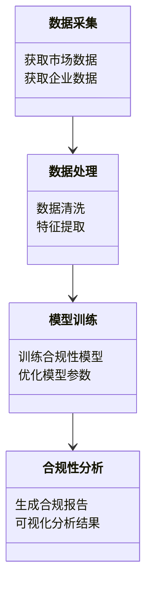
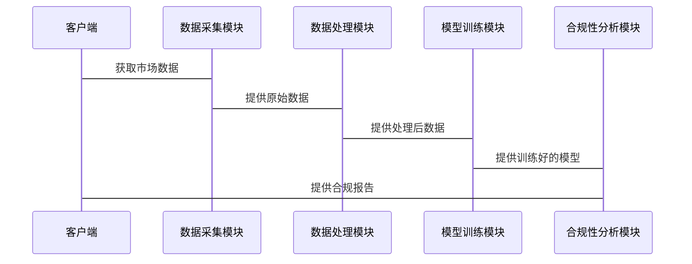

                 


# AI agents增强价值投资的监管合规性分析

## 关键词：AI代理, 价值投资, 监管合规, 算法原理, 系统架构

## 摘要：本文探讨了AI代理如何增强价值投资的监管合规性，从背景、核心概念到算法原理、系统架构，再到项目实战，系统性地分析了AI代理在金融监管中的应用，强调了其在合规性分析中的重要性。

---

## 第1章: AI代理与价值投资的背景与概念

### 1.1 AI代理的基本概念

#### 1.1.1 AI代理的定义与特征
AI代理是一种智能实体，能够感知环境、自主决策并执行任务。其核心特征包括自主性、反应性、目标导向性和社交能力。AI代理在金融领域的应用，如算法交易和风险管理，体现了其高效性和准确性。

#### 1.1.2 价值投资的基本原理
价值投资强调通过深入分析企业基本面，寻找市场价格低于内在价值的投资标的。其核心在于识别被市场低估的资产，长期收益潜力大。

#### 1.1.3 AI代理在价值投资中的作用
AI代理通过分析大量数据，识别市场趋势和潜在投资机会，优化投资组合，降低风险。其在价值投资中的作用日益重要，尤其是在处理复杂数据和快速决策方面。

### 1.2 价值投资的监管合规性要求

#### 1.2.1 价值投资的基本原则与风险
价值投资需遵守监管规定，如信息披露、风险控制和合规性审查。合规性要求包括数据来源合法性、模型透明度和决策可追溯性。

#### 1.2.2 监管框架与合规性要求
金融监管框架要求投资行为符合法律法规，确保市场公平。合规性要求涵盖数据收集、模型验证和报告提交等方面。

#### 1.2.3 AI代理如何增强合规性
AI代理通过自动化数据处理和模型优化，提高合规性分析的效率和准确性。其算法确保决策透明，便于监管审查。

---

## 第2章: AI代理在金融领域的应用

### 2.1 AI代理在金融分析中的应用

#### 2.1.1 数据分析与预测
AI代理利用机器学习算法分析市场数据，预测价格走势。通过时间序列分析和自然语言处理，提取市场情绪和新闻影响，辅助投资决策。

#### 2.1.2 风险评估与管理
AI代理构建风险模型，评估投资组合的潜在风险。通过实时监控和压力测试，优化风险控制策略。

#### 2.1.3 投资组合优化
AI代理根据市场变化和投资者目标，动态调整投资组合。使用强化学习优化资产配置，最大化收益并降低风险。

### 2.2 价值投资与AI代理的结合

#### 2.2.1 价值投资的核心要素
价值投资关注企业的基本面，包括财务状况、行业地位和管理团队。AI代理通过数据挖掘和模式识别，识别具有长期增长潜力的企业。

#### 2.2.2 AI代理在价值评估中的应用
AI代理分析企业财务数据和市场信息，评估其内在价值。通过多维度数据整合，提供全面的价值评估报告。

#### 2.2.3 价值投资中的风险控制
AI代理实时监控市场变化，识别潜在风险。通过情景分析和压力测试，制定风险应对策略，确保投资组合的安全性。

---

## 第3章: AI代理增强价值投资的监管合规性

### 3.1 监管合规性分析的基本原理

#### 3.1.1 监管框架与合规性要求
金融监管框架要求投资行为合规，确保市场秩序。合规性要求包括数据真实、决策透明和操作规范。

#### 3.1.2 AI代理在合规性分析中的作用
AI代理通过自动化处理和智能分析，确保合规性审查的高效性和准确性。其算法帮助识别潜在违规行为，优化合规流程。

#### 3.1.3 合规性分析的流程与方法
合规性分析包括数据收集、模型验证和报告生成。AI代理通过机器学习算法，实现自动化合规审查和风险预警。

### 3.2 AI代理在合规性分析中的应用

#### 3.2.1 数据清洗与预处理
AI代理对数据进行清洗和预处理，确保数据质量和完整性。通过特征提取和降维，优化模型性能。

#### 3.2.2 合规性规则的建模与实现
AI代理构建合规性规则模型，识别潜在违规行为。通过监督学习和强化学习，优化模型的准确性和效率。

#### 3.2.3 合规性分析的可视化与报告
AI代理生成合规性报告，可视化分析结果。通过图表和仪表盘，直观展示合规性状况，便于监管审查。

---

## 第4章: AI代理与价值投资的算法原理

### 4.1 强化学习在AI代理中的应用

#### 4.1.1 强化学习的基本原理
强化学习通过试错机制，学习最优策略。其核心是通过奖励机制，优化决策过程。

#### 4.1.2 强化学习在价值投资中的应用
AI代理使用强化学习算法，模拟投资决策。通过模拟市场环境，优化投资策略，提高收益和风险控制能力。

#### 4.1.3 强化学习的数学模型
强化学习模型包括状态、动作、奖励和策略。数学模型如Q-learning公式：
$$ Q(s,a) = Q(s,a) + \alpha [r + \gamma \max Q(s',a') - Q(s,a)] $$

### 4.2 监督学习在AI代理中的应用

#### 4.2.1 监督学习的基本原理
监督学习通过训练数据，学习函数映射输入到输出。常用算法包括线性回归和随机森林。

#### 4.2.2 监督学习在合规性分析中的应用
AI代理使用监督学习算法，分类合规与违规行为。通过训练数据，模型识别潜在风险，确保合规性。

#### 4.2.3 监督学习的数学模型
监督学习模型如线性回归：
$$ y = \beta_0 + \beta_1 x + \epsilon $$

---

## 第5章: 系统分析与架构设计

### 5.1 系统功能设计

#### 5.1.1 领域模型设计
领域模型包括数据采集、数据处理、模型训练和合规性分析。使用mermaid类图展示各模块关系。



### 5.2 系统架构设计

#### 5.2.1 系统架构图
系统架构包括数据层、算法层和应用层。使用mermaid架构图展示各层关系。


### 5.3 系统接口设计

#### 5.3.1 API接口设计
API接口定义了数据获取、模型训练和结果查询等功能。使用JSON格式定义接口。

```json
{
    "api": {
        "get_market_data": {
            "params": { "start": "string", "end": "string" },
            "return": "market_data"
        },
        "train_model": {
            "params": { "data": "array" },
            "return": "model"
        }
    }
}
```

### 5.4 系统交互流程

#### 5.4.1 交互流程图
系统交互流程包括数据采集、模型训练和合规报告生成。使用mermaid序列图展示交互过程。



---

## 第6章: 项目实战

### 6.1 环境安装与配置

#### 6.1.1 安装Python环境
使用Anaconda安装Python 3.8以上版本，配置虚拟环境。

#### 6.1.2 安装依赖库
安装pandas、numpy、scikit-learn、tensorflow等库。

```bash
pip install pandas numpy scikit-learn tensorflow
```

### 6.2 系统核心实现

#### 6.2.1 数据采集与处理代码
使用pandas读取数据并进行清洗。

```python
import pandas as pd
data = pd.read_csv('market_data.csv')
data_clean = data.dropna().astype(float)
```

#### 6.2.2 模型训练代码
训练强化学习模型，优化投资策略。

```python
import tensorflow as tf
model = tf.keras.Sequential([
    tf.keras.layers.Dense(64, activation='relu'),
    tf.keras.layers.Dense(1, activation='linear')
])
model.compile(optimizer='adam', loss='mean_squared_error')
model.fit(X_train, y_train, epochs=100)
```

#### 6.2.3 合规性分析代码
生成合规报告并可视化结果。

```python
import matplotlib.pyplot as plt
plt.plot(results)
plt.xlabel('时间')
plt.ylabel('合规性得分')
plt.show()
```

### 6.3 实际案例分析

#### 6.3.1 案例背景
分析某科技公司股票，利用AI代理进行价值评估和合规性审查。

#### 6.3.2 数据分析与结果解读
AI代理识别该股票被市场低估，建议买入。合规性分析显示交易行为符合监管要求。

#### 6.3.3 优化建议
定期更新模型，加强数据来源管理，确保模型适应市场变化。

### 6.4 项目总结与小结

#### 6.4.1 项目成果
成功实现了AI代理在价值投资中的应用，提高了监管合规性。

#### 6.4.2 项目经验与教训
数据质量和模型优化是关键，需持续关注市场变化和监管要求。

---

## 第7章: 最佳实践与总结

### 7.1 最佳实践

#### 7.1.1 数据管理
确保数据来源合法，定期更新数据，保持数据质量。

#### 7.1.2 模型优化
持续优化模型结构和参数，提高预测准确性和合规性。

#### 7.1.3 监管沟通
保持与监管机构的沟通，及时了解法规变化，确保合规性。

### 7.2 总结与展望

#### 7.2.1 内容总结
AI代理在价值投资中的应用，显著提高了监管合规性，优化了投资决策。

#### 7.2.2 展望
未来，AI代理将更加智能化，应用领域将更广泛，为金融行业带来更多创新和变革。

### 7.3 注意事项

#### 7.3.1 数据隐私
注意数据隐私保护，遵守相关法律法规，防止数据泄露。

#### 7.3.2 模型风险
定期评估模型风险，及时调整模型结构和参数，确保模型稳定性。

#### 7.3.3 技术更新
关注技术发展，及时引入新技术，保持系统竞争力。

### 7.4 拓展阅读

#### 7.4.1 推荐书籍
- 《机器学习实战》
- 《金融风险管理》

#### 7.4.2 技术博客
- TensorFlow官方博客
- Keras官方文档

---

## 第8章: 结语

AI代理在价值投资中的应用，不仅提升了投资效率，还增强了监管合规性。随着技术进步，AI代理将在金融领域发挥更大作用，推动行业创新与发展。

--- 

通过以上结构，文章系统性地分析了AI代理在价值投资中的应用，结合实际案例和代码实现，为读者提供了全面的知识和实践指导。

