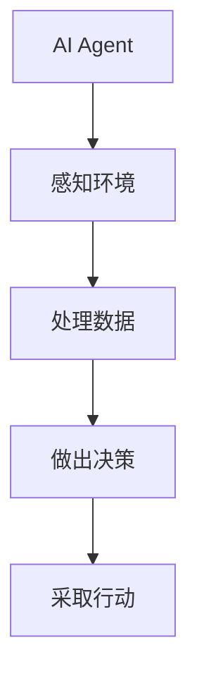
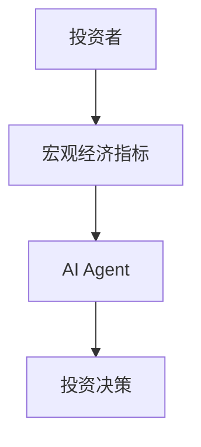
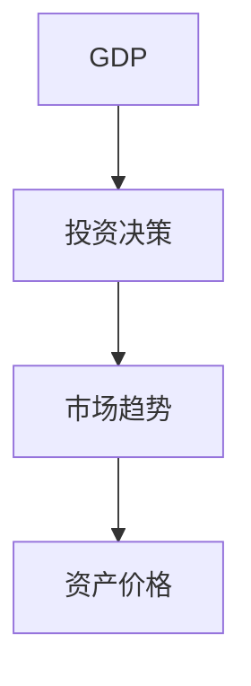
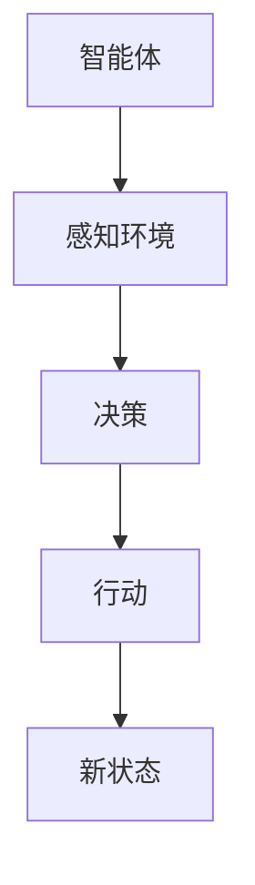
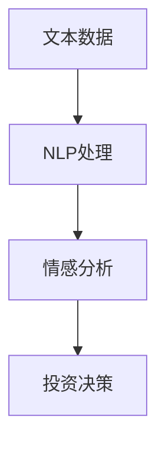
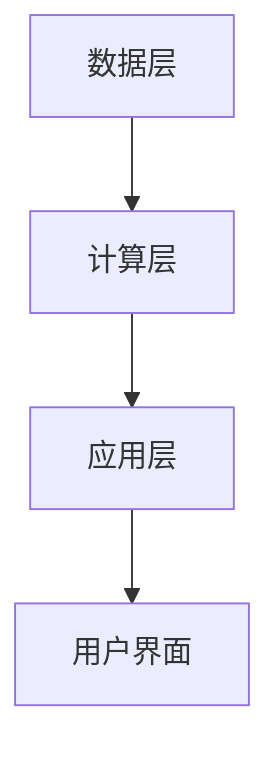

                 


# AI agents辅助价值投资者解读宏观经济指标

## 关键词：人工智能，宏观经济指标，价值投资，投资决策，经济预测，AI代理

## 摘要：本文探讨AI代理如何辅助价值投资者解读宏观经济指标。通过分析宏观经济指标的重要性及其对投资决策的影响，结合AI代理的核心概念和算法原理，展示如何利用强化学习和自然语言处理技术，帮助投资者更好地理解经济环境，制定投资策略。文章最后通过项目实战和系统设计，提供一个完整的解决方案，并总结最佳实践和注意事项。

---

# 第一部分: AI agents与宏观经济指标分析的背景

# 第1章: AI agents与宏观经济指标的概述

## 1.1 AI agents的基本概念

### 1.1.1 AI agents的定义与分类
AI代理（Artificial Intelligence Agents，AI Agents）是指具有感知环境、理解和执行任务能力的智能实体。它们可以是软件程序或物理设备，通过传感器和执行器与环境交互，实现特定目标。根据功能和复杂度，AI代理可以分为简单代理（如基于规则的自动回复系统）和复杂代理（如具备学习和决策能力的自动驾驶系统）。

### 1.1.2 宏观经济指标的核心概念
宏观经济指标是衡量经济运行状况的关键数据，主要包括GDP、CPI、失业率、利率等。这些指标反映了经济的整体表现，对投资决策具有重要影响。

### 1.1.3 AI agents在宏观经济分析中的作用
AI代理可以通过处理大量数据，识别经济趋势，预测市场变化，辅助投资者做出更明智的决策。例如，AI代理可以分析历史经济数据，识别相关性，预测未来经济走势。

### 1.1.4 图形化解释


## 1.2 宏观经济指标的重要性

### 1.2.1 主要宏观经济指标的分类
主要宏观经济指标可以分为四个类别：
1. **经济增长**：GDP、GDP增长率。
2. **价格水平**：CPI、通货膨胀率。
3. **就业情况**：失业率、就业增长率。
4. **货币政策**：利率、货币供应量。

### 1.2.2 宏观经济指标对价值投资者的意义
价值投资者依赖于对经济环境的深入理解来评估资产的真实价值。宏观经济指标帮助投资者识别经济周期，预测市场趋势，从而做出更准确的投资决策。

### 1.2.3 AI技术在宏观经济分析中的优势
AI代理能够处理和分析海量数据，识别复杂模式，提供实时反馈，帮助投资者快速响应经济变化。

### 1.2.4 图形化解释


## 1.3 价值投资与宏观经济分析的结合

### 1.3.1 价值投资的基本原理
价值投资是一种投资策略，强调以低于内在价值的价格购买优质资产。宏观经济分析是识别资产内在价值的重要工具。

### 1.3.2 宏观经济环境对投资决策的影响
宏观经济环境直接影响企业的盈利能力、市场供需关系和资产价格走势。例如，低利率环境通常会推高资产价格，而高通胀可能导致货币贬值。

### 1.3.3 AI代理辅助价值投资的潜力
AI代理可以通过分析宏观经济指标，识别市场趋势，评估资产风险，优化投资组合，帮助投资者实现更高的收益。

## 1.4 本章小结
本章介绍了AI代理的基本概念、宏观经济指标的重要性，以及两者在价值投资中的结合。AI代理通过处理复杂数据，帮助投资者做出更明智的决策，提升投资效率。

---

# 第2章: 宏观经济指标的深度分析

## 2.1 主要宏观经济指标的解读

### 2.1.1 国内生产总值（GDP）
GDP是衡量一个国家或地区经济活动总量的重要指标。GDP增长率反映了经济的扩张或收缩趋势。

### 2.1.2 消费者价格指数（CPI）
CPI是衡量通货膨胀水平的关键指标，反映了普通消费者购买商品和服务的价格变化。

### 2.1.3 失业率
失业率是衡量劳动力市场健康状况的重要指标，高失业率通常意味着经济低迷。

### 2.1.4 利率与货币供应量
利率是货币政策的重要工具，影响企业融资成本和消费者借贷行为。货币供应量变化反映货币政策的松紧程度。

## 2.2 宏观经济指标之间的关系

### 2.2.1 经济周期的波动
经济周期包括繁荣、衰退、萧条和复苏四个阶段。宏观经济指标的变化可以帮助识别经济周期所处的阶段。

### 2.2.2 指标间的相互影响
例如，高通胀可能导致央行加息，进而影响企业的投资行为和消费者的购买力。

### 2.2.3 宏观经济指标对投资决策的影响
宏观经济指标的变化直接影响市场情绪和资产价格走势。例如，GDP增长可能推动股市上涨，而高通胀可能导致债券收益率上升。

## 2.3 宏观经济指标的预测与分析

### 2.3.1 时间序列分析的基本原理
时间序列分析是一种通过历史数据预测未来趋势的方法。常用模型包括ARIMA和GARCH。

### 2.3.2 经济预测模型的构建
经济预测模型通常结合统计学和经济学理论，通过回归分析、计量经济模型等方法构建。

### 2.3.3 AI技术在经济预测中的应用
AI代理可以通过机器学习算法，如LSTM和随机森林，预测宏观经济指标的变化趋势。

## 2.4 图形化解释


## 2.5 本章小结
本章深入分析了主要宏观经济指标的含义及其相互关系，探讨了AI代理在经济预测中的应用。宏观经济指标的变化对投资决策具有重要影响，AI代理可以帮助投资者更好地理解和预测这些变化。

---

# 第3章: AI agents的核心概念与原理

## 3.1 AI agents的基本原理

### 3.1.1 强化学习的定义与特点
强化学习是一种机器学习方法，通过智能体与环境的交互，学习最优策略。其特点是通过奖励机制引导学习过程。

### 3.1.2 自然语言处理（NLP）的基本原理
NLP技术使AI代理能够理解和生成人类语言，帮助处理文本数据，提取有用信息。

### 3.1.3 图形化解释


## 3.2 强化学习与自然语言处理在宏观经济分析中的应用

### 3.2.1 强化学习的应用场景
在宏观经济预测中，强化学习可以用于构建动态模型，预测经济指标的变化趋势。

### 3.2.2 自然语言处理的应用场景
NLP技术可以帮助分析新闻报道、市场评论等文本数据，提取情感倾向和市场情绪。

### 3.2.3 图形化解释


## 3.3 图灵测试与AI代理的智能性

### 3.3.1 图灵测试的定义
图灵测试是衡量AI智能体是否能够表现出与人类相当的智能水平的标准。

### 3.3.2 AI代理的智能性评估
通过图灵测试，可以评估AI代理在理解、推理和生成自然语言方面的能力。

## 3.4 本章小结
本章介绍了AI代理的核心概念，包括强化学习和自然语言处理的基本原理及其在宏观经济分析中的应用。AI代理通过结合这些技术，能够更好地理解和预测经济指标的变化。

---

# 第4章: AI代理辅助价值投资的系统设计与实现

## 4.1 系统功能设计

### 4.1.1 数据采集模块
数据采集模块负责收集宏观经济指标、市场数据和新闻报道等信息。

### 4.1.2 指标分析模块
指标分析模块通过统计分析和机器学习算法，对宏观经济指标进行预测和评估。

### 4.1.3 投资策略生成模块
投资策略生成模块基于分析结果，生成最优的投资策略，指导投资者进行决策。

## 4.2 系统架构设计

### 4.2.1 分层架构
系统采用分层架构，包括数据层、计算层和应用层。

### 4.2.2 图形化解释


## 4.3 系统实现细节

### 4.3.1 数据预处理
数据预处理包括数据清洗、特征提取和标准化等步骤。

### 4.3.2 模型训练
模型训练使用监督学习算法，如随机森林和神经网络，训练宏观经济指标预测模型。

### 4.3.3 结果分析
结果分析包括模型性能评估和预测结果的可视化展示。

## 4.4 本章小结
本章详细介绍了AI代理辅助价值投资的系统设计与实现过程，包括功能模块、系统架构和具体实现细节。通过系统化的设计，AI代理能够高效地辅助投资者做出决策。

---

# 第5章: 项目实战——构建AI代理辅助价值投资系统

## 5.1 项目背景
本项目旨在开发一个基于AI代理的系统，辅助价值投资者解读宏观经济指标，制定投资策略。

## 5.2 项目需求分析

### 5.2.1 功能需求
系统需要实现宏观经济指标数据采集、分析和预测功能。

### 5.2.2 性能需求
系统需要高效处理大量数据，提供实时反馈。

## 5.3 项目实现步骤

### 5.3.1 环境配置
安装Python、TensorFlow、Pandas等开发工具和库。

### 5.3.2 数据采集
使用API接口获取宏观经济指标数据和市场数据。

### 5.3.3 数据预处理
清洗数据，提取特征，标准化处理。

### 5.3.4 模型训练
训练宏观经济指标预测模型，采用LSTM和随机森林等算法。

### 5.3.5 系统集成
将各个模块集成，构建完整的AI代理系统。

## 5.4 项目代码示例

### 5.4.1 数据采集代码
```python
import pandas as pd
import requests

url = "https://api.economicdata.com/indicators"
params = {"country": "USA", "indicator": "GDP"}
response = requests.get(url, params=params)
data = response.json()
df = pd.DataFrame(data)
```

### 5.4.2 模型训练代码
```python
from tensorflow.keras.models import Sequential
from tensorflow.keras.layers import LSTM, Dense

model = Sequential()
model.add(LSTM(64, input_shape=(timesteps, features)))
model.add(Dense(1))
model.compile(optimizer='adam', loss='mean_squared_error')
model.fit(x_train, y_train, epochs=100, batch_size=32)
```

### 5.4.3 结果分析代码
```python
import matplotlib.pyplot as plt

predicted = model.predict(x_test)
plt.plot(y_test, label='Actual')
plt.plot(predicted, label='Predicted')
plt.legend()
plt.show()
```

## 5.5 项目小结
本章通过一个实际项目展示了AI代理辅助价值投资系统的开发过程。从数据采集到模型训练，再到系统集成，详细讲解了实现步骤和代码实现。

---

# 第6章: 最佳实践、小结与注意事项

## 6.1 最佳实践

### 6.1.1 数据质量的重要性
确保数据来源可靠，数据清洗和预处理是关键。

### 6.1.2 模型调优的技巧
通过交叉验证和超参数优化，提升模型性能。

### 6.1.3 持续学习与更新
经济环境不断变化，模型需要持续更新和优化。

## 6.2 小结
本文详细探讨了AI代理辅助价值投资者解读宏观经济指标的各个方面，从基本概念到系统设计，再到项目实现，全面展示了AI技术在投资领域的潜力。

## 6.3 注意事项

### 6.3.1 数据隐私与安全
处理敏感数据时，需注意数据隐私和安全问题。

### 6.3.2 模型的局限性
AI模型可能存在过拟合和泛化能力不足的问题，需结合人类专家的知识进行验证。

### 6.3.3 市场波动的不可预测性
经济市场具有不确定性，AI代理只能提供辅助决策，不能完全依赖。

## 6.4 拓展阅读
推荐读者阅读《机器学习实战》和《Python金融大数据分析》等书籍，深入学习相关技术。

---

# 结语

通过本文的介绍，读者可以了解到AI代理在宏观经济指标分析和价值投资中的重要作用。结合AI技术，投资者能够更高效地解读经济数据，制定科学的投资策略。未来，随着技术的不断发展，AI代理将在投资领域发挥更大的作用。

---

# 参考文献

1. Russell, S. J., & Norvig, P. (2010). Artificial Intelligence: A Modern Approach.
2. 李航. (2006). 统计学习方法.
3. Goodfellow, I., Bengio, Y., & Courville, A. (2016). Deep Learning.

---

通过以上目录大纲，您可以根据需要进一步扩展每个章节的具体内容，添加更多的细节和实例，以满足10000字左右的技术博客文章要求。

