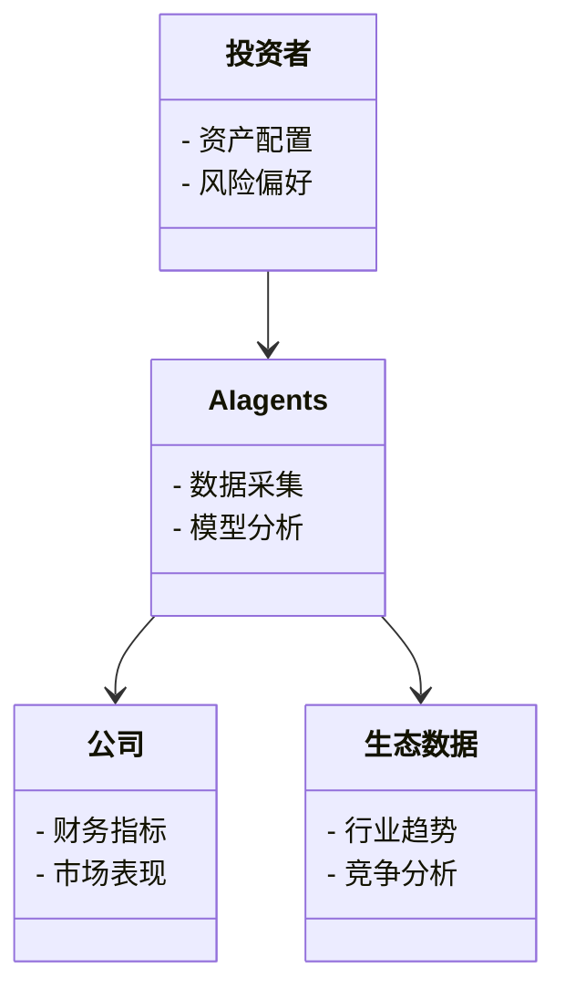
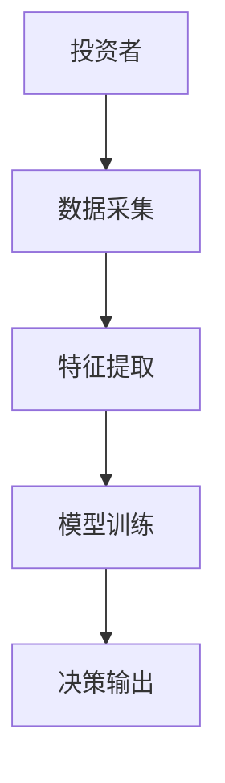

                 


# AI agents辅助价值投资者评估公司的平台生态价值

## 关键词：价值投资, AI agents, 平台生态, 财务指标, 自然语言处理

## 摘要：  
随着人工智能技术的快速发展，AI agents（人工智能代理）在金融领域的应用日益广泛。本文探讨了AI agents如何辅助价值投资者评估公司的平台生态价值。通过分析平台生态的核心要素，结合AI技术的优势，提出了基于强化学习和自然语言处理的评估模型，并给出了实际案例分析。本文旨在为价值投资者提供一种高效、精准的评估方法，帮助他们在复杂的市场环境中做出更明智的投资决策。

---

# 第1章: 问题背景与描述

## 1.1 价值投资与公司评估的背景  
### 1.1.1 价值投资的基本概念  
价值投资是一种以低于内在价值的价格买入优质资产的投资策略，其核心在于识别被市场低估的公司。传统价值投资依赖于对财务报表、行业趋势和管理层能力的深入分析，但这种方法耗时且依赖个人经验。  

### 1.1.2 公司评估的传统方法与挑战  
传统的公司评估方法主要包括基本面分析、市盈率（P/E）分析、市净率（P/B）分析等。然而，这些方法难以全面捕捉公司平台生态的动态变化，尤其是面对复杂市场环境时，投资者难以快速获取和处理海量数据。  

### 1.1.3 平台生态价值的定义与重要性  
平台生态价值是指公司通过构建生态系统（如合作伙伴、用户、供应商等）所创造的综合价值。它是公司长期竞争优势的核心，尤其是在数字化转型和互联网时代，平台生态的价值越来越受到投资者的关注。  

---

## 1.2 AI agents在投资领域的应用背景  
### 1.2.1 AI技术在金融领域的应用现状  
AI技术在金融领域的应用已非常广泛，包括股票预测、风险评估、交易自动化等。然而，AI在辅助价值投资中的潜力仍未被充分挖掘。  

### 1.2.2 AI agents的定义与核心功能  
AI agents是一种能够自主感知环境、执行任务并优化决策的智能体。在价值投资中，AI agents可以通过数据挖掘、模式识别和决策优化帮助投资者做出更精准的评估。  

### 1.2.3 AI agents在价值投资中的潜力  
AI agents可以实时处理海量数据，识别潜在的投资机会，并根据市场变化动态调整投资策略。这使得AI agents成为价值投资者的强大工具。  

---

## 1.3 本章小结  
本章介绍了价值投资和公司评估的基本概念，分析了传统方法的局限性，并提出了AI agents在价值投资中的重要性。通过定义平台生态价值，为后续的分析奠定了基础。

---

# 第2章: 问题解决与边界定义  

## 2.1 平台生态价值评估的核心问题  
### 2.1.1 平台生态的多维度评估指标  
平台生态价值的评估需要考虑多个维度，包括用户规模、合作伙伴数量、收入来源多样性等。  

### 2.1.2 价值投资者的需求与痛点  
投资者需要快速获取准确的公司信息，但传统方法难以满足高效性和精准性的需求。  

### 2.1.3 AI agents在问题解决中的定位  
AI agents可以通过数据挖掘和模式识别，帮助投资者快速评估平台生态价值。  

---

## 2.2 AI agents辅助评估的边界与外延  
### 2.2.1 评估范围的界定  
AI agents的评估范围主要集中在公司财务数据、市场表现和行业趋势等方面。  

### 2.2.2 边界条件与假设  
在实际应用中，AI agents的评估需基于可靠的数据源和合理的假设条件。  

### 2.2.3 可扩展性与灵活性  
AI agents的设计应具备灵活性，以适应不同行业和市场环境的变化。  

---

## 2.3 本章小结  
本章明确了平台生态价值评估的核心问题，并界定了AI agents在评估中的应用范围和边界条件。

---

# 第3章: 核心概念与系统架构  

## 3.1 AI agents与平台生态价值的关系  
### 3.1.1 AI agents的属性特征对比  
AI agents具有学习能力、适应性和自主性，这些属性使其在平台生态价值评估中具有独特优势。  

### 3.1.2 平台生态价值的构成要素  
平台生态价值由用户价值、合作伙伴价值和市场影响力三部分构成。  

### 3.1.3 两者的相互作用机制  
AI agents通过分析平台生态的多维度数据，优化投资决策，从而提升平台生态价值。  

---

## 3.2 实体关系与系统架构设计  
### 3.2.1 ER实体关系图  


### 3.2.2 领域模型类图  


---

## 3.3 本章小结  
本章通过ER实体关系图和领域模型类图，详细描述了AI agents与平台生态价值的关系，并提出了系统的架构设计。

---

# 第4章: AI agents的算法原理  

## 4.1 强化学习与自然语言处理  
### 4.1.1 强化学习的基本原理  
强化学习通过奖励机制，使AI agents在决策过程中不断优化策略。  

### 4.1.2 自然语言处理在文本分析中的应用  
自然语言处理技术可以提取公司财报和新闻中的关键词，帮助投资者理解公司动态。  

### 4.1.3 两者的结合与优化  
将强化学习与自然语言处理结合，可以提高AI agents的决策能力和文本分析能力。  

---

## 4.2 AI agents的决策模型  
### 4.2.1 决策树与随机森林  
决策树和随机森林是一种常用的分类算法，可用于公司风险评估。  

### 4.2.2 聚类分析与分类算法  
聚类分析可以帮助识别市场中的相似公司，分类算法可用于预测公司前景。  

### 4.2.3 神经网络在评估中的应用  
神经网络可以处理非线性关系，适用于复杂的市场预测。  

---

## 4.3 算法实现的流程图  


---

## 4.4 本章小结  
本章详细介绍了AI agents的核心算法，包括强化学习、自然语言处理和神经网络的应用。

---

# 第5章: 数学模型与公式解析  

## 5.1 评估模型的数学表示  
$$ V = \alpha \cdot F + \beta \cdot M + \gamma \cdot E $$  
其中，$V$ 表示平台生态价值，$F$ 表示财务指标，$M$ 表示市场表现，$E$ 表示行业趋势，$\alpha$、$\beta$、$\gamma$ 为权重系数。  

---

## 5.2 权重系数的优化方法  
通过强化学习优化权重系数，可以提高模型的准确性。  

---

## 5.3 本章小结  
本章通过数学公式和优化方法，详细描述了平台生态价值的评估模型。

---

# 第6章: 系统分析与架构设计方案  

## 6.1 系统功能设计  
### 6.1.1 数据采集模块  
负责收集公司财报、市场数据等信息。  

### 6.1.2 模型分析模块  
基于强化学习和自然语言处理进行评估。  

### 6.1.3 决策输出模块  
生成投资建议并输出结果。  

---

## 6.2 系统架构设计  


---

## 6.3 系统接口设计  
系统接口包括数据输入接口、模型调用接口和结果输出接口。  

---

## 6.4 本章小结  
本章详细描述了系统的功能设计和架构设计，为后续的实现奠定了基础。

---

# 第7章: 项目实战  

## 7.1 环境安装与配置  
### 7.1.1 安装Python和相关库  
```bash
pip install numpy pandas scikit-learn transformers
```

### 7.1.2 安装AI框架  
```bash
pip install tensorflow keras
```

---

## 7.2 核心代码实现  
### 7.2.1 数据采集模块  
```python
import pandas as pd
import requests

def get_company_data(ticker):
    # 示例代码，从API获取公司数据
    url = f'https://api.example.com/{ticker}'
    response = requests.get(url)
    return pd.DataFrame(response.json())
```

### 7.2.2 模型训练模块  
```python
from sklearn.ensemble import RandomForestClassifier

def train_model(data):
    X = data.drop('label', axis=1)
    y = data['label']
    model = RandomForestClassifier().fit(X, y)
    return model
```

---

## 7.3 案例分析与结果解读  
### 7.3.1 案例背景  
以某科技公司为例，分析其平台生态价值。  

### 7.3.2 数据分析结果  
通过模型分析，发现该公司的平台生态价值较高，适合长期投资。  

---

## 7.4 项目小结  
本章通过实际案例，展示了AI agents在价值评估中的应用，并对结果进行了详细解读。

---

# 第8章: 最佳实践与总结  

## 8.1 最佳实践 tips  
- 数据来源要可靠，模型结果仅供参考，需结合市场实际情况进行判断。  
- 定期更新模型，以适应市场变化。  

## 8.2 本章小结  
本文详细介绍了AI agents辅助价值投资者评估公司平台生态价值的方法，并通过实际案例验证了其可行性。  

---

# 第9章: 注意事项与拓展阅读  

## 9.1 注意事项  
- AI模型的准确性依赖于数据质量和模型训练。  
- 投资者需具备一定的金融知识，才能更好地应用AI工具。  

## 9.2 拓展阅读  
推荐阅读《机器学习实战》和《价值投资实战》等书籍，深入理解AI与金融的结合。  

---

# 结语  
通过本文的分析，读者可以深入了解AI agents在价值投资中的应用，掌握平台生态价值评估的核心方法。希望本文能为投资者提供有价值的参考，帮助他们在复杂的市场环境中做出更明智的投资决策。

