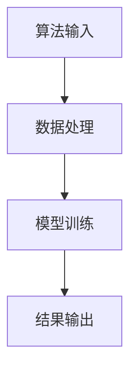
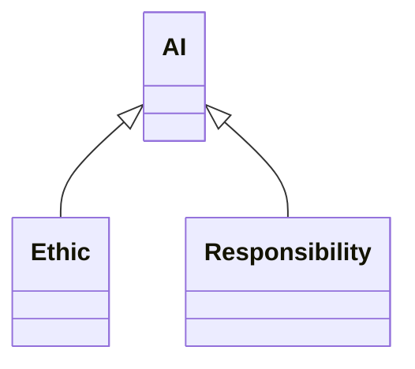

                 


```markdown
# AI伦理与责任

> 关键词：AI伦理，责任，算法，系统架构，法律，社会影响

> 摘要：本文探讨了AI伦理与责任的核心概念、算法原理、系统架构设计、项目实战以及最佳实践。通过分析AI技术的发展历程，伦理和责任问题的出现及其相互作用，本文详细阐述了AI系统在实际应用中的伦理与责任问题，提供了一个全面的框架来理解和解决这些挑战。

---

## 第一部分: AI伦理与责任的背景与核心概念

### 第1章: AI伦理与责任的背景介绍

#### 1.1 AI技术的发展历程
- 1.1.1 人工智能的起源与发展
- 1.1.2 当前AI技术的核心特点
- 1.1.3 AI技术在社会中的广泛应用

#### 1.2 伦理问题的出现与AI技术的关系
- 1.2.1 伦理问题的定义与分类
- 1.2.2 AI技术引发的伦理问题
- 1.2.3 伦理问题与AI技术发展的矛盾与统一

#### 1.3 责任问题的提出与AI技术的关系
- 1.3.1 责任问题的定义与分类
- 1.3.2 AI技术引发的责任问题
- 1.3.3 责任问题与AI技术发展的相互作用

### 第2章: AI伦理与责任的核心概念

#### 2.1 核心概念的定义与属性
- 2.1.1 伦理的基本概念与属性
- 2.1.2 责任的基本概念与属性
- 2.1.3 AI伦理与责任的核心要素

#### 2.2 核心概念的ER实体关系图
```mermaid
entity: Ethic
entity: Responsibility
entity: AI
```

#### 2.3 核心概念的数学模型与公式
- 2.3.1 伦理问题的数学模型
- 2.3.2 责任问题的数学模型
- 2.3.3 AI伦理与责任的综合模型

---

## 第二部分: AI伦理与责任的算法原理

### 第3章: AI伦理与责任的算法原理

#### 3.1 算法原理的概述
- 3.1.1 AI算法的基本原理
- 3.1.2 伦理与责任在算法中的体现
- 3.1.3 算法的伦理与责任问题

#### 3.2 算法原理的数学模型与公式
- 3.2.1 算法的数学模型
- 3.2.2 伦理与责任的数学模型
- 3.2.3 综合模型的数学公式

#### 3.3 算法原理的mermaid流程图


---

## 第三部分: AI伦理与责任的系统分析与架构设计

### 第4章: AI伦理与责任的系统分析与架构设计

#### 4.1 系统分析
- 4.1.1 问题场景介绍
- 4.1.2 项目介绍
- 4.1.3 系统功能设计
- 4.1.4 系统架构设计
- 4.1.5 系统接口设计
- 4.1.6 系统交互设计

#### 4.2 系统分析的mermaid类图


---

## 第四部分: AI伦理与责任的项目实战

### 第5章: AI伦理与责任的项目实战

#### 5.1 项目背景与需求分析
- 5.1.1 项目背景介绍
- 5.1.2 项目需求分析
- 5.1.3 项目目标设定

#### 5.2 项目实施过程
- 5.2.1 环境安装与配置
- 5.2.2 系统核心实现
- 5.2.3 代码实现与解读
- 5.2.4 测试与验证

#### 5.3 项目案例分析
- 5.3.1 案例介绍
- 5.3.2 案例分析
- 5.3.3 经验总结

---

## 第五部分: AI伦理与责任的最佳实践

### 第6章: AI伦理与责任的最佳实践

#### 6.1 最佳实践的总结
- 6.1.1 经验总结
- 6.1.2 教训总结
- 6.1.3 最佳实践建议

#### 6.2 注意事项与风险提示
- 6.2.1 设计阶段的注意事项
- 6.2.2 实施阶段的风险提示
- 6.2.3 运维阶段的注意事项

#### 6.3 未来发展趋势与挑战
- 6.3.1 未来发展趋势
- 6.3.2 发展中的挑战
- 6.3.3 如何应对挑战

---

## 第六部分: 总结与展望

### 第7章: 总结与展望

#### 7.1 核心内容回顾
- 7.1.1 AI伦理与责任的核心概念
- 7.1.2 算法原理与系统架构设计
- 7.1.3 项目实战与最佳实践

#### 7.2 未来展望
- 7.2.1 技术发展预测
- 7.2.2 研究方向建议
- 7.2.3 对社会的影响

---

## 附录

### 附录A: 术语表
- AI伦理
- 责任
- 算法
- 系统架构

### 附录B: 参考文献
- 相关书籍
- 相关论文
- 相关网站

### 附录C: 工具与资源
- 开发工具
- 数据集
- API接口

---

## 作者简介

简要介绍作者的背景、经验和专业领域。
```

