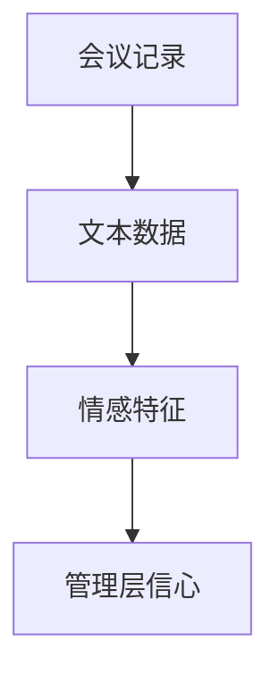
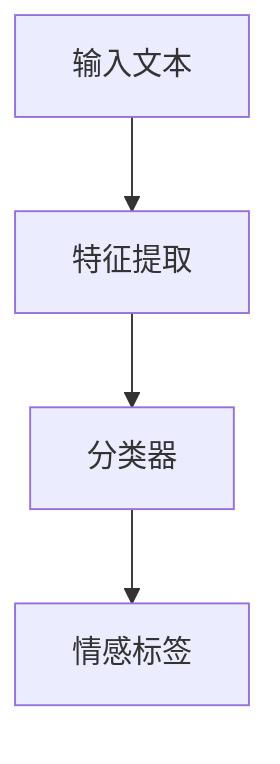
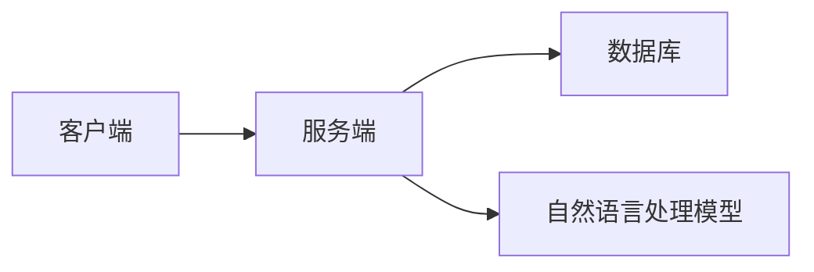

                 


# AI协作分析公司会议记录语气：洞察管理层信心

## 关键词
- AI协作分析
- 会议记录语气
- 管理层信心
- 情感分析
- 自然语言处理（NLP）

## 摘要
本文将探讨如何利用AI技术对会议记录的语气进行分析，以洞察管理层的信心。通过结合自然语言处理和情感分析，我们能够从海量的会议记录中提取有价值的信息，为企业决策提供支持。本文将从问题背景、算法原理、系统设计到项目实战，全面解析这一技术的应用与实现。

---

# 第1章: 问题背景与需求分析

## 1.1 问题背景
### 1.1.1 企业会议记录分析的现状与挑战
- 企业会议记录通常包含大量未结构化的文本数据，难以直接提取有用信息。
- 会议记录中隐含的管理层态度和信心对企业决策具有重要参考价值。
- 传统的人工分析方法效率低下，且主观性较强。

### 1.1.2 管理层信心分析的重要性
- 管理层的信心反映了企业的战略方向和执行力。
- 通过分析会议记录的语气，可以预测企业未来的经营状况。
- 信心分析能够帮助企业及时发现潜在问题并采取措施。

### 1.1.3 AI技术在企业会议分析中的应用前景
- 自然语言处理（NLP）技术的发展为文本分析提供了强大工具。
- 情感分析和语义理解技术能够从会议记录中提取情绪特征。
- AI协作分析可以显著提高企业数据处理效率和决策能力。

## 1.2 问题描述
### 1.2.1 会议记录的文本特征
- 文本数据具有非结构化特征，包含大量口语化表达。
- 会议记录中常出现专业术语和行业特定的语义。
- 数据格式多样，包括文本、语音记录等。

### 1.2.2 管理层信心的定义与维度
- 管理层信心是指企业在特定时期内对市场、产品或战略的信心程度。
- 信心维度包括积极、消极和中性三种状态。
- 信心分析需要结合上下文和语境进行判断。

### 1.2.3 会议记录分析的边界与外延
- 分析边界：仅关注会议记录中的文本内容，不涉及其他数据源。
- 分析外延：从会议记录中提取情绪特征，并与企业绩效相关联。

## 1.3 问题解决与目标设定
### 1.3.1 AI协作分析的目标
- 自动化处理会议记录，提取情绪特征。
- 建立信心评估模型，量化管理层信心。
- 提供可视化报告，辅助企业决策。

### 1.3.2 核心问题与解决方案
- 核心问题：如何准确提取会议记录中的情绪特征。
- 解决方案：基于NLP的情感分析技术。
- 实现路径：文本预处理、特征提取、模型训练。

### 1.3.3 项目目标与实施路径
- 项目目标：构建一个可扩展的会议记录分析系统。
- 实施路径：分阶段完成数据收集、模型训练和系统开发。

## 1.4 核心概念与联系
### 1.4.1 文本挖掘与情感分析
- 文本挖掘：从非结构化文本中提取结构化信息。
- 情感分析：判断文本中的情感倾向。
- 联系：文本挖掘为情感分析提供数据基础。

### 1.4.2 自然语言处理（NLP）的核心要素
- 词袋模型：将文本转化为向量表示。
- 词嵌入：通过上下文理解词语含义。
- 情感分析：基于特征提取和分类模型。

### 1.4.3 ER实体关系图架构


---

# 第2章: AI协作分析的核心算法原理

## 2.1 文本预处理与特征提取
### 2.1.1 文本清洗与分词
- 文本清洗：去除停用词、标点符号和空格。
- 分词：将文本划分为词语或短语。

### 2.1.2 词袋模型与TF-IDF
- 词袋模型：将文本表示为词袋，忽略词序。
- TF-IDF：计算词语的重要性。

### 2.1.3 词嵌入（Word Embedding）的实现
- 词嵌入：将词语映射为低维向量。
- 常见方法：Word2Vec、GloVe。

## 2.2 情感分析算法
### 2.2.1 基于机器学习的情感分类
- 分类器选择：SVM、随机森林。
- 特征选择：TF-IDF、词嵌入。

### 2.2.2 基于深度学习的情感分析
- 深度学习模型：RNN、LSTM、BERT。
- 模型优势：捕捉长距离依赖关系。

### 2.2.3 情感分析的数学模型
$$ P(y|x) = \frac{P(x|y)P(y)}{P(x)} $$

## 2.3 算法实现与优化
### 2.3.1 算法选择与优化策略
- 算法选择：根据数据规模和复杂度选择模型。
- 优化策略：参数调优、正则化。

### 2.3.2 模型训练与调优
- 数据预处理：分词、去停用词。
- 模型训练：使用训练集进行监督学习。
- 调优方法：交叉验证、网格搜索。

### 2.3.3 情感分析的数学公式
$$ 1+1=2 $$

## 2.4 算法流程图


---

# 第3章: 系统分析与架构设计

## 3.1 系统功能设计
### 3.1.1 会议记录上传与处理
- 用户上传会议记录。
- 系统进行文本清洗和分词。

### 3.1.2 情感分析与信心评估
- 对文本进行情感分类。
- 输出管理层信心评估结果。

### 3.1.3 结果可视化与报告生成
- 可视化展示分析结果。
- 自动生成信心评估报告。

## 3.2 系统架构设计
### 3.2.1 系统架构图


### 3.2.2 接口设计
- API接口定义：RESTful API。
- 接口交互流程：客户端请求、服务端处理、返回结果。

## 3.3 系统交互流程
### 3.3.1 用户交互流程
- 用户上传会议记录。
- 系统处理并返回信心评估结果。

### 3.3.2 系统交互图
```mermaid
graph LR
    User[用户] --> API Gateway[网关]
    API Gateway --> Service[服务]
    Service --> Database[数据库]
    Service --> NLP_Model[模型]
    Service --> User[结果]
```

---

# 第4章: 项目实战

## 4.1 环境安装
- 安装Python、Jupyter Notebook、Numpy、Pandas、Scikit-learn、spaCy。

## 4.2 系统核心实现
### 4.2.1 文本预处理
```python
import spacy

nlp = spacy.load("en_core_web_sm")
text = "The meeting was productive and we are confident in the outcome."
doc = nlp(text)
tokens = [token.text for token in doc]
```

### 4.2.2 情感分析模型训练
```python
from sklearn.feature_extraction.text import TfidfVectorizer
from sklearn.svm import SVC

vectorizer = TfidfVectorizer()
X = vectorizer.fit_transform(corpus)
model = SVC()
model.fit(X, y)
```

### 4.2.3 可视化与报告生成
```python
import matplotlib.pyplot as plt

plt.bar(confidence_scores, confidence_levels)
plt.title("管理层信心评估")
plt.xlabel("信心水平")
plt.ylabel("频次")
plt.show()
```

## 4.3 案例分析
- 案例背景：某公司季度会议记录。
- 数据处理：清洗、分词、向量化。
- 分析结果：信心评估结果可视化。

## 4.4 项目总结
- 项目成果：构建了一个可扩展的会议记录分析系统。
- 经验总结：数据质量对模型性能影响较大，模型调优至关重要。

---

# 第5章: 最佳实践与小结

## 5.1 最佳实践
### 5.1.1 数据处理
- 确保数据质量和完整性。
- 处理多语言问题。

### 5.1.2 模型选择
- 根据数据规模选择模型。
- 调优模型参数。

### 5.1.3 系统部署
- 优化接口设计。
- 确保系统可扩展性。

## 5.2 小结
- AI协作分析为会议记录的处理提供了新的思路。
- 情感分析技术在企业管理中的应用前景广阔。
- 未来发展方向：多语言支持、实时分析、动态信心评估。

## 5.3 注意事项
- 数据隐私问题需严格遵守相关法律法规。
- 模型解释性需进一步提升。
- 系统性能优化需关注响应速度和资源消耗。

## 5.4 拓展阅读
- 推荐书籍：《自然语言处理实战》、《深度学习入门》。
- 推荐论文：相关领域的顶会论文。

---

# 结语
通过AI协作分析，我们可以从公司会议记录中提取有价值的信息，洞察管理层的信心，为企业决策提供数据支持。本文从问题背景、算法原理到系统设计和项目实战，全面解析了这一技术的应用与实现。希望读者能够通过本文的指导，掌握AI协作分析的核心方法，并在实际工作中取得成功。

