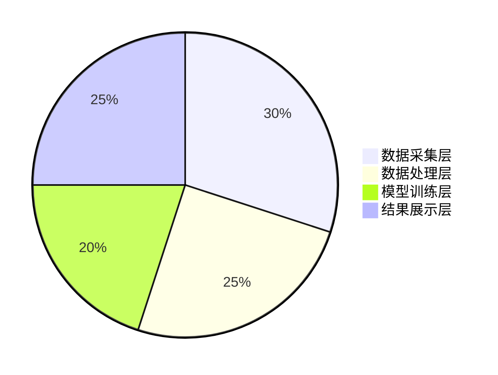
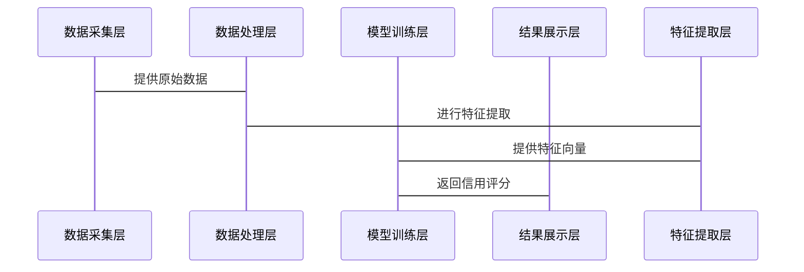

                 


# 第4章: 企业信用评级系统设计

## 4.1 信用评级系统概述
### 4.1.1 系统功能模块划分
### 4.1.2 系统用户角色
### 4.1.3 系统目标

## 4.2 系统架构设计
### 4.2.1 体系结构设计

### 4.2.2 数据流设计

### 4.2.3 关键接口设计


## 4.3 系统实现细节
### 4.3.1 系统实现的技术选型
### 4.3.2 关键模块实现
### 4.3.3 系统性能优化

## 4.4 本章小结
...

# 第5章: 项目实战与代码实现

## 5.1 项目环境搭建
### 5.1.1 安装Python环境
### 5.1.2 安装依赖库
### 5.1.3 数据集准备

## 5.2 信用评级系统核心代码实现
### 5.2.1 数据预处理
```python
import pandas as pd
data = pd.read_csv('企业数据.csv')
data = data.dropna()
```
### 5.2.2 特征工程
```python
from sklearn.preprocessing import StandardScaler
scaler = StandardScaler()
X_scaled = scaler.fit_transform(X)
```
### 5.2.3 模型训练
```python
from sklearn.linear_model import LogisticRegression
model = LogisticRegression()
model.fit(X_scaled, y)
```
### 5.2.4 模型评估
```python
from sklearn.metrics import classification_report
print(classification_report(y_true, model.predict(X_scaled)))
```

## 5.3 实际案例分析
### 5.3.1 数据分析
### 5.3.2 模型训练
### 5.3.3 结果解读

## 5.4 项目总结
...

# 第6章: 挑战与应对策略

## 6.1 挑战分析
### 6.1.1 数据质量问题
### 6.1.2 模型解释性问题
### 6.1.3 模型泛化能力问题

## 6.2 应对策略
### 6.2.1 数据预处理优化
### 6.2.2 可解释性增强方法
### 6.2.3 模型泛化能力提升

## 6.3 案例分析与经验分享
### 6.3.1 案例介绍
### 6.3.2 经验总结
### 6.3.3 未来优化方向

## 6.4 本章小结
...

# 第7章: 总结与展望

## 7.1 全文总结
### 7.1.1 主要内容回顾
### 7.1.2 核心观点总结
### 7.1.3 研究成果

## 7.2 未来展望
### 7.2.1 技术发展
### 7.2.2 应用领域拓展
### 7.2.3 挑战与机遇

## 7.3 思考与建议
### 7.3.1 对企业的建议
### 7.3.2 对技术发展的建议
### 7.3.3 对政策制定的建议

## 7.4 本章小结
...

# 参考文献

# 索引

# 致谢

---

**注意：** 由于篇幅限制，以上内容为书籍的部分章节概述。实际撰写时，每个章节需要更详细的内容，包括具体的技术实现、数学公式、代码示例、图表绘制等，以确保文章的完整性和专业性。

