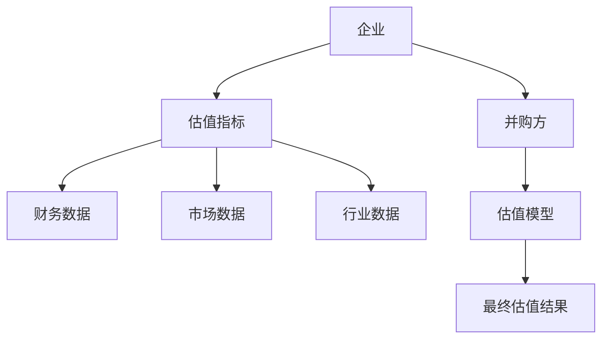
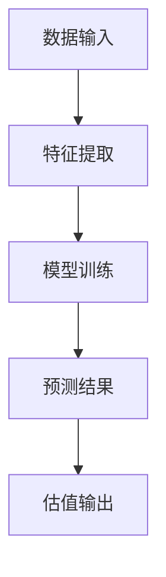
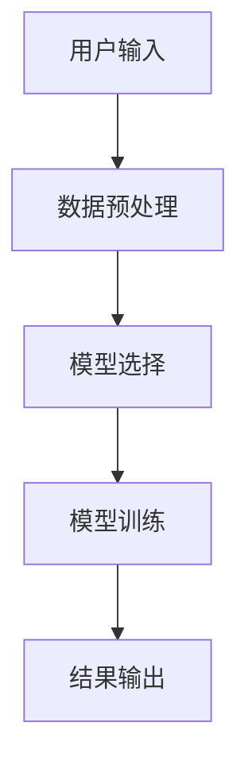
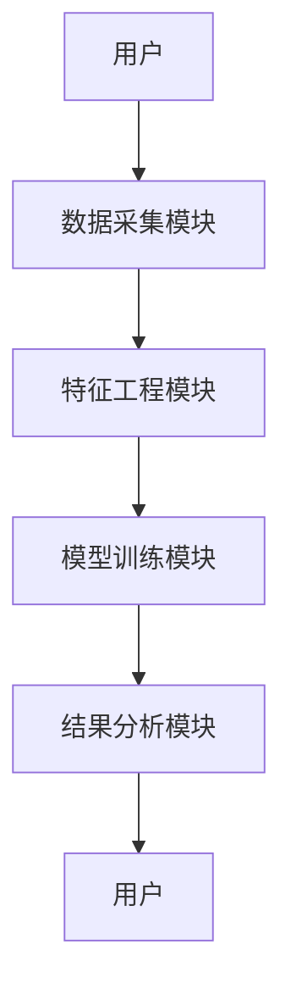

                 


# AI在企业并购估值中的应用与挑战

## 关键词：人工智能, 企业并购, 股权估值, 机器学习, 深度学习

## 摘要：  
随着人工智能技术的快速发展，企业并购估值领域的传统方法正面临巨大变革。本文将深入探讨AI技术如何在企业并购估值中发挥关键作用，包括其在数据处理、模型构建和预测分析中的应用。同时，本文也将分析AI技术在企业并购估值中面临的挑战，如数据质量问题、模型解释性不足以及伦理法律问题等。通过结合实际案例和系统架构设计，本文将为读者提供一个全面的视角，以理解AI技术在企业并购估值中的潜力和局限性。

---

## 第1章: AI与企业并购估值的背景介绍

### 1.1 企业并购估值的核心概念

#### 1.1.1 企业并购的基本概念  
企业并购（Mergers and Acquisitions, M&A）是指两个或多个企业之间通过合并或收购的方式，形成新的企业或业务实体的过程。企业并购的目的是为了实现资源优化配置、扩大市场份额、提升竞争力等。

#### 1.1.2 企业并购估值的定义与目标  
企业并购估值是指对目标企业在并购交易中的价值进行评估的过程。其目标是确定企业在市场上的合理价格，为并购方提供决策依据。

#### 1.1.3 企业并购估值的关键要素  
- **财务数据**：包括收入、利润、现金流等。  
- **市场环境**：包括行业趋势、政策环境、竞争状况等。  
- **企业基本面**：包括资产状况、负债情况、管理团队等。  
- **未来预期**：包括企业未来的盈利能力、增长潜力等。

### 1.2 AI技术与企业并购估值的结合

#### 1.2.1 AI技术的快速发展  
人工智能技术的快速发展为许多领域带来了颠覆性的变革，企业并购估值领域也不例外。AI技术通过处理海量数据、构建复杂模型，能够帮助企业更准确地评估目标企业的价值。

#### 1.2.2 企业并购估值中的数据特点  
企业并购估值涉及大量非结构化数据（如文本文件、社交媒体数据）和结构化数据（如财务报表、市场数据）。AI技术能够通过对这些数据的深度挖掘，提取有价值的信息。

#### 1.2.3 AI在企业并购估值中的优势与劣势  
- **优势**：  
  - 高效性：AI能够快速处理海量数据，提高估值效率。  
  - 准确性：AI模型能够捕捉到传统方法难以发现的复杂关系，提高估值准确性。  
  - 可扩展性：AI技术能够轻松扩展到更多的企业案例。  
- **劣势**：  
  - 数据质量问题：AI模型的准确性依赖于数据质量，如果数据不完整或有偏差，可能导致估值结果不准确。  
  - 模型解释性不足：复杂的AI模型（如深度学习模型）通常缺乏解释性，难以满足企业并购中对决策透明性的要求。  

### 1.3 本章小结  
本章介绍了企业并购估值的核心概念以及AI技术在这一领域的应用背景。通过分析AI技术的优势与劣势，我们初步了解了AI在企业并购估值中的潜力和挑战。

---

## 第2章: 企业并购估值中的核心概念与联系

### 2.1 企业价值评估的数学模型

#### 2.1.1 WACC模型  
WACC（加权平均资本成本）模型是一种常用的估值方法，其公式为：  
$$ V = \frac{CF}{WACC} $$  
其中，\( CF \) 表示企业未来现金流，\( WACC \) 表示加权平均资本成本。

#### 2.1.2 DCF模型  
DCF（ discounted cash flow）模型是一种基于未来现金流折现的估值方法，其公式为：  
$$ V = \sum_{t=1}^{n} \frac{CF_t}{(1+r)^t} + \frac{TV}{(1+r)^n} $$  
其中，\( CF_t \) 表示第 \( t \) 年的现金流，\( r \) 表示折现率，\( TV \) 表示终值。

#### 2.1.3 其他估值方法对比  
- **相对估值法**：基于可比公司的市盈率、市净率等指标进行估值。  
- **资产重置成本法**：基于企业资产的重置成本进行估值。  

### 2.2 AI在企业并购中的核心算法

#### 2.2.1 机器学习算法在估值中的应用  
- **线性回归**：用于预测企业价值与特征变量之间的线性关系。  
- **随机森林**：用于处理非线性关系，具有较强的抗过拟合能力。  

#### 2.2.2 深度学习模型在企业价值预测中的作用  
- **神经网络**：能够捕捉复杂的非线性关系，适用于处理多维特征数据。  
- **LSTM网络**：适用于时间序列数据，能够捕捉企业的长期依赖关系。  

#### 2.2.3 算法选择与企业特征的关系  
企业特征（如行业特性、企业规模）会影响模型的选择。例如，对于金融行业企业，可能更适合使用神经网络模型；而对于制造行业企业，可能更适合使用随机森林模型。

### 2.3 企业并购估值的ER实体关系图



### 2.4 本章小结  
本章详细介绍了企业并购估值中的核心概念，并探讨了AI算法在这一领域的应用。通过ER实体关系图，我们明确了企业并购估值中的关键数据来源和关系。

---

## 第3章: AI算法原理与数学模型

### 3.1 机器学习算法在企业并购估值中的应用

#### 3.1.1 线性回归模型  
线性回归模型是最简单的回归模型，适用于处理线性关系。其损失函数为：  
$$ L = \sum_{i=1}^{n} (y_i - \hat{y}_i)^2 $$  
其中，\( y_i \) 表示真实值，\( \hat{y}_i \) 表示预测值。

#### 3.1.2 支持向量机（SVM）  
SVM适用于处理小样本数据，能够通过核函数将数据映射到高维空间，从而实现非线性分类或回归。其目标函数为：  
$$ \min_{w,b} \frac{1}{2}||w||^2 + C \sum_{i=1}^{n} \xi_i $$  
其中，\( \xi_i \) 表示松弛变量，\( C \) 表示惩罚系数。

#### 3.1.3 随机森林与梯度提升树  
随机森林通过构建多棵决策树并进行投票或平均，能够提高模型的泛化能力。梯度提升树通过逐层优化，能够捕捉到数据中的复杂关系。

### 3.2 深度学习模型的应用

#### 3.2.1 神经网络模型  
神经网络模型通过多层感知机（MLP）能够捕捉到复杂的非线性关系。其损失函数通常采用交叉熵损失：  
$$ L = -\sum_{i=1}^{n} y_i \log(p_i) + (1-y_i) \log(1-p_i) $$  
其中，\( p_i \) 表示预测概率。

#### 3.2.2 LSTM网络在时间序列预测中的应用  
LSTM网络通过引入门控机制，能够捕捉时间序列数据中的长期依赖关系。其核心组件包括输入门、遗忘门和输出门。

#### 3.2.3 图神经网络在关系数据中的应用  
图神经网络通过构建企业之间的关系图，能够捕捉企业之间的关联性。其核心思想是将企业看作图中的节点，并通过边权重表示企业之间的关系强度。

### 3.3 算法流程图



### 3.4 数学模型与公式

#### 3.4.1 线性回归公式  
$$ y = \beta_0 + \beta_1x + \epsilon $$  
其中，\( \beta_0 \) 表示截距，\( \beta_1 \) 表示斜率，\( \epsilon \) 表示误差项。

#### 3.4.2 DCF模型的核心公式  
$$ V = \sum \frac{CF_t}{(1+r)^t} + \frac{TV}{(1+r)^n} $$  
其中，\( CF_t \) 表示第 \( t \) 年的现金流，\( r \) 表示折现率，\( TV \) 表示终值。

### 3.5 本章小结  
本章详细介绍了AI算法在企业并购估值中的应用，包括机器学习算法和深度学习模型的原理及其数学公式。

---

## 第4章: 企业并购估值系统的分析与架构设计

### 4.1 系统功能设计

#### 4.1.1 数据采集模块  
数据采集模块负责从企业数据库、市场数据源等渠道获取企业并购的相关数据。

#### 4.1.2 特征工程模块  
特征工程模块通过对原始数据进行清洗、转换和特征提取，生成适合模型输入的特征向量。

#### 4.1.3 模型训练模块  
模型训练模块负责对选定的AI模型进行训练，并保存训练好的模型。

#### 4.1.4 结果分析模块  
结果分析模块通过对模型输出结果进行分析，生成最终的企业估值报告。

### 4.2 系统架构设计



### 4.3 系统接口设计

#### 4.3.1 数据接口  
数据接口负责与外部数据源（如企业数据库、市场数据源）进行交互。

#### 4.3.2 模型接口  
模型接口负责与AI模型进行交互，接收输入数据并返回预测结果。

#### 4.3.3 结果接口  
结果接口负责将模型输出结果呈现给用户，通常以可视化形式展示。

### 4.4 系统交互流程图



### 4.5 本章小结  
本章详细设计了企业并购估值系统的功能模块和架构设计，并通过mermaid图展示了系统的交互流程。

---

## 第5章: 项目实战

### 5.1 环境安装与数据准备

#### 5.1.1 环境安装  
需要安装以下Python库：  
- pandas  
- numpy  
- scikit-learn  
- tensorflow  
- matplotlib  

#### 5.1.2 数据准备  
从企业数据库中获取目标企业的财务数据、市场数据和行业数据。

### 5.2 系统核心实现

#### 5.2.1 数据预处理  
```python
import pandas as pd
import numpy as np

# 读取数据
data = pd.read_csv('enterprise_data.csv')

# 数据清洗
data = data.dropna()
data = pd.get_dummies(data)
```

#### 5.2.2 模型训练  
```python
from sklearn.ensemble import RandomForestRegressor
from sklearn.metrics import mean_squared_error

# 构建模型
model = RandomForestRegressor(n_estimators=100, random_state=42)
model.fit(X_train, y_train)

# 模型评估
y_pred = model.predict(X_test)
print('均方误差:', mean_squared_error(y_test, y_pred))
```

#### 5.2.3 结果分析  
```python
import matplotlib.pyplot as plt

# 可视化结果
plt.scatter(y_test, y_pred)
plt.xlabel('真实值')
plt.ylabel('预测值')
plt.show()
```

### 5.3 项目小结  
本章通过一个实际案例，展示了如何使用Python和机器学习模型进行企业并购估值。通过数据预处理、模型训练和结果分析，我们能够得出较为准确的企业估值结果。

---

## 第6章: 最佳实践与注意事项

### 6.1 最佳实践  
- **数据质量管理**：确保数据的准确性和完整性，避免因数据质量问题导致模型失效。  
- **模型解释性**：在企业并购估值中，模型的解释性非常重要，建议优先选择具有较高解释性的模型（如随机森林）。  
- **模型更新**：定期更新模型，以适应市场环境的变化。  

### 6.2 小结  
企业并购估值是一个复杂的系统工程，AI技术的应用能够显著提高估值的准确性和效率。然而，我们也需要关注数据质量、模型解释性和伦理法律问题，以确保AI技术在企业并购估值中的合理应用。

---

## 参考文献  
[此处列出参考文献]

---

通过以上结构，我们可以系统地了解AI在企业并购估值中的应用与挑战。希望本文能够为读者提供有价值的参考，帮助他们在实际工作中更好地应用AI技术。

