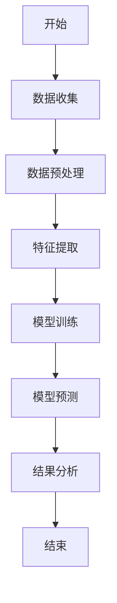
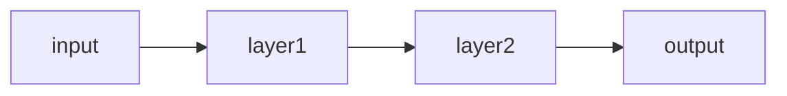
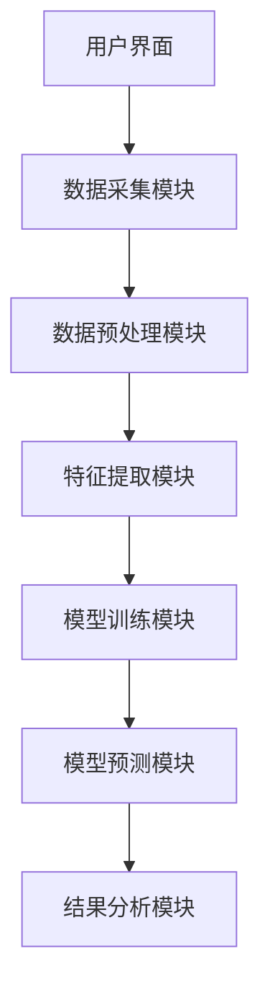

                 


# AI在企业并购协同效应预测中的应用与挑战

> 关键词：企业并购、协同效应、人工智能、机器学习、预测模型

> 摘要：企业并购是企业发展的重要战略之一，协同效应是衡量并购成功的重要指标。随着人工智能技术的快速发展，AI在企业并购协同效应预测中的应用越来越广泛。本文将从企业并购的背景出发，详细探讨协同效应预测的核心概念、算法原理、系统架构设计、项目实战以及应用中的挑战，为读者提供全面的技术解读。

---

## 第1章: 企业并购协同效应预测的背景与问题描述

### 1.1 企业并购的定义与类型

#### 1.1.1 企业并购的基本概念

企业并购（Mergers and Acquisitions，简称M&A）是指两个或多个企业之间的合并或收购行为。并购可以是企业为了扩大规模、优化资源、进入新市场或增强竞争力而采取的战略决策。并购通常涉及资产、股权或控制权的转移。

#### 1.1.2 并购的类型与特点

企业并购可以分为以下几种类型：

1. **横向并购**：同一行业内的企业并购，目的是扩大市场份额或消除竞争。
2. **纵向并购**：产业链上下游企业之间的并购，目的是整合资源，控制生产链。
3. **混合并购**：不同行业或业务领域的企业并购，目的是多元化经营或获取新技术。

#### 1.1.3 并购的动机与目标

企业进行并购的主要动机包括：

- **市场扩展**：进入新市场或扩大现有市场占有率。
- **成本节约**：通过规模效应降低成本。
- **技术获取**：获取新技术或研发能力。
- **财务优化**：通过并购优化资本结构或降低财务风险。

### 1.2 协同效应的定义与分类

#### 1.2.1 协同效应的核心概念

协同效应（Synergy）是指并购后的企业通过整合资源、优化流程、共享技术和知识，从而实现的成本节约或收益增加。协同效应是企业并购成功的重要指标，也是并购的主要驱动力之一。

#### 1.2.2 协同效应的主要类型

协同效应可以分为以下几种：

1. **经营协同效应**：通过整合生产、销售和供应链实现的成本节约。
2. **技术协同效应**：通过共享技术和知识实现的创新和效率提升。
3. **财务协同效应**：通过整合财务资源、优化资本结构实现的财务收益。

#### 1.2.3 协同效应的衡量指标

常用的协同效应衡量指标包括：

- **成本节约率**：并购后成本节约额与并购前总成本的比率。
- **收益增长率**：并购后企业收益与并购前收益的比率。
- **协同效应比率**：协同效应的实现程度与预期协同效应的比率。

### 1.3 AI技术在企业并购中的应用潜力

#### 1.3.1 AI技术的基本概念

人工智能（AI）是指计算机系统模拟人类智能的技术，包括学习、推理、自我改进等功能。AI技术在企业并购中的应用可以帮助企业更好地进行市场分析、风险评估和协同效应预测。

#### 1.3.2 AI在企业并购中的应用场景

1. **市场分析**：通过自然语言处理（NLP）分析市场趋势和竞争对手信息。
2. **风险评估**：利用机器学习模型预测并购后的风险和不确定性。
3. **协同效应预测**：通过AI模型预测并购后的协同效应，优化并购决策。

#### 1.3.3 AI技术对企业并购协同效应预测的推动作用

AI技术可以帮助企业更准确地预测协同效应，降低并购风险，提高并购成功率。通过大数据分析和机器学习模型，AI可以提取和分析大量的企业数据，发现潜在的协同点，优化协同效应预测模型。

---

## 第2章: 企业并购协同效应预测的核心概念与联系

### 2.1 协同效应预测的核心要素

#### 2.1.1 企业战略匹配性

企业战略匹配性是指并购双方在战略目标、发展方向和核心竞争力上的匹配程度。战略匹配性是协同效应预测的重要因素，决定了并购后的资源整合和协同发展潜力。

#### 2.1.2 企业资源互补性

企业资源互补性是指并购双方在资源、技术和市场上的互补性。资源互补性是协同效应实现的基础，决定了并购后的资源整合效率和协同效应的大小。

#### 2.1.3 企业文化融合性

企业文化融合性是指并购双方在文化、管理风格和企业价值观上的融合程度。企业文化融合性是协同效应实现的关键因素，决定了并购后的企业整合效果和员工满意度。

### 2.2 协同效应预测的ER实体关系图

以下是协同效应预测的核心实体关系图：

```mermaid
erDiagram
    customer[顾客] {
        integer 用户ID
        string 用户名
        date 加入日期
    }
    product[产品] {
        integer 产品ID
        string 产品名称
        decimal 价格
    }
    order[订单] {
        integer 订单ID
        date 订单日期
        decimal 订单金额
    }
    customer --> order: 下单
    product --> order: 订单包含的产品
```

### 2.3 协同效应预测的流程图

以下是协同效应预测的流程图：



---

## 第3章: 协同效应预测的算法原理

### 3.1 常见的协同效应预测算法

#### 3.1.1 线性回归模型

线性回归模型是一种简单但有效的预测模型，适用于线性关系的数据。以下是线性回归模型的公式：

$$ y = \beta_0 + \beta_1x + \epsilon $$

其中，$y$ 是目标变量，$x$ 是自变量，$\beta_0$ 是截距，$\beta_1$ 是回归系数，$\epsilon$ 是误差项。

#### 3.1.2 支持向量机

支持向量机（SVM）是一种监督学习算法，适用于分类和回归问题。以下是SVM的核心思想：

- 将数据映射到高维空间，找到一个超平面，使正负样本分开。

#### 3.1.3 神经网络模型

神经网络模型是一种深度学习算法，适用于复杂的非线性关系。以下是神经网络模型的结构：



#### 3.1.4 随机森林

随机森林是一种集成学习算法，适用于分类和回归问题。以下是随机森林的核心思想：

- 通过随机采样和特征选择，生成多个决策树，最终通过投票或平均得到预测结果。

### 3.2 协同效应预测的数学模型

#### 协同效应指数计算公式

$$ 协同效应指数 = \frac{协同效应预测值}{协同效应基准值} \times 100\% $$

其中，协同效应预测值是基于AI模型预测的协同效应值，协同效应基准值是根据历史数据或行业标准确定的基准值。

#### 协同效应预测的机器学习模型

以下是协同效应预测的机器学习模型示例：

```python
from sklearn.linear_model import LinearRegression
from sklearn.ensemble import RandomForestRegressor

# 数据预处理
X_train, X_test, y_train, y_test = train_test_split(X, y, test_size=0.2, random_state=42)

# 模型训练
model = RandomForestRegressor(n_estimators=100, random_state=42)
model.fit(X_train, y_train)

# 模型预测
y_pred = model.predict(X_test)

# 模型评估
print('R² Score:', model.score(X_test, y_test))
```

---

## 第4章: 系统分析与架构设计

### 4.1 系统功能设计

协同效应预测系统的主要功能包括：

1. 数据采集：从企业数据库中采集并购相关数据。
2. 数据预处理：清洗、转换和标准化数据。
3. 特征提取：提取影响协同效应的关键特征。
4. 模型训练：训练协同效应预测模型。
5. 模型预测：预测并购后的协同效应。
6. 结果分析：分析预测结果，优化模型。

### 4.2 系统架构设计

以下是协同效应预测系统的架构图：



### 4.3 系统接口设计

以下是协同效应预测系统的接口设计：

```python
class ModelPredictor:
    def predict(self, input_data):
        # 输入数据预处理
        processed_data = self._preprocess(input_data)
        # 调用预测模型
        prediction = self.model.predict(processed_data)
        return prediction

    def _preprocess(self, data):
        # 数据预处理逻辑
        return data
```

---

## 第5章: 项目实战

### 5.1 环境安装

以下是协同效应预测系统的环境安装步骤：

1. 安装Python和相关库：
   ```bash
   pip install numpy pandas scikit-learn
   ```

2. 安装Jupyter Notebook：
   ```bash
   pip install jupyter
   ```

### 5.2 核心代码实现

以下是协同效应预测系统的核心代码实现：

```python
from sklearn.ensemble import RandomForestRegressor
from sklearn.metrics import mean_squared_error
import pandas as pd

# 数据加载
data = pd.read_csv('merger_data.csv')

# 数据分割
X = data.drop('synergy', axis=1)
y = data['synergy']

# 数据分割
X_train, X_test, y_train, y_test = train_test_split(X, y, test_size=0.2, random_state=42)

# 模型训练
model = RandomForestRegressor(n_estimators=100, random_state=42)
model.fit(X_train, y_train)

# 模型预测
y_pred = model.predict(X_test)

# 模型评估
mse = mean_squared_error(y_test, y_pred)
print('均方误差:', mse)
print('R²:', model.score(X_test, y_test))
```

### 5.3 案例分析

以下是协同效应预测系统的实际案例分析：

1. **数据收集**：收集目标企业的财务数据、市场数据和竞争对手数据。
2. **数据预处理**：清洗和标准化数据。
3. **特征提取**：提取影响协同效应的关键特征。
4. **模型训练**：训练协同效应预测模型。
5. **模型预测**：预测并购后的协同效应。
6. **结果分析**：分析预测结果，优化模型。

### 5.4 项目总结

通过本项目，我们可以看到AI技术在企业并购协同效应预测中的巨大潜力。通过大数据分析和机器学习模型，企业可以更准确地预测并购后的协同效应，优化并购决策，降低并购风险。

---

## 第6章: 扩展与展望

### 6.1 最佳实践

- **数据质量**：确保数据的准确性和完整性。
- **模型优化**：通过交叉验证和超参数调优优化模型性能。
- **实时监控**：实时监控模型性能，及时更新模型。

### 6.2 小结

本文详细探讨了AI技术在企业并购协同效应预测中的应用，包括核心概念、算法原理、系统架构设计和项目实战。通过这些内容，我们可以看到AI技术在企业并购中的巨大潜力。

### 6.3 注意事项

- **数据隐私**：注意保护企业数据隐私。
- **模型解释性**：确保模型的解释性，便于企业理解和应用。
- **持续优化**：持续优化模型，适应市场变化。

### 6.4 拓展阅读

- 《机器学习实战》
- 《企业并购战略》
- 《人工智能与商业应用》

---

## 结论与展望

随着AI技术的快速发展，企业并购协同效应预测的应用前景广阔。通过AI技术，企业可以更准确地预测协同效应，优化并购决策，降低并购风险。未来，随着AI技术的进一步发展，企业并购协同效应预测将更加精准和智能化，为企业创造更大的价值。

--- 

# END

