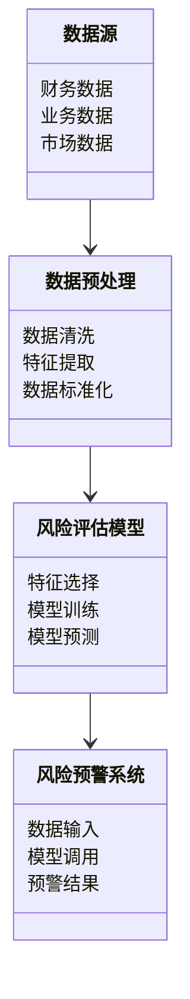
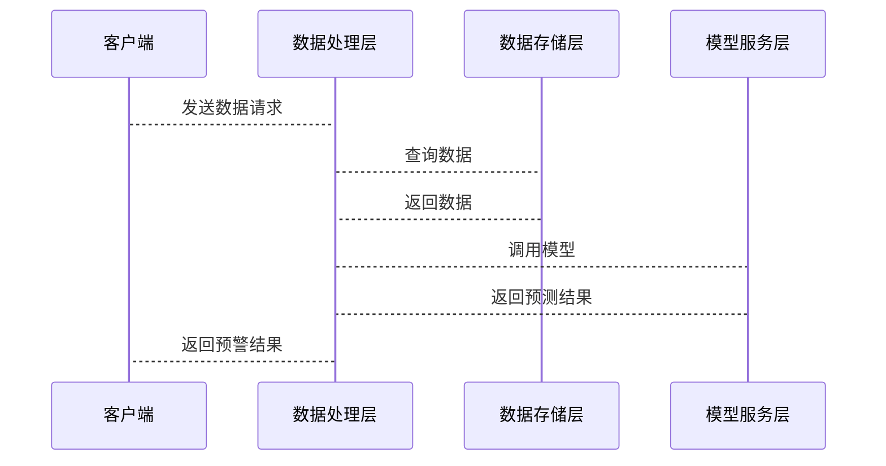

                 


# AI在企业并购整合风险预警中的应用与挑战

> 关键词：企业并购、风险预警、人工智能、机器学习、数据驱动

> 摘要：本文深入探讨了人工智能在企业并购整合风险预警中的应用与挑战。通过分析并购整合中的各类风险，结合AI技术的核心原理，提出了一种基于数据驱动的智能化风险评估与预警系统。本文从背景与概述、AI技术的核心概念与原理、系统设计与实现、项目实战、挑战与解决方案等多方面展开论述，为企业在并购整合过程中如何利用AI技术降低风险提供了详尽的技术指导和实践参考。

---

# 第一部分: 企业并购整合风险预警的背景与概述

## 第1章: 企业并购整合的基本概念

### 1.1 企业并购的基本定义

#### 1.1.1 并购的定义与分类

- **定义**: 并购是指一家企业通过购买另一家企业的一部分或全部股权，以实现资源重组和战略扩张的过程。
- **分类**:
  1. **横向并购**: 同行业之间的并购，旨在扩大市场份额。
  2. **纵向并购**: 上下游企业之间的并购，以优化供应链。
  3. **混合并购**: 不同行业之间的并购，以实现多元化经营。

#### 1.1.2 企业整合的内涵与外延

- **内涵**: 整合是指在并购完成后，将双方的人力资源、技术、资产、业务流程等进行融合的过程。
- **外延**: 包括组织架构调整、文化融合、业务协同等多方面。

#### 1.1.3 并购整合的核心目标

- **目标**:
  1. 实现资源优化配置。
  2. 提高企业竞争力。
  3. 降低经营成本。
  4. 战略协同效应。

---

### 1.2 并购整合的风险类型

#### 1.2.1 财务风险

- **定义**: 并购过程中因财务状况不佳、债务负担过重等引起的财务危机。
- **表现**:
  1. 企业盈利能力下降。
  2. 资产负债率过高。
  3. 现金流断裂。

#### 1.2.2 市场风险

- **定义**: 并购后因市场需求变化、竞争加剧等导致的市场风险。
- **表现**:
  1. 销量下降。
  2. 价格战。
  3. 市场份额被蚕食。

#### 1.2.3 经营风险

- **定义**: 并购后因管理不善、业务整合困难等导致的经营问题。
- **表现**:
  1. 业务流程混乱。
  2. 人员流失。
  3. 业务协同不足。

#### 1.2.4 法律与合规风险

- **定义**: 并购过程中因法律问题、合规性不足等引起的法律风险。
- **表现**:
  1. 诉讼风险。
  2. 合规性罚款。
  3. 信息披露问题。

---

### 1.3 并购整合风险预警的重要性

#### 1.3.1 风险预警的定义与作用

- **定义**: 风险预警是指通过数据分析和模型预测，提前识别和预警潜在风险的过程。
- **作用**:
  1. 减少经济损失。
  2. 提高决策效率。
  3. 优化资源配置。

#### 1.3.2 风险预警在企业并购中的价值

- **价值**:
  1. 提前发现潜在风险。
  2. 优化并购决策。
  3. 提高并购成功率。

#### 1.3.3 风险预警的边界与外延

- **边界**:
  1. 风险预警仅能识别潜在风险，不能完全消除风险。
  2. 风险预警需要结合具体业务场景。
- **外延**:
  1. 风险预警可以应用于企业战略规划、风险管理等多个领域。

---

## 第2章: AI在企业并购整合中的应用背景

### 2.1 AI技术的发展与应用现状

#### 2.1.1 AI技术的演进历程

- **发展历程**:
  1. **符号AI阶段**: 基于规则的AI系统。
  2. **机器学习阶段**: 基于数据的AI系统。
  3. **深度学习阶段**: 基于神经网络的AI系统。

#### 2.1.2 AI在企业中的主要应用场景

- **应用场景**:
  1. 数据分析与预测。
  2. 自然语言处理。
  3. 图像识别。
  4. 机器人流程自动化。

#### 2.1.3 AI在并购整合中的潜在价值

- **价值**:
  1. 提高数据分析效率。
  2. 优化风险评估模型。
  3. 实现实时监控与预警。

---

### 2.2 并购整合风险预警的痛点与挑战

#### 2.2.1 传统风险评估方法的局限性

- **局限性**:
  1. 数据量小，难以捕捉复杂风险。
  2. 人工分析耗时长，效率低。
  3. 风险评估缺乏动态性。

#### 2.2.2 数据获取与处理的难点

- **难点**:
  1. 数据来源多样化，清洗难度大。
  2. 数据质量参差不齐，影响分析结果。
  3. 数据隐私与安全问题。

#### 2.2.3 模型构建与应用的挑战

- **挑战**:
  1. 模型泛化能力不足。
  2. 模型解释性差，难以验证。
  3. 模型更新与维护成本高。

---

### 2.3 AI技术如何解决并购整合风险预警的问题

#### 2.3.1 数据驱动的风险分析

- **方法**:
  1. 利用大数据技术进行数据清洗与特征提取。
  2. 通过机器学习模型进行风险预测。

#### 2.3.2 智能化风险评估模型

- **优势**:
  1. 模型自适应能力强。
  2. 可以处理复杂非线性关系。
  3. 提高风险评估的准确率。

#### 2.3.3 实时监控与预警机制

- **机制**:
  1. 实时数据采集与分析。
  2. 基于模型的动态预警。
  3. 多维度数据交叉验证。

---

# 第二部分: AI在并购整合风险预警中的核心概念与原理

## 第3章: 并购整合风险预警的核心概念

### 3.1 数据驱动的风险分析框架

#### 3.1.1 数据来源与类型

- **数据来源**:
  1. 企业内部数据（财务数据、业务数据）。
  2. 企业外部数据（行业数据、市场数据）。
- **数据类型**:
  1. 结构化数据（如表格数据）。
  2. 非结构化数据（如文本、图像）。

#### 3.1.2 数据预处理与特征提取

- **数据预处理**:
  1. 数据清洗（去除重复、缺失值处理）。
  2. 数据标准化（归一化、标准化）。
  3. 数据增强（增加样本多样性）。
- **特征提取**:
  1. 基于统计的方法（如主成分分析）。
  2. 基于机器学习的方法（如LDA）。
  3. 基于深度学习的方法（如Word2Vec）。

#### 3.1.3 数据分析与建模

- **数据分析**:
  1. 描述性分析（识别数据分布）。
  2. 预测性分析（预测风险概率）。
  3. 可视化分析（数据可视化工具）。
- **建模**:
  1. 监督学习模型（如逻辑回归、SVM）。
  2. 非监督学习模型（如聚类分析）。
  3. 强化学习模型（如Q-learning）。

---

### 3.2 风险评估模型的构建与优化

#### 3.2.1 模型选择与设计

- **模型选择**:
  1. 根据数据类型选择合适模型。
  2. 根据业务需求选择模型。
- **模型设计**:
  1. 确定输入特征。
  2. 设定模型参数。
  3. 设计损失函数。

#### 3.2.2 模型训练与调优

- **训练方法**:
  1. 批量训练。
  2. 在线训练。
  3. 混合训练。
- **调优方法**:
  1. 超参数优化（如网格搜索）。
  2. 正则化方法（如L1/L2正则化）。
  3. 数据增强方法。

#### 3.2.3 模型评估与验证

- **评估指标**:
  1. 准确率、召回率、F1分数。
  2. AUC-ROC曲线。
  3. 混淆矩阵。
- **验证方法**:
  1. K折交叉验证。
  2. 留出验证集。
  3. 外部验证集。

---

### 3.3 风险预警系统的实现原理

#### 3.3.1 系统输入与输出

- **输入**:
  1. 企业并购相关的数据（如财务数据、市场数据）。
  2. 用户输入的查询请求。
- **输出**:
  1. 风险预警信号（如红色、橙色、黄色）。
  2. 风险分析报告。

#### 3.3.2 预警规则的制定

- **规则制定**:
  1. 根据历史数据制定阈值。
  2. 结合业务知识制定预警条件。
  3. 动态调整预警规则。

#### 3.3.3 预警结果的可视化

- **可视化方法**:
  1. 柱状图、折线图展示风险趋势。
  2. 热力图展示风险分布。
  3. 可视化仪表盘展示实时预警信息。

---

## 第4章: AI技术在并购整合风险预警中的核心原理

### 4.1 数据预处理与特征工程

#### 4.1.1 数据清洗与标准化

- **数据清洗**:
  ```python
  # 示例代码：数据清洗
  import pandas as pd
  data = pd.read_csv('data.csv')
  data.dropna(inplace=True)  # 删除缺失值
  data = data.drop_duplicates()  # 删除重复值
  ```

- **数据标准化**:
  ```python
  from sklearn.preprocessing import StandardScaler
  scaler = StandardScaler()
  data_scaled = scaler.fit_transform(data)
  ```

#### 4.1.2 特征选择与降维

- **特征选择**:
  ```python
  from sklearn.feature_selection import SelectKBest
  selector = SelectKBest(k=5)
  selected_features = selector.fit_transform(data, labels)
  ```

- **降维方法**:
  ```python
  from sklearn.decomposition import PCA
  pca = PCA(n_components=3)
  reduced_data = pca.fit_transform(data)
  ```

#### 4.1.3 数据增强与扩展

- **数据增强**:
  ```python
  # 示例代码：图像数据增强
  from tensorflow.keras.preprocessing.image import ImageDataGenerator
  datagen = ImageDataGenerator(rotation_range=20, horizontal_flip=True)
  ```

---

### 4.2 机器学习算法在风险预警中的应用

#### 4.2.1 线性回归模型

- **模型原理**:
  线性回归通过拟合一条直线来预测目标变量。
  $$ y = \beta_0 + \beta_1x_1 + \beta_2x_2 + ... + \beta_nx_n $$

- **应用**:
  用于预测连续型变量（如企业市值变化）。

#### 4.2.2 随机森林模型

- **模型原理**:
  随机森林是一种基于决策树的集成学习方法。
  ```python
  from sklearn.ensemble import RandomForestClassifier
  model = RandomForestClassifier(n_estimators=100, random_state=42)
  model.fit(X_train, y_train)
  ```

- **应用**:
  用于分类问题（如企业并购成功的概率）。

#### 4.2.3 支持向量机模型

- **模型原理**:
  SVM通过构建超平面将数据分为两类。
  $$ max_{w,b} \sum_{i=1}^n \xi_i $$
  $$ y_i (w \cdot x_i + b) \geq 1 - \xi_i $$
  $$ \xi_i \geq 0 $$

- **应用**:
  用于分类和回归问题。

---

### 4.3 深度学习模型在风险预警中的应用

#### 4.3.1 神经网络模型

- **模型原理**:
  神经网络通过多层非线性变换捕捉数据特征。
  $$ a^{(l+1)} = \sigma(w^{(l)} a^{(l)} + b^{(l)}) $$

- **应用**:
  用于处理复杂非线性关系。

#### 4.3.2 循环神经网络

- **模型原理**:
  RNN适用于序列数据处理。
  $$ s_t = \sigma(W_{hh} s_{t-1} + W_{xh} x_t + b_h) $$
  $$ y_t = W_{hy} s_t + b_y $$

- **应用**:
  用于时间序列数据分析。

#### 4.3.3 图神经网络

- **模型原理**:
  图神经网络处理图结构数据。
  $$ z_i = \sigma \left( \sum_{j \in \mathcal{N}(i)} W_{ij} z_j + W_{ii} z_i \right) $$

- **应用**:
  用于分析企业之间的关联关系。

---

# 第三部分: 系统设计与实现

## 第5章: 并购整合风险预警系统的实现

### 5.1 问题场景介绍

- **场景描述**:
  某企业计划并购一家目标公司，需要通过AI系统进行风险评估和预警。

### 5.2 系统功能设计

#### 5.2.1 领域模型设计



#### 5.2.2 系统架构设计


#### 5.2.3 系统接口设计



---

## 第6章: 项目实战

### 6.1 环境安装与配置

- **工具安装**:
  1. 安装Python和pip。
  2. 安装机器学习库（如scikit-learn、tensorflow）。
  3. 安装数据可视化库（如matplotlib、seaborn）。

### 6.2 核心代码实现

#### 6.2.1 数据预处理代码

```python
import pandas as pd
from sklearn.preprocessing import StandardScaler

# 数据加载与清洗
data = pd.read_csv('并购数据.csv')
data.dropna(inplace=True)
data = data.drop_duplicates()

# 特征提取与标准化
features = data[['财务指标1', '财务指标2', '市场指标1', '市场指标2']]
labels = data['风险标签']
scaler = StandardScaler()
features_scaled = scaler.fit_transform(features)
```

#### 6.2.2 模型训练与预测

```python
from sklearn.ensemble import RandomForestClassifier
from sklearn.metrics import accuracy_score

# 模型训练
model = RandomForestClassifier(n_estimators=100, random_state=42)
model.fit(features_scaled, labels)

# 模型预测
test_features = scaler.transform(test_data[['财务指标1', '财务指标2', '市场指标1', '市场指标2']])
predicted_labels = model.predict(test_features)
print("准确率:", accuracy_score(test_labels, predicted_labels))
```

#### 6.2.3 可视化结果展示

```python
import matplotlib.pyplot as plt
from sklearn.metrics import confusion_matrix, classification_report

# 混淆矩阵可视化
cm = confusion_matrix(test_labels, predicted_labels)
plt.imshow(cm, cmap='viridis')
plt.colorbar()
plt.show()
```

---

## 第7章: 挑战与解决方案

### 7.1 数据隐私与安全问题

- **挑战**:
  1. 数据泄露风险。
  2. 数据访问权限管理。
- **解决方案**:
  1. 数据加密存储。
  2. 访问控制策略。
  3. 数据脱敏处理。

### 7.2 模型的可解释性问题

- **挑战**:
  1. 深度学习模型黑箱问题。
  2. 风险预警结果难以解释。
- **解决方案**:
  1. 使用可解释性模型（如线性回归）。
  2. 提供模型解释工具（如LIME）。
  3. 结合业务知识解释模型。

### 7.3 计算资源与成本问题

- **挑战**:
  1. 高性能计算需求。
  2. 云计算成本高昂。
- **解决方案**:
  1. 使用分布式计算框架（如Spark）。
  2. 优化算法复杂度。
  3. 利用云服务弹性扩展。

---

## 第8章: 总结与展望

### 8.1 总结

- **总结**:
  AI技术在企业并购整合风险预警中的应用具有重要意义，通过数据驱动和智能化模型，可以显著提高风险评估的效率和准确性。

### 8.2 展望

- **展望**:
  1. 结合知识图谱进行更精准的风险分析。
  2. 利用联邦学习保护数据隐私。
  3. 研究可解释性模型提高用户信任度。

---

# 参考文献

1. 周志华.《机器学习》. 清华大学出版社, 2016.
2. LeCun Y, Bengio Y, Hinton G. Deep learning. Nature, 2015.
3. Bishop C M. Pattern recognition and machine learning. Springer, 2006.
4. Goodfellow I, Bengio Y, Courville A. Deep learning. MIT Press, 2016.

---

以上是《AI在企业并购整合风险预警中的应用与挑战》的技术博客文章的目录大纲和部分详细内容。如果需要进一步扩展或补充具体章节内容，请随时告知！

