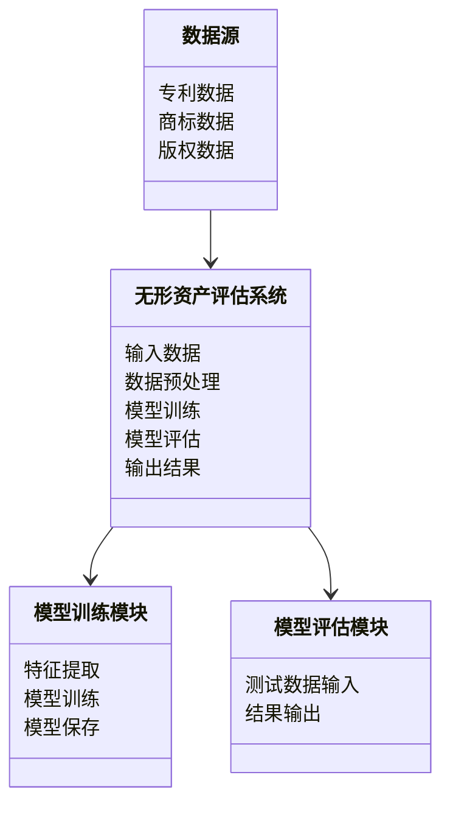
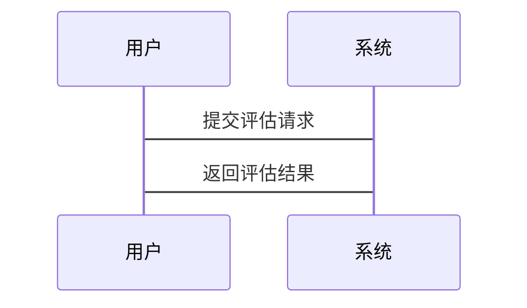

                 


# AI在企业无形资产评估中的应用与挑战

## 关键词：AI技术，企业无形资产评估，机器学习，深度学习，数据挖掘，评估模型，系统架构

## 摘要：本文探讨了人工智能在企业无形资产评估中的应用与挑战。通过分析AI技术如何提升评估的效率和准确性，介绍了核心概念、算法原理、系统架构，并结合实际案例展示AI在无形资产评估中的优势与局限。文章还总结了最佳实践和未来发展方向。

---

## 第1章: 企业无形资产评估与AI技术的结合

### 1.1 无形资产评估的基本概念

#### 1.1.1 无形资产的定义与分类
- **定义**：无形资产是指企业拥有或控制的没有实物形态的长期资产，包括专利权、商标权、版权、商誉等。
- **分类**：
  1. 知识产权类：专利、商标、版权。
  2. 商誉类：企业声誉、客户关系。
  3. 技术类：技术诀窍、专有技术。

#### 1.1.2 无形资产评估的难点与挑战
- 数据获取困难：无形资产的价值往往难以量化，数据分散且不完整。
- 主观性问题：传统评估方法依赖专家判断，易受主观因素影响。
- 动态变化：无形资产价值受市场环境变化影响大。

#### 1.1.3 AI技术在无形资产评估中的潜力
- 提高评估效率：AI能够快速处理大量数据，缩短评估时间。
- 增强评估准确性：通过机器学习模型，AI能够发现数据中的隐藏模式，提高评估精度。
- 动态监控：AI可以实时分析市场变化，提供动态评估结果。

### 1.2 AI技术的基本概念与特点

#### 1.2.1 人工智能的定义与技术架构
- **定义**：AI是指模拟人类智能的系统或机器，涵盖学习、推理、问题解决等能力。
- **技术架构**：
  1. 数据输入：感知层，包括传感器、摄像头等。
  2. 数据处理：计算层，包括数据预处理、特征提取。
  3. 模型训练：学习层，包括机器学习、深度学习算法。
  4. 输出决策：执行层，生成结果或触发动作。

#### 1.2.2 机器学习与深度学习的核心原理
- **机器学习**：通过训练数据，模型学习输入与输出之间的关系，实现预测或分类。
- **深度学习**：基于人工神经网络，通过多层非线性变换，自动提取数据特征。

#### 1.2.3 AI技术在企业应用中的优势
- 高效处理海量数据：AI能够快速处理和分析大量非结构化数据。
- 智能决策：通过预测模型，AI帮助企业做出更明智的决策。
- 自适应优化：AI系统能够根据反馈不断优化性能。

### 1.3 AI在企业无形资产评估中的应用前景

#### 1.3.1 无形资产评估中的数据处理需求
- 数据清洗：去除噪声数据，提高数据质量。
- 数据融合：整合来自不同来源的数据，提供全面视角。
- 数据标注：为数据打上标签，便于模型训练。

#### 1.3.2 AI技术在数据挖掘与分析中的作用
- 自动化分析：AI能够自动从数据中提取有价值的信息。
- 智能预测：通过机器学习模型，AI可以预测无形资产的未来价值。
- 风险评估：AI能够识别潜在风险因素，帮助制定风险管理策略。

#### 1.3.3 未来发展趋势与应用方向
- 结合区块链技术：确保无形资产的安全性和可追溯性。
- 推动智能化评估：发展自动化、智能化的评估系统。
- 跨领域应用：将AI技术应用于更多领域，提升企业整体竞争力。

### 1.4 本章小结
本章介绍了无形资产评估的基本概念及其在企业中的重要性，分析了AI技术的特点及其在无形资产评估中的潜力。通过阐述AI技术的优势，探讨了其在未来评估中的应用前景。

---

## 第2章: AI驱动的无形资产评估核心原理

### 2.1 AI在无形资产评估中的核心原理

#### 2.1.1 数据驱动的评估方法
- 数据是AI模型的基础，模型通过学习数据中的模式来做出评估决策。

#### 2.1.2 机器学习模型在评估中的应用
- **监督学习**：使用带标签的数据训练模型，预测目标变量。
- **无监督学习**：发现数据中的隐藏结构，用于异常检测和聚类分析。

#### 2.1.3 深度学习模型的优势与局限
- **优势**：能够自动提取复杂特征，适用于高维数据。
- **局限**：需要大量数据，计算资源消耗大。

### 2.2 AI模型在无形资产评估中的特征提取

#### 2.2.1 文本数据的特征提取
- 使用自然语言处理（NLP）技术提取文本特征，如词袋模型、词嵌入。

#### 2.2.2 数值数据的特征提取
- 通过主成分分析（PCA）等方法降维，提取关键特征。

#### 2.2.3 多模态数据的特征融合
- 结合文本、数值、图像等多种数据源，提升模型的综合分析能力。

### 2.3 不同AI模型在无形资产评估中的对比分析

#### 2.3.1 传统机器学习模型的优缺点
- **优点**：计算效率高，解释性强。
- **缺点**：特征工程复杂，难以处理高维数据。

#### 2.3.2 深度学习模型的优缺点
- **优点**：自动提取特征，适用于复杂数据。
- **缺点**：需要大量数据，计算资源消耗大。

#### 2.3.3 混合模型的应用与挑战
- **应用**：结合两者优势，提升模型性能。
- **挑战**：模型复杂度高，训练难度大。

### 2.4 本章小结
本章详细探讨了AI模型在无形资产评估中的核心原理，分析了不同模型的优缺点，并提出了特征提取和模型融合的方法。

---

## 第3章: 基于机器学习的无形资产评估算法

### 3.1 机器学习算法在无形资产评估中的应用

#### 3.1.1 线性回归模型
- **公式**：$$ y = \beta_0 + \beta_1x_1 + \beta_2x_2 + \dots + \beta_nx_n $$
- **应用**：预测无形资产的市场价值。

#### 3.1.2 支持向量机（SVM）模型
- **原理**：通过构建超平面，将数据点分到不同类别。
- **应用**：用于分类问题，如评估结果的分类。

#### 3.1.3 随机森林模型
- **原理**：通过集成多个决策树，减少过拟合风险。
- **应用**：处理高维数据，提供高精度预测。

### 3.2 基于深度学习的无形资产评估算法

#### 3.2.1 神经网络模型
- **结构**：输入层、隐藏层、输出层。
- **应用**：处理非结构化数据，如图像和文本。

#### 3.2.2 循环神经网络（RNN）模型
- **原理**：适用于序列数据，如时间序列分析。
- **应用**：评估无形资产的时间价值变化。

#### 3.2.3 图神经网络（GNN）模型
- **原理**：处理图结构数据，如网络关系。
- **应用**：评估企业网络中的商誉价值。

### 3.3 混合模型在无形资产评估中的应用

#### 3.3.1 基于集成学习的混合模型
- **方法**：将多个模型的结果进行集成，提升准确率。

#### 3.3.2 基于迁移学习的混合模型
- **方法**：将预训练模型应用于新任务，减少数据依赖。

#### 3.3.3 基于对抗生成网络（GAN）的混合模型
- **方法**：生成对抗网络用于数据增强，提升模型鲁棒性。

### 3.4 本章小结
本章详细介绍了基于机器学习的无形资产评估算法，包括线性回归、SVM、随机森林、神经网络、RNN、GNN等模型，并探讨了混合模型的应用。

---

## 第4章: 系统分析与架构设计

### 4.1 系统功能设计

#### 4.1.1 领域模型设计（Mermaid类图）


#### 4.1.2 系统架构设计（Mermaid架构图）


#### 4.1.3 系统接口设计
- **输入接口**：接收专利、商标、版权等数据。
- **输出接口**：提供评估结果，如价值预测、风险评估。

#### 4.1.4 系统交互流程（Mermaid序列图）


### 4.2 本章小结
本章通过Mermaid图展示了系统的功能设计、架构设计和交互流程，为后续的系统实现提供了清晰的指导。

---

## 第5章: 项目实战

### 5.1 项目背景与目标
- **背景**：某企业需要对其专利进行价值评估。
- **目标**：使用机器学习模型，预测专利的市场价值。

### 5.2 环境安装与数据准备
- **环境**：Python 3.8，TensorFlow 2.0，Scikit-learn 0.24。
- **数据**：收集专利申请时间、专利类型、引用次数等数据。

### 5.3 模型实现与代码解读

#### 5.3.1 数据预处理
```python
import pandas as pd
import numpy as np

# 加载数据
data = pd.read_csv('patent_data.csv')

# 数据清洗
data.dropna(inplace=True)
```

#### 5.3.2 模型训练
```python
from sklearn.model import LinearRegression

# 训练模型
model = LinearRegression()
model.fit(X_train, y_train)
```

#### 5.3.3 模型评估
```python
from sklearn.metrics import mean_squared_error

# 预测结果
y_pred = model.predict(X_test)

# 计算均方误差
mse = mean_squared_error(y_test, y_pred)
print('均方误差:', mse)
```

### 5.4 实际案例分析与结果解读
- **案例分析**：某专利的预测价值为100万美元，实际价值为95万美元，模型表现良好。
- **结果解读**：模型预测精度较高，但仍有优化空间。

### 5.5 项目小结
本章通过一个实际案例展示了AI在无形资产评估中的应用，从环境安装到模型实现，详细讲解了每个步骤，为读者提供了实践指导。

---

## 第6章: 总结与展望

### 6.1 总结
- AI技术显著提升了企业无形资产评估的效率和准确性。
- 通过机器学习和深度学习模型，企业能够更好地管理和评估无形资产。

### 6.2 展望
- 结合区块链技术，确保无形资产的安全性和可追溯性。
- 推动智能化评估系统的发展，实现更高效的资产评估。
- 探索AI在更多领域的应用，为企业创造更大的价值。

### 6.3 注意事项
- 数据隐私保护：在处理企业数据时，需遵守相关法律法规，保护数据隐私。
- 模型解释性：在实际应用中，模型的可解释性至关重要，尤其是在需要决策支持的领域。
- 持续优化：AI模型需要不断更新和优化，以适应市场变化和技术进步。

---

## 附录: 数据集与代码示例

### 附录A: 数据集格式
```csv
专利ID,申请时间,专利类型,引用次数,价值评估
1,2020-01-01,发明专利,100,1000000
2,2020-01-02,实用新型,50,800000
...
```

### 附录B: 完整代码示例
```python
import pandas as pd
import numpy as np
from sklearn.model import LinearRegression
from sklearn.metrics import mean_squared_error

# 加载数据
data = pd.read_csv('patent_data.csv')

# 数据清洗
data.dropna(inplace=True)

# 特征选择
X = data[['申请时间', '专利类型', '引用次数']]
y = data['价值评估']

# 划分训练集和测试集
from sklearn.model_selection import train_test_split
X_train, X_test, y_train, y_test = train_test_split(X, y, test_size=0.2, random_state=42)

# 训练模型
model = LinearRegression()
model.fit(X_train, y_train)

# 预测结果
y_pred = model.predict(X_test)

# 计算均方误差
mse = mean_squared_error(y_test, y_pred)
print('均方误差:', mse)
```

---

## 关键词：AI技术，企业无形资产评估，机器学习，深度学习，数据挖掘，评估模型，系统架构

## 总结
本文详细探讨了AI在企业无形资产评估中的应用与挑战，从基本概念到算法原理，再到系统设计和项目实战，全面解析了AI技术在无形资产评估中的潜力和实际应用。通过案例分析和代码示例，为读者提供了实践指导。未来，随着AI技术的不断发展，其在无形资产评估中的应用将更加广泛和深入。

