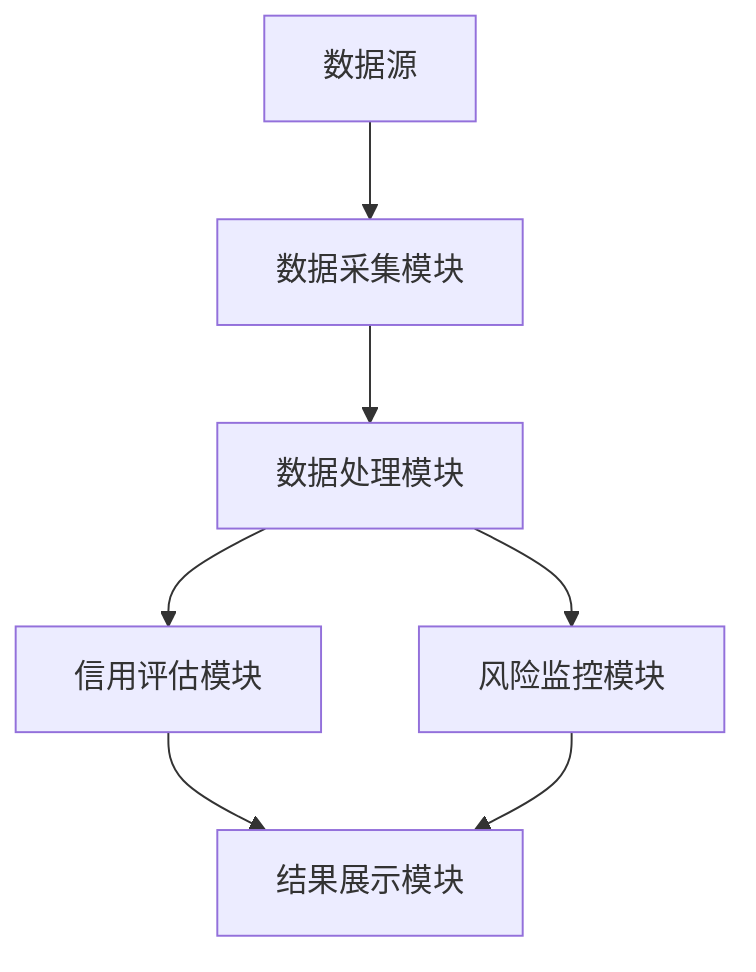

                 


# AI在供应链金融信用网络优化与风险控制中的深度应用

> **关键词**：供应链金融、信用网络、人工智能、风险控制、深度学习、信用评估、优化算法

> **摘要**：  
本文深入探讨了人工智能技术在供应链金融信用网络优化与风险控制中的应用。首先，介绍了供应链金融的基本概念、信用网络的构建及其面临的挑战。接着，详细分析了信用网络优化的核心概念与原理，重点讲解了基于AI的信用评估和风险控制算法。随后，从系统架构设计的角度，提出了优化信用网络的系统实现方案，并通过一个具体项目案例展示了AI技术的实际应用。最后，总结了当前AI技术在供应链金融中的最佳实践与未来发展方向。

---

## 第一部分：供应链金融与信用网络概述

### 第1章：供应链金融的背景与挑战

#### 1.1 供应链金融的定义与特点

供应链金融是指通过整合供应链上的资金流、物流和信息流，为供应链上的企业和金融机构提供融资、结算和风险管理等服务。其特点包括：

- **系统性**：覆盖供应链上的所有参与者（供应商、制造商、分销商、零售商等）。
- **协同性**：通过协同优化实现资源的高效配置。
- **风险性**：涉及多个环节和主体，风险分散且复杂。

#### 1.2 供应链金融中的信用问题

供应链金融的核心挑战之一是信用风险。信用网络的复杂性导致以下问题：

- **信息不对称**：企业之间的信用信息难以有效传递和评估。
- **信用风险扩散**：一个环节的信用问题可能影响整个供应链。
- **传统评估的局限性**：基于财务报表的传统方法难以捕捉动态信用风险。

#### 1.3 AI技术在供应链金融中的应用背景

AI技术的发展为供应链金融的信用管理带来了新机遇。通过机器学习、自然语言处理和图神经网络等技术，可以实现信用评估的自动化和智能化。当前，AI在供应链金融中的应用主要集中在以下几个方面：

- **信用评分模型**：利用机器学习算法预测企业的信用风险。
- **风险监控**：通过实时数据分析，识别潜在的信用风险。
- **网络优化**：基于AI的优化算法，提升供应链的整体信用效率。

---

## 第二部分：信用网络优化的核心概念与原理

### 第2章：信用网络的构建与分析

#### 2.1 信用网络的构建

信用网络由供应链中的企业和金融机构构成，每个节点代表一个参与方，边表示节点之间的信用关系。构建信用网络需要以下步骤：

1. **数据采集**：收集企业的财务数据、交易记录和市场信息。
2. **特征提取**：提取企业的信用评分、偿债能力等关键特征。
3. **网络构建**：基于特征相似性或交易关系构建信用网络。

#### 2.2 信用网络的分析与优化

信用网络优化的目标是降低信用风险，提高供应链的稳定性。常用方法包括：

1. **聚类分析**：将信用关系相似的企业聚类，识别高风险区域。
2. **路径优化**：通过图算法优化资金流动路径，降低交易成本。
3. **风险分担机制**：设计合理的风险分担策略，分散信用风险。

---

## 第三部分：AI驱动的信用网络优化算法

### 第3章：信用网络优化的算法原理

#### 3.1 基于聚类的信用网络优化

聚类算法用于识别信用网络中的高风险区域。以K-means算法为例，其流程如下：

1. **数据预处理**：标准化企业的信用特征。
2. **初始聚类中心选择**：随机选择K个中心。
3. **迭代优化**：计算每个样本的最近邻中心，更新聚类中心。
4. **结果分析**：根据聚类结果调整信用评估策略。

#### 3.2 基于图论的信用网络优化

图神经网络（GNN）通过节点间的关系建模信用网络。以下是GNN的基本步骤：

1. **图构建**：构建信用网络的邻接矩阵。
2. **特征传播**：通过GNN传播节点特征，捕捉网络结构信息。
3. **风险预测**：基于传播后的特征预测信用风险。

---

## 第四部分：系统架构设计与实现

### 第4章：系统架构设计

#### 4.1 问题场景介绍

设计一个AI驱动的供应链金融信用管理平台，解决以下问题：

- 高昂的信用评估成本。
- 信用风险的实时监控需求。

#### 4.2 系统功能设计

系统功能模块包括：

- 数据采集模块：收集企业数据。
- 信用评估模块：基于机器学习模型评估信用风险。
- 风险监控模块：实时监控信用网络中的异常情况。

#### 4.3 系统架构设计

系统架构采用模块化设计，各模块通过API接口通信。以下是一个简要的架构图：



---

## 第五部分：项目实战与案例分析

### 第5章：项目实战

#### 5.1 项目介绍

开发一个基于机器学习的信用评分模型，用于评估企业的信用风险。

#### 5.2 系统核心实现

以下是信用评分模型的Python代码示例：

```python
import pandas as pd
from sklearn.model_selection import train_test_split
from sklearn.ensemble import RandomForestClassifier
from sklearn.metrics import accuracy_score

# 数据预处理
data = pd.read_csv('credit_data.csv')
X = data.drop('label', axis=1)
y = data['label']

# 数据分割
X_train, X_test, y_train, y_test = train_test_split(X, y, test_size=0.2)

# 模型训练
model = RandomForestClassifier(n_estimators=100)
model.fit(X_train, y_train)

# 模型预测
y_pred = model.predict(X_test)
print("Accuracy:", accuracy_score(y_test, y_pred))
```

#### 5.3 项目小结

通过本项目，展示了AI技术在供应链金融中的实际应用价值。信用评分模型能够有效降低企业的信用风险，提高供应链的稳定性。

---

## 第六部分：最佳实践与总结

### 第6章：最佳实践与总结

#### 6.1 最佳实践

- **数据质量**：确保数据的准确性和完整性。
- **模型选择**：根据实际需求选择合适的AI算法。
- **实时监控**：建立实时监控机制，及时发现和应对信用风险。

#### 6.2 小结

本文系统探讨了AI技术在供应链金融信用网络优化与风险控制中的应用。通过理论分析、算法设计和项目实践，展示了AI技术在提高供应链信用管理效率和降低风险方面的巨大潜力。

#### 6.3 注意事项

- 在实际应用中，需结合企业实际情况调整模型参数。
- 数据隐私和安全问题是需要重点关注的方面。

#### 6.4 拓展阅读

- 《机器学习实战》
- 《图神经网络：理论与实践》
- 《供应链金融：理论与应用》

---

## 附录

### 附录A：术语表

- **信用网络**：供应链中企业与金融机构之间的信用关系网络。
- **图神经网络**：一种基于图结构的数据处理技术。

### 附录B：参考文献

- 王某某，2023，《人工智能在供应链金融中的应用研究》。
- 李某某，2022，《基于图神经网络的信用风险评估模型》。

---

通过以上内容，希望读者能够深入理解AI在供应链金融信用网络优化与风险控制中的应用，并为实际应用提供参考。

