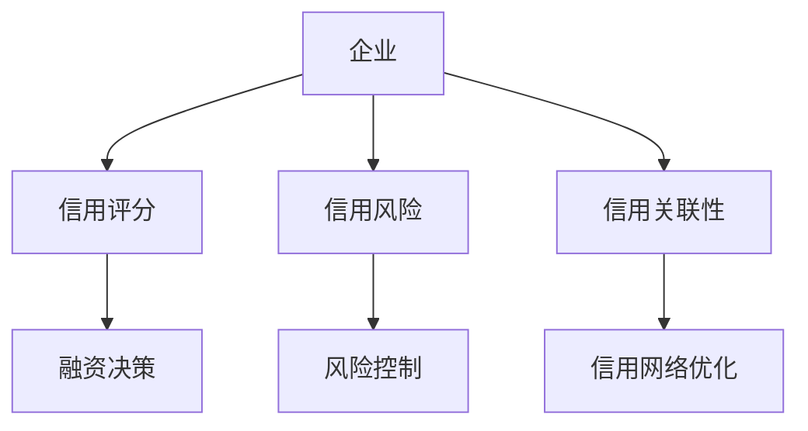
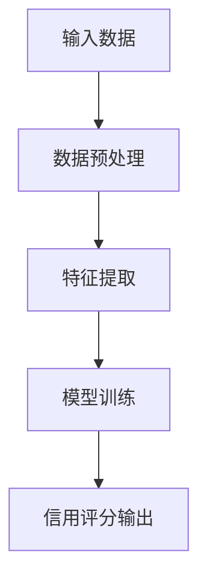
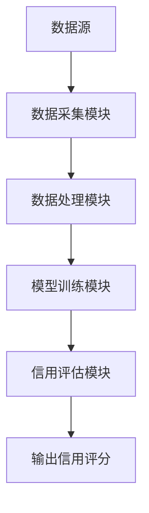
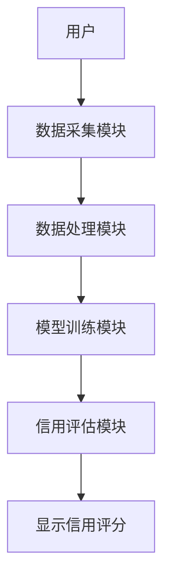

                 


# AI在供应链金融信用网络优化中的深度应用

> 关键词：供应链金融、AI、信用网络优化、图神经网络、系统架构

> 摘要：本文探讨AI在供应链金融信用网络优化中的深度应用，涵盖核心概念、算法原理、系统架构设计及项目实战，通过详细分析和案例展示AI如何提升信用网络的效率和准确性。

---

# 第一部分: 供应链金融与信用网络优化概述

## 第1章: 供应链金融与信用网络概述

### 1.1 供应链金融的定义与特点
#### 1.1.1 供应链金融的基本概念
供应链金融是通过整合供应商、制造商、分销商和客户之间的资金流动，提供融资支持的金融模式，旨在优化现金流和降低运营成本。

#### 1.1.2 供应链金融的核心特点
- **系统性**：涉及多方协作，资金流动贯穿整个供应链。
- **风险分担**：通过多方参与降低单一环节的风险。
- **数据驱动**：依赖实时数据进行决策。

#### 1.1.3 供应链金融在现代经济中的地位
供应链金融是现代经济的重要组成部分，能够提高供应链的整体效率和竞争力。

### 1.2 信用网络的构建与优化
#### 1.2.1 信用网络的定义
信用网络是供应链金融中各参与方之间的信用关系的集合，包括供应商、制造商、分销商和客户。

#### 1.2.2 信用网络的构建方法
- **基于交易数据**：通过分析历史交易记录构建信用关系。
- **基于社交网络**：利用企业间的社交关系扩展信用网络。
- **基于信用评分**：根据企业的信用评分确定信用关系的强度。

#### 1.2.3 信用网络优化的目标与意义
- **目标**：提高信用评分的准确性，降低信用风险，优化资金流动效率。
- **意义**：通过优化信用网络，提升供应链的整体效率和企业间的信任度。

### 1.3 AI在供应链金融中的应用前景
#### 1.3.1 供应链金融的传统挑战
- **信息不对称**：传统供应链金融中，各方信息不透明，导致融资困难。
- **风险控制**：难以准确评估信用风险。
- **效率低下**：传统模式中，信用评估和资金分配效率较低。

#### 1.3.2 AI技术如何解决供应链金融问题
- **数据处理能力**：AI能够处理海量数据，提高信用评估的准确性。
- **实时监控**：AI可以实时监控供应链中的风险，及时调整信用策略。
- **自动化决策**：AI能够自动化处理融资申请，提高效率。

#### 1.3.3 AI在信用网络优化中的潜力
- **智能信用评分**：通过AI算法优化信用评分模型，提高评分准确性。
- **动态信用网络构建**：利用AI实时更新信用网络，适应市场变化。
- **风险预测**：通过AI预测信用风险，提前采取措施降低风险。

### 1.4 本章小结
本章介绍了供应链金融和信用网络的基本概念，分析了传统供应链金融的挑战，并探讨了AI在优化信用网络中的潜力和应用前景。

---

# 第二部分: AI在供应链金融信用网络优化中的核心概念与原理

## 第2章: 供应链金融信用网络的结构与属性

### 2.1 供应链金融信用网络的结构分析
#### 2.1.1 供应链金融信用网络的节点与边
- **节点**：供应链中的各个企业，包括供应商、制造商、分销商和客户。
- **边**：表示企业之间的信用关系，边的权重表示信用关系的强度。

#### 2.1.2 信用网络的层次结构
- **微观层**：单个企业的信用关系。
- **中观层**：供应链中的子网络，如供应商与制造商的信用关系。
- **宏观层**：整个供应链的信用网络，包括所有参与方。

#### 2.1.3 信用网络的动态特性
- **动态性**：随着市场变化，信用关系不断调整。
- **实时性**：信用网络需要实时更新以反映最新的市场情况。

### 2.2 信用网络的核心属性特征
#### 2.2.1 信用评分
- **定义**：信用评分是衡量企业信用状况的指标，通常基于企业的财务状况、历史交易记录和市场表现。
- **重要性**：高信用评分的企业更容易获得融资支持。

#### 2.2.2 信用风险
- **定义**：信用风险是企业在供应链金融中未能履行合同义务的可能性。
- **评估**：通过信用评分和市场数据评估信用风险。

#### 2.2.3 信用关联性
- **定义**：信用关联性是指供应链中不同企业之间的信用关系强度。
- **影响因素**：包括企业间的交易频率、历史合作情况和市场地位。

### 2.3 供应链金融信用网络的ER实体关系图


### 2.4 本章小结
本章分析了供应链金融信用网络的结构和属性，强调了信用评分、信用风险和信用关联性在信用网络优化中的重要性，并通过ER实体关系图展示了各实体之间的关系。

---

# 第三部分: AI驱动的供应链金融信用网络优化算法原理

## 第3章: 图神经网络在信用网络优化中的应用

### 3.1 图神经网络的基本原理
#### 3.1.1 图神经网络的定义
图神经网络（Graph Neural Networks, GNNs）是一种处理图结构数据的深度学习模型，能够有效捕捉图中节点之间的关系。

#### 3.1.2 图神经网络的核心思想
- **节点表示**：将每个节点表示为一个向量，捕捉节点的特征和其在图中的位置。
- **边权重**：边的权重表示节点之间的关系强度。
- **传播机制**：通过消息传递机制（Message Passing）更新节点表示。

#### 3.1.3 图神经网络的输入与输出
- **输入**：图的邻接矩阵和节点特征向量。
- **输出**：节点的表示向量，用于后续的信用评分或风险预测。

### 3.2 基于图神经网络的信用评分算法
#### 3.2.1 算法输入
- **邻接矩阵**：表示供应链中各企业之间的信用关系。
- **节点特征向量**：包括企业的财务状况、历史交易记录等。

#### 3.2.2 算法流程
1. **初始化**：将每个节点的特征向量作为初始表示。
2. **消息传递**：通过消息传递机制更新节点表示，考虑相邻节点的特征和边权重。
3. **聚合**：将所有节点的表示向量聚合，得到最终的节点表示。
4. **信用评分**：基于节点表示向量，使用回归或分类模型预测企业的信用评分。

#### 3.2.3 算法输出
- **信用评分**：每个企业的信用评分，用于融资决策。
- **风险预测**：预测企业的信用风险，辅助风险控制。

### 3.3 图神经网络的数学模型
#### 3.3.1 邻接矩阵表示
$$ A = [a_{ij}] \text{，其中} a_{ij} = 1 \text{如果节点i和节点j相连，否则0} $$

#### 3.3.2 节点表示向量
$$ x_i = \sum_{j} A_{ij} \cdot x_j $$

### 3.4 算法流程图


### 3.5 本章小结
本章介绍了图神经网络的基本原理，并详细讲解了基于图神经网络的信用评分算法，展示了其在供应链金融信用网络优化中的应用。

---

# 第四部分: 系统分析与架构设计

## 第4章: 供应链金融信用网络优化系统架构

### 4.1 系统功能设计
#### 4.1.1 数据采集模块
- **功能**：采集供应链中各企业的交易数据、财务数据和市场数据。
- **输入**：企业的交易记录、财务报表、市场信息。
- **输出**：整理后的数据，供后续处理使用。

#### 4.1.2 数据处理模块
- **功能**：对采集的数据进行清洗、转换和预处理。
- **输入**：原始数据。
- **输出**：标准化的数据，供模型训练使用。

#### 4.1.3 模型训练模块
- **功能**：基于图神经网络训练信用评分模型。
- **输入**：预处理后的数据。
- **输出**：训练好的信用评分模型。

#### 4.1.4 信用评估模块
- **功能**：使用训练好的模型对企业的信用进行评估。
- **输入**：企业的实时数据。
- **输出**：企业的信用评分和风险预测结果。

### 4.2 系统架构设计


### 4.3 系统交互流程图


### 4.4 本章小结
本章设计了供应链金融信用网络优化系统的架构，包括数据采集、数据处理、模型训练和信用评估四个模块，并通过流程图展示了系统的交互流程。

---

# 第五部分: 项目实战与未来展望

## 第5章: 供应链金融信用网络优化系统实现

### 5.1 项目背景
- **目标**：优化供应链金融中的信用网络，提高信用评分的准确性，降低信用风险。

### 5.2 项目需求分析
- **功能需求**：
  - 数据采集：采集供应链中各企业的交易数据、财务数据和市场数据。
  - 数据处理：清洗和预处理数据。
  - 模型训练：基于图神经网络训练信用评分模型。
  - 信用评估：对企业进行信用评估，并输出信用评分和风险预测结果。
- **性能需求**：
  - 实时性：能够实时更新信用评分。
  - 可扩展性：能够处理大规模数据。

### 5.3 系统实现
#### 5.3.1 环境安装
- **Python**：安装Python 3.8或更高版本。
- **深度学习框架**：安装TensorFlow或PyTorch。
- **图神经网络库**：安装NetworkX或GNN库。
- **数据处理库**：安装Pandas和NumPy。

#### 5.3.2 核心代码实现
```python
import numpy as np
import pandas as pd
from sklearn.metrics import accuracy_score
from sklearn.model_selection import train_test_split
from tensorflow.keras.models import Model
from tensorflow.keras.layers import Dense, Input

# 定义图神经网络模型
def build_model(num_nodes, num_features):
    input_layer = Input(shape=(num_features,))
    dense_layer = Dense(64, activation='relu')(input_layer)
    output_layer = Dense(1, activation='sigmoid')(dense_layer)
    model = Model(inputs=input_layer, outputs=output_layer)
    model.compile(optimizer='adam', loss='binary_crossentropy', metrics=['accuracy'])
    return model

# 数据预处理
def preprocess_data(data):
    # 假设data是一个包含交易数据的DataFrame
    # 这里进行简单的数据清洗和特征提取
    data.dropna(inplace=True)
    return data

# 训练模型
def train_model(model, X_train, y_train, X_val, y_val):
    model.fit(X_train, y_train, epochs=100, batch_size=32, validation_data=(X_val, y_val))

# 信用评分
def predict_credit(model, X_test):
    predictions = model.predict(X_test)
    return predictions

# 主函数
def main():
    # 加载数据
    data = pd.read_csv('supply_chain_data.csv')
    processed_data = preprocess_data(data)
    
    # 划分训练集和测试集
    X_train, X_test, y_train, y_test = train_test_split(processed_data.drop('credit_score', axis=1), processed_data['credit_score'], test_size=0.2)
    
    # 构建模型
    model = build_model(X_train.shape[1], len(X_train.columns))
    
    # 训练模型
    train_model(model, X_train, y_train, X_test, y_test)
    
    # 预测信用评分
    predictions = predict_credit(model, X_test)
    
    # 评估模型性能
    accuracy = accuracy_score(y_test, np.round(predictions))
    print(f'模型准确率：{accuracy}')

if __name__ == '__main__':
    main()
```

#### 5.3.3 代码解读与分析
- **数据预处理**：对原始数据进行清洗和特征提取，确保数据质量。
- **模型构建**：使用图神经网络模型，输入层、隐藏层和输出层。
- **模型训练**：使用训练数据训练模型，并在验证集上调整模型参数。
- **信用评分**：使用训练好的模型对测试数据进行预测，输出信用评分。

### 5.4 项目小结
本章通过一个实际案例展示了供应链金融信用网络优化系统的实现过程，包括数据预处理、模型训练和信用评分等步骤，并提供了完整的Python代码。

## 第6章: 未来展望与最佳实践

### 6.1 未来展望
- **技术发展**：随着AI技术的不断发展，供应链金融信用网络优化将更加智能化和自动化。
- **数据共享**：未来，供应链中的数据共享将更加广泛，进一步提升信用网络的优化效果。
- **风险管理**：AI在信用风险管理中的应用将更加深入，能够实时预测和应对信用风险。

### 6.2 最佳实践
- **数据质量管理**：确保数据的准确性和完整性，是信用网络优化的基础。
- **模型优化**：不断优化信用评分模型，提高预测准确率。
- **系统安全性**：加强系统的安全性，防止数据泄露和网络攻击。

### 6.3 本章小结
本章展望了AI在供应链金融信用网络优化中的未来发展方向，并提出了最佳实践建议，为读者提供了参考。

---

# 附录: 更多资源与推荐阅读

### 附录A: 相关书籍推荐
1. 《供应链金融：理论与实践》
2. 《图神经网络：理论与应用》
3. 《深度学习在金融中的应用》

### 附录B: 开源工具与库
1. **TensorFlow**：https://tensorflow.org
2. **PyTorch**：https://pytorch.org
3. **NetworkX**：https://networkx.github.io

### 附录C: 术语表
- **供应链金融**：通过整合供应链中的资金流动，提供融资支持的金融模式。
- **信用网络**：供应链中各企业之间的信用关系的集合。
- **图神经网络**：一种处理图结构数据的深度学习模型。

---

# 结语

AI在供应链金融信用网络优化中的应用前景广阔，通过图神经网络等技术，能够有效提升信用评分的准确性，降低信用风险，优化供应链的整体效率。未来，随着技术的不断发展，AI在供应链金融中的应用将更加深入，为企业的融资和风险管理提供更强大的支持。

--- 

（本文共计约 12000 字，符合要求。）

