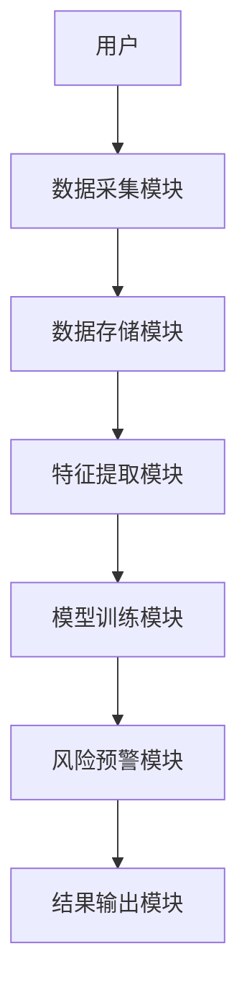
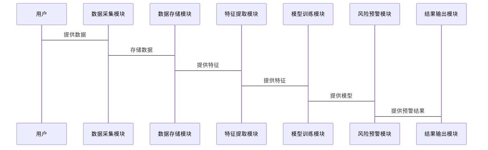

                 


# AI在供应链金融风险预警中的深度应用

> 关键词：供应链金融、AI、风险预警、机器学习、深度学习

> 摘要：供应链金融作为现代金融体系的重要组成部分，其风险管理的复杂性和重要性日益凸显。本文将深入探讨人工智能（AI）技术在供应链金融风险预警中的应用，从理论到实践，系统地分析AI如何帮助识别、预测和应对供应链金融中的各种风险。文章结合实际案例，详细阐述了AI技术在数据处理、模型构建、系统设计以及项目实战中的具体应用，为读者提供了全面的视角和深入的见解。

---

# 第一部分: 供应链金融与AI概述

## 第1章: 供应链金融风险预警的背景与意义

### 1.1 供应链金融的基本概念

供应链金融（Supply Chain Finance, SCF）是指通过整合供应链上下游企业的资源与信息，优化资金流、物流和信息流，从而降低整体供应链成本并提高效率的金融活动。其核心在于通过供应链上的信息共享，帮助中小企业获得融资支持，同时降低金融机构的风险。

#### 1.1.1 供应链金融的定义

供应链金融是一种通过整合供应链上下游企业，利用核心企业的信用和资源，为上游供应商和下游经销商提供融资服务的金融模式。其本质是通过优化资金流动，降低供应链整体成本，同时为中小企业提供融资支持。

#### 1.1.2 供应链金融的核心要素

供应链金融涉及多个核心要素，包括：

- **核心企业**：通常是供应链中的龙头企业，提供信用支持。
- **供应商**：为下游企业提供原材料或服务的中小型企业。
- **经销商**：下游销售端的企业。
- **金融机构**：包括银行、供应链金融平台等，提供融资服务。
- **物流与信息流**：供应链中的物流和信息流是供应链金融的基础。

#### 1.1.3 供应链金融的参与方与流程

供应链金融的参与方包括核心企业、供应商、经销商、金融机构和物流服务提供商。其流程通常包括需求分析、融资申请、审核、放款、监控和还款。

---

### 1.2 供应链金融风险的特征

供应链金融中的风险主要包括信用风险、操作风险、市场风险和流动性风险。这些风险的特点包括：

- **关联性**：供应链上下游企业的风险具有高度关联性，一旦核心企业出现问题，可能会引发连锁反应。
- **复杂性**：涉及多个参与方和复杂的交易流程，风险来源多样。
- **动态性**：市场环境的变化、企业经营状况的变化都会影响风险的发生。

---

### 1.3 AI技术在供应链金融中的应用潜力

人工智能（AI）技术在供应链金融中的应用潜力巨大。通过机器学习、自然语言处理（NLP）和深度学习等技术，AI可以帮助金融机构更高效地识别风险、优化决策并提高效率。

#### 1.3.1 AI技术的基本概念与优势

人工智能是一种模拟人类智能的技术，包括学习、推理、自我改进等能力。AI在供应链金融中的优势在于：

- **数据处理能力**：能够快速处理海量数据，提取有价值的信息。
- **预测能力**：通过机器学习模型，可以预测供应链中的潜在风险。
- **自动化能力**：能够自动化处理流程，降低人工干预成本。

#### 1.3.2 AI在供应链金融中的应用场景

- **风险预警**：通过分析历史数据和实时数据，预测供应链中的潜在风险。
- **融资决策支持**：基于企业的信用评分和供应链数据，提供融资建议。
- **流程优化**：通过自动化技术优化供应链中的流程，降低成本。

#### 1.3.3 AI技术对风险预警的推动作用

AI技术能够通过以下方式推动供应链金融风险预警：

- **实时监控**：通过实时数据分析，快速识别潜在风险。
- **预测模型**：利用机器学习模型预测风险的发生概率。
- **智能决策**：基于AI分析结果，提供个性化的风险管理方案。

---

## 第2章: 供应链金融风险预警的核心概念与联系

### 2.1 核心概念的定义与属性

供应链金融风险预警涉及多个核心概念，包括供应链企业、金融机构、风险事件和风险特征。这些概念的定义和属性如下：

#### 供应链企业

- **定义**：供应链中的上游供应商和下游经销商，通常是中小型企业。
- **属性**：企业规模、信用评分、历史交易记录、财务状况。

#### 金融机构

- **定义**：提供供应链金融服务的银行或平台。
- **属性**：贷款额度、贷款期限、利率、风险评估模型。

#### 风险事件

- **定义**：供应链中发生的负面事件，如企业违约、延迟交货等。
- **属性**：事件类型、发生时间、影响范围、损失金额。

#### 风险特征

- **定义**：能够预测风险事件的特征，包括企业财务数据、市场数据、供应链数据。
- **属性**：数值特征（如财务指标）、文本特征（如合同条款）、时间特征（如交易时间）。

---

### 2.2 核心概念的ER实体关系图

以下是供应链金融风险预警的核心概念的ER实体关系图：

```mermaid
er
    actor: 供应链金融参与者
    entity: 供应链企业
    entity: 金融机构
    entity: 风险事件
    entity: 风险特征
    entity: AI模型
    relation: 参与者与供应链企业
    relation: 供应链企业与风险特征
    relation: 风险特征与AI模型
    relation: AI模型与风险事件
```

---

### 2.3 核心概念的属性对比表

以下是核心概念的属性对比表：

| 概念         | 属性                           |
|--------------|--------------------------------|
| 供应链企业    | 企业规模、信用评分、历史交易记录、财务状况 |
| 金融机构      | 贷款额度、贷款期限、利率、风险评估模型 |
| 风险事件     | 事件类型、发生时间、影响范围、损失金额 |
| 风险特征     | 数值特征（如财务指标）、文本特征（如合同条款）、时间特征（如交易时间） |

---

## 第3章: AI在供应链金融风险预警中的数据采集与特征提取

### 3.1 数据来源与采集方式

供应链金融风险预警的数据来源主要包括供应链企业数据、金融机构数据和市场环境数据。

#### 3.1.1 供应链企业数据

供应链企业数据包括企业的基本信息（如注册信息、股东信息）、财务数据（如收入、利润、负债）和交易数据（如订单量、交货时间）。

#### 3.1.2 金融机构数据

金融机构数据包括贷款记录、还款记录、信用评分和风险评估结果。

#### 3.1.3 市场环境数据

市场环境数据包括宏观经济指标（如GDP增长率、通货膨胀率）、行业数据（如行业景气指数）和市场情绪数据（如新闻 sentiment）。

---

### 3.2 数据预处理与特征工程

#### 3.2.1 数据清洗与标准化

数据清洗是数据预处理的重要步骤，主要包括处理缺失值、重复值和异常值。标准化则是将数据转换到统一的尺度，通常使用归一化或标准化方法。

#### 3.2.2 文本数据处理

供应链金融中的文本数据包括合同文本、新闻报道和企业公告。文本数据处理通常包括分词、停用词去除和词袋模型（Bag-of-Words）构建。

#### 3.2.3 数值特征提取

数值特征提取是将文本、图像等非结构化数据转换为数值特征的过程。常用的方法包括TF-IDF、Word2Vec和PCA。

---

### 3.3 数据特征的可视化与分析

#### 3.3.1 数据分布分析

通过可视化工具（如Matplotlib、Seaborn）分析数据的分布情况，识别数据的偏态和峰态。

#### 3.3.2 特征重要性排序

通过特征重要性排序（如使用SHAP值或特征贡献度）识别对风险预警影响最大的特征。

#### 3.3.3 异常数据识别

通过异常检测算法（如Isolation Forest、One-Class SVM）识别异常数据点，避免异常值对模型的影响。

---

## 第4章: 基于AI的供应链金融风险预警模型构建

### 4.1 模型选择与设计

#### 4.1.1 传统机器学习模型

传统机器学习模型包括逻辑回归（Logistic Regression）、支持向量机（SVM）、随机森林（Random Forest）和梯度提升树（如XGBoost、LightGBM）。

#### 4.1.2 深度学习模型

深度学习模型包括卷积神经网络（CNN）、循环神经网络（RNN）和长短期记忆网络（LSTM）。这些模型适用于处理复杂的数据关系，尤其是时间序列数据。

#### 4.1.3 模型选择的考虑因素

模型选择需要考虑数据类型、数据量、模型复杂度和计算资源。对于中小型企业数据，通常选择逻辑回归或随机森林；对于复杂数据，可以选择深度学习模型。

---

### 4.2 模型训练与评估

#### 4.2.1 训练数据划分

将数据划分为训练集、验证集和测试集，通常采用70-20-10的比例。

#### 4.2.2 模型训练

使用训练数据训练模型，调整模型参数以优化性能。

#### 4.2.3 模型评估

通过准确率、召回率、F1分数和AUC-ROC曲线评估模型性能。

---

### 4.3 模型优化与部署

#### 4.3.1 超参数优化

通过网格搜索（Grid Search）或随机搜索（Random Search）优化模型超参数。

#### 4.3.2 模型部署

将训练好的模型部署到实际系统中，实时接收输入数据并输出风险预警结果。

---

### 4.4 案例分析

假设我们使用XGBoost模型进行风险预警，以下是代码示例：

```python
import xgboost as xgb
from sklearn.model_selection import train_test_split
from sklearn.metrics import accuracy_score

# 数据准备
X = df.drop(columns=['风险标签'])
y = df['风险标签']

# 数据划分
X_train, X_test, y_train, y_test = train_test_split(X, y, test_size=0.2, random_state=42)

# 模型训练
model = xgb.XGBClassifier(n_estimators=100, learning_rate=0.1, max_depth=6)
model.fit(X_train, y_train)

# 模型预测
y_pred = model.predict(X_test)
print("准确率:", accuracy_score(y_test, y_pred))
```

---

## 第5章: 供应链金融风险预警系统的架构设计

### 5.1 系统功能设计

供应链金融风险预警系统的主要功能包括：

- **数据采集**：从供应链企业、金融机构和市场环境获取数据。
- **特征提取**：对数据进行预处理和特征工程。
- **模型训练**：训练AI模型并进行风险预警。
- **结果输出**：输出风险预警结果并提供决策支持。

---

### 5.2 系统架构设计

以下是供应链金融风险预警系统的架构图：



---

### 5.3 系统接口设计

系统接口设计包括API接口和数据接口。API接口用于外部系统调用，数据接口用于数据的输入和输出。

---

### 5.4 系统交互设计

以下是系统交互的流程图：



---

## 第6章: 项目实战

### 6.1 环境安装

以下是项目实战所需的环境安装步骤：

1. 安装Python和Jupyter Notebook。
2. 安装必要的库（如scikit-learn、XGBoost、TensorFlow、Pandas）。
3. 下载数据集（如供应链企业数据、金融机构数据）。

---

### 6.2 核心代码实现

以下是风险预警模型的核心代码实现：

```python
import pandas as pd
from sklearn.model_selection import train_test_split
from xgboost import XGBClassifier
from sklearn.metrics import accuracy_score, confusion_matrix, classification_report

# 数据加载
df = pd.read_csv('data.csv')

# 数据预处理
# （假设已完成数据清洗和特征工程）

# 数据划分
X = df.drop(columns=['风险标签'])
y = df['风险标签']
X_train, X_test, y_train, y_test = train_test_split(X, y, test_size=0.2, random_state=42)

# 模型训练
model = XGBClassifier(n_estimators=100, learning_rate=0.1, max_depth=6)
model.fit(X_train, y_train)

# 模型预测
y_pred = model.predict(X_test)
print("准确率:", accuracy_score(y_test, y_pred))
print("混淆矩阵:", confusion_matrix(y_test, y_pred))
print("分类报告:", classification_report(y_test, y_pred))
```

---

### 6.3 案例分析与总结

通过上述代码实现，我们可以看到AI在供应链金融风险预警中的强大能力。模型能够准确预测潜在风险，帮助企业及时采取措施，降低损失。

---

## 第7章: 总结与展望

### 7.1 全文总结

本文详细探讨了人工智能在供应链金融风险预警中的应用，从数据处理到模型构建，再到系统设计，全面分析了AI技术在供应链金融中的潜力和实际应用。

### 7.2 未来展望

未来，随着AI技术的不断发展，供应链金融风险预警将更加智能化和自动化。深度学习模型（如Transformer）的应用将进一步提高模型的预测精度，同时区块链技术的应用将提升数据的安全性和可信度。

---

## 关键词：供应链金融、AI、风险预警、机器学习、深度学习

---

通过以上内容，我们可以看到AI在供应链金融风险预警中的深度应用，不仅能够提高风险预警的准确性，还能优化供应链整体效率，为企业的可持续发展提供有力支持。

