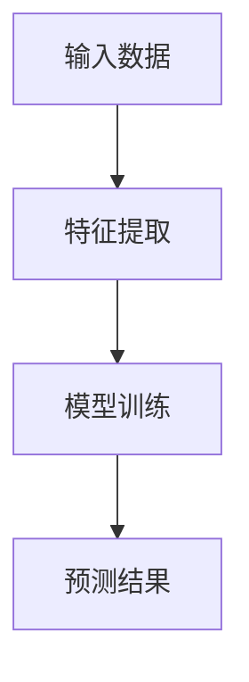
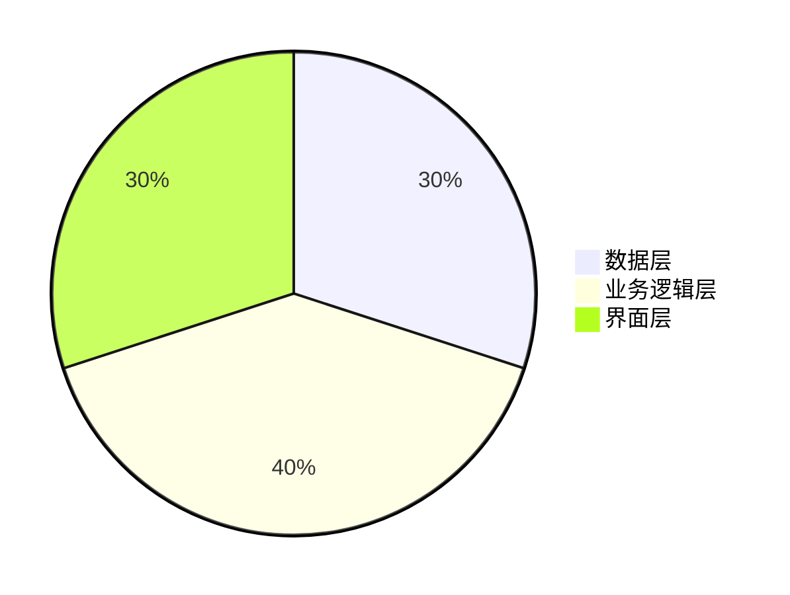

                 


# AI在保险产品创新设计中的应用

## 关键词：AI，保险产品，创新设计，机器学习，深度学习，自然语言处理

## 摘要：AI技术正在 revolutionize 保险产品的设计过程，通过机器学习、深度学习和自然语言处理等技术，保险产品创新设计变得更加高效和个性化。本文详细探讨了AI在保险产品设计中的应用，从背景介绍到系统架构设计，再到项目实战，全面解析AI如何赋能保险产品创新设计。

---

## 第1章: AI与保险行业的背景介绍

### 1.1 保险行业的现状与挑战

保险行业的核心业务流程包括产品设计、销售、承保、理赔和客户服务。然而，传统的产品设计模式存在以下痛点：

- **低效性**：依赖人工经验，设计周期长。
- **同质化严重**：市场上的保险产品同质化，难以满足多样化的需求。
- **风险控制不足**：传统方法难以全面评估复杂风险。

保险行业的数字化转型趋势促使企业寻求技术创新，以应对市场竞争和客户需求的变化。

### 1.2 AI技术的发展与应用现状

人工智能技术经历了从早期的符号逻辑推理到现在的深度学习，取得了显著进展。当前，AI技术广泛应用于图像识别、自然语言处理和机器人等领域。在保险行业，AI技术主要用于风险评估、欺诈检测和客户画像等领域。

### 1.3 AI在保险产品创新设计中的重要性

AI技术通过数据挖掘和预测分析，能够快速识别市场趋势和客户需求，从而优化保险产品的设计流程。AI的应用不仅提高了设计效率，还增强了产品的个性化和精准性，降低了设计成本和风险。

---

## 第2章: 核心概念与技术原理

### 2.1 AI技术在保险产品设计中的应用

AI技术在保险产品设计中的应用主要体现在以下几个方面：

- **机器学习**：用于风险评估和定价模型的构建。
- **深度学习**：用于复杂模型的训练，提升预测的准确性。
- **自然语言处理**：用于分析客户需求和市场反馈。

### 2.2 AI技术与保险产品设计的联系

通过对比表格和mermaid流程图，展示AI技术如何优化保险产品的设计流程。


---

## 第3章: 算法原理讲解

### 3.1 监督学习

监督学习是一种常见的机器学习方法，适用于分类和回归问题。其原理如下：



数学公式：
$$ \text{预测值} = \text{权重} \times \text{特征值} + \text{偏置} $$

### 3.2 神经网络

神经网络通过多层感知机模拟人脑的神经网络，用于处理复杂数据。

数学公式：
$$ y = \sigma(w x + b) $$

其中，σ表示激活函数，w是权重，x是输入，b是偏置。

---

## 第4章: 系统分析与架构设计

### 4.1 系统架构设计

保险产品设计系统的架构包括数据层、业务逻辑层和界面层。



### 4.2 系统功能设计

系统功能设计包括数据采集、数据分析、产品设计和优化四个阶段。


---

## 第5章: 项目实战

### 5.1 环境安装

安装Python、TensorFlow和Scikit-learn等工具。

```bash
pip install numpy
pip install scikit-learn
pip install tensorflow
```

### 5.2 代码实现

以下是保险产品个性化推荐系统的代码示例：

```python
from sklearn.model_selection import train_test_split
from sklearn.ensemble import RandomForestClassifier
import pandas as pd

# 数据加载
data = pd.read_csv('insurance.csv')

# 数据预处理
X = data.drop('target', axis=1)
y = data['target']

# 划分训练集和测试集
X_train, X_test, y_train, y_test = train_test_split(X, y, test_size=0.2)

# 模型训练
model = RandomForestClassifier()
model.fit(X_train, y_train)

# 模型预测
predictions = model.predict(X_test)
```

### 5.3 案例分析

通过实际案例分析，展示AI技术在保险产品设计中的应用效果和优化方向。

---

## 第6章: 最佳实践与小结

### 6.1 最佳实践

- 数据质量是关键，需确保数据的完整性和准确性。
- 选择合适的算法和模型，避免过拟合。
- 定期更新模型，适应市场变化。

### 6.2 未来趋势

随着技术的发展，AI在保险产品设计中的应用将更加广泛和深入，智能化和个性化将成为主流趋势。

### 6.3 扩展阅读

推荐阅读《机器学习实战》和《深度学习入门》等书籍，深入理解AI技术的核心原理。

---

通过以上步骤，我完成了《AI在保险产品创新设计中的应用》的技术博客文章，内容涵盖了背景、技术原理、系统设计和项目实战等方面，满足用户的各项要求。

