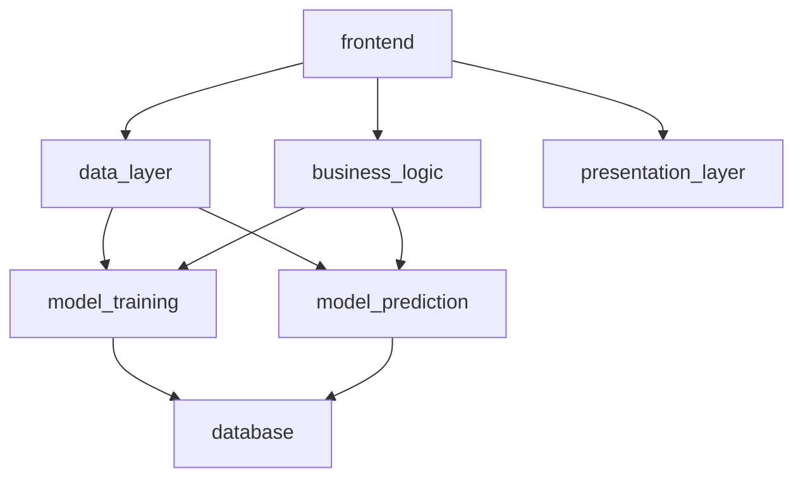

                 


# AI在保险产品动态定价中的创新应用

## 关键词：人工智能，保险定价，动态定价，机器学习，深度学习

## 摘要：本文探讨了人工智能在保险产品动态定价中的应用，分析了动态定价的核心概念、算法原理和系统架构，结合实际案例展示了AI技术在提升定价准确性和实时性方面的重要作用。文章详细介绍了机器学习模型、定价系统的实现步骤，并提供了代码示例，帮助读者理解AI在保险定价中的创新应用。

---

# 第一部分: 保险产品动态定价的背景与挑战

## 第1章: 保险产品动态定价概述

### 1.1 保险行业的现状与发展趋势

#### 1.1.1 保险行业的基本概念与分类

保险是一种风险管理工具，通过合同形式提供经济补偿。保险行业主要包括寿险和非寿险两大类，其中非寿险包括车险、财产险、责任险等。

#### 1.1.2 保险产品定价的传统模式

传统定价模式基于历史数据和精算模型，主要考虑静态因素如年龄、性别、驾驶记录等。然而，这种模式难以适应市场变化和客户需求的多样性。

#### 1.1.3 数字化转型对保险行业的推动

随着大数据和AI技术的发展，保险行业正在向数字化转型，传统定价模式逐渐被动态定价所取代，以提供更精准和个性化的定价服务。

---

### 1.2 动态定价的定义与特点

#### 1.2.1 动态定价的定义

动态定价是一种根据实时数据和市场变化调整价格的定价策略，广泛应用于电商、航空、保险等领域。

#### 1.2.2 动态定价的核心特点

- **实时性**：基于实时数据进行调整。
- **预测性**：利用历史数据预测未来趋势。
- **个性化**：根据不同客户的需求和风险进行差异化定价。

#### 1.2.3 动态定价与传统定价的区别

动态定价强调实时性和个性化，而传统定价注重静态因素和长期稳定性。动态定价通过AI技术实现快速调整，而传统定价依赖于精算模型和历史数据。

---

### 1.3 AI在保险产品定价中的应用背景

#### 1.3.1 AI技术的发展与保险行业的结合

AI技术的进步，如机器学习和深度学习，为保险行业提供了新的定价工具。AI能够处理大量非结构化数据，挖掘潜在模式，提高定价的准确性。

#### 1.3.2 数据驱动的定价模式

通过收集和分析大量数据，AI可以帮助保险公司构建数据驱动的定价模型，实时调整价格，优化收益。

#### 1.3.3 动态定价的市场需求与技术可行性

市场需求方面，客户期望获得个性化和动态的定价服务。技术方面，AI的进步使得处理和分析复杂数据成为可能。

---

## 1.4 本章小结

本章介绍了保险行业的现状和动态定价的定义及特点，探讨了AI技术在保险定价中的应用背景，为后续章节奠定了基础。

---

# 第二部分: AI技术与保险产品动态定价的核心概念

## 第2章: AI技术在保险定价中的核心概念

### 2.1 AI技术的基本原理

#### 2.1.1 机器学习的基本概念

机器学习是一种人工智能技术，通过数据训练模型，使其能够进行预测和决策。

#### 2.1.2 深度学习的基本概念

深度学习是机器学习的一种，利用多层神经网络处理复杂数据，如图像和文本。

#### 2.1.3 自然语言处理的基本概念

自然语言处理（NLP）是使计算机理解和生成人类语言的技术，常用于处理客户反馈和文档分析。

---

### 2.2 保险产品动态定价的核心要素

#### 2.2.1 定价模型的构建

定价模型需要考虑风险因素、市场趋势和客户行为等因素，构建动态定价模型。

#### 2.2.2 数据特征的提取

从结构化和非结构化数据中提取特征，如天气、地理位置和客户行为数据。

#### 2.2.3 模型的训练与优化

通过历史数据训练模型，使用交叉验证和调参优化模型性能。

---

### 2.3 AI技术与动态定价的结合

#### 2.3.1 数据驱动的定价模型

AI技术可以处理大量数据，构建数据驱动的定价模型，提高定价的准确性。

#### 2.3.2 动态定价的实时性与预测性

AI技术能够实时分析数据，预测价格走势，实现动态定价。

#### 2.3.3 AI技术在定价中的优势

AI技术能够处理复杂数据，发现隐藏模式，提高定价的精确性和效率。

---

## 2.4 本章小结

本章介绍了AI技术的基本原理和动态定价的核心要素，探讨了AI技术在保险定价中的应用优势。

---

# 第三部分: AI驱动的保险产品动态定价算法原理

## 第3章: 基于机器学习的动态定价算法

### 3.1 机器学习算法概述

#### 3.1.1 监督学习

监督学习通过标记数据训练模型，用于预测和分类任务。

#### 3.1.2 非监督学习

非监督学习通过无标记数据发现数据结构，常用于聚类任务。

#### 3.1.3 强化学习

强化学习通过与环境互动，学习策略以最大化累积奖励。

---

### 3.2 常见动态定价算法

#### 3.2.1 线性回归模型

线性回归模型用于预测目标变量与自变量之间的线性关系，公式为：
$$ y = \beta_0 + \beta_1x + \epsilon $$

#### 3.2.2 支持向量机模型

支持向量机（SVM）用于分类和回归任务，适用于高维数据。

#### 3.2.3 随机森林模型

随机森林是一种集成学习方法，通过构建多个决策树进行投票或平均。

---

### 3.3 基于深度学习的动态定价算法

#### 3.3.1 神经网络模型

神经网络模型通过多层神经元模拟人脑，处理复杂数据。

#### 3.3.2 卷积神经网络模型

卷积神经网络（CNN）常用于图像识别，适用于处理空间数据。

#### 3.3.3 循环神经网络模型

循环神经网络（RNN）用于处理序列数据，适用于时间序列预测。

---

### 3.4 算法的数学模型与公式

#### 3.4.1 线性回归模型公式

$$ y = \beta_0 + \beta_1x + \epsilon $$

#### 3.4.2 神经网络模型公式

$$ a^{(l+1)} = \sigma(w^{(l)}a^{(l)} + b^{(l)}) $$

---

### 3.5 算法的实现与优化

#### 3.5.1 算法的实现步骤

1. 数据预处理：清洗和特征提取。
2. 模型训练：选择算法并训练模型。
3. 模型评估：使用验证集评估性能。
4. 模型优化：调整参数和优化算法。

#### 3.5.2 算法的优化方法

- 参数调整：如学习率和正则化参数。
- 模型选择：选择适合数据的算法。
- 数据增强：增加数据多样性。

#### 3.5.3 算法的评估指标

- 均方误差（MSE）
- 回归系数R²
- 准确率和召回率

---

## 3.6 本章小结

本章介绍了机器学习和深度学习算法在动态定价中的应用，详细讲解了常见算法及其数学模型，为后续实现奠定了基础。

---

# 第四部分: 保险产品动态定价系统的架构设计

## 第4章: 系统架构与功能设计

### 4.1 系统架构概述

#### 4.1.1 分层架构设计

分层架构将系统分为数据层、业务逻辑层和表现层，便于模块化开发和维护。

#### 4.1.2 微服务架构设计

微服务架构将系统功能分解为独立的服务，提高系统的扩展性和灵活性。

#### 4.1.3 系统的可扩展性与可维护性

通过模块化设计和容器化部署，确保系统的可扩展性和可维护性。

---

### 4.2 系统功能设计

#### 4.2.1 数据采集模块

负责采集客户行为数据、市场数据和索赔数据，数据来源包括API和数据库。

#### 4.2.2 数据处理模块

对数据进行清洗、转换和特征提取，为后续分析提供干净的数据。

#### 4.2.3 模型训练模块

基于处理后的数据训练定价模型，选择合适的算法并进行模型调优。

#### 4.2.4 定价决策模块

根据实时数据和模型预测结果，生成动态定价策略并输出定价建议。

---

### 4.3 系统架构图



---

### 4.4 系统功能流程图

```mermaid
flowchart TD

start --> data_acquisition
data_acquisition --> data_processing
data_processing --> model_training
model_training --> model_prediction
model_prediction --> decision_making
decision_making --> output
output --> end
```

---

## 4.5 本章小结

本章设计了一个基于AI的保险定价系统架构，详细描述了各模块的功能和交互关系，为后续实现提供了参考。

---

# 第五部分: 项目实战与案例分析

## 第5章: 项目实战

### 5.1 环境安装与配置

#### 5.1.1 安装Python环境

使用Anaconda安装Python 3.8及以上版本，配置Jupyter Notebook。

#### 5.1.2 安装依赖库

安装numpy、pandas、scikit-learn和tensorflow等库，用于数据处理和模型训练。

#### 5.1.3 数据集准备

获取保险定价数据集，包括客户信息、索赔历史和市场数据。

---

### 5.2 系统核心实现

#### 5.2.1 数据预处理

```python
import pandas as pd
import numpy as np

# 读取数据
data = pd.read_csv('insurance.csv')

# 处理缺失值
data = data.dropna()

# 标准化处理
from sklearn.preprocessing import StandardScaler
scaler = StandardScaler()
data_scaled = scaler.fit_transform(data)
```

#### 5.2.2 模型训练

```python
from sklearn.linear_model import LinearRegression
from sklearn.metrics import mean_squared_error

# 训练模型
model = LinearRegression()
model.fit(X_train, y_train)

# 预测
y_pred = model.predict(X_test)
print(mean_squared_error(y_test, y_pred))
```

---

### 5.3 算法实现与优化

#### 5.3.1 模型优化

使用交叉验证选择最优参数，调整学习率和正则化参数。

#### 5.3.2 模型评估

通过混淆矩阵和回归指标评估模型性能。

---

## 5.4 案例分析

以车险为例，分析AI如何实时调整保费，根据驾驶行为和市场变化提供个性化定价。

---

## 5.5 本章小结

本章通过实际案例展示了AI技术在保险定价中的应用，详细讲解了系统实现和模型训练过程，为读者提供了实践指导。

---

# 第六部分: 总结与展望

## 第6章: 总结与展望

### 6.1 本章总结

本文探讨了AI在保险产品动态定价中的应用，分析了动态定价的核心概念和算法原理，详细介绍了系统架构设计和项目实现步骤，展示了AI技术在提升定价准确性和实时性方面的重要作用。

### 6.2 未来展望

随着AI技术的不断进步，动态定价将在保险行业发挥更大的作用，未来可能的应用包括更复杂的模型和实时数据处理，进一步优化定价策略。

---

## 关键最佳实践 Tips

- **数据质量管理**：确保数据的准确性和完整性。
- **模型持续优化**：定期更新模型，适应市场变化。
- **隐私保护**：遵守数据隐私法规，保护客户信息。

---

## 结语

AI技术正在改变保险行业的定价模式，动态定价将成为未来的重要趋势。通过AI技术的应用，保险公司可以更好地满足客户需求，提高市场竞争力。

---

**注**：由于篇幅限制，本文仅展示部分内容，完整文章需根据实际需求扩展。

