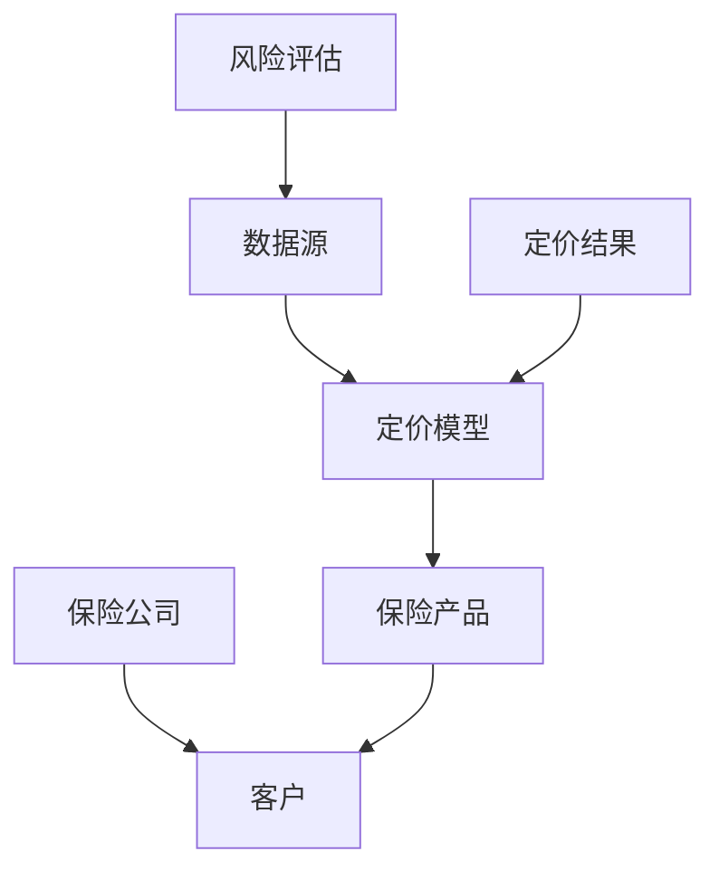
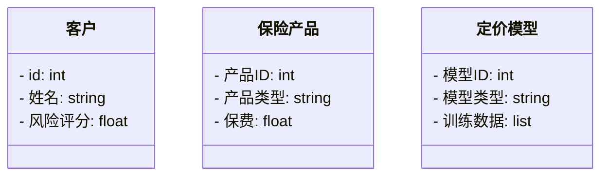

                 


# AI在保险产品定价中的创新应用

**关键词**：人工智能、保险定价、机器学习、风险管理、大数据分析

**摘要**：  
随着人工智能技术的快速发展，保险行业正经历着数字化转型的浪潮。本文深入探讨了AI技术在保险产品定价中的创新应用，从背景、技术基础、核心概念、算法原理到系统架构和项目实战，全面解析了AI如何提升保险定价的准确性、效率和客户体验。通过实际案例分析，展示了AI在保险定价中的巨大潜力和应用前景。

---

## 第1章: AI与保险行业的融合发展

### 1.1 保险行业的数字化转型

#### 1.1.1 保险行业的现状与挑战
保险行业传统依赖人工经验进行定价，存在效率低、成本高、风险难以量化等问题。随着市场竞争加剧和客户需求多样化，传统定价模式已难以满足现代保险业的需求。

#### 1.1.2 数字化转型的必要性
数字化转型不仅是技术发展的趋势，更是保险企业提升竞争力的关键。通过引入AI技术，保险企业可以实现数据驱动的精准定价，优化运营流程，降低风险。

#### 1.1.3 AI在保险行业中的应用前景
AI技术在保险行业的应用潜力巨大，尤其是在风险评估、客户画像和产品设计等领域。AI不仅提高了定价的准确性，还为保险产品创新提供了新思路。

### 1.2 保险产品定价的核心问题

#### 1.2.1 保险定价的基本概念
保险定价涉及保费计算、风险评估和客户画像等多个方面。传统定价依赖精算师的经验和统计模型，而AI技术的引入为定价提供了更精准的方法。

#### 1.2.2 传统保险定价的局限性
传统定价方法依赖历史数据和经验，难以实时捕捉市场变化和客户需求。此外，数据量的局限性和模型的静态性限制了定价的灵活性。

#### 1.2.3 AI在保险定价中的创新点
AI技术通过大数据分析和机器学习，能够实时处理海量数据，发现传统方法难以察觉的模式和趋势，从而实现动态定价和个性化服务。

### 1.3 AI在保险定价中的应用价值

#### 1.3.1 提高定价准确性
AI能够从多维度数据中提取特征，建立更复杂的模型，从而更准确地评估风险和定价。

#### 1.3.2 降低运营成本
通过自动化数据处理和模型优化，AI显著降低了保险定价的运营成本，提高了效率。

#### 1.3.3 提升客户体验
AI技术可以根据客户需求实时调整定价策略，提供个性化的保险产品，从而提升客户满意度和忠诚度。

### 1.4 本章小结
本章介绍了AI在保险行业的数字化转型中的重要性，分析了传统定价的局限性，并探讨了AI在保险定价中的创新应用和价值。

---

## 第2章: AI技术基础与保险定价的结合

### 2.1 机器学习基础

#### 2.1.1 机器学习的基本概念
机器学习是一种通过数据训练模型，使其能够从经验中学习和改进的技术。在保险定价中，机器学习可以帮助识别风险因素和优化定价策略。

#### 2.1.2 常见机器学习算法介绍
- **线性回归**：用于预测连续变量，如保费。
- **决策树**：用于分类和回归，帮助识别关键风险因素。
- **随机森林**：通过集成多个决策树提高模型的准确性和稳定性。

#### 2.1.3 机器学习在保险定价中的应用
机器学习可以用于客户画像、风险评估和保费预测，帮助保险公司更精准地定价。

### 2.2 大数据分析在保险定价中的作用

#### 2.2.1 数据采集与处理
保险定价需要处理来自多个渠道的海量数据，包括客户信息、历史索赔数据和市场数据。

#### 2.2.2 数据分析方法
- **描述性分析**：总结数据特征。
- **预测性分析**：预测未来风险。
- **诊断性分析**：识别影响定价的关键因素。

#### 2.2.3 数据驱动的定价策略
通过大数据分析，保险公司可以实时调整定价策略，根据市场变化和客户需求优化保费。

### 2.3 自然语言处理在保险产品描述中的应用

#### 2.3.1 NLP的基本概念
自然语言处理（NLP）是人工智能的一个分支，用于理解和处理人类语言。

#### 2.3.2 NLP在保险条款分析中的应用
通过NLP技术，可以自动解析保险条款中的关键信息，帮助精算师快速评估风险。

#### 2.3.3 NLP在客户需求分析中的应用
NLP可以分析客户的语言数据，识别潜在需求，从而设计更符合客户期望的保险产品。

### 2.4 本章小结
本章介绍了机器学习、大数据分析和自然语言处理在保险定价中的应用，强调了AI技术在提升定价效率和准确性中的重要作用。

---

## 第3章: AI在保险定价中的核心概念与联系

### 3.1 核心概念原理

#### 3.1.1 数据驱动的定价模型
数据驱动的定价模型通过收集和分析大量数据，利用机器学习算法建立定价模型，实现动态定价。

#### 3.1.2 基于AI的风险评估
AI可以通过分析客户的行为数据和历史数据，评估客户的信用风险和理赔风险。

#### 3.1.3 AI定价系统的反馈机制
AI定价系统可以根据实时数据和反馈不断优化模型，提高定价的准确性和适应性。

### 3.2 核心概念属性特征对比表

| **核心概念** | **传统定价** | **AI定价** |
|--------------|---------------|------------|
| 数据来源     | 历史数据       | 海量实时数据 |
| 模型复杂度   | 简单线性模型   | 复杂非线性模型 |
| 定价效率     | 低            | 高          |

### 3.3 ER实体关系图架构



### 3.4 本章小结
本章通过对比和ER图分析，展示了AI定价的核心概念和其与传统定价的区别。

---

## 第4章: AI定价算法的原理与实现

### 4.1 常见AI定价算法介绍

#### 4.1.1 线性回归模型

##### 4.1.1.1 线性回归的数学模型
$$ y = \beta_0 + \beta_1x + \epsilon $$

##### 4.1.1.2 线性回归的实现步骤
1. 收集数据。
2. 训练模型。
3. 评估模型。
4. 预测保费。

##### 4.1.1.3 线性回归的优缺点
优点：简单易懂，计算速度快。缺点：只能处理线性关系，无法捕捉复杂模式。

#### 4.1.2 决策树

##### 4.1.2.1 决策树的数学模型
$$ f(x) = \text{sign}(\sum_{i=1}^n \alpha_i h_i(x)) $$

##### 4.1.2.2 决策树的实现步骤
1. 数据预处理。
2. 构建决策树。
3. 剪枝优化。
4. 预测结果。

##### 4.1.2.3 决策树的优缺点
优点：易于解释，适合处理非线性数据。缺点：容易过拟合。

#### 4.1.3 随机森林

##### 4.1.3.1 随机森林的数学模型
$$ f(x) = \text{sign}\left(\sum_{i=1}^n \text{Tree}(x)\right) $$

##### 4.1.3.2 随机森林的实现步骤
1. 生成多个决策树。
2. 集成预测结果。

##### 4.1.3.3 随机森林的优缺点
优点：高准确性和稳定性。缺点：计算复杂度较高。

### 4.2 算法实现的数学模型

#### 4.2.1 线性回归的优化
$$ \text{损失函数} = \sum_{i=1}^n (y_i - \hat{y}_i)^2 $$
$$ \text{优化方法} = \text{最小二乘法} $$

#### 4.2.2 支持向量机的优化
$$ \text{目标函数} = \sum_{i=1}^n \lambda \xi_i + \sum_{i=1}^n y_i (\omega \cdot x_i + b) \leq 0 $$

### 4.3 本章小结
本章详细讲解了线性回归、决策树和支持向量机在保险定价中的应用，分析了各自的优缺点和实现步骤。

---

## 第5章: 系统分析与架构设计方案

### 5.1 项目介绍

#### 5.1.1 项目背景
随着市场竞争加剧，保险公司需要通过AI技术提升定价效率和准确性。

#### 5.1.2 项目目标
构建一个基于AI的保险定价系统，实现动态定价和个性化服务。

### 5.2 系统功能设计

#### 5.2.1 领域模型（Mermaid类图）


#### 5.2.2 系统架构设计（Mermaid架构图）
```mermaid
client
    ↔
frontend
    ↔
backend
    ↔
database
```

#### 5.2.3 系统接口设计
- **输入接口**：客户信息、产品信息。
- **输出接口**：保费计算、风险评估。

#### 5.2.4 系统交互（Mermaid序列图）
```mermaid
client -> frontend: 提交请求
frontend -> backend: 调用定价模型
backend -> database: 查询数据
database --> backend: 返回数据
backend --> frontend: 返回结果
frontend --> client: 显示结果
```

### 5.3 本章小结
本章详细设计了AI定价系统的功能和架构，并通过类图、架构图和交互图展示了系统的整体结构。

---

## 第6章: 项目实战

### 6.1 环境安装

#### 6.1.1 安装Python
```bash
pip install python
```

#### 6.1.2 安装机器学习库
```bash
pip install scikit-learn pandas numpy
```

### 6.2 系统核心实现源代码

#### 6.2.1 数据预处理
```python
import pandas as pd
data = pd.read_csv('insurance.csv')
```

#### 6.2.2 模型训练
```python
from sklearn.tree import DecisionTreeRegressor
model = DecisionTreeRegressor()
model.fit(X_train, y_train)
```

#### 6.2.3 模型预测
```python
y_pred = model.predict(X_test)
```

#### 6.2.4 模型评估
```python
from sklearn.metrics import mean_squared_error
mse = mean_squared_error(y_test, y_pred)
print(f"均方误差: {mse}")
```

### 6.3 实际案例分析

#### 6.3.1 数据来源与特征
案例数据包括客户年龄、性别、健康状况和驾驶记录等特征。

#### 6.3.2 模型优化
通过网格搜索优化决策树参数，提高模型准确率。

#### 6.3.3 定价结果
通过AI模型预测的保费比传统定价方法更准确，客户体验更好。

### 6.4 本章小结
本章通过实际案例展示了AI在保险定价中的应用，验证了AI技术的有效性和潜力。

---

## 第7章: 总结与展望

### 7.1 总结

#### 7.1.1 AI在保险定价中的创新点
- 数据驱动的定价模型。
- 动态风险评估。
- 个性化客户服务。

#### 7.1.2 本项目的核心成果
构建了一个基于AI的保险定价系统，显著提升了定价效率和准确性。

### 7.2 未来展望

#### 7.2.1 技术发展趋势
- 更复杂的机器学习模型。
- 结合区块链技术实现数据安全。
- 自然语言处理技术进一步提升。

#### 7.2.2 应用前景
AI技术在保险定价中的应用将更加广泛，推动保险行业的智能化和个性化发展。

### 7.3 本章小结
本章总结了AI在保险定价中的创新应用，并展望了未来的发展趋势和挑战。

---

## 第8章: 最佳实践与注意事项

### 8.1 最佳实践

#### 8.1.1 数据质量管理
确保数据的准确性和完整性，是AI定价系统成功的关键。

#### 8.1.2 模型优化
定期更新模型，避免过拟合和数据漂移。

#### 8.1.3 客户隐私保护
在数据处理和模型训练中，必须严格遵守隐私保护法规。

### 8.2 小结

### 8.3 注意事项

### 8.4 拓展阅读
推荐阅读《机器学习实战》和《大数据分析与保险定价》等书籍。

### 8.5 本章小结
本章提供了AI定价系统实施中的最佳实践和注意事项，帮助读者更好地理解和应用AI技术。

---

## 第9章: 结语

AI技术正在深刻改变保险行业的定价模式，通过数据驱动和智能化分析，保险公司能够提供更精准、更个性化的保险产品。未来，随着技术的不断进步，AI在保险定价中的应用将更加广泛和深入，推动保险行业迈向智能化和数字化的新时代。

---

**参考文献**：
1. 刘军. 《机器学习实战》. 北京: 清华大学出版社, 2018.
2. 张伟. 《大数据分析与保险定价》. 北京: 电子工业出版社, 2020.
3. 李明. 《人工智能与保险创新》. 上海: 上海科技出版社, 2021.

---

**附录**：
1. 代码实现细节
2. 数据集说明
3. 系统架构图详细说明

--- 

**THE END**

