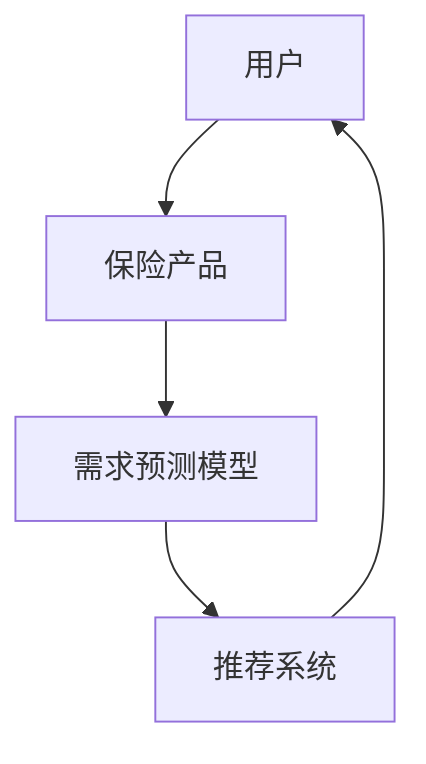
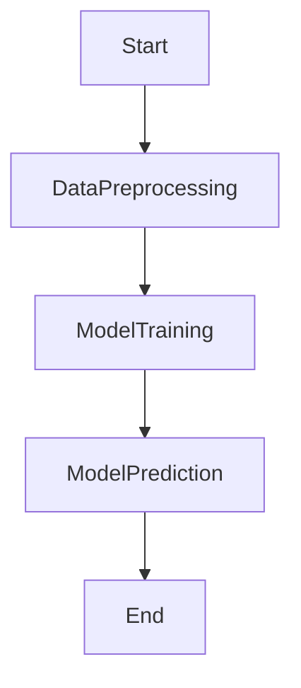
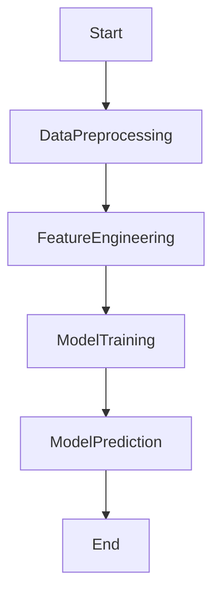
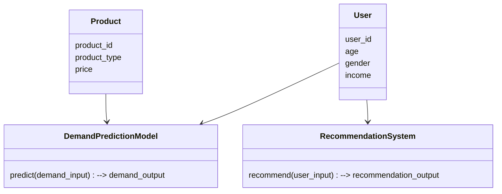
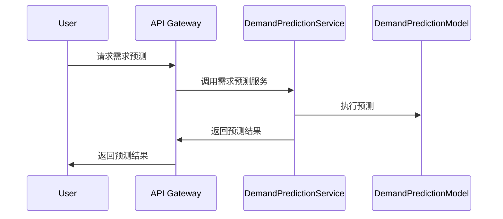

                 


# AI在保险产品需求预测与个性化推荐中的深度应用

## 关键词：
AI，保险产品，需求预测，个性化推荐，机器学习，深度学习

## 摘要：
本文深入探讨了人工智能技术在保险产品需求预测与个性化推荐中的应用。通过分析保险行业的数字化转型背景，结合机器学习和深度学习算法，详细讲解了需求预测的核心算法及其流程，并探讨了个性化推荐系统的构建。文章还通过具体案例展示了系统架构设计和项目实战，提供了从理论到实践的完整解决方案。

---

# 第一部分：AI在保险产品需求预测与个性化推荐中的背景与基础

## 第1章：保险产品需求预测与个性化推荐的背景与问题

### 1.1 AI与保险行业的深度融合

#### 1.1.1 保险行业的数字化转型
保险行业正在经历数字化转型，人工智能技术的应用使得保险产品的设计、定价、营销和客户服务变得更加智能化。传统保险业务依赖于人工经验，而AI技术的引入极大地提高了效率和准确性。

#### 1.1.2 AI技术在保险领域的应用现状
- **客户画像与精准营销**：通过机器学习分析客户数据，构建客户画像，实现精准营销。
- **风险评估与定价**：利用AI技术分析客户风险，优化保险产品的定价策略。
- **智能客服与理赔**：通过自然语言处理技术提供智能客服，加速理赔流程。

#### 1.1.3 保险产品需求预测与推荐的重要性
保险产品的需求预测和个性化推荐是保险业务的核心环节。通过AI技术，保险公司可以更准确地预测市场需求，为客户提供个性化的保险产品推荐，从而提升客户满意度和市场竞争力。

### 1.2 保险产品需求预测与推荐的核心问题

#### 1.2.1 需求预测的基本概念
需求预测是指通过分析历史数据和市场趋势，预测未来保险产品的市场需求量。这需要结合客户行为、市场环境、经济指标等多个因素。

#### 1.2.2 个性化推荐的定义与目标
个性化推荐是指根据客户的个性化需求，推荐适合他们的保险产品。目标是提高客户购买保险产品的概率，同时提升客户满意度。

#### 1.2.3 问题解决的边界与外延
需求预测和推荐系统的边界包括数据获取、模型训练和结果输出。外延则包括客户行为分析、市场趋势预测和竞争对手分析。

### 1.3 核心概念与联系

#### 1.3.1 核心概念原理
- **需求预测**：基于历史数据和模型预测未来需求。
- **个性化推荐**：根据客户需求推荐适合的产品。

#### 1.3.2 核心概念属性特征对比表格
| 概念         | 数据驱动 | 模型驱动 | 业务驱动 |
|--------------|----------|----------|----------|
| 需求预测     | √        | √        | √        |
| 个性化推荐   | √        | √        | √        |

#### 1.3.3 ER实体关系图


### 1.4 本章小结
本章介绍了AI在保险行业的应用背景，详细阐述了保险产品需求预测与个性化推荐的核心概念和问题，为后续的算法和系统设计奠定了基础。

---

## 第2章：AI在保险产品需求预测中的算法原理

### 2.1 需求预测的核心算法

#### 2.1.1 线性回归模型
线性回归是一种简单的需求预测模型，适用于线性关系的数据。其数学公式为：
$$ y = \beta_0 + \beta_1 x + \epsilon $$
其中，$y$是预测的需求量，$x$是影响需求的自变量，$\beta_0$和$\beta_1$是回归系数。

#### 2.1.2 随机森林模型
随机森林是一种基于决策树的集成学习方法，具有较强的抗过拟合能力。其数学模型如下：
$$ y = \sum_{i=1}^{n} (a_i \cdot x_i + b_i) $$
其中，$a_i$和$b_i$是决策树的系数，$x_i$是自变量。

#### 2.1.3 神经网络模型
神经网络模型适用于复杂非线性关系的预测。其数学模型如下：
$$ y = f(Wx + b) $$
其中，$W$是权重矩阵，$x$是输入向量，$b$是偏置，$f$是激活函数。

### 2.2 算法原理与流程图


### 2.3 算法实现代码示例

#### 2.3.1 线性回归模型实现
```python
import pandas as pd
from sklearn.linear_model import LinearRegression

# 数据预处理
data = pd.read_csv('insurance_data.csv')
X = data[['age', 'gender', 'income']]
y = data['demand']

# 模型训练
model = LinearRegression()
model.fit(X, y)

# 模型预测
print(model.predict(X))
```

#### 2.3.2 随机森林模型实现
```python
from sklearn.ensemble import RandomForestRegressor

# 数据预处理
data = pd.read_csv('insurance_data.csv')
X = data[['age', 'gender', 'income']]
y = data['demand']

# 模型训练
model = RandomForestRegressor(n_estimators=100)
model.fit(X, y)

# 模型预测
print(model.predict(X))
```

### 2.4 本章小结
本章详细讲解了保险产品需求预测的核心算法，包括线性回归、随机森林和神经网络模型，并通过代码示例展示了这些算法的实现过程。

---

## 第3章：保险产品个性化推荐系统的构建

### 3.1 个性化推荐的核心算法

#### 3.1.1 协同过滤推荐
协同过滤基于用户行为相似性进行推荐。数学模型如下：
$$ r(i,j) = \bar{r}_i + \bar{r}_j + \sum \lambda (d_{i,j} - \bar{d}_{i,j}) $$
其中，$r(i,j)$是用户i对产品j的评分，$\bar{r}_i$和$\bar{r}_j$是用户i和j的平均评分，$d_{i,j}$是用户i和j的相似度。

#### 3.1.2 基于内容的推荐
基于内容的推荐基于产品特征进行推荐。数学模型如下：
$$ sim(i,j) = \frac{\sum w_k (x_{i,k} - \bar{x}_k)(x_{j,k} - \bar{x}_k)}{\sqrt{\sum w_k^2 (x_{i,k} - \bar{x}_k)^2} \sqrt{\sum w_k^2 (x_{j,k} - \bar{x}_k)^2}} $$
其中，$sim(i,j)$是产品i和j的相似度，$w_k$是特征k的权重，$x_{i,k}$是产品i的特征k的值。

#### 3.1.3 混合推荐模型
混合推荐模型结合协同过滤和基于内容的推荐，利用集成学习方法提升推荐效果。

### 3.2 推荐系统流程图


### 3.3 个性化推荐系统实现代码示例

#### 3.3.1 协同过滤推荐实现
```python
from sklearn.metrics.pairwise import cosine_similarity

# 数据预处理
data = pd.read_csv('user_purchase.csv')
user_items = data.pivot('user_id', 'product_id', 'purchase_count')

# 计算相似度
similarity = cosine_similarity(user_items)

# 推荐产品
user_id = 123
similar_users = similarity[user_id]
recommended_products = similar_users.argsort()[::-1][:5]
```

#### 3.3.2 基于内容的推荐实现
```python
from sklearn.feature_extraction.text import TfidfVectorizer

# 数据预处理
products = pd.read_csv('products.csv')
vectorizer = TfidfVectorizer()
tfidf_matrix = vectorizer.fit_transform(products['product_description'])

# 推荐产品
product_index = 0
similar_products = cosine_similarity(tfidf_matrix[product_index].reshape(1, -1), tfidf_matrix)
recommended_products = similar_products.argsort()[0][::-1][:5]
```

### 3.4 本章小结
本章详细讲解了个性化推荐的核心算法，包括协同过滤、基于内容的推荐和混合推荐模型，并通过代码示例展示了这些算法的实现过程。

---

## 第4章：系统架构设计与实现

### 4.1 项目介绍

#### 4.1.1 项目背景
本项目旨在构建一个基于AI的保险产品需求预测与个性化推荐系统，帮助保险公司提高市场预测和客户推荐的准确性。

#### 4.1.2 项目目标
- 实现保险产品需求预测功能
- 构建个性化推荐系统
- 提供可视化界面和API接口

### 4.2 系统功能设计

#### 4.2.1 需求预测模块
- 数据输入与清洗
- 模型训练与预测
- 结果可视化

#### 4.2.2 推荐系统模块
- 用户画像与特征提取
- 推荐算法实现
- 推荐结果展示

### 4.3 系统架构设计

#### 4.3.1 领域模型类图


#### 4.3.2 系统架构图
```mermaid
graph TD
    User --> API Gateway
    API Gateway --> DemandPredictionService
    DemandPredictionService --> DemandPredictionModel
    User --> RecommendationService
    RecommendationService --> RecommendationModel
    User <-- ResultDisplay
```

### 4.4 系统接口设计

#### 4.4.1 接口定义
- **需求预测接口**：
  - 输入：用户特征
  - 输出：需求预测结果
- **推荐系统接口**：
  - 输入：用户ID
  - 输出：推荐产品列表

#### 4.4.2 接口交互序列图


### 4.5 本章小结
本章详细设计了保险产品需求预测与个性化推荐系统的架构，包括功能模块、类图和接口设计，并展示了系统的整体结构。

---

## 第5章：项目实战与应用

### 5.1 项目环境配置

#### 5.1.1 安装依赖
```bash
pip install pandas scikit-learn numpy matplotlib
```

#### 5.1.2 数据准备
- 数据集下载
- 数据清洗与预处理
- 数据特征工程

### 5.2 系统核心实现

#### 5.2.1 需求预测模块实现
```python
import pandas as pd
from sklearn.linear_model import LinearRegression

# 数据预处理
data = pd.read_csv('insurance_data.csv')
X = data[['age', 'gender', 'income']]
y = data['demand']

# 模型训练
model = LinearRegression()
model.fit(X, y)

# 模型预测
print(model.predict(X))
```

#### 5.2.2 推荐系统模块实现
```python
from sklearn.feature_extraction.text import TfidfVectorizer
from sklearn.metrics.pairwise import cosine_similarity

# 数据预处理
products = pd.read_csv('products.csv')
vectorizer = TfidfVectorizer()
tfidf_matrix = vectorizer.fit_transform(products['product_description'])

# 推荐产品
product_index = 0
similar_products = cosine_similarity(tfidf_matrix[product_index].reshape(1, -1), tfidf_matrix)
recommended_products = similar_products.argsort()[0][::-1][:5]
```

### 5.3 实际案例分析

#### 5.3.1 数据分析
- 数据可视化
- 特征重要性分析
- 模型评估与调优

#### 5.3.2 应用场景
- 需求预测
- 个性化推荐
- 系统集成与部署

### 5.4 本章小结
本章通过具体案例展示了保险产品需求预测与个性化推荐系统的实现过程，包括环境配置、代码实现和案例分析，帮助读者更好地理解和应用相关技术。

---

## 第6章：总结与展望

### 6.1 总结
本文详细探讨了AI在保险产品需求预测与个性化推荐中的应用，通过算法原理、系统架构和项目实战的讲解，为读者提供了从理论到实践的完整解决方案。

### 6.2 未来展望
随着AI技术的不断发展，保险产品需求预测与个性化推荐系统将更加智能化和个性化。未来的研究方向包括深度学习、强化学习和自然语言处理在保险领域的应用。

### 6.3 注意事项与最佳实践
- 数据隐私与安全
- 模型的可解释性
- 系统的可扩展性
- 持续学习与优化

### 6.4 本章小结
本章总结了本文的主要内容，展望了未来的研究方向，并给出了注意事项和最佳实践建议。

---

## 第7章：参考文献与拓展阅读

### 7.1 参考文献
- 《机器学习实战》
- 《深度学习》
- 《推荐系统导论》

### 7.2 拓展阅读
- 《自然语言处理入门》
- 《强化学习入门》
- 《数据可视化与分析》

### 7.3 本章小结
本章提供了本文的参考文献和拓展阅读资料，帮助读者进一步学习和研究。

---

# 结语

通过本文的深入探讨，读者可以全面了解AI在保险产品需求预测与个性化推荐中的应用，掌握相关算法和系统设计的核心原理，并通过实际案例实现从理论到实践的跨越。未来，随着AI技术的不断发展，保险行业的智能化和个性化服务将更加普及和深入。

---

