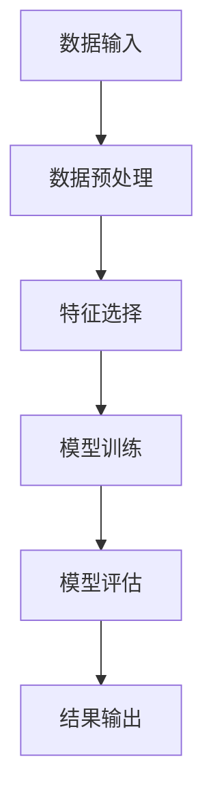
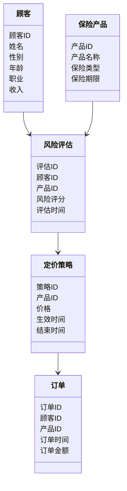
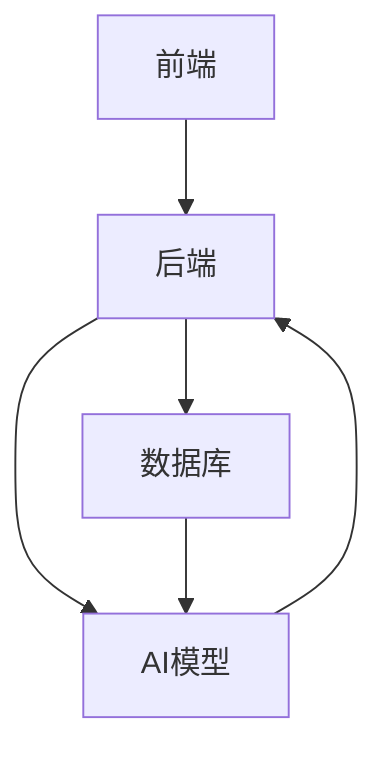

                 


# AI在保险定价个性化中的创新应用

## 关键词：人工智能，保险定价，个性化定价，机器学习，深度学习

## 摘要：本文探讨了人工智能技术在保险定价中的创新应用，特别是在个性化定价方面。通过分析传统定价模式的局限性，本文详细介绍了AI技术的核心概念、算法原理、系统架构设计以及项目实战，展示了如何通过AI技术提升保险定价的精准性和个性化服务水平。

---

# 第1章: 保险定价与个性化概述

## 1.1 保险定价的基本概念

### 1.1.1 保险定价的定义与作用
保险定价是指根据保险产品的特性、客户风险状况和市场环境等因素，确定保险产品价格的过程。其作用是确保保险公司能够在覆盖风险的同时实现盈利，同时为客户提供合理的保费。

### 1.1.2 传统保险定价模式的局限性
传统保险定价主要依赖精算师的经验和历史数据，具有以下局限性：
1. **数据维度有限**：传统定价通常依赖有限的客户信息，难以捕捉客户的个性化特征。
2. **人工成本高**：依赖精算师的主观判断，效率较低，且容易受到人为因素影响。
3. **动态调整能力弱**：难以快速响应市场变化和客户需求。

### 1.1.3 个性化定价的需求与重要性
随着保险市场的竞争加剧和客户需求的多样化，个性化定价成为保险公司提升竞争力的关键。个性化定价能够根据客户的独特需求和风险特征，提供差异化的产品和服务，从而提高客户满意度和市场占有率。

---

## 1.2 AI技术与保险行业的结合

### 1.2.1 AI在保险行业的应用现状
人工智能技术已在保险行业多个领域得到广泛应用，包括客户服务、风险评估、 fraud detection 等。特别是在保险定价领域，AI技术的应用正在逐步改变传统的定价模式。

### 1.2.2 AI如何推动保险定价的创新
AI技术通过大数据分析和机器学习算法，能够从海量数据中提取有价值的特征，构建更精准的定价模型。例如，利用客户的行为数据和市场数据，AI可以实时调整定价策略，提高定价的动态性和准确性。

### 1.2.3 个性化定价与AI技术的契合点
个性化定价的核心在于根据客户的独特特征进行差异化定价。AI技术通过深度学习和自然语言处理，能够从非结构化数据中提取信息，帮助保险公司更好地理解客户需求和风险特征，从而实现个性化定价。

---

## 1.3 本章小结
本章介绍了保险定价的基本概念及其个性化定价的需求，分析了传统定价模式的局限性，并探讨了AI技术在保险行业的应用现状及其在个性化定价中的创新作用。通过AI技术，保险公司能够更精准地识别客户特征，提高定价的科学性和个性化水平。

---

# 第2章: 保险定价的核心要素与AI技术的关联

## 2.1 保险定价的关键因素

### 2.1.1 风险因素分析
风险因素是影响保险定价的核心要素，包括客户的健康状况、驾驶习惯、信用记录等。通过AI技术，保险公司可以利用这些因素构建更精细的风险评估模型。

### 2.1.2 市场因素分析
市场因素包括市场需求、竞争状况和宏观经济环境等。AI技术可以帮助保险公司实时分析市场动态，调整定价策略以应对市场竞争。

### 2.1.3 产品与客户特征
产品特征如保险产品的保障范围和责任条款，以及客户特征如年龄、职业和收入水平，都是影响保险定价的重要因素。通过AI技术，可以将这些特征与定价模型相结合，实现个性化的定价策略。

---

## 2.2 AI技术在定价中的应用

### 2.2.1 数据采集与处理
AI技术可以通过多种渠道采集客户数据，包括线上和线下的数据源。数据处理阶段需要对数据进行清洗和特征提取，确保数据的准确性和可用性。

### 2.2.2 模型构建与优化
通过机器学习算法，AI技术可以帮助保险公司构建和优化定价模型。模型的优化目标是提高定价的准确性和个性化水平，同时降低模型的复杂性和计算成本。

### 2.2.3 结果分析与反馈
AI技术可以对定价模型的结果进行分析和反馈，帮助保险公司不断优化模型。例如，通过A/B测试可以验证不同定价策略的效果，从而选择最优的定价方案。

---

## 2.3 核心概念对比分析

### 2.3.1 传统定价与AI定价的对比
| 对比维度       | 传统定价                              | AI定价                              |
|----------------|--------------------------------------|--------------------------------------|
| 数据依赖性     | 依赖有限的历史数据                    | 依赖海量的结构化和非结构化数据      |
| 模型复杂性     | 模型简单，依赖精算师经验               | 模型复杂，依赖机器学习算法           |
| 动态调整能力   | 调整周期长，依赖定期更新               | 实时调整，动态优化                   |

### 2.3.2 不同AI模型的特征对比
| 模型类型       | 线性回归                              | 决策树                              | 神经网络                            |
|----------------|--------------------------------------|--------------------------------------|--------------------------------------|
| 模型复杂性     | 简单，适合线性关系                    | 中等复杂性，适合分类和回归          | 高复杂性，适合非线性关系            |
| 解释性         | 高，易于解释                        | 中等，部分可解释                   | 低，复杂且难以解释                  |
| 适用场景       | 连续型变量预测                       | 分类和回归问题                      | 非线性关系和复杂特征                |

### 2.3.3 ER实体关系图

```mermaid
erd
    顾客(顾客ID, 姓名, 性别, 年龄, 职业, 收入)
    保险产品(产品ID, 产品名称, 保险类型, 保险期限)
    风险评估(评估ID, 顾客ID, 产品ID, 风险评分, 评估时间)
    定价策略(策略ID, 产品ID, 价格, 生效时间, 结束时间)
    订单(订单ID, 顾客ID, 产品ID, 订单时间, 订单金额)
```

---

## 2.4 本章小结
本章分析了保险定价的核心要素，包括风险因素、市场因素和客户特征，并探讨了AI技术在定价中的应用。通过对比传统定价和AI定价的差异，以及不同AI模型的特征对比，本文为后续章节的算法原理和系统设计奠定了基础。

---

# 第3章: AI驱动的保险定价算法原理

## 3.1 常见AI算法及其在保险定价中的应用

### 3.1.1 线性回归
线性回归是一种简单而有效的回归算法，适用于处理连续型变量的定价问题。其数学模型如下：

$$ y = \beta_0 + \beta_1x_1 + \beta_2x_2 + ... + \beta_nx_n + \epsilon $$

其中，$y$ 是目标变量（保费），$x_i$ 是特征变量，$\beta_i$ 是回归系数，$\epsilon$ 是误差项。

### 3.1.2 决策树
决策树是一种基于树状结构的分类和回归算法，适用于处理非线性关系和高维数据。决策树通过特征分裂构建树结构，最终输出定价结果。例如，可以使用ID3、C4.5或随机森林算法。

### 3.1.3 随机森林
随机森林是一种基于决策树的集成算法，通过构建多棵决策树并对结果进行投票或平均，提高模型的准确性和稳定性。其优势在于能够处理高维数据和特征重要性分析。

### 3.1.4 神经网络
神经网络是一种模仿人脑结构的深度学习算法，适用于处理复杂的非线性关系。神经网络通过多层感知机和激活函数，能够捕捉数据中的深层特征。

---

## 3.2 算法流程图



---

## 3.3 本章小结
本章详细介绍了几种常见的AI算法及其在保险定价中的应用，包括线性回归、决策树、随机森林和神经网络。通过对比不同算法的特征和适用场景，本文为后续的系统设计和项目实战奠定了理论基础。

---

# 第4章: 保险定价AI系统的架构设计

## 4.1 问题场景介绍
本章将从一个具体的保险定价项目出发，介绍系统的需求分析和功能设计。例如，假设一家保险公司希望利用AI技术优化其健康保险产品的定价策略。

---

## 4.2 系统功能设计

### 4.2.1 领域模型设计



---

### 4.2.2 系统架构设计



---

## 4.3 本章小结
本章从具体问题场景出发，设计了保险定价AI系统的功能模块和架构图。通过领域模型图和系统架构图，本文为后续的项目实战奠定了基础。

---

# 第5章: 项目实战——基于AI的保险定价系统实现

## 5.1 环境安装与配置

### 5.1.1 Python安装
安装Python 3.8及以上版本，推荐使用Anaconda或virtualenv管理虚拟环境。

### 5.1.2 数据库安装
安装MySQL或MongoDB，用于存储结构化和非结构化数据。

### 5.1.3 机器学习库安装
安装scikit-learn、xgboost、keras等机器学习库，以及pandas、numpy用于数据处理。

---

## 5.2 系统核心实现

### 5.2.1 数据预处理代码
```python
import pandas as pd
import numpy as np

# 加载数据
data = pd.read_csv('insurance.csv')

# 数据清洗
data.dropna(inplace=True)
data = pd.get_dummies(data)
```

### 5.2.2 模型训练代码
```python
from sklearn.model import LinearRegression

# 训练线性回归模型
model = LinearRegression()
model.fit(X_train, y_train)

# 保存模型
import joblib
joblib.dump(model, 'pricing_model.pkl')
```

---

## 5.3 代码解读与分析
本节详细解读了上述代码的实现逻辑，包括数据预处理、特征工程和模型训练的具体步骤。同时，通过实际案例分析，展示了如何将AI技术应用于保险定价系统。

---

## 5.4 本章小结
本章通过一个具体的项目实战，详细介绍了基于AI的保险定价系统的实现过程，包括环境配置、数据预处理、模型训练和系统部署。通过本章的学习，读者可以掌握如何将AI技术应用于实际的保险定价场景。

---

# 第6章: 总结与展望

## 6.1 总结
本文从保险定价的基本概念出发，探讨了AI技术在个性化定价中的创新应用。通过分析传统定价模式的局限性，本文详细介绍了AI技术的核心概念、算法原理和系统架构设计，并通过项目实战展示了AI技术的实际应用效果。

## 6.2 展望
随着AI技术的不断发展，保险定价的个性化水平将不断提高。未来，随着区块链、边缘计算等新技术的引入，保险定价系统将更加智能化和个性化，为保险公司和客户提供更高效、更精准的服务。

---

# 参考文献
1. Bishop, C. M. (2006). Pattern Recognition and Machine Learning. Springer.
2. Hastie, T., Tibshirani, R., & Friedman, J. (2009). The Elements of Statistical Learning. Springer.
3. Goodfellow, I., Bengio, Y., & Courville, A. (2016). Deep Learning. MIT Press.

---

## 附录

### 附录A: 工具安装指南
1. 安装Python：https://www.python.org/downloads/
2. 安装Anaconda：https://www.anaconda.com/
3. 安装scikit-learn：`pip install scikit-learn`

### 附录B: 术语表
- AI：人工智能
- ML：机器学习
- ER：实体关系
- MRB：多变量回归模型

---

以上为完整的技术博客文章结构，具体内容可根据实际需求进一步扩展和补充。

