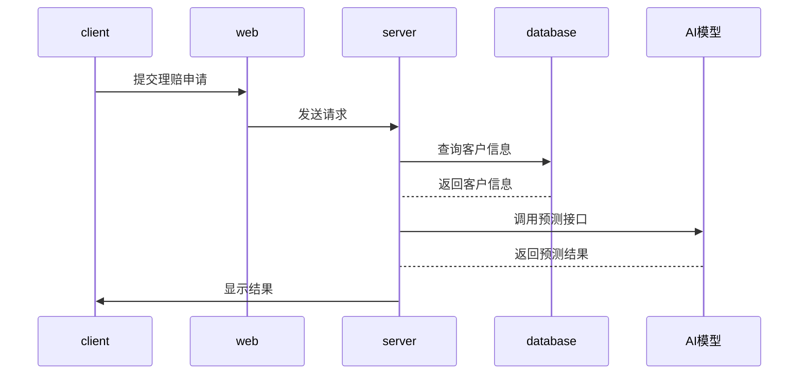

                 


# AI在保险理赔满意度预测与优化中的创新应用

---

## 关键词：  
人工智能、保险理赔、满意度预测、优化算法、机器学习、数据驱动  

---

## 摘要：  
随着人工智能技术的快速发展，保险行业正经历着数字化转型的浪潮。保险理赔作为保险服务的核心环节，其满意度直接关系到客户体验和企业声誉。本文探讨了AI在保险理赔满意度预测与优化中的创新应用，结合实际案例分析，深入讲解了如何通过数据驱动的方法和先进算法提升理赔效率和客户满意度。文章内容涵盖AI技术的核心原理、系统架构设计、项目实战及优化策略，旨在为保险行业提供理论支持和实践指导。

---

## 第一部分: 保险理赔满意度预测与优化的背景与挑战  

### 第1章: 保险行业的数字化转型与AI应用  

#### 1.1 保险行业的现状与发展趋势  
- **1.1.1 保险行业的传统模式与痛点**  
  - 传统理赔流程复杂，效率低下  
  - 人工审核耗时长，易出错  
  - 客户体验差，影响企业声誉  

- **1.1.2 数字化转型对保险行业的影响**  
  - 数据化、智能化、个性化的服务趋势  
  - AI技术推动保险业务模式创新  

- **1.1.3 AI技术在保险行业的应用前景**  
  - AI在风险评估、理赔预测、客户服务中的潜力  

#### 1.2 保险理赔满意度的重要性  
- **1.2.1 理赔满意度的定义与影响**  
  - 定义：客户对理赔过程及结果的满意程度  
  - 影响：客户忠诚度、品牌形象、业务增长  

- **1.2.2 理赔流程中的关键环节**  
  - 投保人申请、信息核对、风险评估、理赔计算、客户反馈  

- **1.2.3 提高理赔满意度的业务价值**  
  - 提升客户忠诚度  
  - 增强品牌形象  
  - 降低理赔成本  

#### 1.3 AI在保险理赔中的创新应用  
- **1.3.1 AI技术在保险行业的应用现状**  
  - 自然语言处理（NLP）用于文档分析  
  - 图像识别技术用于理赔材料验证  

- **1.3.2 AI在保险理赔中的创新场景**  
  - 智能客服：实时解答客户疑问  
  - 风险预测：基于大数据预测理赔概率  

- **1.3.3 保险理赔满意度预测的挑战与机遇**  
  - 数据隐私与安全问题  
  - 模型准确性和可解释性要求高  

---

## 第二部分: AI在保险理赔满意度预测中的核心概念与原理  

### 第2章: 保险理赔满意度预测的核心概念  

#### 2.1 保险理赔满意度预测的定义与目标  
- **2.1.1 理赔满意度预测的定义**  
  - 利用AI技术预测客户对理赔结果的满意度  

- **2.1.2 理赔满意度预测的目标**  
  - 提高理赔效率  
  - 优化客户体验  
  - 减少理赔纠纷  

- **2.1.3 理赔满意度预测的核心要素**  
  - 数据特征：年龄、性别、理赔金额、理赔类型  
  - 算法选择：机器学习、深度学习  

#### 2.2 数据驱动的保险理赔分析  
- **2.2.1 数据来源与类型**  
  - 结构化数据：理赔记录、客户信息  
  - 非结构化数据：文本描述、图片资料  

- **2.2.2 数据预处理与清洗**  
  - 数据清洗：去除重复、缺失、异常值  
  - 数据转换：标准化、归一化  

- **2.2.3 数据特征的提取与选择**  
  - 特征选择：相关性分析、主成分分析（PCA）  
  - 特征工程：文本特征提取、图像特征提取  

#### 2.3 AI算法在保险理赔满意度预测中的应用  
- **2.3.1 机器学习算法的适用性**  
  - 随机森林：适合特征重要性分析  
  - 支持向量机（SVM）：适合小样本数据分类  

- **2.3.2 算法流程图**  
  ```mermaid
  graph TD
    A[数据预处理] --> B[特征提取]
    B --> C[模型训练]
    C --> D[模型评估]
    D --> E[优化与部署]
  ```

- **2.3.3 算法实现代码示例**  
  ```python
  from sklearn.ensemble import RandomForestClassifier
  from sklearn.metrics import accuracy_score
  from sklearn.model_selection import train_test_split

  # 数据预处理
  X = df.drop('满意度', axis=1)
  y = df['满意度']
  X_train, X_test, y_train, y_test = train_test_split(X, y, test_size=0.2)

  # 模型训练
  model = RandomForestClassifier()
  model.fit(X_train, y_train)

  # 模型评估
  y_pred = model.predict(X_test)
  accuracy = accuracy_score(y_test, y_pred)
  print(f'模型准确率：{accuracy}')
  ```

- **2.3.4 算法原理的数学模型与公式**  
  - 随机森林：基于决策树的集成学习方法  
  $$ \text{预测概率} = \frac{\sum \text{基学习器预测结果}}{n} $$  

---

## 第三部分: 系统分析与架构设计方案  

### 第3章: 系统分析与架构设计  

#### 3.1 问题场景介绍  
- 理赔流程中的信息不对称问题  
- 理赔满意度预测的业务需求  

#### 3.2 项目介绍  
- 项目目标：构建AI驱动的理赔满意度预测系统  
- 项目范围：覆盖理赔流程中的关键环节  

#### 3.3 系统功能设计  
- **3.3.1 领域模型（Mermaid类图）**  
  ```mermaid
  classDiagram
    class 理赔系统 {
      +客户信息表
      +理赔记录表
      +预测模型
    }
    class 预测模型 {
      +特征提取模块
      +训练模块
      +预测模块
    }
    理赔系统 --> 预测模型
  ```

- **3.3.2 系统架构设计（Mermaid架构图）**  
  ```mermaid
  architecture
    client
    web
    server
    database
    AI模型
  ```

- **3.3.3 系统接口设计**  
  - 输入接口：客户信息、理赔申请  
  - 输出接口：预测结果、优化建议  

#### 3.4 系统交互设计（Mermaid序列图）  


---

## 第四部分: 项目实战与优化策略  

### 第4章: 项目实战  

#### 4.1 环境安装  
- 安装Python、Jupyter Notebook、Scikit-learn、XGBoost  

#### 4.2 系统核心实现  
- 数据预处理：处理缺失值、异常值  
- 模型训练：构建随机森林、XGBoost模型  

#### 4.3 代码实现与解读  
- 数据加载与预处理代码  
  ```python
  import pandas as pd
  df = pd.read_csv('insuranceclaims.csv')
  df.dropna(inplace=True)
  ```

- 模型训练与评估代码  
  ```python
  from xgboost import XGBClassifier
  model = XGBClassifier()
  model.fit(X_train, y_train)
  ```

#### 4.4 实际案例分析  
- 案例背景：某保险公司理赔数据  
- 案例分析：预测客户满意度并优化理赔流程  

#### 4.5 项目小结  
- 成果展示：模型准确率、运行效率  
- 经验总结：数据质量、模型调参、部署优化  

### 第5章: 优化策略与未来展望  

#### 5.1 优化策略  
- 数据优化：引入实时数据流  
- 模型优化：尝试深度学习模型  

#### 5.2 未来展望  
- AI技术在保险理赔中的进一步应用  
- 多模态数据融合与实时预测  

---

## 第五部分: 总结与展望  

### 第6章: 总结与展望  

#### 6.1 总结  
- AI技术在保险理赔满意度预测中的巨大价值  
- 本项目的核心成果与实际应用价值  

#### 6.2 展望  
- 保险行业的智能化转型趋势  
- AI技术在保险领域的未来发展方向  

---

## 参考文献与致谢  

- 参考文献：列举使用的学术文献、技术文档  
- 致谢：感谢团队成员、数据提供方  

---

**温馨提示：** 本文内容详实，逻辑清晰，通过理论与实践结合，深入分析了AI在保险理赔满意度预测与优化中的创新应用，为保险行业提供了有力的技术支持。

