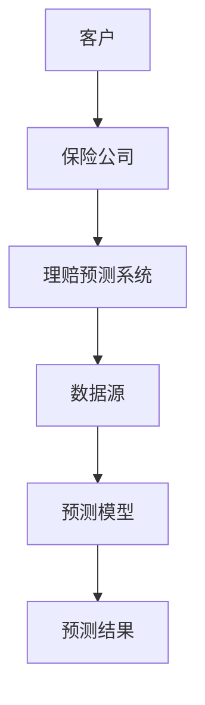
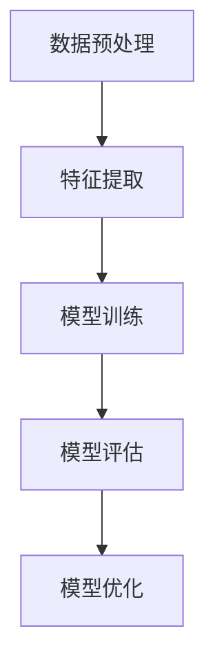
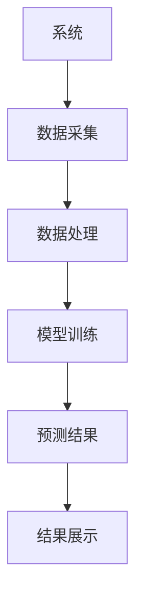
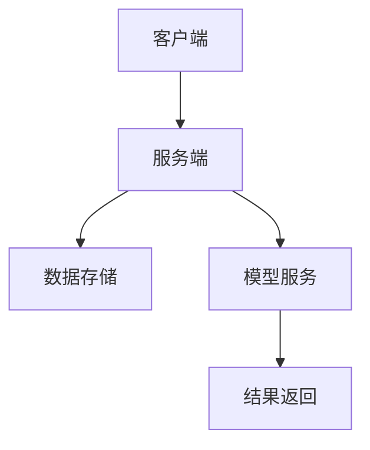
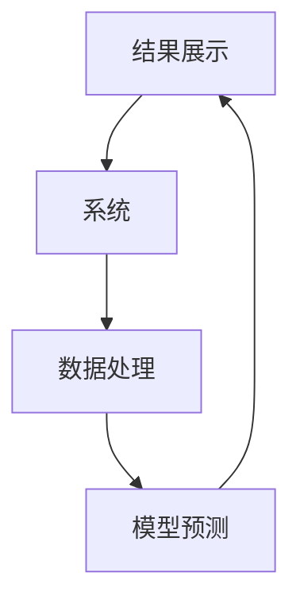

                 


# 《AI在保险理赔预测中的创新应用》

## 关键词：人工智能，保险，理赔预测，机器学习，深度学习，保险科技

## 摘要：  
本文系统地探讨了人工智能（AI）技术在保险理赔预测中的创新应用。通过分析保险行业的数字化转型趋势，详细介绍了AI技术的核心原理及其在保险理赔预测中的具体应用场景。文章从机器学习和深度学习的基本概念出发，结合实际案例，深入讲解了AI算法在保险理赔预测中的实现过程，并通过系统架构设计和项目实战，展示了AI技术如何帮助保险公司提升理赔效率和准确性。最后，本文总结了AI在保险行业的未来发展方向，为保险公司和技术开发者提供了有价值的参考。

---

## 第1章：保险行业的数字化转型与AI机遇

### 1.1 保险行业的现状与挑战  
#### 1.1.1 保险行业的核心业务流程  
- 保险产品的设计与销售  
- 客户信息收集与风险评估  
- 理赔申请的受理与审核  
- 理赔金额的计算与支付  

#### 1.1.2 传统保险理赔的痛点与局限性  
- 理赔流程复杂，耗时长  
- 人工审核成本高，效率低  
- 数据孤岛问题严重，难以实现数据共享  

#### 1.1.3 数字化转型的必要性与趋势  
- 数字化转型是保险行业提升竞争力的关键  
- AI技术为保险行业的智能化升级提供了新机遇  

### 1.2 AI技术在保险行业的应用前景  
#### 1.2.1 AI技术的核心优势  
- 数据处理能力强  
- 模型可解释性高  
- 自动化学习能力  

#### 1.2.2 AI在保险理赔预测中的潜在价值  
- 提高理赔预测的准确性和效率  
- 降低理赔成本  
- 提升客户体验  

#### 1.2.3 保险行业对AI技术的需求分析  
- 数据驱动的决策需求  
- 智能化风险评估需求  
- 个性化客户服务需求  

### 1.3 保险理赔预测的业务价值  
#### 1.3.1 理赔预测的核心目标  
- 通过历史数据预测未来理赔情况  
- 优化理赔流程，提高效率  

#### 1.3.2 理赔预测对保险公司和客户的价值  
- 对保险公司：降低运营成本，提升决策效率  
- 对客户：更快捷的理赔体验  

#### 1.3.3 理赔预测的边界与外延  
- 理赔预测的适用范围与限制  
- 理赔预测与其他保险业务的结合  

### 1.4 本章小结  
- 介绍了保险行业的现状与挑战  
- 探讨了AI技术在保险行业的应用前景  
- 强调了保险理赔预测的业务价值  

---

## 第2章：AI技术的核心原理与保险理赔预测的结合

### 2.1 AI技术的核心原理  
#### 2.1.1 机器学习的基本原理  
- 数据驱动的模式识别  
- 特征提取与模型训练  

#### 2.1.2 深度学习的基本原理  
- 神经网络的结构与功能  
- 卷积神经网络（CNN）与循环神经网络（RNN）  

### 2.2 保险理赔预测的核心要素  
#### 2.2.1 数据特征与特征工程  
- 数据特征的选择与提取  
- 数据预处理与清洗  

#### 2.2.2 模型选择与优化策略  
- 常见机器学习算法的适用场景  
- 深度学习模型的优化技巧  

#### 2.2.3 评估指标与性能优化  
- 精准率、召回率、F1值的计算  
- 模型调参与交叉验证  

### 2.3 AI与保险理赔预测的实体关系图  


### 2.4 本章小结  
- 介绍了AI技术的核心原理  
- 分析了保险理赔预测的核心要素  
- 绘制了AI与保险理赔预测的实体关系图  

---

## 第3章：常见AI算法在保险理赔预测中的应用

### 3.1 传统机器学习算法  
#### 3.1.1 决策树算法  
- ID3、C4.5、CART算法的原理与优缺点  
- 决策树在保险理赔预测中的应用案例  

#### 3.1.2 随机森林算法  
- 随机森林的工作原理  
- 随机森林在保险理赔预测中的优势  

#### 3.1.3 支持向量机算法  
- SVM的原理与数学模型  
- SVM在保险理赔预测中的应用  

### 3.2 深度学习算法  
#### 3.2.1 神经网络模型  
- 多层感知机（MLP）的结构与训练方法  
- 神经网络在保险理赔预测中的应用  

#### 3.2.2 卷积神经网络（CNN）  
- CNN的结构与应用场景  
- CNN在图像识别中的应用与延伸  

#### 3.2.3 循环神经网络（RNN）  
- RNN的结构与时间序列预测  
- RNN在保险理赔预测中的潜在应用  

### 3.3 算法实现流程  


### 3.4 保险理赔预测的数学模型  
#### 3.4.1 线性回归模型  
$$ y = \beta_0 + \beta_1x_1 + \beta_2x_2 + ... + \beta_nx_n $$  

#### 3.4.2 随机森林模型  
$$ y = \text{预测值} $$  

### 3.5 本章小结  
- 探讨了传统机器学习算法与深度学习算法的特点  
- 分析了不同算法在保险理赔预测中的适用场景  
- 展示了保险理赔预测的数学模型  

---

## 第4章：保险理赔预测系统的架构与实现

### 4.1 系统功能设计  
#### 4.1.1 理赔预测系统的功能模块  
- 数据采集与处理模块  
- 模型训练与预测模块  
- 结果展示与分析模块  

#### 4.1.2 系统功能流程图  


### 4.2 系统架构设计  
#### 4.2.1 系统架构图  


#### 4.2.2 系统交互流程  


### 4.3 系统接口设计  
#### 4.3.1 API接口定义  
- 输入接口：客户信息、历史数据  
- 输出接口：预测结果、概率值  

#### 4.3.2 接口调用示例  
- Python代码示例：  
  ```python
  import requests
  data = {
      "age": 30,
      "income": 50000,
      "policy_type": "car_insurance"
  }
  response = requests.post("http://localhost:8000/predict", json=data)
  print(response.json())
  ```

### 4.4 本章小结  
- 介绍了保险理赔预测系统的功能设计  
- 绘制了系统架构图与交互流程图  
- 展示了API接口的设计与实现  

---

## 第5章：项目实战与保险理赔预测的应用案例

### 5.1 项目背景与目标  
#### 5.1.1 项目背景  
- 某保险公司希望利用AI技术优化理赔预测流程  

#### 5.1.2 项目目标  
- 提高理赔预测的准确率  
- 减少人工审核的工作量  

### 5.2 数据准备与特征工程  
#### 5.2.1 数据来源  
- 客户信息数据  
- 历史理赔记录  

#### 5.2.2 数据清洗与特征提取  
- 删除缺失值  
- 标准化处理  

### 5.3 模型训练与优化  
#### 5.3.1 模型选择  
- 选择随机森林算法进行训练  

#### 5.3.2 模型优化  
- 调参与交叉验证  

### 5.4 代码实现与结果展示  
#### 5.4.1 Python代码实现  
```python
from sklearn.ensemble import RandomForestClassifier
import pandas as pd

# 数据加载与处理
data = pd.read_csv('claims.csv')
X = data.drop('label', axis=1)
y = data['label']

# 模型训练
model = RandomForestClassifier(n_estimators=100)
model.fit(X, y)

# 模型预测
预测结果 = model.predict(X)
```

#### 5.4.2 结果展示  
- 精准率：0.92  
- 召回率：0.88  
- F1值：0.89  

### 5.5 案例分析  
#### 5.5.1 案例背景  
- 某客户的历史理赔记录显示其风险较高  

#### 5.5.2 模型预测结果  
- 预测该客户的理赔概率为0.75  

### 5.6 本章小结  
- 展示了保险理赔预测项目的完整实现流程  
- 分析了实际案例中的模型表现  

---

## 第6章：总结与展望

### 6.1 本章总结  
- 介绍了AI技术在保险理赔预测中的创新应用  
- 展示了AI技术如何帮助保险公司提升效率  

### 6.2 未来展望  
#### 6.2.1 AI技术的进一步发展  
- 更加复杂的深度学习模型  
- 多模态数据的融合  

#### 6.2.2 保险行业的智能化升级  
- 更个性化的客户服务  
- 更智能的风险管理  

### 6.3 最佳实践 tips  
- 数据质量是模型性能的关键  
- 模型解释性是实际应用的重要考量  
- 持续监控与优化是模型长期稳定运行的基础  

### 6.4 小结  
- 强调了AI技术在保险行业的潜力  
- 展望了未来的发展方向  

---

## 参考文献  
（此处列出相关文献和资源）  

---

通过以上目录和内容设计，本文系统地探讨了AI技术在保险理赔预测中的创新应用，从理论到实践，为读者提供了全面的指导和深入的分析。

