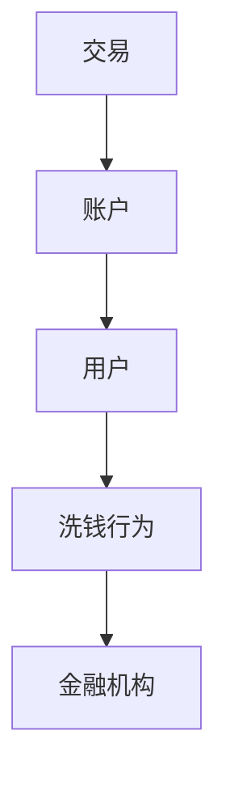
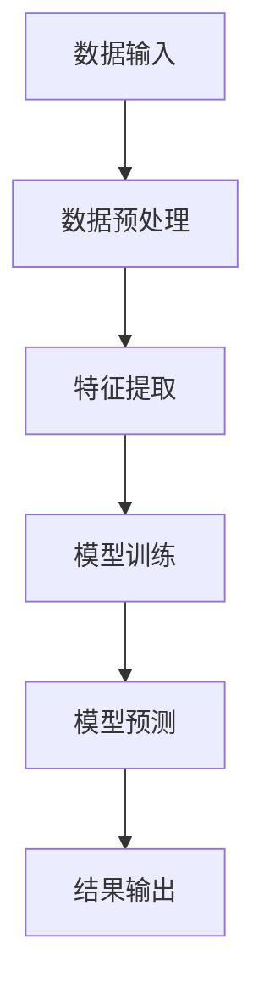
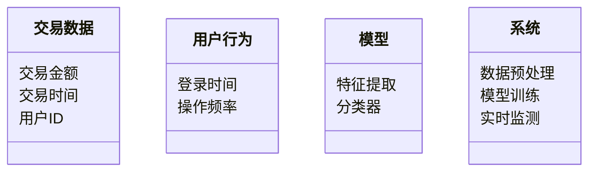
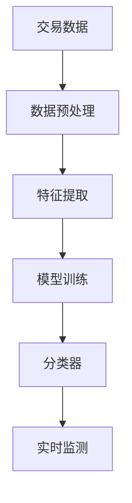
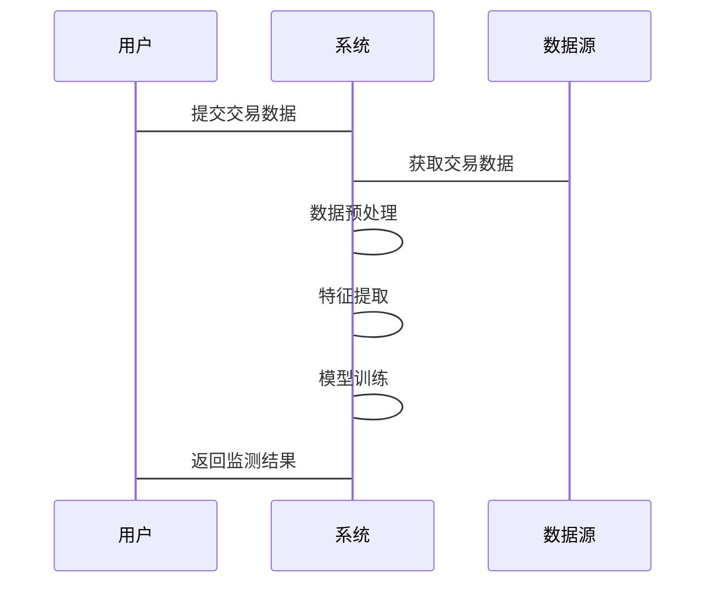

                 


# AI在反洗钱模式识别中的创新应用

> 关键词：反洗钱，人工智能，模式识别，机器学习，深度学习，系统架构

> 摘要：本文将详细探讨AI技术在反洗钱模式识别中的创新应用，从背景、核心概念、算法原理到系统架构设计和项目实战，逐步解析如何利用AI技术提升反洗钱效率和准确性。通过具体案例分析和代码实现，深入探讨AI在反洗钱领域的潜力与挑战。

---

# 第一部分: AI在反洗钱模式识别中的背景与基础

# 第1章: 反洗钱模式识别的背景与挑战

## 1.1 反洗钱的基本概念

### 1.1.1 洗钱的定义与流程
- 洗钱是指将非法资金通过复杂的金融交易使其合法化的过程。
- 常见洗钱流程包括：放置、清洗、整合。

### 1.1.2 反洗钱的重要性与法律框架
- 反洗钱是维护金融安全的重要手段。
- 全球主要国家和地区都建立了反洗钱法律框架。

### 1.1.3 模式识别在反洗钱中的作用
- 通过模式识别技术，发现异常交易模式，识别潜在的洗钱行为。

## 1.2 AI技术在反洗钱中的应用背景

### 1.2.1 传统反洗钱技术的局限性
- 传统基于规则的反洗钱系统存在漏报和误报的问题。
- 需要人工干预，效率较低。

### 1.2.2 AI技术的优势与潜力
- AI能够处理海量数据，发现复杂模式。
- 机器学习和深度学习算法能够动态适应洗钱行为的变化。

### 1.2.3 全球反洗钱领域的AI创新趋势
- 各国开始尝试将AI技术应用于反洗钱系统。
- 创新技术包括：无监督学习、图神经网络等。

## 1.3 反洗钱模式识别的创新应用

### 1.3.1 AI在反洗钱中的核心问题
- 如何从海量数据中提取有用的特征。
- 如何构建高效的模型识别洗钱行为。

### 1.3.2 模式识别的创新方法
- 基于图的模式识别。
- 结合时间序列分析的模式识别。

### 1.3.3 创新应用的典型案例
- 某银行采用深度学习技术识别可疑交易。
- 某地区使用无监督学习发现新型洗钱模式。

## 1.4 本章小结
- 本章介绍了反洗钱的基本概念、AI技术的优势以及创新应用的典型案例。

---

# 第二部分: 反洗钱模式识别的核心概念与AI的结合

# 第2章: 反洗钱模式识别的核心概念

## 2.1 模式识别的基本原理

### 2.1.1 模式识别的定义与分类
- 模式识别是通过计算机技术对数据进行分析和分类的过程。
- 分类包括：监督学习、无监督学习、半监督学习。

### 2.1.2 模式识别的关键技术
- 特征提取。
- 分类器设计。
- 数据预处理。

### 2.1.3 模式识别在反洗钱中的应用
- 识别异常交易模式。
- 发现洗钱团伙的关联关系。

## 2.2 AI与模式识别的结合

### 2.2.1 机器学习在模式识别中的应用
- 监督学习：用于分类交易类型。
- 无监督学习：用于发现异常交易模式。

### 2.2.2 深度学习在模式识别中的应用
- 卷积神经网络（CNN）用于图像识别。
- 长短期记忆网络（LSTM）用于时间序列分析。

### 2.2.3 AI与模式识别结合的优势
- 能够处理非结构化数据。
- 能够发现复杂模式。

## 2.3 反洗钱模式识别的核心要素

### 2.3.1 数据特征提取
- 交易金额、时间、地点、频率等特征。
- 用户行为特征，如登录时间、操作频率等。

### 2.3.2 模型训练与优化
- 数据预处理：去噪、归一化。
- 模型选择：选择合适的算法，如随机森林、XGBoost等。
- 模型调优：参数优化、交叉验证。

### 2.3.3 结果解释与反馈
- 解释模型的决策过程。
- 根据反馈优化模型。

## 2.4 核心概念原理对比表

| 对比项         | 传统模式识别                | AI模式识别                   |
|----------------|-----------------------------|------------------------------|
| 数据处理       | 需要人工提取特征             | 自动提取特征                 |
| 模型适应性     | 需要人工调整模型             | 自动调整模型                 |
| 处理效率       | 较低                       | 较高                         |

## 2.5 ER实体关系图


## 2.6 本章小结
- 本章详细讲解了反洗钱模式识别的核心概念，分析了AI技术与模式识别结合的优势。

---

# 第三部分: 反洗钱模式识别的算法

## 3.1 监督学习算法

### 3.1.1 支持向量机（SVM）
- 用于分类交易类型。
- 适用于小规模数据集。

### 3.1.2 随机森林
- 用于分类交易风险。
- 具有较高的鲁棒性。

## 3.2 无监督学习算法

### 3.2.1 K-means聚类
- 用于发现异常交易群组。
- 适用于无标签数据。

### 3.2.2 DBSCAN聚类
- 用于发现密度较高的异常点。
- 适用于高维数据。

## 3.3 深度学习算法

### 3.3.1 卷积神经网络（CNN）
- 用于图像识别。
- 适用于处理结构化数据。

### 3.3.2 长短期记忆网络（LSTM）
- 用于时间序列分析。
- 适用于处理时序数据。

## 3.4 算法对比表

| 算法类型       | 优势                   | 劣势                   |
|----------------|------------------------|------------------------|
| 监督学习         | 分类精度高             | 需要大量标签数据       |
| 无监督学习       | 无需标签数据           | 分类精度较低           |
| 深度学习         | 特征提取能力强         | 计算资源消耗大         |

## 3.5 算法流程图


## 3.6 本章小结
- 本章介绍了常用的监督学习、无监督学习和深度学习算法，并分析了它们在反洗钱中的应用。

---

# 第四部分: 反洗钱模式识别的系统架构设计

## 4.1 项目介绍

### 4.1.1 项目目标
- 构建一个基于AI的反洗钱模式识别系统。
- 实现对异常交易的实时监测。

### 4.1.2 项目范围
- 数据收集：银行交易数据。
- 数据处理：清洗、归一化。
- 模型训练：构建分类模型。
- 系统部署：实时监测。

## 4.2 系统功能设计

### 4.2.1 领域模型


### 4.2.2 系统架构图


### 4.2.3 接口设计
- 数据输入接口：接收交易数据。
- 模型接口：调用分类器进行预测。
- 结果输出接口：返回监测结果。

### 4.2.4 交互流程


## 4.3 本章小结
- 本章详细设计了反洗钱模式识别系统的架构，并展示了系统的功能模块和交互流程。

---

# 第五部分: 反洗钱模式识别的项目实战

## 5.1 环境配置

### 5.1.1 安装Python
```bash
python --version
pip install numpy pandas scikit-learn tensorflow
```

### 5.1.2 数据集准备
- 数据来源：银行交易数据。
- 数据格式：CSV格式。

## 5.2 核心代码实现

### 5.2.1 数据预处理
```python
import pandas as pd
data = pd.read_csv('transactions.csv')
# 删除缺失值
data = data.dropna()
# 标准化处理
from sklearn.preprocessing import StandardScaler
scaler = StandardScaler()
data_scaled = scaler.fit_transform(data)
```

### 5.2.2 模型训练
```python
from sklearn.ensemble import RandomForestClassifier
model = RandomForestClassifier()
model.fit(data_scaled, labels)
```

### 5.2.3 模型预测
```python
import joblib
# 保存模型
joblib.dump(model, 'anti_money Laundering.pkl')
# 加载模型
loaded_model = joblib.load('anti_money Laundering.pkl')
# 预测
predictions = loaded_model.predict(new_data)
```

### 5.2.4 代码解读
- 数据预处理：清洗数据，标准化处理。
- 模型训练：使用随机森林进行分类。
- 模型保存：使用joblib保存模型，方便后续使用。

## 5.3 案例分析

### 5.3.1 案例背景
- 某银行发现多笔异常交易，金额巨大，时间集中。

### 5.3.2 数据分析
- 使用随机森林模型进行分类，发现这些交易属于高风险类别。

### 5.3.3 案例总结
- 模型准确率高，能够有效识别异常交易。

## 5.4 本章小结
- 本章通过实际案例展示了如何使用AI技术实现反洗钱模式识别。

---

# 第六部分: 总结与展望

## 6.1 本章总结
- 本文详细探讨了AI在反洗钱模式识别中的创新应用。
- 从背景、核心概念、算法到系统设计和项目实战，全面解析了AI技术的优势和潜力。

## 6.2 未来展望
- AI技术在反洗钱领域的应用将更加广泛。
- 新型算法如图神经网络将得到更多应用。
- 多模态数据的结合将提升反洗钱系统的效率。

## 6.3 最佳实践 tips
- 数据预处理是关键，需仔细清洗和归一化。
- 模型选择需结合实际业务需求。
- 系统设计需注重实时性和可扩展性。

## 6.4 注意事项
- 数据隐私保护需严格遵守相关法律法规。
- 模型解释性需增强，便于业务人员理解。
- 系统需具备良好的容错性和恢复能力。

## 6.5 拓展阅读
- 《机器学习实战》
- 《深度学习》
- 《反洗钱实务》

## 6.6 本章小结
- 本文总结了AI在反洗钱模式识别中的应用，并展望了未来的发展方向。

---

# 结语
通过本文的详细讲解，读者可以深入了解AI在反洗钱模式识别中的创新应用，掌握从理论到实践的完整流程。希望本文能为相关领域的研究和实践提供有价值的参考。

