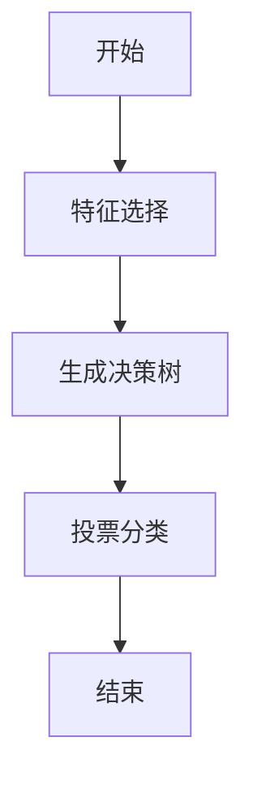
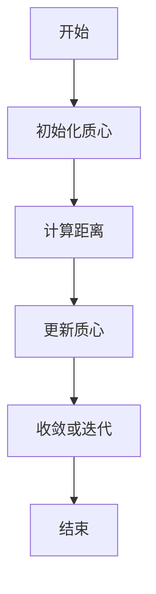
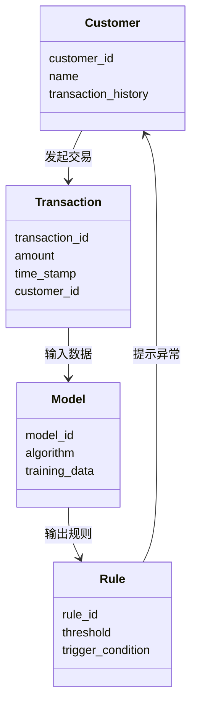

                 


# AI在反洗钱模式识别中的深度应用研究

## 关键词：反洗钱、AI、模式识别、深度学习、金融安全

## 摘要：  
随着金融诈骗和洗钱活动的日益复杂化，传统的反洗钱手段已难以应对日益增长的威胁。人工智能（AI）技术的深度应用为反洗钱模式识别提供了新的解决方案。本文将系统地探讨AI在反洗钱模式识别中的核心原理、算法实现、系统架构及实际应用。通过对比分析多种AI算法，结合实际案例，深入挖掘AI技术的优势与挑战，并展望未来发展方向。

---

## 第一部分: 反洗钱与AI模式识别概述

### 第1章: 反洗钱与AI模式识别概述

#### 1.1 反洗钱的基本概念  
反洗钱（Anti-Money Laundering, AML）是指通过合法手段将非法所得合法化的过程。其核心目标是识别和阻止非法资金流动，维护金融系统的安全。传统的反洗钱方法依赖于规则-based系统，但这些方法在面对复杂、多样化的洗钱手段时显得力不从心。

#### 1.2 AI模式识别的基本原理  
模式识别是通过算法从数据中提取特征并进行分类的过程。AI模式识别利用机器学习、深度学习等技术，从海量数据中发现隐藏的模式和关联性。在反洗钱领域，模式识别可以帮助识别异常交易行为，从而有效防范洗钱活动。

#### 1.3 AI在反洗钱中的应用前景  
AI技术能够处理海量数据，发现传统方法难以察觉的异常模式。通过监督学习、无监督学习和深度学习等方法，AI能够显著提高反洗钱的准确性和效率，降低金融机构的合规成本。

---

## 第二部分: AI在反洗钱模式识别中的核心概念

### 第2章: 反洗钱模式识别的核心概念与联系

#### 2.1 核心概念原理  
在反洗钱模式识别中，核心概念包括：  
- **数据特征提取**：从交易数据中提取关键特征，如交易金额、频率、时间等。  
- **模型训练与优化**：通过训练数据优化模型，使其能够准确识别异常交易。  
- **结果解释与反馈**：模型输出的结果需要可解释，并能够为后续优化提供反馈。  

#### 2.2 核心概念对比表格  
以下是几种常用算法的对比表格：  

| **算法类型** | **监督学习** | **无监督学习** | **深度学习** |  
|--------------|--------------|----------------|--------------|  
| **代表算法** | 随机森林、XGBoost | K-means、聚类分析 | CNN、RNN |  
| **适用场景** | 已知标签的异常检测 | 未知模式的探索 | 复杂非线性关系的建模 |  

#### 2.3 ER实体关系图架构  
以下是反洗钱模式识别的实体关系图：  

```mermaid
erDiagram
    customer[CUSTOMER] {
        customer_id
        name
        transaction_history
    }
    transaction[TRANSACTION] {
        transaction_id
        amount
        time_stamp
        customer_id
    }
    model[MODEL] {
        model_id
        algorithm
        training_data
    }
    rule[RULE] {
        rule_id
        threshold
        trigger_condition
    }
    customer --> transaction : 发起交易
    transaction --> model : 输入数据
    model --> rule : 输出规则
    rule --> customer : 提示异常
```

---

## 第三部分: AI在反洗钱模式识别中的算法原理

### 第3章: 常用算法原理与实现

#### 3.1 监督学习算法  
**随机森林算法**  
随机森林是一种基于树的集成学习算法，通过投票机制进行分类。以下是随机森林的流程图：  



以下是随机森林的投票机制公式：  
$$ \text{预测结果} = \text{多数投票} $$  

**XGBoost算法**  
XGBoost是一种优化的提升树算法，通过正则化和损失函数优化模型。以下是XGBoost的损失函数：  
$$ \text{损失函数} = \text{Log Loss} $$  

#### 3.2 无监督学习算法  
**K-means算法**  
K-means是一种聚类算法，用于将数据分成K个簇。以下是K-means的流程图：  



---

## 第四部分: AI在反洗钱模式识别中的系统分析

### 第4章: 系统分析与架构设计方案

#### 4.1 问题场景介绍  
反洗钱系统的场景包括：  
- 数据源：交易数据、客户信息、账户流水等。  
- 系统功能：数据预处理、特征提取、模型训练、结果展示。  

#### 4.2 系统功能设计  
以下是反洗钱系统的领域模型：  



#### 4.3 系统架构设计  
以下是反洗钱系统的架构图：  


---

## 第五部分: AI在反洗钱模式识别中的项目实战

### 第5章: 项目实战与案例分析

#### 5.1 环境安装  
以下是项目环境安装代码：  
```bash
pip install numpy
pip install pandas
pip install scikit-learn
pip install xgboost
```

#### 5.2 核心实现  
以下是反洗钱模型的核心实现代码：  
```python
import pandas as pd
from sklearn.ensemble import RandomForestClassifier
from xgboost import XGBClassifier
from sklearn.metrics import accuracy_score

# 数据加载
data = pd.read_csv('transactions.csv')

# 特征提取
features = data[['amount', 'time_stamp', 'customer_id']]
labels = data['is_fraud']

# 模型训练
model = RandomForestClassifier()
model.fit(features, labels)

# 模型预测
predictions = model.predict(features)
print('Accuracy:', accuracy_score(labels, predictions))
```

#### 5.3 案例分析  
以下是一个银行交易数据的反洗钱分析案例：  
```python
# 数据处理
data = pd.read_csv('bank_transactions.csv')

# 特征工程
data['amount_per_hour'] = data.groupby('customer_id')['amount'].transform('mean') / data['time_stamp'].transform('mean')

# 模型训练
model = XGBClassifier()
model.fit(data[['amount', 'amount_per_hour']], data['is_fraud'])

# 模型评估
print('Training Accuracy:', model.score(data[['amount', 'amount_per_hour']], data['is_fraud']))
```

---

## 第六部分: 总结与展望

### 第6章: 总结与展望

#### 6.1 本章小结  
AI技术在反洗钱模式识别中的应用显著提高了检测的准确性和效率。通过监督学习、无监督学习和深度学习算法，AI能够有效识别异常交易行为，降低金融风险。

#### 6.2 未来展望  
随着技术的发展，AI在反洗钱中的应用将更加智能化和自动化。未来的挑战包括：  
- 提高模型的可解释性。  
- 解决数据隐私问题。  
- 提升模型的实时性。  

#### 6.3 最佳实践 tips  
- 数据预处理是模型训练的基础，需重点关注。  
- 模型调优是提高准确性的关键。  
- 模型部署需考虑计算资源和实时性要求。  

---

通过以上分析，我们可以看到AI技术在反洗钱模式识别中的巨大潜力，同时也需要在技术细节和实际应用中不断优化和完善。

