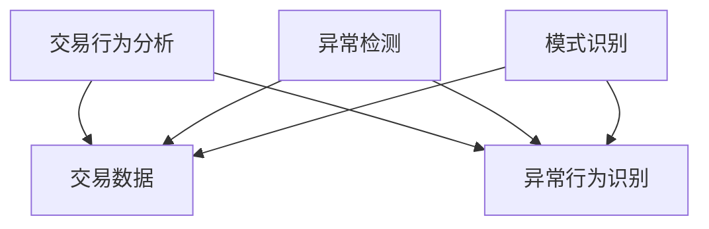
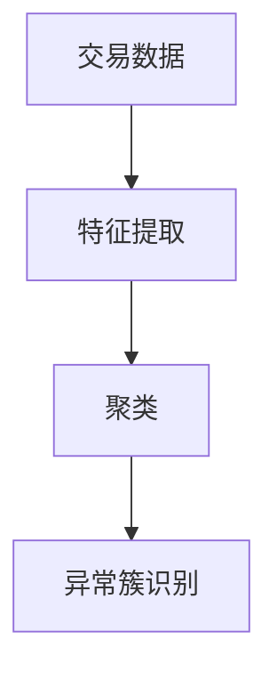
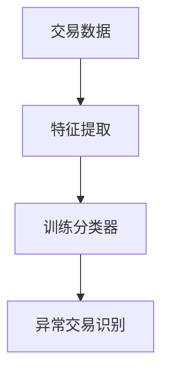
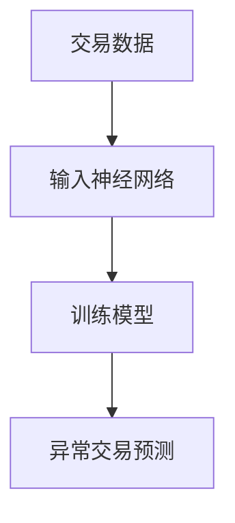
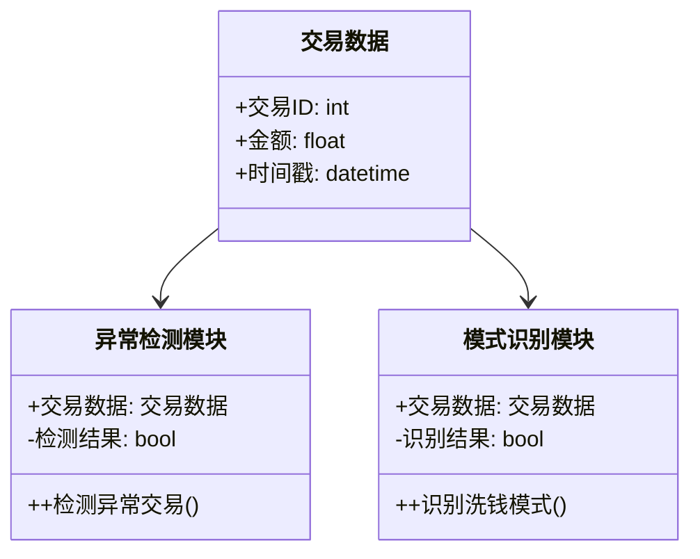
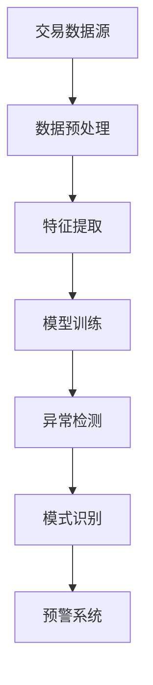
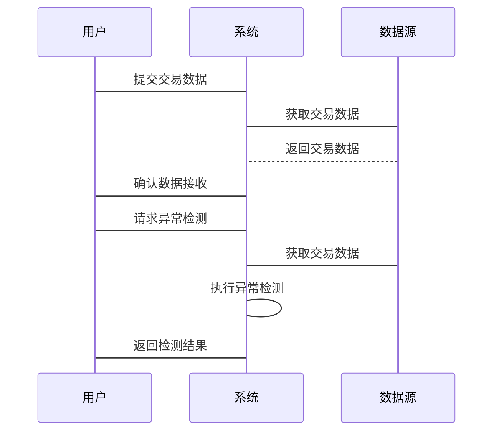

                 


# AI在反洗钱模式进化检测与预警中的深度应用研究

## 关键词：反洗钱、人工智能、模式检测、异常检测、深度学习、预警系统

## 摘要：随着全球金融体系的复杂化，反洗钱工作面临越来越大的挑战。传统方法在检测新型洗钱模式时显得力不从心，而人工智能（AI）技术的引入为解决这一问题提供了新的可能性。本文将深入探讨AI在反洗钱模式进化检测与预警中的应用，从背景、核心概念、算法原理、系统设计到项目实战，全面解析如何利用AI技术提升反洗钱的效率和准确性。通过对机器学习、深度学习等技术的分析，本文旨在为反洗钱领域的从业者提供理论和实践上的指导，帮助他们更好地应对不断变化的洗钱手段。

---

## 第一部分: 反洗钱模式进化检测与预警的背景与挑战

### 第1章: 反洗钱的基本概念与问题背景

#### 1.1 反洗钱的基本概念
##### 1.1.1 洗钱的定义与基本流程
洗钱是指将非法获取的资金通过复杂的金融操作合法化的过程。其基本流程包括放置、层叠和融合三个阶段，目的是掩盖资金的非法来源。

##### 1.1.2 反洗钱的核心目标与原则
反洗钱的核心目标是识别和阻止非法资金流动，维护金融系统的安全和稳定。其原则包括合法性、有效性、保密性和国际合作。

##### 1.1.3 反洗钱的法律框架与国际标准
国际上主要通过 FATF（金融行动特别工作组）制定的标准来指导反洗钱工作。各国根据自身情况，制定了相应的法律法规，如美国的《反洗钱法案》和欧盟的《反洗钱指令》。

#### 1.2 反洗钱模式的演进
##### 1.2.1 传统反洗钱模式的局限性
传统反洗钱主要依赖人工审核和规则-based系统，存在效率低、漏检率高、难以应对复杂模式等问题。

##### 1.2.2 基于AI的反洗钱模式的优势
AI技术通过大数据分析和机器学习，能够快速识别异常交易模式，提高检测的准确性和效率。

##### 1.2.3 反洗钱模式进化的驱动力
技术进步（AI、大数据）、洗钱手段的多样化、监管要求的提高是推动反洗钱模式进化的三大驱动力。

#### 1.3 问题背景与研究意义
##### 1.3.1 当前反洗钱面临的主要挑战
- 洗钱手段多样化，传统方法难以应对。
- 数据量大，人工分析效率低。
- 跨机构协作不足，数据孤岛问题突出。

##### 1.3.2 AI技术在反洗钱中的应用前景
AI技术能够通过深度学习识别复杂的交易模式，实时监控和预警，提高反洗钱的效率和效果。

##### 1.3.3 研究本课题的意义与价值
研究AI在反洗钱中的应用，有助于提升金融机构的反洗钱能力，维护金融系统的安全，促进合规与创新的平衡。

---

## 第二部分: AI在反洗钱中的深度应用概述

### 第2章: AI技术的核心优势

#### 2.1 数据驱动的特征识别能力
AI通过分析海量数据，识别交易中的异常特征，如交易频率、金额、时间等。

#### 2.2 自动学习与模式识别能力
机器学习算法能够自动学习交易模式，识别潜在的洗钱行为。

#### 2.3 实时监控与预警能力
AI系统可以实时监控交易数据，快速识别异常并发出预警。

### 第3章: 反洗钱模式检测的核心问题

#### 3.1 交易行为的异常检测
通过分析交易数据，识别与正常交易模式不符的异常行为。

#### 3.2 资金流动的模式识别
识别资金流动中的异常模式，如资金快速转移、多次交易等。

#### 3.3 洗钱网络的结构分析
通过图分析技术，识别洗钱网络的结构和关键节点。

---

## 第三部分: 反洗钱模式检测的核心概念与联系

### 第4章: 核心概念的定义与属性

#### 4.1 交易行为分析
- 定义：对交易的频率、金额、时间等特征进行分析，识别异常行为。
- 属性：实时性、数据驱动、规则-based。

#### 4.2 异常检测
- 定义：识别偏离正常模式的数据点。
- 属性：基于统计或机器学习方法，实时性。

#### 4.3 模式识别
- 定义：通过算法识别数据中的模式和结构。
- 属性：数据驱动、基于机器学习或深度学习。

### 第5章: 核心概念的对比分析

#### 5.1 概念属性对比表格
| 概念      | 定义                           | 属性               |
|-----------|--------------------------------|--------------------|
| 交易行为分析 | 分析交易特征识别异常行为 | 数据驱动、规则-based |
| 异常检测   | 识别偏离正常模式的数据点 | 统计/机器学习驱动 |
| 模式识别   | 识别数据中的模式和结构 | 机器学习/深度学习驱动 |

#### 5.2 实体关系图（ER图）


---

## 第四部分: AI驱动的反洗钱模式检测算法原理

### 第6章: 算法原理概述

#### 6.1 聚类算法在模式识别中的应用
- 定义：将交易数据分为不同的簇，识别异常簇。
- 常用算法：K-means、DBSCAN。

#### 6.2 分类算法在异常检测中的应用
- 定义：通过训练模型识别正常与异常交易。
- 常用算法：随机森林、支持向量机（SVM）。

#### 6.3 深度学习在复杂模式识别中的应用
- 定义：通过神经网络学习复杂的交易模式。
- 常用模型：循环神经网络（RNN）、长短期记忆网络（LSTM）。

### 第7章: 算法流程图

#### 7.1 聚类算法流程图


#### 7.2 分类算法流程图


#### 7.3 深度学习算法流程图


### 第8章: 算法实现代码示例

#### 8.1 聚类算法代码
```python
from sklearn.cluster import DBSCAN
import numpy as np

# 示例交易数据
X = np.array([[1, 2], [2, 3], [3, 4], [4, 5], [5, 6]])

# 聚类模型
db = DBSCAN(eps=1.5, min_samples=2).fit(X)

# 输出聚类结果
print(db.labels_)
```

#### 8.2 分类算法代码
```python
from sklearn.ensemble import RandomForestClassifier
import numpy as np

# 示例交易数据
X = np.array([[1, 2], [2, 3], [3, 4], [4, 5], [5, 6]])
y = np.array([0, 0, 1, 1, 1])

# 分类模型
clf = RandomForestClassifier(n_estimators=100).fit(X, y)

# 预测异常交易
print(clf.predict([[6, 7]]))
```

#### 8.3 深度学习算法代码
```python
import tensorflow as tf
from tensorflow.keras import layers

# 示例交易数据
X = np.array([[1, 2], [2, 3], [3, 4], [4, 5], [5, 6]])

# 深度学习模型
model = tf.keras.Sequential()
model.add(layers.Dense(64, activation='relu', input_dim=2))
model.add(layers.Dense(1, activation='sigmoid'))
model.compile(optimizer='adam', loss='binary_crossentropy', metrics=['accuracy'])

# 训练模型
model.fit(X, y, epochs=10, batch_size=32)
```

---

## 第五部分: 数学模型与公式解析

### 第9章: 概率论基础

#### 9.1 贝叶斯定理
$$ P(A|B) = \frac{P(B|A)P(A)}{P(B)} $$
贝叶斯定理在分类算法中常用于计算条件概率，帮助识别异常交易。

#### 9.2 中心极限定理
$$ \frac{\bar{X} - \mu}{\sigma/\sqrt{n}} \sim N(0, 1) $$
中心极限定理用于统计分析，帮助识别交易数据的异常值。

---

## 第六部分: 系统分析与架构设计

### 第10章: 系统功能设计

#### 10.1 领域模型（类图）


#### 10.2 系统架构设计


### 第11章: 系统接口设计

#### 11.1 接口描述
- 数据输入接口：接收交易数据。
- 模型训练接口：训练异常检测和模式识别模型。
- 预警接口：输出异常交易预警信息。

#### 11.2 接口交互序列图


---

## 第七部分: 项目实战

### 第12章: 环境搭建与代码实现

#### 12.1 环境搭建
- 安装必要的库：numpy、scikit-learn、tensorflow、mermaid、latex。

#### 12.2 核心实现代码
##### 12.2.1 异常检测实现
```python
import numpy as np
from sklearn.ensemble import IsolationForest

# 示例交易数据
X = np.random.randn(100, 2)
X[50:] += 3  # 添加异常数据

# 异常检测模型
model = IsolationForest(n_estimators=100, random_state=42)
model.fit(X)

# 预测异常点
outliers = model.predict(X)
print(outliers)
```

##### 12.2.2 模式识别实现
```python
import tensorflow as tf
from tensorflow.keras import layers

# 示例交易数据
X = np.random.randn(100, 2)
y = np.random.randint(2, size=100)

# 模式识别模型
model = tf.keras.Sequential()
model.add(layers.Dense(64, activation='relu', input_dim=2))
model.add(layers.Dense(1, activation='sigmoid'))
model.compile(optimizer='adam', loss='binary_crossentropy', metrics=['accuracy'])

# 训练模型
model.fit(X, y, epochs=10, batch_size=32)
```

### 第13章: 实际案例分析与详细解读

#### 13.1 案例背景
- 某银行发现大量异常交易，需要通过AI技术识别洗钱行为。

#### 13.2 数据分析
- 数据预处理：清洗、特征提取。
- 模型训练：使用聚类和分类算法识别异常交易。

#### 13.3 模型优化
- 调参：调整模型参数，提高准确率。
- 验证：使用测试数据验证模型效果。

### 第14章: 项目小结

#### 14.1 成果总结
- 成功识别异常交易。
- 提高反洗钱效率和准确性。

#### 14.2 经验总结
- 数据质量至关重要。
- 模型选择和调优影响效果。
- 实时监控和预警是关键。

---

## 第八部分: 总结与展望

### 第15章: 总结

#### 15.1 全文总结
本文详细探讨了AI在反洗钱中的应用，从理论到实践，全面解析了如何利用AI技术提升反洗钱能力。

#### 15.2 本书的核心观点
- AI技术能够有效识别复杂的洗钱模式。
- 统计学习和深度学习在反洗钱中具有重要作用。
- 实时监控和预警是未来反洗钱的核心能力。

### 第16章: 展望

#### 16.1 未来发展方向
- 联邦学习：在数据隐私保护的前提下，实现跨机构协作。
- 边缘计算：在本地设备上实时分析数据，减少数据传输风险。
- 自然语言处理：分析非结构化数据，如交易说明。

#### 16.2 作者观点
随着技术的进步，AI在反洗钱中的应用将更加深入，帮助金融机构更好地应对复杂的洗钱威胁。

---

## 参考文献
（此处列出相关书籍、论文和网站资源）

---

## 致谢
感谢读者的耐心阅读，感谢同行的宝贵建议，感谢家人和朋友的支持。

---

以上目录大纲全面覆盖了AI在反洗钱模式进化检测与预警中的各个方面，从基础理论到实际应用，为读者提供了系统的学习和实践指南。

