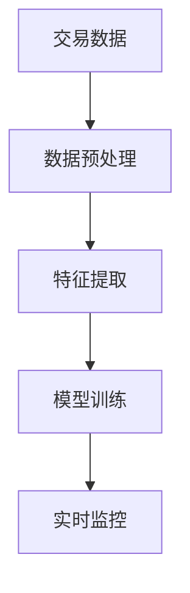
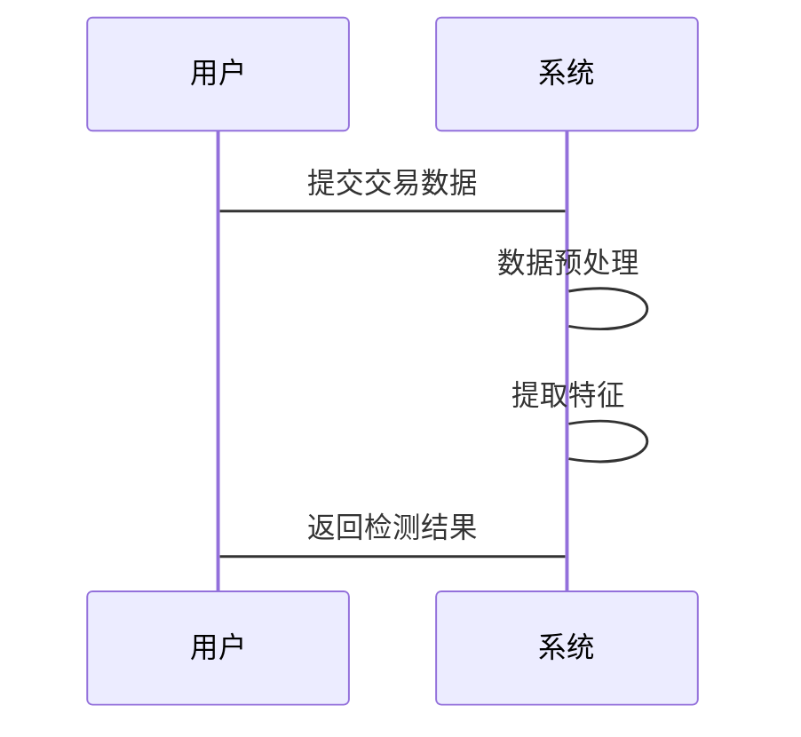

                 


# AI在反洗钱模式进化检测中的深度应用研究

> 关键词：反洗钱，人工智能，模式进化检测，机器学习，深度学习，金融安全

> 摘要：  
本文探讨了人工智能（AI）在反洗钱模式进化检测中的深度应用研究，系统性地分析了反洗钱的基本概念、AI技术的核心原理、模式进化检测的关键算法，以及如何通过AI技术实现对洗钱行为的精准识别与预测。文章从理论到实践，结合具体案例，详细阐述了AI在反洗钱领域的应用现状、技术挑战与解决方案，并展望了未来的发展方向。

---

## 第一章: 反洗钱与AI技术概述

### 1.1 反洗钱的基本概念

#### 1.1.1 什么是反洗钱
反洗钱（Anti-Money Laundering, AML）是指通过法律、行政和技术手段，识别、阻止和打击非法资金流动的行为。洗钱活动通常包括隐藏资金来源、转移资产、掩盖交易痕迹等，其目的是将非法所得合法化。

#### 1.1.2 反洗钱的目标与意义
- **目标**：识别和阻止非法资金流动，打击犯罪活动，维护金融系统的安全与稳定。
- **意义**：保护经济体系的健康发展，防止洗钱行为对社会造成危害，维护金融机构的合规性。

#### 1.1.3 反洗钱的法律法规与国际标准
- **国际标准**：FATF（金融行动特别工作组）制定的反洗钱标准。
- **国内法规**：各国根据自身情况制定的反洗钱法律，如《反洗钱法》。

### 1.2 AI技术的基本概念

#### 1.2.1 人工智能的定义与特点
人工智能（AI）是模拟人类智能的技术，包括学习、推理、自适应等能力。其特点包括数据驱动、任务导向、可扩展性和不确定性处理能力。

#### 1.2.2 机器学习与深度学习的区别
- **机器学习**：基于数据训练模型，通过经验改进性能。
- **深度学习**：一种机器学习的子领域，基于多层神经网络进行特征学习，擅长处理非结构化数据。

#### 1.2.3 当前主流AI技术的应用领域
- 金融：风险评估、欺诈检测。
- 医疗：疾病诊断、药物研发。
- 交通：自动驾驶、智能导航。

### 1.3 反洗钱与AI技术的结合

#### 1.3.1 AI在金融领域的应用现状
- 风险评估、欺诈检测、交易监控。
- 利用AI技术分析海量金融数据，识别异常交易。

#### 1.3.2 反洗钱模式进化检测的定义
模式进化检测是指通过AI技术，动态识别洗钱行为模式的变化，及时调整检测策略。

#### 1.3.3 模式进化检测的核心问题与挑战
- 数据量大、维度高。
- 洗钱手段不断进化，模型需要动态适应。

---

## 第二章: 反洗钱模式进化检测的核心概念

### 2.1 反洗钱模式进化检测的基本原理

#### 2.1.1 什么是模式进化
模式进化是指洗钱行为模式随时间变化，反洗钱系统需要不断更新检测策略。

#### 2.1.2 反洗钱模式的特征分析
- 交易频率、金额、时间、地点。
- 资金流向、账户关联性。

#### 2.1.3 模式进化检测的关键步骤
1. 数据收集与预处理。
2. 特征提取与建模。
3. 模型训练与优化。
4. 实时监控与反馈。

### 2.2 反洗钱模式进化检测的核心要素

#### 2.2.1 数据来源与特征提取
- 数据来源：银行交易记录、账户信息、IP地址。
- 特征提取：利用统计学和机器学习方法提取关键特征。

#### 2.2.2 模型训练与优化
- 使用监督学习、无监督学习等方法训练模型。
- 通过交叉验证优化模型参数。

#### 2.2.3 结果分析与反馈机制
- 对模型输出进行分析，调整检测阈值。
- 根据新数据不断优化模型。

---

## 第三章: AI技术在反洗钱中的深度应用

### 3.1 机器学习在反洗钱中的应用

#### 3.1.1 监督学习在反洗钱中的应用
- 算法：逻辑回归、随机森林。
- 应用：分类交易为正常或异常。

#### 3.1.2 无监督学习在反洗钱中的应用
- 算法：聚类分析、异常检测。
- 应用：发现隐藏的洗钱网络。

#### 3.1.3 强化学习在反洗钱中的应用
- 算法：Q-learning。
- 应用：动态调整检测策略。

### 3.2 深度学习在反洗钱中的应用

#### 3.2.1 神经网络在反洗钱中的应用
- 算法：卷积神经网络（CNN）、循环神经网络（RNN）。
- 应用：识别复杂交易模式。

#### 3.2.2 Transformer模型在反洗钱中的应用
- 算法：基于Transformer的序列模型。
- 应用：时间序列分析。

#### 3.2.3 图神经网络在反洗钱中的应用
- 算法：图卷积网络（GCN）。
- 应用：识别洗钱网络的关联性。

---

## 第四章: 模式进化检测的算法原理

### 4.1 特征提取与建模

#### 4.1.1 特征提取
- 统计特征：交易频率、金额分布。
- 行为特征：账户操作时间、IP地址。

#### 4.1.2 建模方法
- 使用主成分分析（PCA）降维。
- 使用K-means进行聚类分析。

### 4.2 异常检测与分类

#### 4.2.1 异常检测算法
- 算法：Isolation Forest。
- 实现：通过树结构隔离异常点。

#### 4.2.2 分类算法
- 算法：随机森林、XGBoost。
- 实现：基于特征训练分类器。

### 4.3 算法实现

#### 4.3.1 异常检测的数学模型
$$
\text{异常概率} = P(x|\text{异常}) = \frac{P(\text{异常}) \cdot P(x|\text{异常})}{P(x)}
$$

#### 4.3.2 分类算法的数学模型
$$
f(x) = \sum_{i=1}^{n} w_i \cdot x_i + b
$$

---

## 第五章: 系统分析与架构设计

### 5.1 系统功能设计

#### 5.1.1 功能模块
- 数据采集模块。
- 特征提取模块。
- 模型训练模块。
- 实时监控模块。

#### 5.1.2 功能流程
1. 数据采集：从银行系统获取交易数据。
2. 特征提取：提取交易特征。
3. 模型训练：训练分类器。
4. 实时监控：实时检测异常交易。

### 5.2 系统架构设计

#### 5.2.1 系统架构图


#### 5.2.2 接口设计
- 数据接口：与银行系统对接。
- API接口：提供检测服务。

#### 5.2.3 交互流程


---

## 第六章: 项目实战

### 6.1 环境搭建

#### 6.1.1 环境要求
- Python 3.8+
- TensorFlow、Scikit-learn库。

### 6.2 系统核心实现

#### 6.2.1 数据预处理
```python
import pandas as pd
df = pd.read_csv('transactions.csv')
```

#### 6.2.2 特征提取
```python
from sklearn.decomposition import PCA
pca = PCA(n_components=5)
features = pca.fit_transform(df)
```

#### 6.2.3 模型训练
```python
from sklearn.ensemble import RandomForestClassifier
model = RandomForestClassifier()
model.fit(features, labels)
```

### 6.3 案例分析

#### 6.3.1 案例介绍
分析一笔异常交易，展示模型如何识别洗钱行为。

#### 6.3.2 分析结果
- 检测到异常交易。
- 确定交易涉及的金额和时间。

### 6.4 系统优化

#### 6.4.1 模型优化
- 调整超参数。
- 使用网格搜索优化。

---

## 第七章: 总结与展望

### 7.1 总结

#### 7.1.1 主要成果
- 探讨了AI在反洗钱中的应用。
- 提出了模式进化检测的方法。

#### 7.1.2 经验与教训
- 数据质量对模型性能影响大。
- 需要不断更新模型以适应新的洗钱手段。

### 7.2 未来展望

#### 7.2.1 技术发展
- 更复杂的模型。
- 更多的数据源。

#### 7.2.2 应用前景
- 更广泛的应用场景。
- 更高的检测精度。

---

## 参考文献
1. [1] FATF, *The FATF Recommendations*, 2021.
2. [2] 周志华, *机器学习*, 清华大学出版社, 2016.

---

通过以上内容，我们可以看到，AI在反洗钱模式进化检测中的应用是一个复杂但极具潜力的领域。随着技术的进步，AI将在反洗钱中发挥越来越重要的作用。

