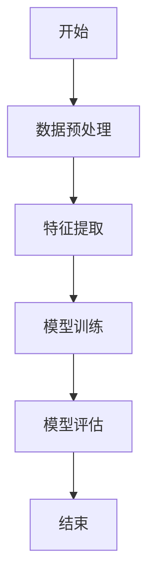
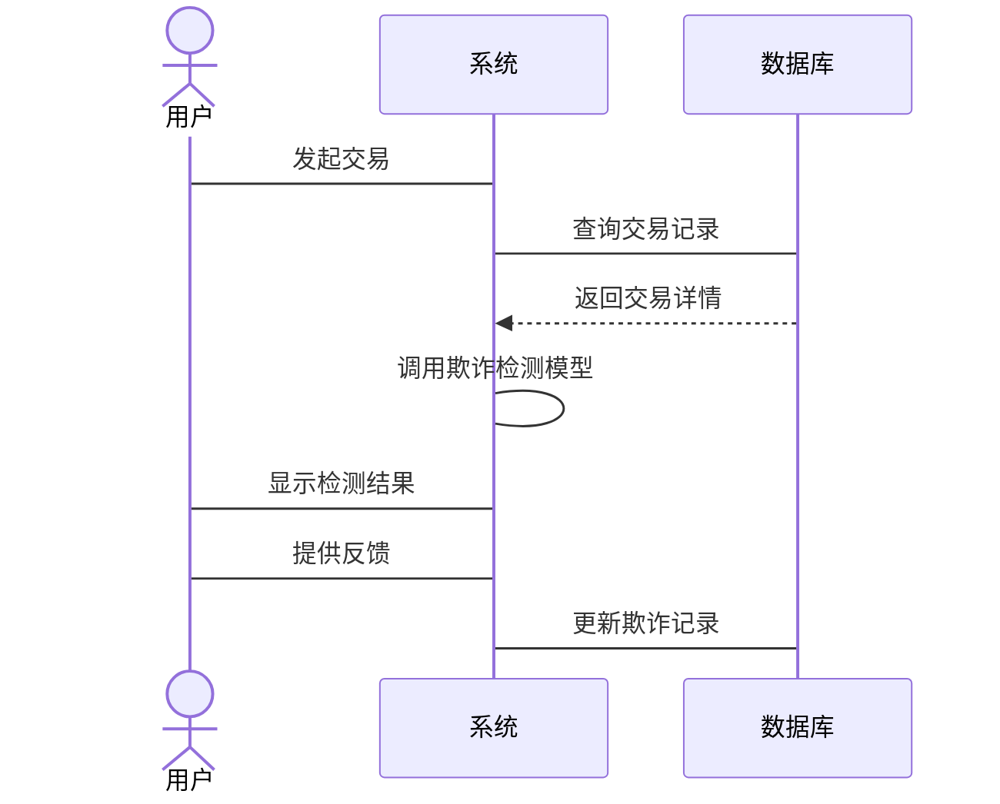

                 


# AI在反金融欺诈中的深度应用研究

> 关键词：金融欺诈、人工智能、深度学习、神经网络、机器学习、数据挖掘、风险控制

> 摘要：本文深入探讨了人工智能技术在反金融欺诈中的应用，分析了其在信用卡欺诈、网络诈骗等场景中的表现，结合系统设计与实现方案，展示了AI在提升反欺诈效率和准确性方面的巨大潜力。

---

## 第一部分：背景介绍

### 第1章：问题背景与核心概念

#### 1.1 问题背景
金融欺诈是全球性的难题，涉及信用卡欺诈、网络诈骗、洗钱等多种形式，给个人和企业造成巨大损失。传统基于规则的检测方法效率低下，难以应对日益复杂的欺诈手段。

#### 1.2 核心概念与联系
- **AI技术**：包括机器学习、深度学习和强化学习，能够从海量数据中提取特征，识别欺诈模式。
- **核心要素**：数据采集、特征提取、模型训练、实时检测和结果处理。

---

## 第二部分：核心概念与联系

### 第2章：AI技术的核心原理

#### 2.1 AI技术的核心原理
- **机器学习**：通过训练数据分类器，识别正常和欺诈交易。
- **深度学习**：利用神经网络提取高维特征，提升检测精度。
- **强化学习**：通过策略优化，实现动态风险控制。

#### 2.2 核心概念对比表格
| 比较项 | 传统机器学习 | 深度学习 |
|--------|--------------|----------|
| 数据需求 | 需大量标注数据 | 可处理未标注数据 |
| 计算能力 | 依赖特征工程 | 需大量计算资源 |

#### 2.3 ER实体关系图
```mermaid
er
  actor: 用户
  transaction: 交易记录
  fraud: 欺诈行为
  rule: 检测规则
  result: 检测结果

  actor --> transaction: 发起
  transaction --> fraud: 包含
  fraud --> rule: 应用
  rule --> result: 得到
```

---

## 第三部分：算法原理与数学模型

### 第3章：算法原理讲解

#### 3.1 算法原理
- **随机森林**：通过特征重要性分析，识别欺诈交易的关键特征。
- **神经网络**：训练深度模型，捕捉复杂模式。
- **强化学习**：通过策略优化，动态调整风险阈值。

#### 3.2 算法流程图


### 第4章：数学模型与公式

#### 4.1 逻辑回归模型
损失函数：$$L(\theta) = -\sum_{i=1}^{n} [y_i \ln h(x_i) + (1 - y_i)\ln(1 - h(x_i))]$$
其中，$$h(x) = \frac{1}{1 + e^{-\theta^T x}}$$

#### 4.2 支持向量机模型
目标函数：$$\min_{\theta, C} \frac{1}{2}\theta^T \theta + C\sum_{i=1}^{n} \xi_i$$
约束条件：$$y_i (\theta^T x_i + \xi_i) \geq 1, \xi_i \geq 0$$

---

## 第四部分：系统分析与架构设计

### 第5章：系统分析与架构设计

#### 5.1 系统架构设计


#### 5.2 系统接口设计
- 数据接口：与银行数据库对接，获取交易数据。
- 用户接口：展示检测结果，提供反馈渠道。
- 模型接口：与第三方服务集成，共享欺诈特征。

#### 5.3 系统交互流程


---

## 第五部分：项目实战

### 第6章：项目实战

#### 6.1 环境安装
- Python 3.8+
- 安装库：pip install scikit-learn tensorflow keras

#### 6.2 核心代码实现
```python
import numpy as np
from sklearn.ensemble import RandomForestClassifier
from tensorflow.keras.models import Sequential
from tensorflow.keras.layers import Dense

# 数据预处理
data = np.load('fraud_dataset.npy')
X = data[:, :-1]
y = data[:, -1]

# 训练随机森林模型
model RF = RandomForestClassifier()
RF.fit(X_train, y_train)

# 训练神经网络模型
model NN = Sequential()
NN.add(Dense(64, activation='relu', input_dim=X_train.shape[1]))
NN.add(Dense(1, activation='sigmoid'))
NN.compile(optimizer='adam', loss='binary_crossentropy', metrics=['accuracy'])
NN.fit(X_train, y_train, epochs=10, batch_size=32)
```

#### 6.3 实际案例分析
案例：信用卡欺诈检测
- 数据预处理：清洗和归一化交易数据。
- 特征提取：提取交易金额、时间间隔、地理位置等特征。
- 模型训练：使用随机森林和神经网络分别训练。
- 结果分析：评估模型准确率、召回率和F1分数。

---

## 第六部分：最佳实践

### 第7章：最佳实践

#### 7.1 总结与经验
- 数据质量至关重要，需清洗和标注。
- 模型选择需结合场景，深度学习适合高维数据。
- 实时性要求高，优化模型推理速度。

#### 7.2 注意事项
- 数据隐私保护，遵守相关法规。
- 定期更新模型，应对新型欺诈手段。
- 避免过拟合，保持模型泛化能力。

#### 7.3 拓展阅读
推荐书籍：《机器学习实战》、《深度学习》
推荐论文：金融欺诈检测的经典研究

---

通过以上内容，本文系统地介绍了AI在反金融欺诈中的应用，从理论到实践，为读者提供了全面的视角和实用的指导。希望本文能为金融行业从业者和技术爱好者提供有价值的参考。

