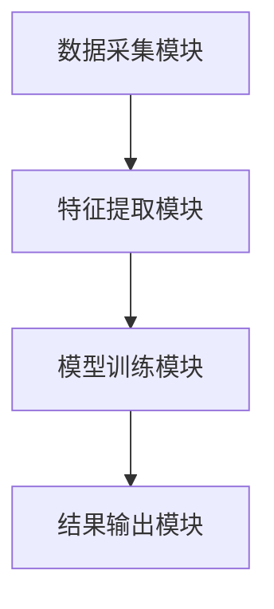

                 


# AI在反金融犯罪模式识别中的深度应用研究

**关键词**：人工智能，反金融犯罪，模式识别，深度学习，金融安全

**摘要**：  
本文探讨了人工智能技术在反金融犯罪模式识别中的深度应用，重点分析了AI技术的核心原理、模式识别的基本概念、常见算法及其在金融犯罪检测中的具体应用。通过系统分析与架构设计，结合实际项目案例，展示了如何利用AI技术有效识别和预防金融犯罪行为。文章还讨论了数学模型、系统架构、接口设计以及实际项目实现中的关键问题，并提出了未来的研究方向和优化建议。

---

# 第一章: 反金融犯罪模式识别的背景与意义

## 1.1 金融犯罪的现状与挑战
### 1.1.1 金融犯罪的主要类型
金融犯罪是指通过欺骗、欺诈或其他非法手段获取不正当经济利益的行为，主要包括：
- **欺诈交易**：信用卡欺诈、虚假交易。
- **洗钱**：通过复杂交易掩盖资金来源。
- **内幕交易**：利用未公开信息进行股票交易。
- **伪造票据**：伪造支票、汇票等金融工具。
- **网络诈骗**：通过钓鱼攻击、虚假网站进行诈骗。

### 1.1.2 传统反金融犯罪手段的局限性
传统的反金融犯罪手段主要包括人工审核、规则-based检测和简单的统计分析。然而，这些方法存在以下问题：
- **效率低**：人工审核耗时耗力，难以应对海量交易数据。
- **漏检率高**：规则-based检测依赖预定义规则，难以捕捉新型犯罪模式。
- **误报率高**：统计方法缺乏深度学习能力，容易将正常交易误判为异常。

### 1.1.3 金融犯罪的智能化与隐蔽化趋势
随着技术的发展，金融犯罪手段日益智能化和隐蔽化：
- 犯罪分子利用技术漏洞进行攻击。
- 利用大数据和AI技术掩盖犯罪行为。
- 通过复杂的多层交易掩盖资金流动。

---

## 1.2 AI技术在金融安全领域的应用前景
### 1.2.1 AI技术在金融领域的核心优势
AI技术在金融领域的优势体现在以下几个方面：
- **高效性**：能够快速处理海量数据。
- **准确性**：通过深度学习模型提高识别精度。
- **适应性**：能够动态适应新的犯罪模式。

### 1.2.2 深度学习在金融犯罪识别中的潜力
深度学习技术在模式识别中的应用潜力巨大：
- **特征提取**：能够自动提取复杂的特征。
- **非线性关系**：能够捕捉复杂的模式。
- **实时性**：能够实时处理交易数据。

### 1.2.3 反金融犯罪模式识别的定义与目标
反金融犯罪模式识别的目标是通过AI技术识别异常交易模式，预防和打击金融犯罪。其核心任务包括：
- 异常检测：识别偏离正常交易模式的异常行为。
- 类别分类：将交易分为正常和异常类别。
- 关联分析：发现跨交易的关联性。

---

## 1.3 模式识别在反金融犯罪中的应用
### 1.3.1 模式识别的基本概念
模式识别是指通过计算机技术识别和分类模式，包括图像、声音、文本和交易数据等。其核心是利用算法从数据中提取特征并进行分类。

### 1.3.2 模式识别在金融犯罪中的具体应用
模式识别在金融犯罪中的应用包括：
- 信用卡欺诈检测：通过交易模式识别异常交易。
- 洗钱识别：通过资金流动模式识别洗钱行为。
- 股票市场操纵检测：通过交易模式识别操纵行为。

### 1.3.3 模式识别与反金融犯罪模式识别的边界与外延
模式识别的边界在于数据的特征提取和分类，而反金融犯罪模式识别的外延则包括交易数据的分析和关联性挖掘。

---

## 1.4 本章小结
本章介绍了金融犯罪的主要类型及其智能化趋势，分析了AI技术在金融安全领域的应用前景，并详细阐述了模式识别在反金融犯罪中的具体应用。

---

# 第二章: AI与模式识别的核心概念与联系

## 2.1 AI技术的基本原理
### 2.1.1 人工智能的基本定义
人工智能（AI）是指计算机系统模拟人类智能的能力，包括学习、推理、自适应等。

### 2.1.2 机器学习的核心原理
机器学习是一种通过数据训练模型的技术，分为监督学习、无监督学习和强化学习。

### 2.1.3 深度学习的基本概念
深度学习是一种基于神经网络的机器学习技术，能够自动提取数据特征。

---

## 2.2 模式识别的核心原理
### 2.2.1 模式识别的基本流程
模式识别的基本流程包括数据采集、特征提取、分类器设计和结果输出。

### 2.2.2 特征提取与分类的基本原理
特征提取是模式识别的关键步骤，分类器则是基于特征进行分类的核心。

### 2.2.3 模式识别的数学基础
模式识别涉及线性代数、概率论和统计学等数学知识。

---

## 2.3 AI与模式识别的联系与区别
### 2.3.1 AI与模式识别的联系
AI为模式识别提供了强大的计算能力和算法支持。

### 2.3.2 模式识别与传统统计方法的区别
模式识别结合了AI技术，能够处理更复杂的数据。

### 2.3.3 AI在模式识别中的创新应用
深度学习技术在模式识别中的创新应用包括图像识别和自然语言处理。

---

## 2.4 本章小结
本章分析了AI与模式识别的核心概念及其在反金融犯罪中的联系。

---

# 第三章: 反金融犯罪模式识别中的算法原理

## 3.1 常见算法及其在反金融犯罪中的应用
### 3.1.1 随机森林算法
随机森林是一种基于决策树的集成学习算法，适用于分类和回归任务。

### 3.1.2 神经网络算法
神经网络是一种受生物神经元启发的计算模型，适用于复杂模式识别。

---

## 3.2 算法的数学模型与公式
### 3.2.1 随机森林的损失函数
随机森林的损失函数用于衡量模型预测值与真实值的差异：
$$ L(y, \hat{y}) = \sum_{i=1}^{n} (y_i - \hat{y}_i)^2 $$

### 3.2.2 神经网络的激活函数
神经网络常用的激活函数包括sigmoid和ReLU：
$$ \sigma(x) = \frac{1}{1 + e^{-x}} $$
$$ ReLU(x) = \max(0, x) $$

---

## 3.3 算法实现与优化
### 3.3.1 算法实现步骤
- 数据预处理：归一化、特征选择。
- 模型训练：选择合适的算法并调整参数。
- 模型评估：通过准确率、召回率等指标评估性能。

### 3.3.2 算法优化策略
- 调参：通过网格搜索优化模型参数。
- 特征工程：选择更有区分度的特征。
- 集成学习：通过集成多个模型提高性能。

---

## 3.4 本章小结
本章详细讲解了随机森林和神经网络算法在反金融犯罪中的应用，并给出了算法的数学模型和优化策略。

---

# 第四章: 反金融犯罪模式识别的系统架构设计

## 4.1 系统架构概述
反金融犯罪模式识别系统包括数据采集、特征提取、模型训练和结果输出四个模块。

---

## 4.2 系统功能设计
### 4.2.1 数据采集模块
数据采集模块负责收集交易数据，包括时间戳、金额、交易类型等。

### 4.2.2 特征提取模块
特征提取模块从交易数据中提取特征，如交易频率、金额分布等。

### 4.2.3 模型训练模块
模型训练模块基于特征训练分类模型，用于识别异常交易。

### 4.2.4 结果输出模块
结果输出模块将模型预测结果输出，用于后续分析和决策。

---

## 4.3 系统架构图


---

## 4.4 系统接口设计
### 4.4.1 数据接口
- 数据输入接口：接收交易数据。
- 数据输出接口：输出特征提取结果。

### 4.4.2 模型接口
- 模型训练接口：训练分类模型。
- 模型预测接口：预测交易类别。

---

## 4.5 本章小结
本章设计了反金融犯罪模式识别系统的整体架构，并详细描述了各模块的功能和接口设计。

---

# 第五章: 反金融犯罪模式识别的项目实战

## 5.1 项目背景与目标
本项目旨在通过AI技术实现银行欺诈交易的检测。

---

## 5.2 项目实施步骤
### 5.2.1 环境配置
安装Python、scikit-learn、TensorFlow等工具。

### 5.2.2 数据预处理
对交易数据进行归一化处理，并提取特征。

### 5.2.3 模型训练
选择随机森林算法训练分类模型。

### 5.2.4 模型评估
通过准确率、召回率等指标评估模型性能。

---

## 5.3 项目代码实现
### 5.3.1 数据预处理代码
```python
import pandas as pd
from sklearn.preprocessing import StandardScaler

# 加载数据
data = pd.read_csv('transactions.csv')

# 特征提取
features = data[['amount', 'time', 'transaction_type']]
target = data['is_fraud']

# 数据标准化
scaler = StandardScaler()
features_scaled = scaler.fit_transform(features)
```

### 5.3.2 模型训练代码
```python
from sklearn.ensemble import RandomForestClassifier

# 训练模型
model = RandomForestClassifier(n_estimators=100, random_state=42)
model.fit(features_scaled, target)
```

### 5.3.3 模型评估代码
```python
from sklearn.metrics import accuracy_score, recall_score

# 预测结果
y_pred = model.predict(features_scaled)

# 评估指标
accuracy = accuracy_score(target, y_pred)
recall = recall_score(target, y_pred)
print(f'准确率：{accuracy}, 召回率：{recall}')
```

---

## 5.4 本章小结
本章通过一个实际项目展示了反金融犯罪模式识别的实施过程，包括数据预处理、模型训练和评估。

---

# 第六章: 总结与展望

## 6.1 总结
本文详细探讨了AI技术在反金融犯罪模式识别中的应用，分析了常见算法及其优化策略，并设计了一个完整的系统架构。

## 6.2 未来研究方向
未来的研究方向包括：
- 更复杂的深度学习模型。
- 实时交易监控系统。
- 多模态数据融合技术。

## 6.3 注意事项与最佳实践
- 数据隐私保护。
- 模型解释性。
- 系统稳定性。

## 6.4 拓展阅读
推荐阅读《机器学习实战》和《深度学习入门》等书籍。

---

# 结语

通过本文的探讨，我们可以看到AI技术在反金融犯罪中的巨大潜力。未来，随着技术的不断发展，反金融犯罪模式识别将更加智能化和高效化。

