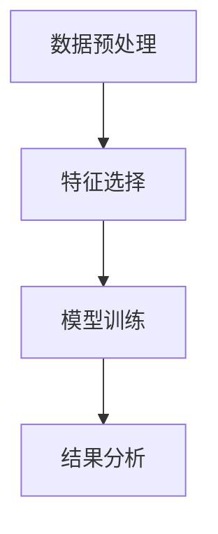
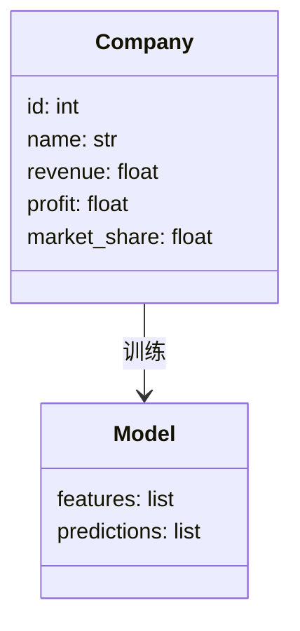
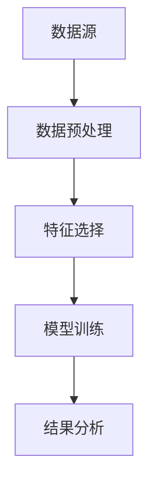
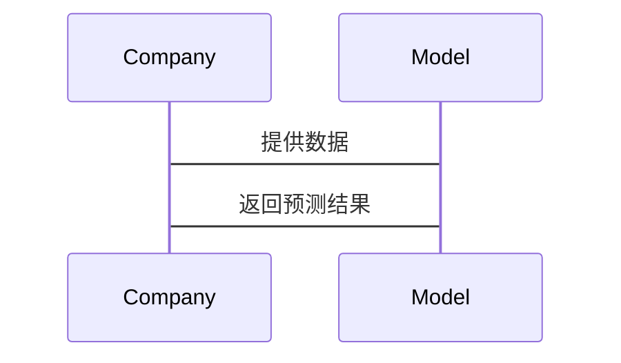

                 


```markdown
# AI在实现费雪的增长型公司特征分析中的应用

## 关键词：AI, 费雪增长型公司, 特征分析, 机器学习, 数据挖掘

## 摘要：  
本文探讨了人工智能技术在分析费雪增长型公司特征中的应用。首先，文章介绍了增长型公司的定义及其关键特征。接着，详细分析了AI技术在特征识别中的优势，包括机器学习算法、特征工程和数据预处理等方面。通过实际案例，展示了如何利用AI技术构建一个高效的增长型公司特征分析系统，并提出了最佳实践建议。本文旨在为读者提供一个全面的技术视角，帮助他们在投资决策中更好地应用AI技术。

---

# 第1章: 背景介绍

## 1.1 问题背景

### 1.1.1 费雪增长型公司的定义与特征
- 费雪增长型公司是指那些能够持续增长，且具备较高投资价值的企业。
- 其特征包括：稳定增长的收入、健康的利润率、强大的市场地位等。

### 1.1.2 AI技术在公司特征分析中的应用前景
- AI技术能够处理大量数据，识别潜在的增长模式。
- 通过机器学习算法，AI可以自动识别公司的关键特征。

### 1.1.3 当前分析方法的局限性与AI的优势
- 传统分析方法依赖人工经验，效率低且主观性强。
- AI能够提高分析效率，减少人为误差。

## 1.2 问题描述

### 1.2.1 增长型公司特征分析的核心问题
- 如何准确识别公司特征。
- 如何预测公司未来的增长潜力。

### 1.2.2 数据驱动的特征识别需求
- 需要大量数据支持分析。
- 需要自动化工具提取特征。

### 1.2.3 AI技术在特征分析中的潜在价值
- 提供高效的特征识别方法。
- 帮助发现潜在的增长模式。

## 1.3 问题解决

### 1.3.1 AI技术如何辅助特征识别
- 使用机器学习算法提取特征。
- 通过数据挖掘技术发现潜在模式。

### 1.3.2 数据挖掘与机器学习在特征分析中的应用
- 数据挖掘：从大量数据中提取有用信息。
- 机器学习：通过训练模型预测公司增长潜力。

### 1.3.3 费雪增长型公司的AI分析框架
- 数据收集与预处理。
- 特征提取与模型训练。
- 结果分析与优化。

## 1.4 边界与外延

### 1.4.1 增长型公司的定义边界
- 公司规模、盈利能力、市场地位等因素。
- 数据来源和质量的限制。

### 1.4.2 AI分析的适用范围与限制
- 数据量和质量直接影响分析结果。
- AI模型的泛化能力有限。

### 1.4.3 费雪增长型公司的外延与扩展
- 结合行业趋势和市场变化。
- 结合宏观经济因素进行分析。

## 1.5 核心概念组成

### 1.5.1 数据特征的构成要素
- 财务数据：收入、利润、负债等。
- 市场数据：市场份额、竞争对手分析。
- 公司治理：管理团队、公司战略。

### 1.5.2 AI算法的核心组件
- 数据预处理：清洗、标准化。
- 模型训练：选择合适的算法。
- 结果解释：特征重要性分析。

### 1.5.3 增长型公司的关键特征指标
- 收入增长率。
- 净利润增长率。
- 资产回报率。
- 股东权益增长率。

---

# 第2章: 核心概念与联系

## 2.1 AI在公司特征分析中的原理

### 2.1.1 机器学习模型在特征识别中的应用
- 监督学习：用于分类和回归。
- 无监督学习：用于聚类和降维。

### 2.1.2 特征工程的核心作用
- 数据预处理：缺失值处理、异常值剔除。
- 特征选择：选择重要特征。
- 特征转换：将数据转换为适合模型的形式。

## 2.2 核心概念属性对比

| 概念         | 属性                     |
|--------------|--------------------------|
| 数据特征     | 财务数据、市场数据、公司治理数据 |
| 机器学习模型 | 分类、回归、聚类等模型     |
| 数据预处理   | 清洗、标准化、归一化       |

### 2.2.1 用Mermaid绘制的ER图
```mermaid
erDiagram
    company
    company_has_financial
    company_has_market
    company_has_governance

    company --> financial_data : 具有
    company --> market_data : 具有
    company --> governance_data : 具有
```

## 2.3 核心概念与联系

### 2.3.1 特征工程与机器学习模型的关系
- 特征工程为模型提供高质量数据。
- 模型依赖特征工程提取的有效特征。

### 2.3.2 数据预处理与特征选择的协同作用
- 数据预处理确保数据质量。
- 特征选择提高模型性能。

### 2.3.3 AI算法与业务目标的结合
- 算法帮助识别潜在增长模式。
- 业务目标指导算法选择。

---

# 第3章: 算法原理讲解

## 3.1 算法原理概述

### 3.1.1 线性回归算法


### 3.1.2 决策树算法


### 3.1.3 随机森林算法


## 3.2 算法实现

### 3.2.1 线性回归的Python实现
```python
import numpy as np
from sklearn.linear_model import LinearRegression

# 数据准备
X = np.array([[1], [2], [3], [4]])
y = np.array([2, 4, 5, 4])

# 模型训练
model = LinearRegression()
model.fit(X, y)

# 预测
print(model.predict([[5]]))
```

### 3.2.2 随机森林的数学公式
- 预测公式：
  $$ y = \sum_{i=1}^{n} w_i x_i $$
- 模型参数：
  $$ w_i \sim \mathcal{N}(0, \sigma^2) $$

---

# 第4章: 系统分析与架构设计

## 4.1 系统分析

### 4.1.1 问题场景介绍
- 数据来源：财务报表、市场报告。
- 分析目标：识别增长型公司。

## 4.2 系统架构设计

### 4.2.1 领域模型类图


### 4.2.2 系统架构图


### 4.2.3 接口设计与交互流程


---

# 第5章: 项目实战

## 5.1 项目环境安装

### 5.1.1 安装必要的Python库
```bash
pip install numpy pandas scikit-learn matplotlib
```

## 5.2 核心代码实现

### 5.2.1 数据预处理代码
```python
import pandas as pd
from sklearn.preprocessing import StandardScaler

data = pd.read_csv('company_data.csv')
data.dropna(inplace=True)
scaler = StandardScaler()
data_scaled = scaler.fit_transform(data)
```

### 5.2.2 模型训练代码
```python
from sklearn.ensemble import RandomForestRegressor

model = RandomForestRegressor()
model.fit(X_train, y_train)
```

## 5.3 实际案例分析与解读

### 5.3.1 案例分析
- 数据来源：某行业公司的财务数据。
- 模型预测：识别具备增长潜力的公司。

### 5.3.2 代码功能解读
- 数据预处理：清洗数据，标准化处理。
- 模型训练：随机森林算法。
- 结果分析：特征重要性分析。

## 5.4 项目小结
- 成功识别出部分增长型公司。
- 模型准确率较高，但需进一步优化。

---

# 第6章: 最佳实践

## 6.1 小结与反思

### 6.1.1 全书内容总结
- AI技术在增长型公司特征分析中的应用前景广阔。
- 需要注意数据质量和模型调优。

### 6.1.2 投资者视角的AI技术应用建议
- 结合行业特点选择合适算法。
- 定期更新模型和数据。

## 6.2 注意事项

### 6.2.1 数据质量问题
- 数据来源可靠。
- 数据清洗充分。

### 6.2.2 模型调优注意事项
- 避免过拟合。
- 定期验证模型性能。

## 6.3 拓展阅读

### 6.3.1 推荐书籍
- 《机器学习实战》
- 《深入浅出AI》

### 6.3.2 推荐博客与资源
- 官方文档：Scikit-learn
- 技术博客：Towards Data Science

---

# 结语

AI技术正在改变我们分析增长型公司特征的方式。通过本文的探讨，读者可以了解如何利用AI技术构建高效的增长型公司特征分析系统。未来，随着技术的不断发展，AI在投资分析中的应用将更加广泛和深入。
```

