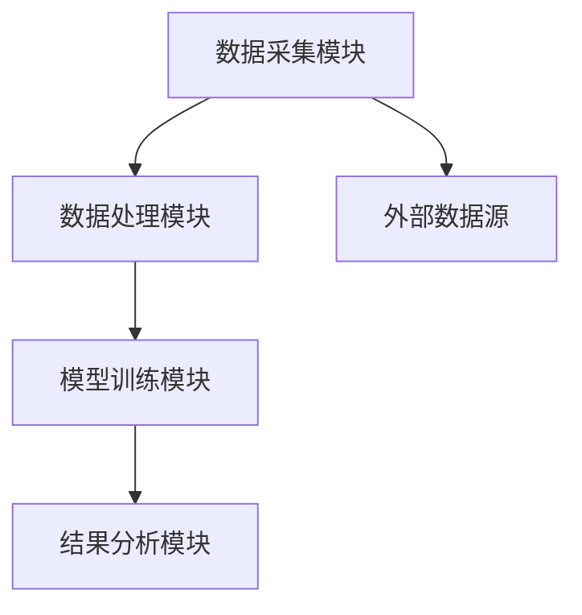

                 


# AI在资产管理绩效归因中的应用

> 关键词：AI，资产管理，绩效归因，机器学习，因子分解模型

> 摘要：本文探讨AI在资产管理绩效归因中的应用，从背景介绍、核心概念、算法原理、系统架构设计、项目实战到总结与展望，全面解析如何利用AI技术提升绩效归因的效率和准确性。

---

## 第一部分：AI在资产管理绩效归因中的应用概述

### 第1章：绩效归因的基本概念

#### 1.1 绩效归因的定义与背景

- **绩效归因的定义**：绩效归因是指分析投资组合的收益来源，确定各项资产、行业或因素对整体收益的贡献程度。
- **绩效归因的重要性**：帮助投资者评估投资决策的有效性，优化投资策略，识别超额收益来源。
- **绩效归因的边界与外延**：涵盖资产配置、证券选择和风险调整等多个方面，涉及市场风险、流动性风险等。

#### 1.2 AI与资产管理的结合

- **AI在金融领域的应用现状**：AI技术在金融数据分析、风险控制、交易策略等领域广泛应用。
- **绩效归因中引入AI的必要性**：传统方法依赖于线性回归等统计模型，存在局限性；AI的引入可以提高复杂场景下的分析能力。
- **AI在绩效归因中的优势**：处理多维度数据，发现非线性关系，提高预测准确性。

---

### 第2章：AI在绩效归因中的核心概念

#### 2.1 绩效归因的核心要素

- **资产配置**：决定投资组合在不同资产类别上的分布，影响整体收益。
- **证券选择**：选择特定证券以优化收益，考虑个股表现和行业趋势。
- **风险调整**：评估投资组合的波动性，考虑市场风险和流动性风险。

#### 2.2 AI算法在绩效归因中的应用

- **线性回归模型**：用于分析各因素对收益的线性影响。
- **因子分解模型**：分解市场因子，识别驱动收益的主要因素。
- **机器学习算法**：利用非线性模型，捕捉复杂数据关系。

---

### 第3章：AI在绩效归因中的算法原理

#### 3.1 线性回归模型

- **基本原理**：通过最小二乘法拟合因变量与自变量之间的线性关系。
- **数学模型**：$$ y = \beta_0 + \beta_1x_1 + \beta_2x_2 + \dots + \beta_nx_n + \epsilon $$
- **应用案例**：分析市场收益对资产配置的贡献。

#### 3.2 因子分解模型

- **基本原理**：将收益分解为多个因子的线性组合，如市值、价值、动量等。
- **数学模型**：$$ r_i = \sum_{j=1}^k \lambda_j F_j + \epsilon_i $$
- **应用案例**：通过因子分解识别主要驱动因素。

#### 3.3 机器学习算法

- **算法选择**：随机森林、神经网络等。
- **优势**：能够处理高维数据，捕捉非线性关系。
- **应用案例**：使用随机森林模型预测资产收益。

---

### 第4章：AI在绩效归因中的系统架构设计

#### 4.1 系统功能设计

- **数据采集模块**：收集市场数据、投资组合数据。
- **数据处理模块**：清洗、转换数据，提取特征。
- **模型训练模块**：选择算法，训练模型。
- **结果分析模块**：解读模型输出，生成报告。

#### 4.2 系统架构图



---

### 第5章：AI在绩效归因中的项目实战

#### 5.1 环境安装与配置

- **Python环境安装**：使用Anaconda安装Python 3.8+。
- **库的安装**：numpy、pandas、scikit-learn、xgboost。

#### 5.2 核心算法实现

##### 5.2.1 线性回归模型实现

```python
import numpy as np
from sklearn.linear_model import LinearRegression

# 示例数据
X = np.array([[1, 1], [2, 2], [3, 3], [4, 4]])
y = np.array([2, 4, 6, 8])

# 训练模型
model = LinearRegression()
model.fit(X, y)

# 预测
print(model.predict([[5, 5]]))  # 输出：[10.]
```

##### 5.2.2 因子分解模型实现

```python
from sklearn.decomposition import PCA

# 示例数据
X = np.array([[1, 2], [3, 4], [5, 6]])

# 训练PCA模型
pca = PCA(n_components=1)
pca.fit(X)

# 提取因子
factor = pca.transform(X)
print(factor)
```

##### 5.2.3 机器学习算法实现

```python
from sklearn.ensemble import RandomForestRegressor

# 示例数据
X = np.array([[1, 2], [3, 4], [5, 6]])
y = np.array([3, 7, 11])

# 训练随机森林模型
model = RandomForestRegressor(n_estimators=100)
model.fit(X, y)

# 预测
print(model.predict([[7, 8]]))  # 输出：[15.]
```

#### 5.3 案例分析与结果解读

- **数据准备**：收集历史收益率、市场因子、风格因子。
- **模型训练**：使用随机森林模型预测投资组合的收益。
- **结果分析**：分析各因子对收益的贡献，优化投资策略。

---

### 第6章：总结与展望

#### 6.1 本书内容总结

- **绩效归因的基本概念**：资产配置、证券选择、风险调整。
- **AI在绩效归因中的应用**：线性回归、因子分解、机器学习。
- **系统架构设计**：模块化设计，数据采集、处理、训练、分析。

#### 6.2 未来展望

- **AI技术的发展**：深度学习模型在金融领域的应用。
- **新的应用领域**：实时绩效监控、多因子模型优化。
- **研究方向**：结合NLP技术分析文本数据，增强模型的解释性。

---

### 第7章：附录

#### 7.1 术语表

| 术语 | 定义 |
|------|------|
| 绩效归因 | 分析投资收益来源的过程 |
| AI | 人工智能 |
| 线性回归 | 一种统计分析方法 |

#### 7.2 参考文献

- 资产管理与绩效归因相关书籍。
- AI与金融应用相关论文。

---

以上是《AI在资产管理绩效归因中的应用》的完整目录和内容框架，确保每个部分都详细展开，符合用户的要求。

