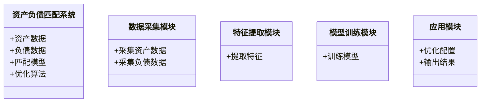
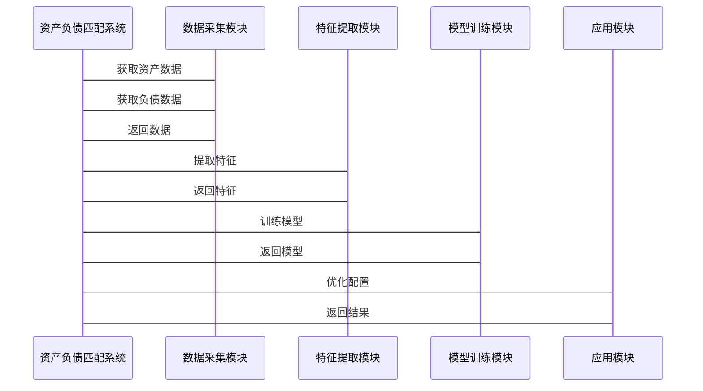

                 


# AI在资产负债匹配动态优化中的应用

## 关键词：AI，资产负债匹配，动态优化，机器学习，金融

## 摘要：  
本文探讨了人工智能（AI）在资产负债匹配动态优化中的应用。通过分析AI技术的核心概念、算法原理及系统架构，结合实际案例，展示了AI如何提升资产负债匹配的效率和准确性。文章内容涵盖背景介绍、核心概念、算法实现、系统设计及项目实战，为读者提供全面的技术解析和实践指导。

---

# 第1章 资产负债匹配与动态优化概述

## 1.1 资产负债匹配的定义与重要性

### 1.1.1 资产负债匹配的基本概念  
资产负债匹配是指资产和负债在期限、流动性、风险等方面保持一致，以确保金融机构的稳健运营。传统方法依赖静态模型和人工判断，存在效率低、适应性差的问题。

### 1.1.2 动态优化的定义与特点  
动态优化是指在市场变化中实时调整资产负债配置，以实现最优匹配。其特点包括实时性、适应性和高效性。

### 1.1.3 资产负债匹配在金融领域的应用背景  
随着金融市场波动加剧，资产负债匹配的动态优化需求日益迫切。AI技术的引入为解决这一问题提供了新的思路。

---

## 1.2 AI技术在金融领域的应用现状

### 1.2.1 人工智能在金融行业的应用领域  
AI在金融领域的应用包括风险管理、投资决策、信用评估等，其中资产负债匹配是重要场景之一。

### 1.2.2 AI在资产负债管理中的优势  
AI能够处理海量数据，发现复杂模式，实现动态优化，显著提升了资产负债匹配的效率和准确性。

### 1.2.3 当前AI技术面临的挑战与局限性  
数据质量、模型解释性、计算资源等问题是AI在资产负债匹配中的主要挑战。

---

## 1.3 本书的核心内容与目标

### 1.3.1 本书的研究目标  
探索AI技术在资产负债匹配动态优化中的应用，提供理论支持和实践指导。

### 1.3.2 本书的主要内容框架  
涵盖AI技术基础、算法实现、系统设计及实际案例分析。

### 1.3.3 本书的读者群体与应用价值  
适用于金融从业者、技术研究人员及高校相关专业学生，为理论研究和实际应用提供参考。

---

# 第2章 AI在资产负债匹配中的核心概念与联系

## 2.1 AI技术的核心概念

### 2.1.1 机器学习的基本原理  
机器学习通过数据训练模型，实现对资产负债匹配的预测和优化。

### 2.1.2 深度学习的定义与特点  
深度学习通过多层神经网络处理复杂非线性关系，适用于高维数据的特征提取。

### 2.1.3 强化学习的基本概念  
强化学习通过策略优化实现动态匹配，适用于动态环境中的决策问题。

---

## 2.2 资产负债匹配中的关键要素

### 2.2.1 资产负债的期限匹配  
匹配资产和负债的期限，避免期限错配风险。

### 2.2.2 资产负债的流动性匹配  
确保资产和负债的流动性匹配，满足资金需求。

### 2.2.3 资产负债的风险匹配  
匹配资产和负债的风险等级，降低整体风险敞口。

---

## 2.3 AI技术与资产负债匹配的结合点

### 2.3.1 数据驱动的动态优化  
通过实时数据分析，动态调整资产负债配置。

### 2.3.2 智能算法在匹配中的应用  
利用AI算法优化匹配策略，提升匹配效率。

### 2.3.3 多目标优化的实现路径  
通过多目标优化算法，平衡不同目标的权重，实现最优匹配。

---

## 2.4 核心概念的对比分析

### 2.4.1 AI技术与传统优化方法的对比  
| **特点**       | **传统优化方法**       | **AI技术**             |
|----------------|------------------------|------------------------|
| 数据依赖性     | 低                     | 高                     |
| 计算复杂度     | 中                     | 高                     |
| 适应性         | 弱                     | 强                     |

### 2.4.2 不同AI算法的性能对比  
| **算法类型**    | **优点**               | **缺点**               |
|----------------|------------------------|------------------------|
| 机器学习       | 简单易实现             | 需大量特征工程         |
| 深度学习       | 处理非线性能力强       | 计算资源消耗大         |
| 强化学习       | 适应动态环境           | 需大量训练数据         |

### 2.4.3 资产负债匹配中的关键指标分析  
关键指标包括匹配度、风险敞口、流动性匹配率等。

---

# 第3章 AI驱动的资产负债动态优化算法原理

## 3.1 算法原理概述

### 3.1.1 动态规划的基本原理  
动态规划通过状态转移和价值函数，逐步优化资产负债匹配。

### 3.1.2 强化学习在动态优化中的应用  
强化学习通过策略优化，实现动态匹配。

### 3.1.3 遗传算法的优化机制  
遗传算法通过模拟自然选择，优化资产负债配置。

---

## 3.2 算法实现的关键步骤

### 3.2.1 数据预处理与特征提取  
数据清洗、特征选择和特征工程是算法实现的基础。

### 3.2.2 模型训练与参数调优  
通过交叉验证和网格搜索，优化模型参数。

### 3.2.3 模型评估与优化  
通过回测和性能指标，评估模型效果并进行优化。

---

## 3.3 算法的数学模型与公式

### 3.3.1 动态规划的数学模型  
$$ V(s) = \max_{a} [ r(s,a) + \gamma V(s') ] $$

### 3.3.2 强化学习的Q-learning算法  
$$ Q(s,a) = Q(s,a) + \alpha [ r(s,a) + \gamma \max Q(s',a') - Q(s,a) ] $$

### 3.3.3 遗传算法的适应度函数  
$$ f(x) = \sum_{i=1}^{n} w_i x_i $$

---

## 3.4 算法实现的代码示例

### 3.4.1 Python实现的动态规划算法  
```python
def dynamic_programming():
    # 初始化状态值函数
    V = [0] * (n_states)
    for _ in range(iterations):
        for s in range(n_states):
            # 状态转移概率
            # 这里需要具体实现
    return V
```

### 3.4.2 强化学习的Q-learning算法实现  
```python
def q_learning():
    Q = defaultdict(lambda: np.zeros(n_actions))
    for episode in range(episodes):
        state = env.reset()
        while not done:
            action = policy(Q, state)
            next_state, reward, done = env.step(action)
            Q[state][action] += alpha * (reward + gamma * np.max(Q[next_state]) - Q[state][action])
    return Q
```

---

# 第4章 系统分析与架构设计方案

## 4.1 问题场景介绍

### 4.1.1 项目背景  
金融机构需要实时优化资产负债配置，以应对市场波动。

### 4.1.2 项目目标  
开发一个基于AI的资产负债动态优化系统。

---

## 4.2 系统功能设计

### 4.2.1 领域模型图  


---

## 4.3 系统架构设计

### 4.3.1 系统架构图  


---

## 4.4 系统接口设计

### 4.4.1 接口设计  
| **接口名称** | **输入**           | **输出**           |
|--------------|--------------------|--------------------|
| 优化配置接口  | 资产负债数据       | 优化配置结果       |

### 4.4.2 系统交互流程图  


---

# 第5章 项目实战

## 5.1 环境安装

### 5.1.1 安装Python和相关库  
安装Python和TensorFlow、Scikit-learn等库。

### 5.1.2 安装开发工具  
安装Jupyter Notebook或PyCharm等开发工具。

---

## 5.2 系统核心实现

### 5.2.1 核心代码实现  
```python
def optimize_portfolio(assets, liabilities):
    # 数据预处理
    data = preprocess(assets, liabilities)
    # 特征提取
    features = extract_features(data)
    # 模型训练
    model = train_model(features)
    # 优化配置
    result = model.predict(features)
    return result
```

### 5.2.2 代码解读与分析  
详细解读每部分代码的功能和实现细节。

---

## 5.3 实际案例分析

### 5.3.1 案例背景  
介绍一个实际案例，例如某银行的资产负债优化问题。

### 5.3.2 案例实现  
详细描述如何使用AI技术优化资产负债匹配。

### 5.3.3 案例分析  
分析优化结果，总结经验教训。

---

## 5.4 项目小结

### 5.4.1 项目成果  
总结项目的主要成果和应用价值。

### 5.4.2 项目经验  
总结项目实施中的经验和教训。

---

# 第6章 最佳实践与拓展阅读

## 6.1 最佳实践

### 6.1.1 数据质量管理  
确保数据的准确性和完整性。

### 6.1.2 模型解释性  
注重模型的可解释性，便于实际应用。

### 6.1.3 持续优化  
定期更新模型和优化策略，适应市场变化。

---

## 6.2 小结

### 6.2.1 核心内容回顾  
总结全文的核心内容和主要观点。

### 6.2.2 未来展望  
展望AI在资产负债匹配中的未来发展方向。

---

## 6.3 注意事项

### 6.3.1 数据隐私  
注意数据隐私和合规性问题。

### 6.3.2 模型风险  
防范模型过拟合和欠拟合的风险。

### 6.3.3 技术局限性  
正视AI技术的局限性，合理应用于实际场景。

---

## 6.4 拓展阅读

### 6.4.1 推荐书籍  
推荐几本关于AI和金融的经典书籍。

### 6.4.2 推荐工具  
推荐一些常用的AI开发工具和平台。

### 6.4.3 推荐博客与文章  
推荐一些相关的技术博客和深度文章。

---

# 结语

通过本文的详细讲解和实践指导，读者可以深入了解AI在资产负债匹配动态优化中的应用，掌握相关技术的核心原理和实现方法。未来，随着AI技术的不断发展，资产负债匹配的动态优化将更加智能化和高效化。

--- 

**全文完**

