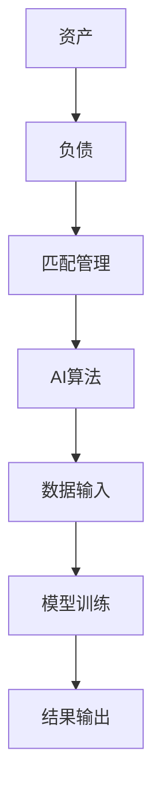
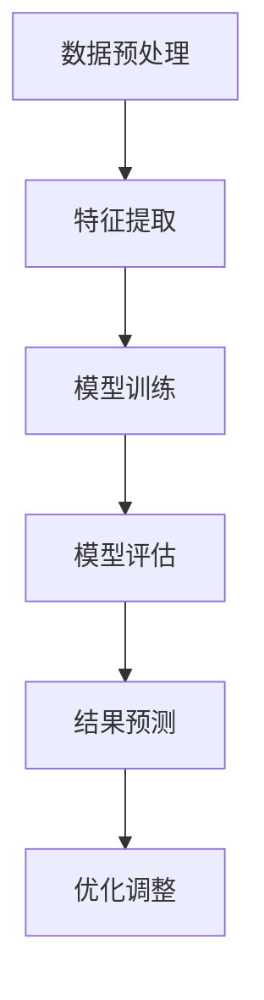
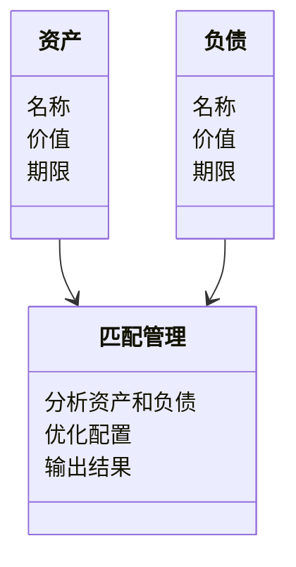
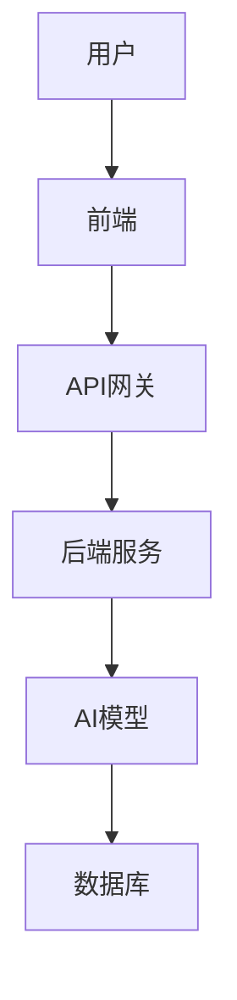
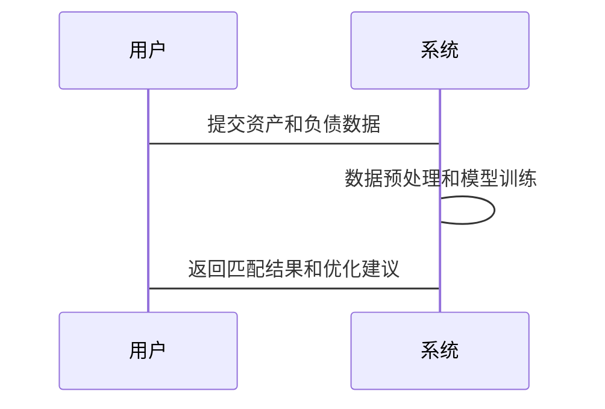

                 


# AI在资产负债匹配管理中的应用

> 关键词：AI，资产负债管理，机器学习，风险管理，金融技术，人工智能

> 摘要：本文探讨了人工智能技术在资产负债匹配管理中的应用，分析了AI如何提升传统金融管理的效率和准确性。通过详细的技术分析和案例研究，本文揭示了AI在风险预测、资产配置优化等方面的优势，并展望了未来的应用前景。

---

## 第1章: 背景介绍

### 1.1 问题背景

#### 1.1.1 资产负债管理的基本概念
资产负债管理是企业财务管理的重要组成部分，旨在通过合理配置资产和负债，实现企业财务健康和价值最大化。传统资产负债管理依赖于人工分析和经验判断，存在效率低、准确性不足的问题。

#### 1.1.2 AI技术在金融领域的应用现状
人工智能（AI）技术在金融领域的应用日益广泛，从风险管理、投资决策到客户画像，AI正在改变金融行业的运作方式。特别是在数据处理、模式识别和预测分析方面，AI展现出强大的优势。

#### 1.1.3 资产负债匹配管理的核心问题
资产负债匹配管理的核心问题是如何在不同经济条件下，确保资产与负债的期限、风险和收益相匹配，以优化企业财务状况。传统方法面临数据量大、变量复杂、实时性要求高等挑战。

### 1.2 问题描述

#### 1.2.1 资产负债匹配管理的目标
- 优化资产和负债的期限匹配，降低流动性风险。
- 通过合理配置资产和负债，实现收益最大化。
- 提升财务决策的实时性和准确性。

#### 1.2.2 传统资产负债管理的局限性
- 依赖人工分析，效率低且易出错。
- 数据处理能力有限，难以应对海量数据。
- 风险预测能力不足，难以应对复杂多变的市场环境。

#### 1.2.3 AI技术如何解决资产负债匹配问题
- 利用机器学习模型进行数据分析和预测。
- 通过算法优化资产和负债的配置。
- 实现实时监控和动态调整。

### 1.3 问题解决

#### 1.3.1 AI在资产负债匹配中的具体应用
- 使用机器学习模型预测负债变化。
- 利用自然语言处理技术分析市场情绪。
- 通过深度学习算法优化资产配置。

#### 1.3.2 AI技术的优势与不足
- **优势**：提高效率，增强预测能力，降低人为错误。
- **不足**：数据依赖性强，模型解释性较差，存在过拟合风险。

#### 1.3.3 资产负债匹配管理的边界与外延
- 管理边界：企业内部资产和负债的配置。
- 外延：扩展到供应链金融、金融市场波动预测等领域。

### 1.4 核心概念结构与组成

#### 1.4.1 资产负债匹配管理的要素分析
- 资产：包括现金、应收账款、存货等。
- 负债：包括应付账款、短期借款、长期债务等。
- 时间维度：不同期限的资产和负债匹配。

#### 1.4.2 AI技术在其中的作用机制
- 数据采集：收集资产和负债的相关数据。
- 模型训练：构建机器学习模型，训练数据。
- 预测与优化：基于模型预测结果优化资产和负债配置。

#### 1.4.3 核心概念之间的关系
- 资产与负债在时间维度上的匹配是核心。
- AI技术通过数据分析和预测，实现匹配优化。

---

## 第2章: 核心概念与联系

### 2.1 核心概念原理

#### 2.1.1 机器学习模型的基本原理
机器学习模型通过学习数据中的模式和特征，进行预测和分类。常用算法包括线性回归、随机森林、神经网络等。

#### 2.1.2 资产负债匹配的核心算法
- 线性回归：用于预测负债的变化趋势。
- 支持向量机（SVM）：用于分类问题，如判断资产与负债是否匹配。
- 随机森林：用于特征重要性分析和预测。

#### 2.1.3 AI技术在资产负债管理中的应用原理
AI通过分析历史数据，识别影响资产负债匹配的关键因素，构建预测模型，辅助决策。

### 2.2 概念属性特征对比

#### 2.2.1 不同AI模型的特征对比
| 特征                | 线性回归          | 随机森林          | 神经网络          |
|---------------------|-------------------|-------------------|-------------------|
| 数据要求            | 线性可分          | 非线性可处理       | 复杂非线性         |
| 模型解释性          | 高                | 中等              | 低                |
| 训练时间            | 较短              | 较长              | 较长              |
| 算法复杂度          | 低                | 中                | 高                |

#### 2.2.2 资产负债匹配管理的关键指标
- 利息支出率：利息支出占收入的比例。
- 匹配度：资产和负债在期限、风险上的匹配程度。
- 流动性覆盖率：短期资产与短期负债的比例。

#### 2.2.3 AI算法的性能评估
- 准确率：模型预测的正确比例。
- 召回率：模型识别出的正样本比例。
- F1分数：综合准确率和召回率的指标。

### 2.3 ER实体关系图架构



---

## 第3章: 算法原理讲解

### 3.1 算法流程图



### 3.2 算法实现代码

```python
# 示例代码：简单的线性回归模型
import numpy as np
from sklearn.linear_model import LinearRegression

# 数据准备
X = np.array([[1], [2], [3], [4], [5]])
y = np.array([2, 4, 5, 4, 5])

# 模型训练
model = LinearRegression()
model.fit(X, y)

# 预测
new_X = np.array([[6]])
print(model.predict(new_X))  # 输出预测值
```

### 3.3 算法数学模型

#### 3.3.1 线性回归模型
$$ y = \beta_0 + \beta_1 x + \epsilon $$

其中，$\beta_0$ 是截距，$\beta_1$ 是斜率，$\epsilon$ 是误差项。

#### 3.3.2 最小二乘法
目标是最小化预测值与实际值的平方差之和：
$$ \min_{\beta_0, \beta_1} \sum_{i=1}^{n} (y_i - (\beta_0 + \beta_1 x_i))^2 $$

---

## 第4章: 系统分析与架构设计

### 4.1 问题场景介绍
企业需要实时监控资产和负债的变化，及时调整配置，以应对市场波动。

### 4.2 项目介绍
构建一个基于AI的资产负债匹配管理系统，利用机器学习算法优化资产和负债配置。

### 4.3 系统功能设计

#### 4.3.1 领域模型


#### 4.3.2 系统架构


#### 4.3.3 接口设计
- API接口：提供资产和负债数据接口。
- 返回格式：JSON格式，包含预测结果和优化建议。

#### 4.3.4 交互流程


---

## 第5章: 项目实战

### 5.1 环境安装
- 安装Python和必要的机器学习库（如scikit-learn、TensorFlow）。
- 安装Jupyter Notebook用于代码编写和测试。

### 5.2 核心实现

```python
# 示例代码：使用随机森林进行负债预测
from sklearn.ensemble import RandomForestRegressor

# 数据准备
X = [[100, 200], [200, 300], [300, 400]]
y = [150, 250, 350]

# 模型训练
model = RandomForestRegressor(n_estimators=100)
model.fit(X, y)

# 预测
new_X = [[400, 500]]
print(model.predict(new_X))  # 输出预测值
```

### 5.3 代码解读与分析
- 数据预处理：对数据进行标准化或归一化处理。
- 模型训练：使用训练数据训练随机森林模型。
- 结果分析：根据预测结果调整资产和负债配置。

### 5.4 案例分析
假设某企业负债预测模型预测未来三个月负债将增加10%，系统会建议调整资产配置，增加短期资产以匹配负债。

### 5.5 项目小结
通过AI技术，企业可以实现资产和负债的智能化匹配，提升财务管理和风险控制能力。

---

## 第6章: 最佳实践与总结

### 6.1 小结
AI技术在资产负债匹配管理中的应用显著提升了效率和准确性，帮助企业优化财务结构，降低风险。

### 6.2 注意事项
- 数据质量是模型准确性的关键。
- 模型需要定期更新，以适应市场变化。
- 需要考虑模型的可解释性和合规性。

### 6.3 拓展阅读
- 《机器学习实战》
- 《深度学习》
- 《金融风险管理》

---

## 结语

通过本文的详细分析，我们可以看到AI技术在资产负债匹配管理中的巨大潜力。未来，随着技术的不断发展，AI将为企业财务管理带来更多创新和优化的可能性。

--- 

# END

