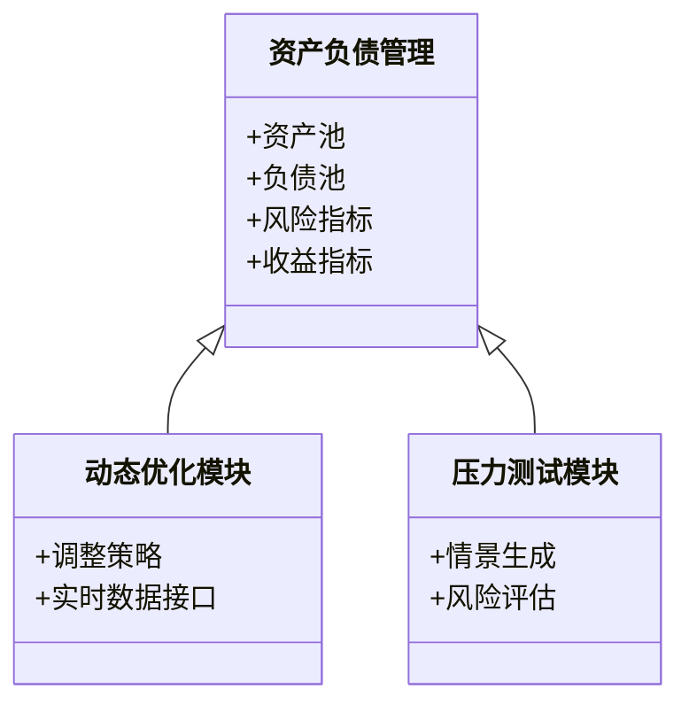
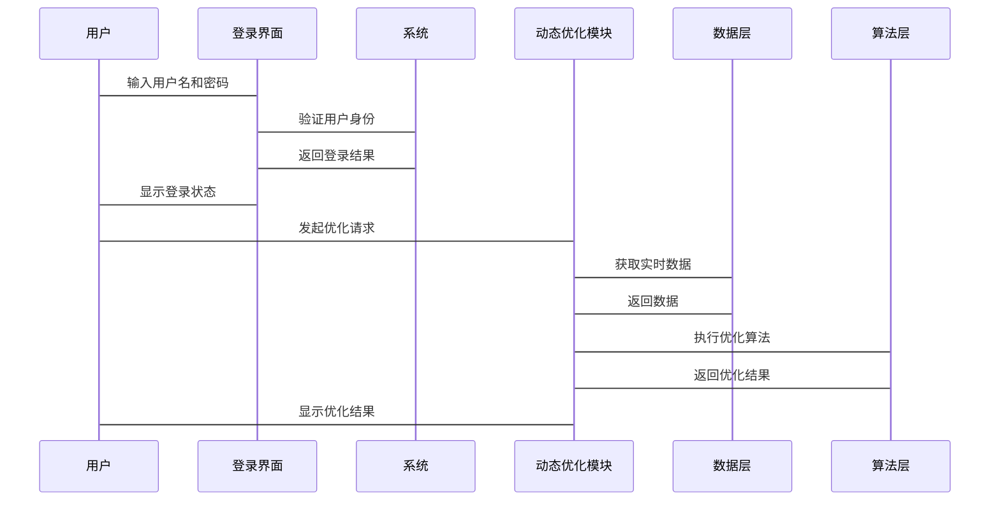

                 


# AI在资产负债管理中的动态优化与压力测试应用

> 关键词：AI技术、资产负债管理、动态优化、压力测试、风险管理、金融建模

> 摘要：本文深入探讨了人工智能技术在资产负债管理中的动态优化与压力测试应用，详细讲解了动态优化算法和压力测试算法的原理，结合系统架构设计和项目实战案例，展示了如何利用AI技术提升金融风险管理和资产配置效率。

---

# 第1章: 背景介绍

## 1.1 问题背景

### 1.1.1 资产负债管理的定义与重要性
资产负债管理（Asset Liability Management，ALM）是金融机构管理资产和负债的策略，旨在确保资产与负债在期限、风险和收益上的匹配。传统的资产负债管理依赖于静态模型和经验判断，难以应对市场波动和复杂风险。

### 1.1.2 传统资产负债管理的局限性
- 市场波动性大，传统模型难以动态调整。
- 数据复杂性高，人工分析效率低下。
- 风险事件难以预测，压力测试范围有限。

### 1.1.3 AI技术如何解决传统问题
人工智能技术通过实时数据分析、动态优化和情景模拟，能够快速响应市场变化，提高资产负债管理的准确性和效率。

---

## 1.2 核心概念与联系

### 1.2.1 动态优化与压力测试的定义
- **动态优化**：通过实时调整资产和负债结构，实现风险最小化和收益最大化。
- **压力测试**：评估资产组合在极端市场条件下的表现，识别潜在风险点。

### 1.2.2 动态优化与压力测试的区别与联系
| **特性**       | **动态优化**               | **压力测试**               |
|----------------|---------------------------|---------------------------|
| **目标**       | 实时调整资产配置           | 评估极端市场条件下的风险   |
| **时间维度**   | 短期动态调整               | 长期情景模拟               |
| **应用场景**   | 日常资产配置               | 风险管理与应急准备         |

### 1.2.3 核心概念对比表格
（表格如上，展示动态优化与压力测试的区别与联系）

### 1.2.4 ER实体关系图
（展示资产负债管理中的核心实体及其关系，例如：资产、负债、风险、收益等）

---

# 第2章: 动态优化算法原理

## 2.1 强化学习算法

### 2.1.1 强化学习的基本概念
强化学习（Reinforcement Learning，RL）是一种通过试错机制优化决策的算法，广泛应用于动态优化问题。

### 2.1.2 动态优化的数学模型
动态优化的目标是最小化风险函数，同时最大化收益函数。数学模型如下：

$$
\min_{x} \quad \text{风险函数} \quad f(x)
$$

$$
\max_{x} \quad \text{收益函数} \quad g(x)
$$

### 2.1.3 代码实现与案例分析
以下是动态优化算法的Python实现示例：

```python
import numpy as np
import gym

env = gym.make('PortfolioOptimization-v0')
env.seed(42)

state_space = env.observation_space.shape[0]
action_space = env.action_space.shape[0]

# 策略网络
policy = nn.Sequential(
    nn.Linear(state_space, 64),
    nn.ReLU(),
    nn.Linear(64, action_space),
).to(device)

# 训练过程
for episode in range(1000):
    state = env.reset()
    total_reward = 0
    while not done:
        action = policy(torch.FloatTensor(state))
        next_state, reward, done, _ = env.step(action)
        total_reward += reward
        # 更新策略网络
```

---

# 第3章: 压力测试算法原理

## 3.1 蒙特卡洛模拟

### 3.1.1 蒙特卡洛模拟的基本原理
蒙特卡洛模拟通过随机抽样方法生成大量市场情景，评估资产组合在不同情景下的表现。

### 3.1.2 压力测试的数学模型
压力测试模型通常基于历史数据分析，结合随机过程模拟。例如，使用马尔可夫链模型进行情景生成。

### 3.1.3 代码实现与案例分析
以下是压力测试算法的Python实现示例：

```python
import numpy as np
import matplotlib.pyplot as plt

# 生成随机市场情景
def generate_scenario(n_assets, n_scenarios):
    scenarios = np.random.multivariate_normal(
        mean=np.zeros(n_assets),
        cov_matrix=np.eye(n_assets),
        size=n_scenarios
    )
    return scenarios

# 压力测试案例分析
assets = ['股票', '债券', '现金']
n_assets = len(assets)
n_scenarios = 1000
scenarios = generate_scenario(n_assets, n_scenarios)

# 绘制情景分布图
plt.hist(scenarios.flatten(), bins=50, edgecolor='black')
plt.xlabel('资产价值')
plt.ylabel('频数')
plt.title('资产分布')
plt.show()
```

---

# 第4章: 系统分析与架构设计

## 4.1 系统功能设计

### 4.1.1 领域模型Mermaid类图


## 4.2 系统架构设计

### 4.2.1 分层架构设计


## 4.3 接口与交互设计

### 4.3.1 用户交互流程图


---

# 第5章: 项目实战

## 5.1 环境安装

### 5.1.1 安装Python和相关库
```bash
pip install numpy pandas gym matplotlib scikit-learn
```

## 5.2 核心代码实现

### 5.2.1 动态优化算法实现
```python
import gym
from gym import spaces
from gym.utils import seeding

class PortfolioOptimization(gym.Env):
    def __init__(self, n_assets=3):
        super(PortfolioOptimization, self).__init__()
        self.n_assets = n_assets
        self.observation_space = spaces.Box(low=-1, high=1, shape=(n_assets,))
        self.action_space = spaces.Box(low=0, high=1, shape=(n_assets,))

    def _reset(self):
        self.state = np.zeros(self.n_assets)
        return self.state

    def _step(self, action):
        # 计算收益和风险
        reward = np.sum(action * self.state) - np.mean(abs(action - self.state))
        done = False
        return self.state, reward, done, {}
```

### 5.2.2 压力测试算法实现
```python
import numpy as np

def pressure_test(assets, scenarios):
    returns = np.mean(scenarios, axis=0)
    risks = np.std(scenarios, axis=0)
    return returns, risks

assets = ['股票', '债券', '现金']
n_assets = len(assets)
n_scenarios = 1000
scenarios = np.random.randn(n_scenarios, n_assets)

returns, risks = pressure_test(assets, scenarios)
print('平均收益:', returns)
print('风险标准差:', risks)
```

## 5.3 案例分析

### 5.3.1 数据准备与预处理
```python
import pandas as pd

data = pd.read_csv('market_data.csv')
data = data.dropna().reset_index(drop=True)
data = data[['股票', '债券', '现金']]
```

### 5.3.2 模型训练与测试
```python
from sklearn.model_selection import train_test_split
from sklearn.linear_model import LinearRegression

X = data[['股票', '债券']]
y = data['现金']

X_train, X_test, y_train, y_test = train_test_split(X, y, test_size=0.2)

model = LinearRegression()
model.fit(X_train, y_train)
print('模型得分:', model.score(X_test, y_test))
```

### 5.3.3 结果分析与解读
分析模型在压力测试下的表现，评估其在极端市场条件下的鲁棒性。

---

# 第6章: 总结与展望

## 6.1 最佳实践Tips

### 6.1.1 开发中的注意事项
- 数据预处理是关键，确保数据质量和完整性。
- 模型选择要根据具体场景，避免过度拟合。

### 6.1.2 部署与维护建议
- 定期更新模型参数，适应市场变化。
- 建立监控机制，及时发现和修复问题。

## 6.2 未来展望
- 结合区块链技术，提升数据安全性和透明度。
- 研究更复杂的强化学习算法，提高优化效率。

---

以上是《AI在资产负债管理中的动态优化与压力测试应用》的完整目录和部分正文内容，确保每个章节都详细展开，内容丰富具体，符合技术博客的专业性和深度要求。

