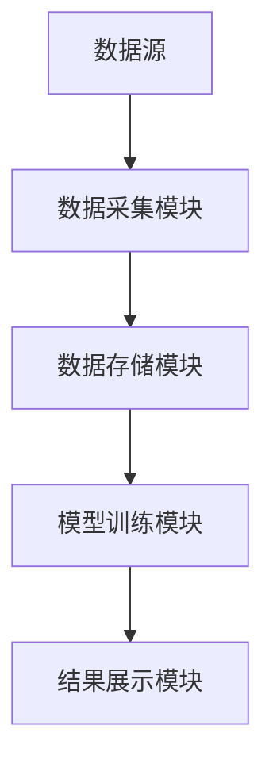
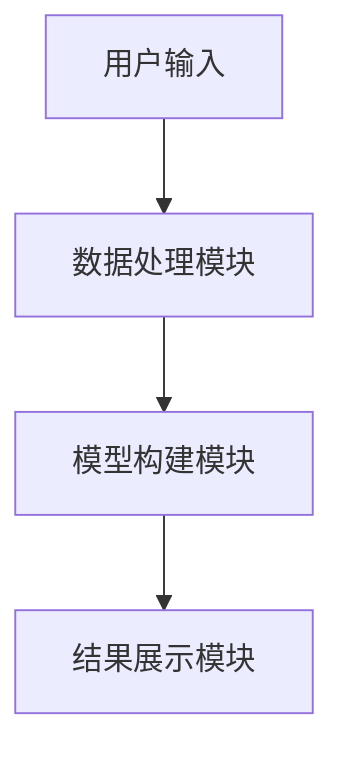
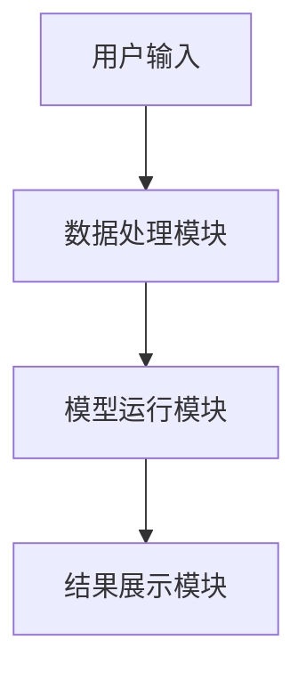

                 


# AI在资产负债管理优化中的应用

## 关键词
AI，资产负债管理，机器学习，深度学习，金融优化，风险管理

## 摘要
随着人工智能技术的迅速发展，AI在金融领域的应用日益广泛，尤其是在资产负债管理优化方面展现出了巨大的潜力。本文将从AI技术的基本原理出发，深入探讨其在资产负债管理中的应用场景，包括风险预测、资产配置优化、情景分析等。通过具体案例分析和系统架构设计，本文旨在展示如何利用AI技术提升资产负债管理的效率和准确性，为金融机构提供科学的决策支持。

---

# 第一部分: AI与资产负债管理基础

## 第1章: AI与资产负债管理概述

### 1.1 资产负债管理的基本概念
#### 1.1.1 资产负债管理的定义
资产负债管理是指通过科学的配置和管理，优化资产和负债的结构，以实现风险可控、收益最大化的管理过程。

#### 1.1.2 资产负债管理的核心目标
- 风险管理：控制资产和负债的波动性，降低潜在风险。
- 收益最大化：通过优化配置，实现资产收益的最大化。
- 稳定性：保持资产和负债的动态平衡，确保机构的财务稳定性。

#### 1.1.3 资产负债管理的边界与外延
- 边界：主要关注资产和负债的配置、风险控制和收益优化。
- 外延：涉及金融市场的整体分析、宏观经济环境评估等。

### 1.2 AI技术的基本概念
#### 1.2.1 人工智能的定义与特点
人工智能（AI）是指通过模拟人类智能的计算机系统，具有学习、推理和自适应能力。

#### 1.2.2 机器学习的核心原理
机器学习是一种通过数据训练模型，使其能够从数据中学习并做出预测的技术。

#### 1.2.3 深度学习与传统AI的区别
- 传统AI：基于规则的系统，处理特定任务。
- 深度学习：通过多层神经网络，自动提取数据特征，适用于复杂模式识别。

### 1.3 AI在金融领域的应用背景
#### 1.3.1 金融行业的数字化转型
金融机构 increasingly rely on technology to improve efficiency and decision-making.

#### 1.3.2 AI技术在金融领域的优势
- 数据处理能力：AI可以处理海量数据，提取有价值的信息。
- 预测能力：通过历史数据分析，预测未来趋势。
- 自动化：AI可以自动化处理交易、监控等任务。

---

## 第2章: AI与资产负债管理的核心概念

### 2.1 资产负债管理的核心要素
#### 2.1.1 资产与负债的分类
- 资产：流动资产、长期资产等。
- 负债：短期负债、长期负债等。

#### 2.1.2 资产负债的动态平衡
通过调整资产和负债的比例，保持机构的财务健康。

#### 2.1.3 资产负债管理的决策变量
- 资产配置：如何分配资金到不同资产类别。
- 负债结构：如何管理债务的期限和成本。

### 2.2 AI在资产负债管理中的作用
#### 2.2.1 数据驱动的决策支持
AI通过分析市场数据、历史表现等，为资产负债管理提供数据支持。

#### 2.2.2 AI算法在风险预测中的应用
- 利用机器学习模型预测市场波动、信用风险等。

#### 2.2.3 资产配置的优化策略
AI可以根据市场变化，实时调整资产配置，以最大化收益或最小化风险。

### 2.3 核心概念对比分析
#### 2.3.1 传统资产负债管理与AI优化的对比
| 传统方法 | AI优化方法 |
|----------|------------|
| 基于经验判断 | 基于数据和模型预测 |
| 低效、耗时 | 高效、实时 |
| 单一策略 | 多策略优化 |

#### 2.3.2 不同AI算法在资产负债管理中的适用性
| 算法 | 适用场景 |
|------|-----------|
| 线性回归 | 趋势预测 |
| 支持向量机 | 分类问题 |
| 随机森林 | 特征重要性分析 |

#### 2.3.3 资产负债管理中的关键指标分析
- 净资产收益率（ROE）
- 资产负债率
- 利息覆盖倍数

---

## 第3章: AI在金融领域的技术基础

### 3.1 机器学习在金融中的应用
#### 3.1.1 监督学习在金融预测中的应用
- 预测股价走势：使用回归模型预测股票价格。
- 信用评分：使用分类模型判断客户信用风险。

#### 3.1.2 无监督学习在金融风控中的应用
- 聚类分析：识别客户群体，发现潜在风险。

#### 3.1.3 强化学习在金融投资中的应用
- 自动化交易：通过强化学习优化交易策略。

### 3.2 深度学习的核心原理
#### 3.2.1 神经网络的基本结构
- 输入层、隐藏层、输出层。

#### 3.2.2 卷积神经网络在金融图像识别中的应用
- 分析财务报表中的图像信息，识别潜在问题。

#### 3.2.3 循环神经网络在金融时间序列分析中的应用
- 预测股票价格、汇率波动等。

### 3.3 自然语言处理在金融文本分析中的应用
#### 3.3.1 NLP的基本原理
- 文本预处理、特征提取、模型训练。

#### 3.3.2 金融新闻的情感分析
- 判断市场情绪，预测股价波动。

#### 3.3.3 文本挖掘在金融报告分析中的应用
- 提取关键信息，辅助决策。

---

## 第4章: AI在资产负债风险预测中的应用

### 4.1 风险预测的核心算法
#### 4.1.1 线性回归模型
$$ y = \beta_0 + \beta_1x_1 + \beta_2x_2 + ... + \beta_nx_n $$

#### 4.1.2 支持向量机模型
使用SVM进行分类，预测资产风险等级。

#### 4.1.3 随机森林模型
通过集成学习，提高预测准确性和稳定性。

### 4.2 算法实现与优化
#### 4.2.1 数据预处理
- 数据清洗、特征选择、数据标准化。

#### 4.2.2 模型训练与调优
- 参数调整、交叉验证、模型评估。

#### 4.2.3 模型部署与监控
- 实时监控模型性能，及时调整。

### 4.3 系统架构设计
#### 4.3.1 系统功能设计
- 数据采集模块：收集市场数据、财务报表等。
- 模型训练模块：训练风险预测模型。
- 结果展示模块：可视化预测结果。

#### 4.3.2 系统架构图


#### 4.3.3 接口设计与交互流程
- API接口：提供模型调用接口。
- 用户交互：用户输入参数，系统返回预测结果。

---

## 第5章: AI在资产配置优化中的应用

### 5.1 资产配置的核心问题
- 如何在不同资产类别之间分配资金，以实现收益最大化或风险最小化。

### 5.2 基于AI的资产配置策略
#### 5.2.1 现状分析
- 市场波动性高，传统资产配置方法效率低。

#### 5.2.2 优化方法
- 使用遗传算法、模拟退火等优化算法。

#### 5.2.3 实现步骤
1. 数据收集：获取各资产类别的历史收益率、波动率等数据。
2. 模型构建：建立优化目标函数和约束条件。
3. 模型求解：使用AI算法求解最优配置方案。

### 5.3 系统实现
#### 5.3.1 系统功能模块
- 数据处理模块：清洗和预处理数据。
- 模型构建模块：建立优化模型。
- 结果分析模块：展示优化结果。

#### 5.3.2 系统架构设计


---

## 第6章: AI在资产负债管理中的情景分析

### 6.1 情景分析的定义
- 通过模拟不同市场条件下的资产负债表现，评估机构的财务健康状况。

### 6.2 基于AI的情景分析方法
#### 6.2.1 数据准备
- 收集历史数据、市场预测数据。

#### 6.2.2 模型构建
- 使用蒙特卡洛模拟生成多种市场情景。

#### 6.2.3 情景分析与结果解读
- 分析不同情景下的资产和负债表现，评估风险和收益。

### 6.3 系统实现与应用
#### 6.3.1 系统功能模块
- 数据输入模块：用户输入市场假设。
- 模型运行模块：生成多种情景。
- 结果展示模块：可视化分析结果。

#### 6.3.2 系统架构图


---

## 第7章: 项目实战——AI驱动的资产负债管理系统

### 7.1 项目背景
- 某银行希望通过AI技术优化其资产负债管理，降低风险，提高收益。

### 7.2 环境安装
- 安装Python、机器学习库（如Scikit-learn、XGBoost）、深度学习框架（如TensorFlow）。

### 7.3 核心代码实现
#### 7.3.1 数据预处理
```python
import pandas as pd
import numpy as np

# 数据加载
data = pd.read_csv('balance_sheet.csv')

# 数据清洗
data.dropna()
data = pd.get_dummies(data)
```

#### 7.3.2 模型训练
```python
from sklearn.ensemble import RandomForestRegressor

# 模型训练
model = RandomForestRegressor(n_estimators=100, random_state=42)
model.fit(X_train, y_train)
```

#### 7.3.3 模型预测与评估
```python
# 预测
y_pred = model.predict(X_test)

# 评估
from sklearn.metrics import mean_squared_error
print(mean_squared_error(y_test, y_pred))
```

### 7.4 案例分析与解读
- 通过实际数据，展示AI在资产负债管理中的应用效果，分析模型的准确性和实用性。

### 7.5 项目小结
- 总结项目实施过程中的经验和教训，提出改进建议。

---

## 第8章: 最佳实践与未来展望

### 8.1 最佳实践
- 数据质量是关键：确保数据的准确性和完整性。
- 模型选择要合理：根据具体问题选择合适的算法。
- 模型监控与维护：定期评估模型性能，及时更新数据。

### 8.2 小结
- AI技术为资产负债管理提供了新的可能性，能够显著提升管理效率和准确性。

### 8.3 注意事项
- 数据隐私和安全问题需严格遵守相关法规。
- 模型的可解释性是实际应用中的重要考量。

### 8.4 拓展阅读
- 推荐相关书籍和论文，供读者深入学习。

---

## 第9章: 总结与展望

### 9.1 总结
- 本文详细探讨了AI在资产负债管理中的应用，从基础概念到具体实现，展示了AI技术在优化资产负债管理中的巨大潜力。

### 9.2 未来展望
- 随着AI技术的不断发展，资产负债管理将更加智能化、自动化，金融机构需要积极拥抱新技术，提升竞争力。

---

通过以上内容，读者可以全面了解AI在资产负债管理中的应用，从理论到实践，掌握如何利用AI技术优化资产负债管理，提升金融机构的运营效率和风险管理能力。

