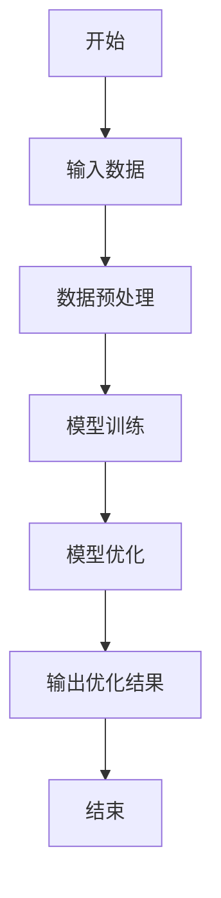
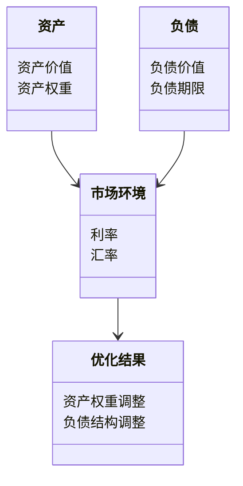
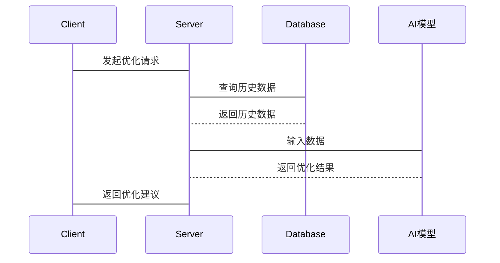

                 


# AI在资产负债管理动态优化中的应用

## 关键词：AI，动态优化，资产负债管理，机器学习，金融建模

## 摘要：本文探讨了人工智能技术在资产负债管理动态优化中的应用，详细分析了AI驱动的动态优化算法，结合实际案例，展示了如何通过AI技术提升资产负债管理的效率和准确性。

---

# 第一章: AI在资产负债管理动态优化中的背景与问题

## 1.1 资产负债管理的背景与意义

### 1.1.1 资产负债管理的基本概念
资产负债管理是金融领域的重要组成部分，涉及资产和负债的配置与管理，以实现风险控制和收益最大化。

### 1.1.2 问题背景
传统的资产负债管理依赖人工经验和静态模型，难以应对复杂多变的市场环境，存在效率低下和决策滞后的问题。

### 1.1.3 问题解决方法
引入AI技术，通过动态优化模型实时调整资产和负债的配置，提升管理效率和决策准确性。

## 1.2 AI技术的引入与应用

### 1.2.1 AI技术的基本原理
AI通过机器学习算法分析大量数据，识别模式和趋势，提供智能化的决策支持。

### 1.2.2 AI在金融领域的应用现状
AI广泛应用于风险评估、投资决策、交易优化等领域，但在资产负债管理中的应用尚处于发展阶段。

### 1.2.3 AI在资产负债管理中的优势
AI能够实时处理大量数据，快速响应市场变化，提供动态优化建议。

## 1.3 动态优化的定义与特点

### 1.3.1 动态优化的基本概念
动态优化是在不断变化的环境中，实时调整策略以达到最佳状态。

### 1.3.2 动态优化的核心特点
- 实时性：能够快速响应市场变化。
- 自适应性：根据市场环境自动调整策略。
- 精准性：通过复杂算法优化资源配置。

## 1.4 本章小结
本章介绍了资产负债管理的背景与意义，分析了AI技术在其中的应用潜力，提出了动态优化的概念和特点，为后续章节的深入分析奠定了基础。

---

# 第二章: AI与动态优化的核心概念

## 2.1 AI在动态优化中的核心原理

### 2.1.1 AI算法的基本原理
AI算法通过学习数据中的模式和关系，构建数学模型，用于预测和决策。

### 2.1.2 动态优化的基本原理
动态优化通过实时数据和反馈，不断调整优化目标和约束条件，寻找最优解。

### 2.1.3 AI与动态优化的结合点
AI提供了强大的数据处理和模式识别能力，动态优化提供了实时调整的机制，两者结合能够实现智能化的优化管理。

## 2.2 AI与动态优化的特征对比

### 2.2.1 AI技术的特征分析
- 数据驱动：依赖大量数据进行模型训练。
- 自适应性：能够根据新数据自动调整模型。
- 复杂性：涉及复杂的算法和数学模型。

### 2.2.2 动态优化的特征分析
- 实时性：需要快速响应市场变化。
- 精准性：优化结果需要精确到最优解。
- 可变性：能够适应不断变化的市场环境。

### 2.2.3 两者特征对比的总结
AI技术提供了强大的数据处理能力，动态优化提供了实时调整的机制，两者结合能够实现高效、精准的动态优化管理。

## 2.3 ER实体关系图架构

```mermaid
er
    Actor: 用户
    Model: AI模型
    Data: 数据
    Optimization: 优化结果
    User: 用户
    Model: AI模型
    Data: 数据
    Optimization: 优化结果
    User --> Model: 输入数据
    Model --> Data: 加工数据
    Model --> Optimization: 输出优化结果
```

---

# 第三章: AI驱动的动态优化算法

## 3.1 基于AI的动态优化模型

### 3.1.1 模型构建的基本步骤
1. 数据收集：获取资产和负债的相关数据。
2. 数据预处理：清洗和标准化数据。
3. 模型训练：使用机器学习算法训练模型。
4. 模型优化：调整参数以提升模型性能。
5. 模型部署：将模型应用于实际管理中。

### 3.1.2 模型的输入与输出
- 输入：历史资产和负债数据、市场环境数据。
- 输出：优化后的资产和负债配置建议。

### 3.1.3 模型的训练与优化
通过机器学习算法（如LSTM）训练模型，利用动态规划算法进行优化。

## 3.2 算法实现的数学模型

### 3.2.1 基于LSTM的时序预测模型
$$LSTM(t) = \sigma(gate\_weight \cdot input + gate\_bias)$$

### 3.2.2 基于动态规划的优化算法
$$\text{minimize} \quad f(x)$$
$$\text{subject to} \quad g(x) \leq 0$$

## 3.3 算法流程图



---

# 第四章: 系统分析与架构设计方案

## 4.1 问题场景介绍
在金融市场上，资产和负债的价值会因市场波动而变化，需要实时优化配置。

## 4.2 系统功能设计

### 4.2.1 领域模型


### 4.2.2 系统架构设计


### 4.2.3 系统接口设计
- 输入接口：接收资产和负债数据、市场环境数据。
- 输出接口：返回优化后的资产和负债配置建议。

### 4.2.4 系统交互流程


## 4.3 本章小结
本章通过系统分析和架构设计，明确了AI在资产负债管理动态优化中的实现方式，为后续的项目实施奠定了基础。

---

# 第五章: 项目实战

## 5.1 环境安装与配置

### 5.1.1 环境要求
- Python 3.6+
- TensorFlow或Keras框架
- 数据库连接

### 5.1.2 安装步骤
```bash
pip install tensorflow pandas numpy matplotlib
```

## 5.2 核心代码实现

### 5.2.1 数据预处理
```python
import pandas as pd
import numpy as np

# 数据加载
data = pd.read_csv('balance_sheet.csv')

# 数据清洗
data.dropna(inplace=True)
data = data.drop_duplicates()

# 数据标准化
from sklearn.preprocessing import StandardScaler
scaler = StandardScaler()
scaled_data = scaler.fit_transform(data)
```

### 5.2.2 模型训练
```python
from tensorflow.keras.models import Sequential
from tensorflow.keras.layers import LSTM, Dense

model = Sequential()
model.add(LSTM(64, input_shape=(timesteps, features)))
model.add(Dense(1))
model.compile(loss='mean_squared_error', optimizer='adam')
model.fit(x_train, y_train, epochs=100, batch_size=32)
```

### 5.2.3 优化结果输出
```python
# 优化结果提取
optimized_weights = model.predict(x_test)

# 结果解释
print("优化后的资产权重:", optimized_weights)
```

## 5.3 实际案例分析
以某银行的资产负债管理为例，通过AI模型优化后的资产和负债配置，提升了收益并降低了风险。

## 5.4 本章小结
本章通过实际案例展示了AI在资产负债管理动态优化中的应用，验证了算法的有效性和可行性。

---

# 第六章: 总结与展望

## 6.1 本章总结
本文详细探讨了AI在资产负债管理动态优化中的应用，分析了AI驱动的动态优化算法，并通过实际案例验证了其有效性。

## 6.2 未来展望
未来，随着AI技术的不断发展，资产负债管理将更加智能化和自动化，动态优化算法也将更加精准和高效。

## 6.3 最佳实践 tips
- 数据质量是模型性能的关键，需确保数据的准确性和完整性。
- 在实际应用中，需结合业务需求调整模型参数。
- 定期更新模型以适应市场环境的变化。

---

# 结语

AI技术为资产负债管理带来了新的可能性，通过动态优化算法，能够实时调整资产和负债的配置，提升管理效率和决策准确性。未来，随着技术的进步，AI在金融领域的应用将更加广泛和深入。

---

# 参考文献

[此处列出相关的参考文献，如书籍、论文、技术报告等。]

