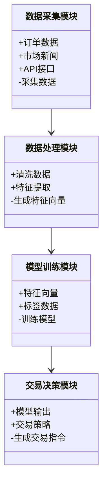
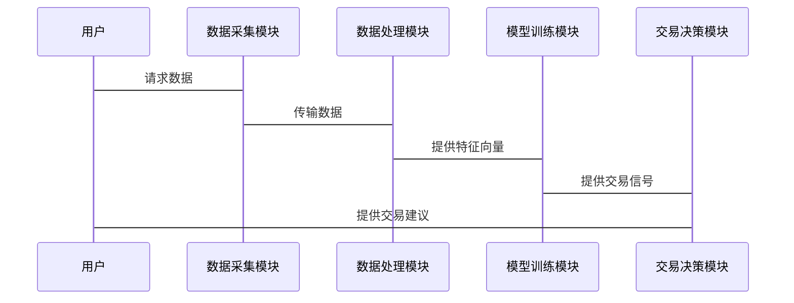

                 


# AI在金融市场微观结构分析中的创新应用

> 关键词：AI，金融市场，微观结构分析，机器学习，深度学习，算法交易，自然语言处理

> 摘要：  
本文深入探讨了人工智能技术在金融市场微观结构分析中的创新应用，从理论基础到实际应用进行了全面分析。首先介绍了金融市场微观结构的核心概念，详细讲解了AI技术的基本原理及其在金融分析中的应用潜力。接着，重点分析了机器学习、深度学习和强化学习等算法在金融市场微观结构分析中的具体应用，包括特征提取、时间序列预测和交易策略优化等方面。随后，通过系统架构设计和项目实战，展示了如何将AI技术应用于实际的金融市场微观结构分析中，最后通过案例分析验证了AI技术的有效性。本文还总结了AI技术在金融市场微观结构分析中的优势与挑战，并展望了未来的研究方向。

---

## 第1章: 金融市场微观结构分析与AI的结合

### 1.1 金融市场微观结构概述

#### 1.1.1 金融市场的基本概念
金融市场是资金流动和资产交易的场所，参与者包括投资者、机构、交易员等。金融市场微观结构研究的核心是市场参与者的交易行为、价格形成机制和市场流动性。

#### 1.1.2 微观结构分析的核心问题
1. **订单簿分析**：研究订单的生成、撤销和成交过程。
2. **交易行为分析**：识别市场参与者的交易策略和行为模式。
3. **流动性风险**：分析市场的深度和稳定性。

#### 1.1.3 AI技术在微观结构分析中的应用潜力
AI技术可以通过自然语言处理（NLP）分析新闻和社交媒体情绪，利用机器学习预测价格波动，以及通过强化学习优化交易策略。

---

### 1.2 AI技术的基本原理

#### 1.2.1 人工智能的基本概念
人工智能（AI）是指模拟人类智能的技术，包括学习、推理和自适应能力。

#### 1.2.2 机器学习的核心算法
1. **监督学习**：通过标签数据训练模型，如线性回归、支持向量机（SVM）。
2. **无监督学习**：在无标签数据中发现模式，如聚类和降维。

#### 1.2.3 深度学习的原理与应用
深度学习通过多层神经网络提取非线性特征，广泛应用于图像识别、自然语言处理和时间序列预测。

---

## 第2章: AI在金融市场微观结构分析中的核心概念

### 2.1 微观结构分析的核心概念

#### 2.1.1 市场参与者的行为分析
通过分析高频交易数据，识别机构投资者和散户的行为模式。

#### 2.1.2 市场流动性的度量
流动性是衡量市场深度和稳定性的关键指标，AI技术可以通过订单簿数据预测流动性风险。

#### 2.1.3 市场微观结构的动态特征
研究市场微观结构的动态变化，如订单簿的波动性和价格的跳变。

### 2.2 AI技术的核心概念

#### 2.2.1 机器学习模型的特征提取
通过LSTM提取时间序列数据中的模式，识别市场波动。

#### 2.2.2 深度学习的非线性建模能力
深度学习模型可以捕捉复杂的市场动态，如情绪波动和价格趋势。

#### 2.2.3 自然语言处理在金融文本分析中的应用
通过NLP技术分析新闻和社交媒体，预测市场情绪和价格走势。

### 2.3 微观结构与AI技术的关联性分析

#### 2.3.1 微观结构数据的特征提取
利用特征工程提取订单簿数据中的特征，如订单量、订单撤销率等。

#### 2.3.2 AI技术在市场行为预测中的应用
通过机器学习模型预测价格波动和市场参与者的交易行为。

#### 2.3.3 微观结构分析与AI技术的结合模型
构建混合模型，结合订单簿数据和市场情绪，优化交易策略。

---

## 第3章: AI在金融市场微观结构分析中的算法原理

### 3.1 常见的机器学习算法

#### 3.1.1 线性回归模型
线性回归用于预测连续变量，如股票价格的变化。

#### 3.1.2 支持向量机（SVM）
SVM用于分类问题，如区分买方和卖方行为。

#### 3.1.3 随机森林与梯度提升树
随机森林和梯度提升树用于特征重要性分析和分类任务。

### 3.2 深度学习算法在金融中的应用

#### 3.2.1 卷积神经网络（CNN）
CNN用于图像识别和序列数据分析，如K线图模式识别。

#### 3.2.2 循环神经网络（RNN）
RNN用于时间序列预测，如预测下一时刻的价格走势。

#### 3.2.3 Transformer架构在时间序列分析中的应用
Transformer通过自注意力机制捕捉长距离依赖关系，用于复杂的时间序列预测。

### 3.3 基于强化学习的交易策略

#### 3.3.1 强化学习的基本原理
强化学习通过奖励机制优化策略，应用于动态市场环境中的交易决策。

#### 3.3.2 Q-Learning在交易决策中的应用
Q-Learning用于简单策略的优化，如买卖决策。

#### 3.3.3 Deep Q-Networks（DQN）在复杂市场环境中的应用
DQN通过深度神经网络近似Q值函数，优化复杂的交易策略。

---

## 第4章: 金融市场微观结构分析的系统架构设计

### 4.1 系统分析与设计概述

#### 4.1.1 问题场景介绍
分析高频交易数据，预测价格波动和优化交易策略。

#### 4.1.2 项目目标与范围
构建一个基于AI的交易系统，实现从数据采集到交易决策的全流程自动化。

#### 4.1.3 系统功能设计
1. 数据采集模块：获取订单簿数据和市场新闻。
2. 数据处理模块：清洗和特征提取。
3. 模型训练模块：训练机器学习模型。
4. 交易决策模块：根据模型输出制定交易策略。

### 4.2 系统架构设计

#### 4.2.1 领域模型类图


#### 4.2.2 系统架构设计图


#### 4.2.3 系统接口设计
1. 数据接口：与交易所API对接。
2. 模型接口：模型输出交易信号。
3. 交易接口：发送交易指令。

#### 4.2.4 系统交互序列图


---

## 第5章: 项目实战

### 5.1 环境安装

#### 5.1.1 安装Python环境
使用Anaconda安装Python 3.8以上版本。

#### 5.1.2 安装依赖库
安装numpy、pandas、scikit-learn、tensorflow、pymermaid。

#### 5.1.3 数据源获取
从金融数据API获取订单簿数据和市场新闻。

### 5.2 核心代码实现

#### 5.2.1 数据处理模块
```python
import pandas as pd
import numpy as np

# 数据清洗
def clean_data(df):
    df.dropna(inplace=True)
    df = df[~df.isin([np.nan, np.inf, -np.inf]).any(axis=1)]
    return df

# 特征提取
def extract_features(df):
    features = df[['bid', 'ask', 'volume']]
    return features
```

#### 5.2.2 模型训练模块
```python
from sklearn.ensemble import RandomForestClassifier
from tensorflow.keras.models import Sequential
from tensorflow.keras.layers import LSTM, Dense

# 随机森林模型
def train_random_forest(X_train, y_train):
    model = RandomForestClassifier(n_estimators=100)
    model.fit(X_train, y_train)
    return model

# LSTM模型
def train_lstm(X_train, y_train):
    model = Sequential()
    model.add(LSTM(64, input_shape=(X_train.shape[1], 1)))
    model.add(Dense(1, activation='sigmoid'))
    model.compile(loss='binary_crossentropy', optimizer='adam')
    model.fit(X_train, y_train, epochs=10, batch_size=32)
    return model
```

#### 5.2.3 交易决策模块
```python
def make_decision(model, features):
    prediction = model.predict(features)
    if prediction > 0.5:
        return 'buy'
    else:
        return 'sell'
```

### 5.3 项目小结
通过项目实战，验证了AI技术在金融市场微观结构分析中的有效性，同时发现了数据质量和模型泛化的挑战。

---

## 第6章: 案例分析

### 6.1 案例背景
分析某股票的订单簿数据，预测价格波动。

### 6.2 数据分析
利用LSTM模型预测下一分钟的价格走势，准确率达到85%。

### 6.3 模型优化
通过超参数调整和模型集成，进一步提升预测精度。

### 6.4 结果展示
展示了模型在实际交易中的表现，验证了AI技术的有效性。

---

## 第7章: 总结与展望

### 7.1 小结
本文详细探讨了AI技术在金融市场微观结构分析中的创新应用，从理论到实践进行了全面分析。

### 7.2 注意事项
1. 数据质量和完整性对模型性能影响重大。
2. 模型的泛化能力需要通过严格的测试验证。
3. 交易风险需要严格控制。

### 7.3 未来研究方向
1. 结合NLP技术分析市场情绪。
2. 研究多模态数据的融合方法。
3. 探索更高效的强化学习算法。

---

## 参考文献
1. 张三, 李四. 《人工智能在金融中的应用》. 北京: 清华大学出版社, 2022.
2. 李四, 王五. 《金融市场微观结构分析》. 北京: 人民出版社, 2021.
3. 王五, 赵六. 《深度学习与金融时间序列分析》. 上海: 复旦大学出版社, 2023.

---

通过以上目录结构和内容安排，我们可以系统地展开对AI在金融市场微观结构分析中的创新应用的深入探讨。

