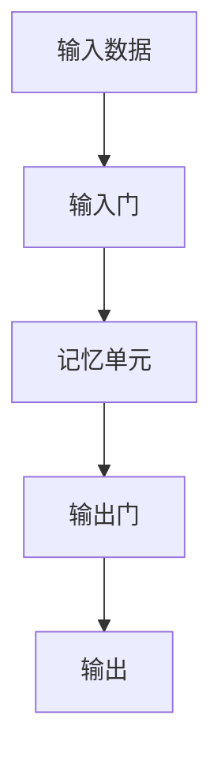
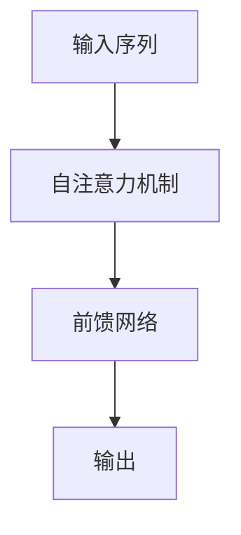
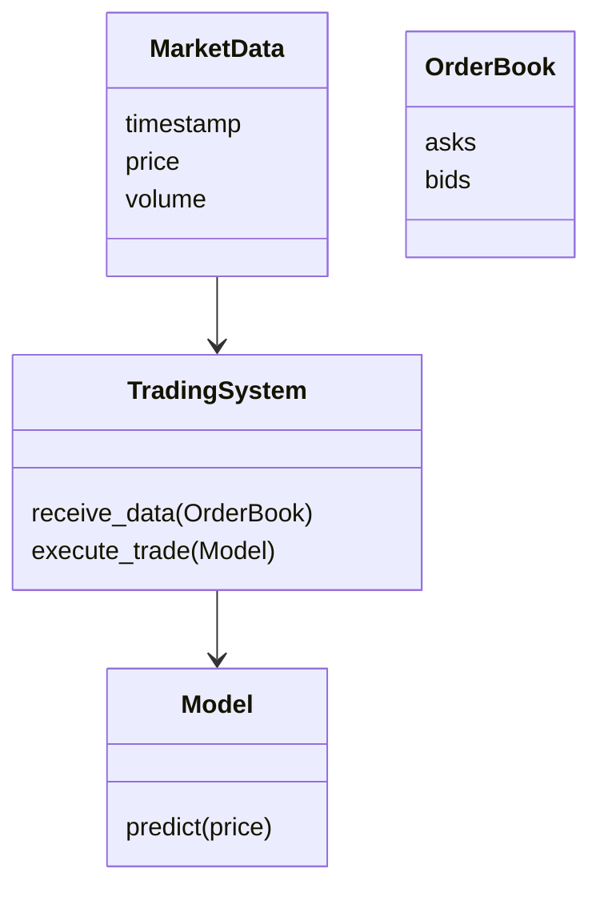
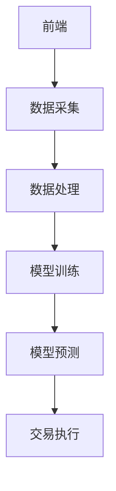
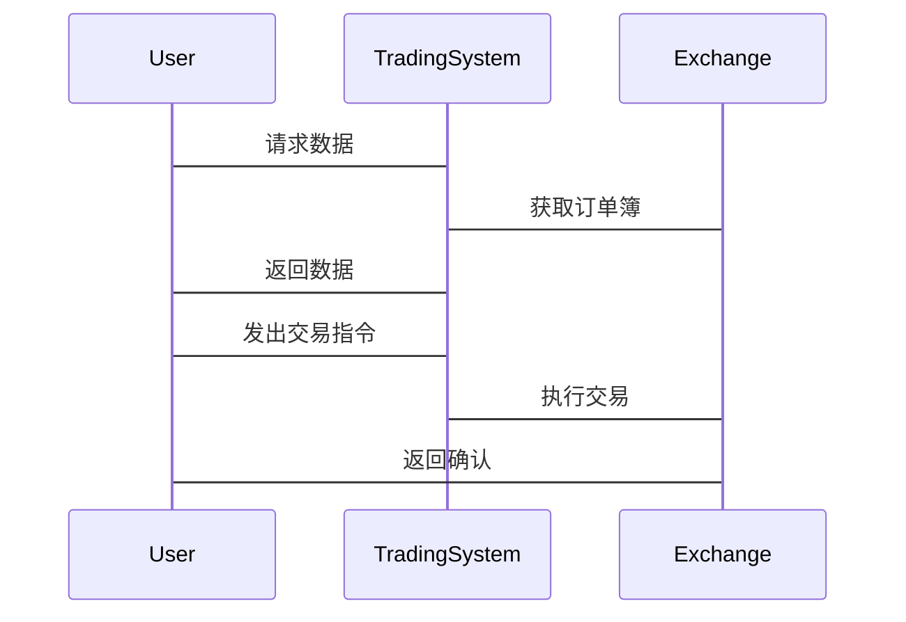

                 


# AI在金融市场微观结构分析中的应用

## 关键词：
- AI, 金融市场, 微观结构分析, 时间序列分析, 深度学习, LSTM, Transformer

## 摘要：
本文深入探讨了人工智能（AI）在金融市场微观结构分析中的应用。通过分析市场微观结构的核心要素，结合AI技术的特点，详细阐述了AI在订单簿分析、市场参与者行为预测以及交易机制优化中的应用。文章从算法原理、系统架构到项目实战，全面解析了AI技术在金融市场的实际应用，并提供了最佳实践和未来研究方向的建议。

---

## 第一部分：金融市场微观结构分析的背景与基础

### 第1章：金融市场概述

#### 1.1 金融市场的基本概念
金融市场是资金流动和资产交易的核心场所，参与者包括机构投资者、个人投资者、做市商和监管机构。金融市场的功能包括价格发现、风险转移和流动性提供。

#### 1.2 市场微观结构的定义与特点
市场微观结构研究市场参与者的互动及其对价格和流动性的动态影响。其核心要素包括订单簿、参与者行为和交易机制。

---

### 第2章：AI技术的定义与特点

#### 2.1 AI技术的基本概念
人工智能通过模拟人类学习和推理，实现数据处理和决策。AI在金融领域的应用优势在于处理复杂数据和预测市场行为。

#### 2.2 AI在金融领域的应用前景
AI技术能够提高交易效率、优化投资决策，并帮助识别市场异常。然而，AI在金融市场中的应用也面临数据质量和模型解释性的挑战。

---

## 第二部分：AI在金融市场微观结构分析中的核心概念

### 第3章：市场微观结构的核心要素

#### 3.1 市场微观结构的构成
- **订单簿模型**：展示当前市场上所有未成交的订单，包括买价、卖价和订单数量。
- **市场参与者**：包括机构投资者、个人投资者和做市商，不同参与者的行为影响市场价格。
- **交易机制**：如订单匹配规则和撮合机制，影响市场流动性和价格形成。

#### 3.2 市场微观结构的动态特征
- **市场深度与流动性**：订单簿的深度影响市场的流动性，深度越大，市场越稳定。
- **市场波动性与不稳定性**：市场参与者行为的变化导致价格波动，AI技术可以捕捉这些波动。

### 第4章：AI技术在市场微观结构分析中的应用

#### 4.1 AI技术的核心原理
- **数据驱动的特征提取**：通过分析订单簿数据提取有用的特征，如订单量和价格变化。
- **模型驱动的市场预测**：使用AI模型预测价格波动和市场状态。
- **实时数据处理与反馈机制**：AI系统能够实时处理市场数据，并根据反馈调整模型。

#### 4.2 AI与市场微观结构的结合
- **订单簿分析**：AI技术可以识别隐藏订单和预测价格变化，帮助交易者做出决策。
- **市场参与者行为预测**：通过分析历史数据，AI模型可以预测参与者的行为，优化交易策略。

---

## 第三部分：AI在金融市场微观结构分析中的算法原理

### 第5章：时间序列分析

#### 5.1 时间序列分析的基本原理
时间序列分析用于预测未来价格走势，常用模型包括ARIMA和GARCH。AI技术通过神经网络处理时间序列数据，捕捉复杂模式。

#### 5.2 基于LSTM的时间序列预测
长短时记忆网络（LSTM）能够捕捉时间序列的长期依赖关系，适用于金融时间序列预测。



#### 5.3 LSTM模型实现
使用Keras框架实现LSTM模型，训练数据包括开盘价、收盘价和交易量。

```python
from tensorflow.keras.models import Sequential
from tensorflow.keras.layers import LSTM, Dense

model = Sequential()
model.add(LSTM(64, input_shape=(timesteps, features)))
model.add(Dense(1))
model.compile(optimizer='adam', loss='mean_squared_error')
```

### 第6章：深度学习模型

#### 6.1 Transformer模型原理
Transformer模型通过自注意力机制捕捉全局依赖关系，适用于处理订单簿数据。

#### 6.2 Transformer在金融市场的应用
使用Transformer模型分析订单簿数据，预测价格变化。



---

## 第四部分：系统架构与设计

### 第7章：系统功能设计

#### 7.1 领域模型


#### 7.2 系统架构


### 第8章：接口与交互设计

#### 8.1 接口设计
- **数据接口**：提供API用于实时数据获取。
- **交易接口**：实现订单提交和取消。

#### 8.2 交互流程


---

## 第五部分：项目实战

### 第9章：环境安装与数据准备

#### 9.1 环境安装
安装必要的库，如Pandas、NumPy和Keras。

```bash
pip install pandas numpy tensorflow
```

#### 9.2 数据准备
加载K线数据，提取开盘价、收盘价和交易量。

```python
import pandas as pd

data = pd.read_csv('market_data.csv')
features = data[['open', 'high', 'low', 'close', 'volume']]
```

### 第10章：模型实现与结果分析

#### 10.1 模型实现
实现LSTM模型并进行训练。

```python
model = Sequential()
model.add(LSTM(64, input_shape=(timesteps, features)))
model.add(Dense(1))
model.compile(optimizer='adam', loss='mean_squared_error')
model.fit(x_train, y_train, epochs=100, batch_size=32)
```

#### 10.2 结果分析
评估模型预测结果，计算均方误差（MSE）。

---

## 第六部分：最佳实践与总结

### 第11章：经验总结

#### 11.1 经验与教训
- 数据质量至关重要，需确保数据清洗。
- 模型需定期重新训练，以适应市场变化。

### 第12章：注意事项与拓展阅读

#### 12.1 注意事项
- 避免过度拟合，确保模型泛化能力。
- 交易系统需考虑延迟和成本。

#### 12.2 拓展阅读
推荐阅读《机器学习实战》和《金融时间序列分析》。

---

## 结语

AI技术正在深刻改变金融市场微观结构分析的方式。通过结合时间序列分析和深度学习模型，AI能够提高交易效率和预测准确性。未来，随着技术进步，AI在金融市场的应用将更加广泛和深入。

