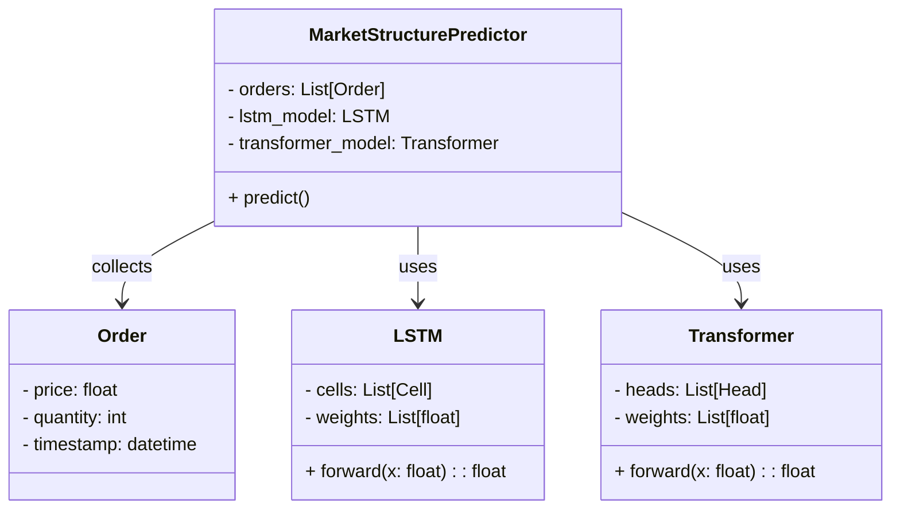
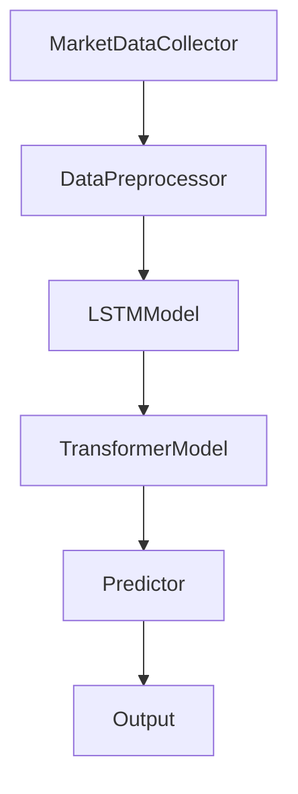
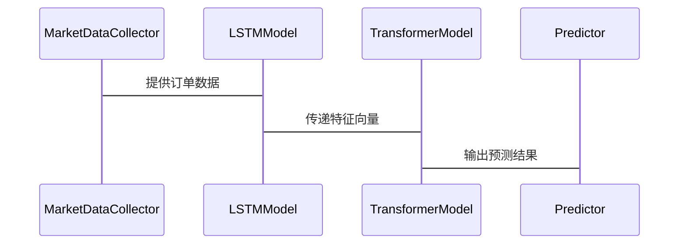

                 


# AI在金融市场微观结构变化预测中的创新应用

> **关键词**：人工智能、金融市场、微观结构、深度学习、预测模型、LSTM、Transformer

> **摘要**：本文探讨了人工智能技术在金融市场微观结构变化预测中的创新应用，重点分析了LSTM和Transformer等深度学习模型在处理金融数据中的优势，结合实际案例，详细阐述了算法原理、系统架构设计以及项目实现过程，为读者提供了从理论到实践的全面指导。

---

# 第一部分: 金融市场微观结构与AI预测的背景介绍

## 第1章: 金融市场微观结构概述

### 1.1 金融市场微观结构的定义与核心概念

金融市场微观结构研究市场参与者的交易行为及其对市场价格、流动性和风险的影响。核心概念包括：

- **订单簿**：记录当前市场上所有待成交的订单，包括买价、卖价、数量等信息。
- **市场参与者**：包括机构投资者、个人投资者、做市商等，不同参与者的行为模式影响市场价格波动。
- **市场深度与流动性**：市场深度反映订单簿中未成交的订单总量，流动性影响交易成本和价格波动。

### 1.2 微观结构变化对市场的影响

微观结构的变化，如订单簿的厚度变化、买卖价差的波动，通常预示着市场状态的变化，例如流动性危机或价格波动加剧。及时捕捉这些变化对交易者和监管机构具有重要意义。

---

## 第2章: AI在金融市场中的创新应用背景

### 2.1 人工智能在金融领域的应用现状

AI技术在金融领域的应用可分为传统应用和创新应用两部分：

- **传统应用**：包括风险评估、信用评分、量化交易策略等。
- **创新应用**：利用深度学习模型预测市场微观结构的变化，优化交易决策。

### 2.2 微观结构变化预测的挑战与机遇

- **挑战**：微观结构变化具有复杂性和非线性，传统统计方法难以捕捉其动态特征。
- **机遇**：AI技术，尤其是深度学习模型，能够通过大量历史数据学习市场规律，捕捉复杂模式。

---

# 第二部分: AI预测金融市场微观结构的核心概念与联系

## 第3章: 微观结构变化的核心要素

### 3.1 订单簿与市场参与者行为

订单簿是微观结构的核心，其变化反映了市场参与者的买卖意愿。例如，大量买单堆积可能预示着价格即将上涨。

### 3.2 市场微观结构指标

关键指标包括买卖价差、订单簿深度、订单取消率等，这些指标的变化可以帮助预测市场状态。

---

## 第4章: AI模型在微观结构预测中的应用

### 4.1 常见AI模型及其特点

| 模型名称 | 核心特点 | 适用场景 |
|----------|----------|----------|
| LSTM    | 长时间序列预测能力 | 适合捕捉时间依赖性 |
| Transformer | 注意力机制，全局依赖 | 适合捕捉长距离依赖 |

---

# 第三部分: AI预测金融市场微观结构的算法原理

## 第5章: 基于LSTM的微观结构预测算法

### 5.1 LSTM网络的基本原理

LSTM通过遗忘门、输入门和输出门控制信息流动：

$$
f_t = \sigma(g(x_t, h_{t-1}))
$$

其中，$f_t$为遗忘门输出，$g$为激活函数，$x_t$为输入，$h_{t-1}$为前一时刻隐藏层状态。

### 5.2 LSTM在微观结构预测中的应用

- 数据预处理：对订单簿数据进行归一化处理。
- 模型训练：使用历史订单数据训练LSTM网络。
- 预测结果分析：输出预测的买卖价差变化。

---

## 第6章: 基于Transformer的微观结构预测算法

### 6.1 Transformer模型的基本原理

Transformer通过多头注意力机制捕捉长距离依赖：

$$
\text{Attention}(Q, K, V) = \text{softmax}\left(\frac{QK^T}{\sqrt{d_k}}\right)V
$$

其中，$Q$为查询向量，$K$为键向量，$V$为值向量。

### 6.2 Transformer在微观结构预测中的应用

- 数据输入：将订单数据转化为序列输入。
- 模型训练：利用大量订单数据优化模型参数。
- 预测结果分析：预测订单深度变化。

---

# 第四部分: 金融市场微观结构预测的系统分析与架构设计

## 第7章: 系统功能设计

### 7.1 领域模型



---

## 第8章: 系统架构设计

### 8.1 系统架构



---

## 第9章: 系统接口设计

- **输入接口**：接收订单数据和市场指标。
- **输出接口**：提供预测结果和异常警报。

---

## 第10章: 系统交互设计



---

# 第五部分: 项目实战

## 第11章: 项目实现

### 11.1 环境安装

```bash
pip install numpy pandas keras tensorflow
```

### 11.2 核心代码实现

```python
import numpy as np
import pandas as pd
from tensorflow.keras.layers import LSTM, Dense, Dropout
from tensorflow.keras.models import Sequential

# 数据预处理
data = pd.read_csv('market_data.csv')
X = data[['bid', 'ask', 'volume']]
y = data['price_change']

# 模型训练
model = Sequential()
model.add(LSTM(64, input_shape=(None, 3)))
model.add(Dropout(0.5))
model.add(Dense(1))
model.compile(optimizer='adam', loss='mean_squared_error')
model.fit(X, y, epochs=100, batch_size=32)
```

### 11.3 案例分析

假设我们有以下订单数据：

| 时间 | 买价 | 卖价 | 数量 |
|------|------|------|------|
| t1   | 100  | 101  | 5    |
| t2   | 101  | 102  | 3    |
| t3   | 102  | 103  | 2    |

模型预测在t4时，买价可能升至103，卖价升至104，数量减少至1。

---

## 第12章: 总结与展望

### 12.1 总结

本文详细介绍了AI技术在金融市场微观结构预测中的应用，分析了LSTM和Transformer模型的优势，并通过实际案例展示了系统的实现过程。

### 12.2 展望

未来，可以结合多模态数据（如新闻情绪分析）进一步优化预测模型，同时探索更高效的算法以应对高频交易的挑战。

---

**Tips**：
- 在实际应用中，建议结合实时数据流优化模型性能。
- 注意数据隐私和合规性问题，确保符合金融监管要求。

希望这篇文章能为读者提供从理论到实践的全面指导，帮助理解AI在金融市场微观结构预测中的创新应用。

