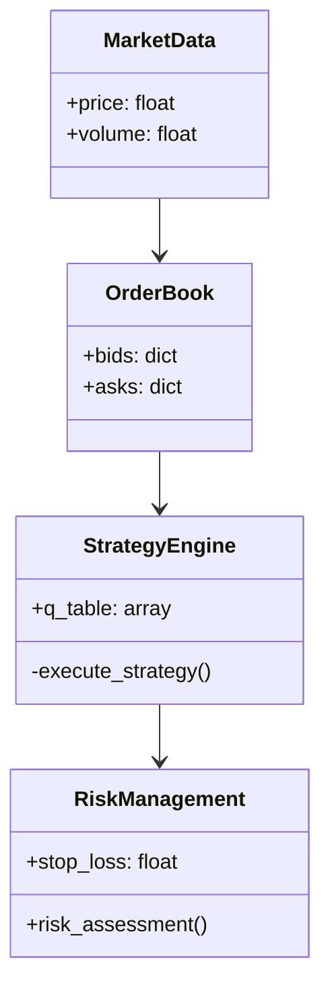
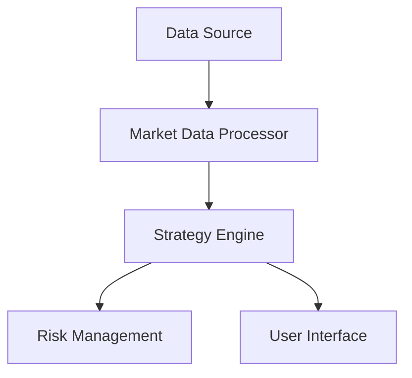

                 


# AI在金融市场流动性提供策略优化中的创新应用

## 关键词
- AI, 金融市场, 流动性, 策略优化, 强化学习, 机器学习, 金融系统架构

## 摘要
本文探讨了人工智能技术在金融市场流动性提供策略优化中的创新应用。通过分析传统流动性管理的局限性，结合强化学习和机器学习等AI技术，提出了一种基于自适应算法的优化策略。本文详细介绍了AI算法的原理、系统架构设计、项目实战案例，并展望了未来的研究方向。

---

## 第1章: 金融市场流动性概述

### 1.1 金融市场的基本概念
金融市场是资金流动和资产交易的场所，参与者包括投资者、机构和监管机构。流动性指资产在市场上的交易活跃程度，高流动性意味着容易快速买卖而不影响价格。

### 1.2 流动性提供者的角色
流动性提供者包括做市商和高频交易商，他们在市场中提供即时的买卖报价，维持市场的流动性。传统策略依赖固定的价格和数量，难以应对市场波动。

---

## 第2章: AI技术与金融市场的结合

### 2.1 AI技术的基本概念
人工智能涵盖机器学习、深度学习等领域，能够处理复杂数据模式。机器学习通过训练模型预测市场行为，强化学习则通过试错优化策略。

### 2.2 AI在金融中的应用
AI用于风险评估、交易策略优化和市场预测。机器学习模型分析历史数据，识别市场趋势，帮助制定交易决策。

---

## 第3章: 流动性提供策略优化的背景与挑战

### 3.1 传统策略的局限性
传统策略依赖固定规则，难以应对市场波动和复杂情况。例如，固定价差策略在市场剧烈波动时可能导致大量亏损。

### 3.2 AI的优势
AI能够实时调整策略，基于市场反馈优化买卖价格和数量，减少交易成本并提高收益。

---

## 第4章: AI在流动性管理中的应用

### 4.1 强化学习的应用
强化学习通过试错优化策略，例如Q-learning算法。在流动性管理中，AI可以动态调整报价和数量，适应市场变化。

### 4.2 算法流程
使用强化学习优化流动性策略的流程包括状态定义、动作选择和奖励机制。状态包括当前市场价格和订单簿情况，动作是调整报价和数量，奖励是收益最大化。

---

## 第5章: 算法原理与数学模型

### 5.1 强化学习模型
强化学习模型通过状态和动作的组合优化策略。数学模型如下：
$$ Q(s, a) = Q(s, a) + \alpha (r + \gamma \max Q(s', a') - Q(s, a)) $$

### 5.2 代码示例
```python
import numpy as np

class QLearning:
    def __init__(self, state_space, action_space, gamma=0.99, epsilon=0.1):
        self.gamma = gamma
        self.epsilon = epsilon
        self.q_table = np.zeros((state_space, action_space))
    
    def get_action(self, state):
        if np.random.random() < self.epsilon:
            return np.random.randint(0, action_space)
        else:
            return np.argmax(self.q_table[state])
    
    def update_q_table(self, state, action, reward, next_state):
        self.q_table[state, action] = self.q_table[state, action] + self.alpha * (reward + self.gamma * np.max(self.q_table[next_state]) - self.q_table[state, action])
```

---

## 第6章: 系统架构设计

### 6.1 领域模型
领域模型包括市场数据、订单簿、策略引擎和风险管理模块。用mermaid图展示模块关系。



### 6.2 系统架构
系统架构分为数据源、处理模块和用户界面。用mermaid图展示架构。



---

## 第7章: 项目实战与案例分析

### 7.1 实战环境搭建
安装必要的库如numpy、pandas和scikit-learn，获取历史市场数据并进行预处理。

### 7.2 代码实现
编写强化学习模型，训练并测试策略。

### 7.3 案例分析
分析模型在不同市场条件下的表现，比较AI策略与传统策略的收益和风险。

---

## 第8章: 最佳实践与未来展望

### 8.1 注意事项
确保数据质量和模型的可解释性，遵守监管规定，定期更新模型参数。

### 8.2 未来方向
研究更复杂的算法，如深度强化学习，探索跨市场流动性优化策略。

---

## 第9章: 小结

本文详细介绍了AI在金融市场流动性管理中的应用，通过强化学习优化策略，提供了一种高效的解决方案。未来随着技术进步，AI将在金融领域发挥更大作用。

---

以上是文章的完整内容，涵盖从理论到实践的各个方面，详细解释了AI在流动性策略优化中的创新应用。

